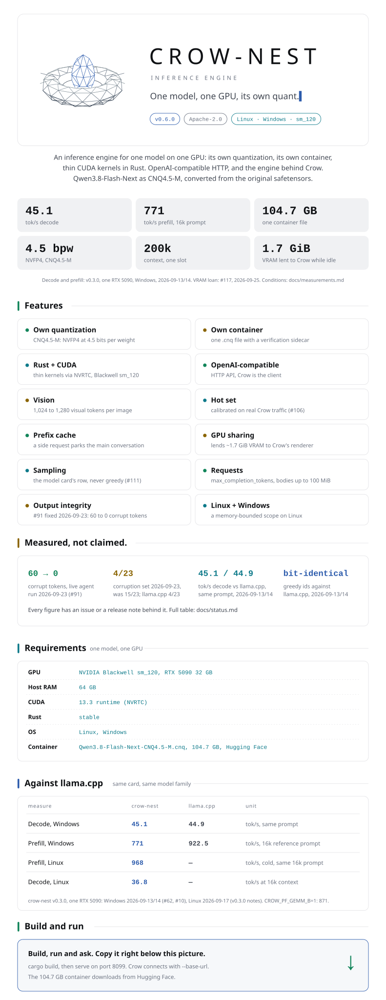

<picture>
  <source media="(max-width: 700px) and (prefers-color-scheme: dark)" srcset="docs/images/readme/crow-nest-mobile-dark.svg">
  <source media="(max-width: 700px)" srcset="docs/images/readme/crow-nest-mobile-light.svg">
  <source media="(prefers-color-scheme: dark)" srcset="docs/images/readme/crow-nest-dark.svg">
  
</picture>

**Build** (container: 104.7 GB from Hugging Face)

```bash
git clone https://github.com/nibor1896/crow-nest && cd crow-nest
hf download nibor1896/Qwen3.8-Flash-Next-CNQ4.5-M Qwen3.8-Flash-Next-CNQ4.5-M.cnq --local-dir converter
cd engine && cargo build --release --bin serve && cd ..
```

**Run, Linux**

```bash
tools/serve-linux.sh --port 8099
```

**Run, Windows**

```powershell
engine/target/release/serve.exe --port 8099
```

**Use from Crow**

```bash
crow --base-url http://127.0.0.1:8099/v1
```

<p align="center">
<a href="docs/getting-started.md">Getting started</a> ·
<a href="docs/env.md">Environment</a> ·
<a href="docs/architecture.md">Architecture</a> ·
<a href="docs/measurements.md">Measurements</a> ·
<a href="docs/repository.md">Repository</a> ·
<a href="docs/status.md">Status</a> ·
<a href="docs/model-card.md">Model card</a> ·
<a href="CHANGELOG.md">Changelog</a> ·
<a href="docs/archive/README-v0.6.0.md">Previous README</a>
</p>

<p align="center"><sub>
Apache-2.0 · <a href="https://github.com/nibor1896/crow-nest">nibor1896/crow-nest</a> ·
Model: <a href="https://huggingface.co/nibor1896/Qwen3.8-Flash-Next-CNQ4.5-M">Qwen3.8-Flash-Next CNQ4.5-M</a> (Qwen Community License 1.0) ·
Client: <a href="https://github.com/nibor1896/Crow">Crow</a>
</sub></p>

<p align="center">
<a href="https://ko-fi.com/nibor1896"><picture>
  <source media="(prefers-color-scheme: dark)" srcset="docs/images/readme/kofi-dark.svg">
  
</picture></a>
</p>
