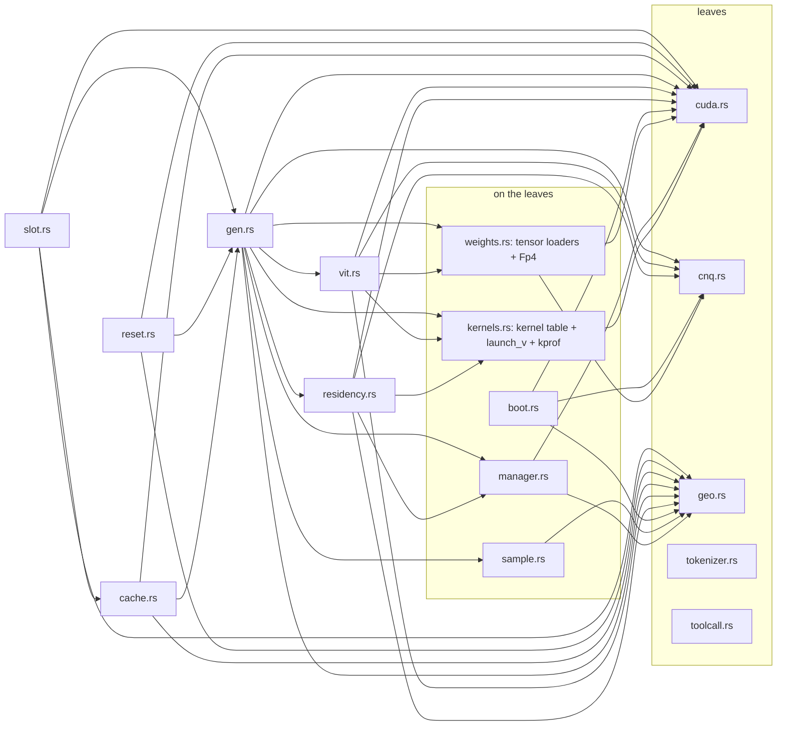

# crow-nest engine spec

**Status: fully approved by robin on 2026-09-02 (all six sections, issue crow-nest #4).**

Approved section by section (issue crow-nest #4; a section is truth only after robin's
approval is recorded there). Environment for every number: `docs/system-landscape.md`.
Methodology: Crow #159. No north star in the record's sense — misses are measured
results that re-cut stages.

---

## Section 0 — goals and operating points (APPROVED by robin 2026-09-02, with the prefill provenance integrated)

### 0.1 Status of the goals

Product requirements from robin (2026-09-01/02, epic #1). They are targets the engine
aims at and the harness reports against — the record's discipline stands: a miss is a
measured result that re-cuts a stage (timebox guard), never a project failure. No goal
is a pass/fail gate.

- Amended 2026-09-11 (robin, chat, recorded on issue #1): an end state below llama.cpp on this
  machine is not acceptable; the performance stage (#37, #38, a per-token kernel profile against
  llama.cpp, #19, #10) runs before the quant upload (F4 to F6), and the comparison is quoted on one
  prompt with both quantizations named (CNQ4.5-M 4.5 bpw against UD-Q2_K_XL 2.4 bpw).

### 0.2 Context

- **Floor 200,000 tokens** — every shipped configuration must hold ≥ 200k; the engine
  refuses a configuration that cannot.
- **Default 262,144** (architecture ceiling) with **FP8-KV**; slider [200k, 262,144].
- The oracle checks FP8-KV against the BF16 reference; if it goes red, the fallback
  operating point is 200k + BF16-KV (~4.6 GiB KV).
- State at default: KV ~3.0 GiB (FP8) / ~6.0 GiB (BF16), GDN ~0.12 GB (f32, fixed),
  QSA per its budget of 2,048 tokens.

### 0.3 Throughput targets, with their measurement points

- **Decode ≥ 42 tok/s** — measured at batch 1 (`-np 1`), session filled to the **200k
  floor** (not the ceiling), after a discarded warm-up request; reported against the
  interleaved llama.cpp baseline on this machine (41 tok/s endstand, same session).
- **Prefill ≥ 972 tok/s**, binding at the **32k operating point**, measured as the
  **completed-prompt average** (prompt tokens ÷ prompt time). Instantaneous rates are
  reported alongside but never substitute for the average.
  - Provenance (grounded 2026-09-02): 972 first appears as the baseline's instantaneous
    rate at 26 % of a ~31.7k-token prefill (`crow-lab/runs/2026-08-30-levers-159/
    control-03`: n_tokens 8,245, 972.24 tok/s). The completed-32k baseline average is
    ~750 tok/s (ladder: 750.75 at 30,777 tokens). The target is therefore honestly a
    ~+29 % stretch over baseline at 32k — a goal, not a gate.
- Every throughput number names: context fill, prompt length, chunk size, quant of both
  engines under test.

### 0.4 Latency metrics

- **TTFT** (time to first token) at the 200k floor with a named prompt length; target
  set by robin against crow-nest's first measured prefill (no invented number now).
- **Mean inter-token latency** is implied by the decode goal: 42 tok/s ⇔ ~23.8 ms.
- "Minimal latency" as a design constraint is already decided and needs no number: no
  host in the hot loop, no kernel launch for synchronization (job ring, stream memops).

### 0.5 Measurement discipline (binding)

Interleaved A/B in the same session, one variable at a time, resolution stated,
environment per `docs/system-landscape.md`. Performance is a measurement, not a
condition.

---

## Section 1 — model format and streaming converter (APPROVED by robin 2026-09-02: BF16 keep-set as proposed; 551 GB free NVMe confirmed)

> **Official name (robin, 2026-09-02): the format and quant family is CNQ; the base
> variant is CNQ4.5** (container magic `CNQ1`, 4.5 bpw NVFP4). Planned follow-ups inherit
> the scheme: CNQ4.5-C (per-expert calibrated scales, stage 2), CNQ4.5-P8 (PLE block
> exchanged to FP8 if the oracle goes red). KV dtype stays runtime config, not part of
> the name. First artifact: `Qwen3.8-Flash-Next-CNQ4.5.cnq`.

### 1.1 Input

The original safetensors: 131 shards, 359,999,963,128 B, revision
`de4b8e4d43b917e7706784d8bb445c9af86a3540`, read with mmap streaming — the model is
never held in RAM. Disk requirement for a conversion: input 360 GB + output ~101 GB
(plus a verification sidecar) — **~470 GB free NVMe**.

### 1.2 Output format (own container, no GGUF)

- **Container**: own binary, shard-aligned, JSON header with the tensor index
  (name, logical dtype, shape, block format, file offset) — conceptually safetensors'
  header, not its code; the container is ours.
- **Quantized weights**: NVFP4 blocks per ggml geometry — 64 values per block, 32 B
  packed E2M1 + 4 ue4m3 scales (one per 16-wide sub-block) = 36 B / 64 values = 4.5 bpw,
  **plus one global f32 scale per tensor** (two-level scaling; probe-pinned hardware
  facts apply, the global scale is a converter convention to be validated numerically in
  the first oracle run).
- **Kept in BF16** (proposal): embeddings and `lm_head` (untied, 2 × 1.27 GB BF16 —
  2.5 GB of 360, no reason to risk them), **router GEMM** (2560 × 512 per layer) and
  `shared_expert_gate`, all norms (`hc_norm` et al.). Routing stability and norm
  precision are cheap to keep.
- **Everything else** (GDN, attention, hyper-connection low-rank, experts, shared
  expert): NVFP4.
- **PLE block**: NVFP4, **exchangeable** — the header tags it as a self-contained
  section so an FP8 swap (oracle fallback) needs no format change.
- **ViT + MTP**: carried in the format, tagged optional-to-load (decision 2026-09-02).
- **KV dtype is runtime config** (FP8 E4M3 default), not file content.

### 1.3 Stage 1 — calibration-free RTN

Shard-streaming on read AND write; each tensor quantized on the fly, per-tensor global
scale computed before emitting its blocks; output written incrementally so at most one
working copy exists beyond input and output.

### 1.4 Stage 2 — per-expert calibration (separate ticket, later)

Re-emission of scales only (format unchanged) from Crow's routing statistics —
ModelOpt's `--calib_all_experts` idea with real traffic instead of synthetic samples.

### 1.5 Acceptance

- Round-trip decode of sample tensors matches BF16 reference within documented error;
  per-tensor max/mean deltas recorded in a verification sidecar next to the output.
- The oracle (#6) consumes the **unquantized originals** — this stage's output is never
  the quality reference.

### 1.6 Resolved (robin, 2026-09-02)

- BF16 keep-set approved as proposed (embeddings, lm_head, router GEMM, gates, norms).
- Disk: 551 GB free NVMe — conversion runs fit comfortably (~470 GB needed).
- Budget consequence carried into section 2: the BF16 keep-set adds ~1.8 GB dense
  VRAM; the hard hot-set ceiling drops from ~177 to ~169 experts/layer (default 160
  unchanged, loader auto-clamps).

---

## Section 2 — memory layout: residency, PLE window, three-state manager (APPROVED by robin 2026-09-02)

### 2.1 VRAM budget at the default operating point (262k context, FP8-KV)

| item | GB | note |
|---|---|---|
| dense resident | ~6.0 | 12.5 GB BF16 → NVFP4 (~3.5) + BF16 keep-set 2.5 (embeddings, lm_head, router, gates, norms); ViT/MTP carried in file, NOT loaded at this stage |
| hot experts | N × 0.132 | 2.76 MB per expert per layer × 48 layers; default N=160 → 21.2 GB |
| KV cache | ~3.2 | FP8 E4M3, 12 KiB/token × 262,144; BF16 would be 6.4 |
| GDN state + QSA | ~0.3 | GDN f32 36 × ~3.1 MB ≈ 0.11; QSA per budget 2048 |
| PLE hot-row cache | 1.0–2.0 | window cache, sized by telemetry (2.2) |
| activations + graph pools | 1.5–2.0 | decode graphs are small; measured at first integration |
| **total non-expert** | **~13.0–13.5** | of 34.4 (32 GiB) |
| **expert budget** | **~20.9–21.4** | → hard ceiling **~158–162** experts/layer with honest pool sizing |

Loader rule (binding): N=160 is the **target**; the loader verifies the full budget with
measured overheads at load time and auto-clamps N if the sum exceeds VRAM — it refuses
configurations that fall below the 200k context floor, never silently degrades context.

The clamp is **two-sided**: VRAM lowers N, the host pinned budget raises it (fewer cold
experts to pin). That budget is not a constant — it is derived at boot as
`min(46 GiB cap, free_for_pin - CROW_RAM_MARGIN_GB)` and capped at the 46 GiB of `geo.rs:42`
(`manager::derive_host_pinned_budget`, issue #15, 2026-09-17). `free_for_pin` counts the
NVIDIA driver's pinned-page pool as free, because it is reclaimable and the next
`cuMemHostAlloc` is served out of it — but only while THIS is the only CUDA process. When
`cuda::other_cuda_fd` finds another process holding `/dev/nvidia-uvm` open (a `/proc/<pid>/fd`
scan, readable entries only), the pool may be that process's, so the budget falls back to the
conservative `MemAvailable` and the `[budget]` boot line names that basis. `/dev/nvidia-uvm`
is the right node: every CUDA context opens it and no graphics client does — measured
2026-09-17, the compositor and every GL app hold `/dev/nvidiactl` and `/dev/nvidia0` while
owning no pinned pool, and testing for THOSE refused the engine's own operating point. The planner refuses only when no N satisfies both sides (`planner_refusal_msg`).

The clamp also carries a **vision reserve** (TASK K, 2026-09-17): with `CROW_VIT` on, the VRAM the
image path allocates inside a request — the cap-sized tower scratch and the interleaved-mrope
span tables, 277.3 MB together at `n_ctx` 200,000 — is
added to the planner's `pending` bytes, so N is chosen with it and an image request can never find
the card full. It is named on its own `[budget]` line and costs N 157 -> 155 at the serve operating
point (7.13 has the two numbers and the measurement). `CROW_VIT=0` reserves nothing.

### 2.2 Expert residency (per layer, data-driven)

- Residency sets are **per-layer top-N by selection frequency** — per-layer ranking, not
  the global curve (#3; per-layer selection achieves ≥ the global coverage).
- Warm-up: first runs accumulate per-layer selection counts (every routed choice counts,
  hit or miss — the print_locality discipline), promote the top-N per layer, and persist
  the sets in a sidecar next to the model file; refreshable by config or command.
- Sidecar contract (`residency::sidecar_sets`, `#49`, 2026-09-18): the file is ONE JSON object
  with a `sets` array of 48 rows of expert ids. Row lengths are adapted to the run's N **per
  row** — a short row is padded with the lowest unused ids, a long one is truncated, and every
  adapted row is logged with its own length. Padding is legitimate because the planner gives
  every layer the same N hot slots whatever the file says and residency is numerically invisible
  on the default tier (7.5 condition 2); it is deterministic, so one file at one N is one hot
  set. What no padding can mean is REFUSED by name: not one JSON object, not 48 rows, an entry
  that is not an expert id, an id outside `0..512`, an id twice in one row. The converter writes
  no hot-set file — `converter/*.cnq.sidecar.jsonl` is the per-tensor quantization report, one
  JSON object per line — and is refused here by name.
- Routing-gated skip: a layer whose 10 routed experts are all resident has **no cold
  job at all** — the handoff count responds to this, measured per token (#7 acceptance).

### 2.3 Cold path (variant A; stager built for C from day 1)

- GPU publishes cold jobs (expert IDs per layer) into the pinned job ring via
  `cuStreamWriteValue32`; the stager gathers weights (RAM tier) into pinned staging
  blocks and streams H2D; the GPU waits on per-job flags via `cuStreamWaitValue32`.
- No host in the hot loop, no kernel launch for synchronization, no full-device barrier.
- The stager's source is an interface from day 1: RAM tier now, NVMe tier (variant C) is
  a second backend of the same interface (decision 2026-09-02). "Compute on CPU"
  (variant B) stays a policy option behind the same interface, unbuilt.
- Per-layer policy field chooses the cold path by bandwidth, not hardcoded.

### 2.4 PLE (one layer, 128 tables of [2,500,012, 160])

- On disk NVFP4 (~28.8 GB), accessed as an **NVMe-mmap window** with a VRAM hot-row
  cache (default 1.0–2.0 GB, sized by hit-rate telemetry).
- Row indices computed **host-side per token** first (llama.cpp's proven
  `set_input` pattern — small H2D of indices); GPU-side indexing is a later refinement,
  not a stage gate.
- Row format NVFP4, block-exchangeable to FP8 (section 1); `ple_layer_ids: [2]` vs
  tensors on `layers.1` — the converter resolves the index once and records the
  resolution in the header.
- Row granularity on NVMe: a row is ~108 B NVFP4; reads happen at page granularity, so
  the cache design assumes read amplification (~37 rows per 4 KB page) and lets the
  hot-row cache absorb it — hit rate is measured, never assumed.

### 2.5 Three-state manager

- **KV**: 12 full-attention layers, 2 KV heads × head_dim 256, FP8 E4M3 default, BF16
  fallback via config; allocation at load for the configured context; resize only
  across full reloads (no mid-session shrink in stage 1).
- **GDN recurrent state**: 36 layers, f32 (16 K / 48 V heads at 128, conv kernel 4) —
  fixed size, context-independent.
- **QSA indexer cache**: budget 2,048 tokens, compress ratio 4 — third state kind,
  allocated alongside KV (`llama-memory-hybrid-idx` as the shape reference).
- Hyper-connections: `hc_norm` state is part of the weights, the 10240-wide residual
  stream is activation, not state.
- The manager owns all three kinds; stages never allocate around it (no leaks across
  stages, one accounting).

### 2.6 Acceptance

- Budget table verified by the loader on this machine (measured, not estimated, pool
  sizes); auto-clamp demonstrated by forcing N=192.
- Warm-up promotion demonstrated: coverage of the persisted sets vs the #3 curve.
- Cold-job path end to end on synthetic traffic before the first real decode.

---

## Section 3 — scheduler: job ring, routing-gated skip, cold-path policy (APPROVED by robin 2026-09-02)

### 3.1 The constraint the scheduler exists for

The borrowed engine's fixed term is 67.1 % synchronization at 62 CPU↔GPU handoffs per
token; a swapped barrier costs 4–6 ms (Crow #186). Binding design constraints: **no host
in the hot loop, no kernel launch for synchronization, no full-device barrier between
layers.** The decode loop per token: embeddings + PLE gather → 48 layers (36 GDN, 12
full attention, interleaved per `layer_types`) under hyper-connections → per MoE layer:
router on GPU → top-10 + shared expert → resident experts computed immediately → cold
experts via the job ring → `shared_expert_gate` combine.

### 3.2 Job ring (the handoff)

- Pinned host-memory ring, job descriptors 64-byte aligned (exl3 `moe_handoff.h`
  pattern): layer id, job kind, cold expert ids (≤ 10), sequence number, flag slots.
- The **descriptor is written by device-side mapped writes** from a small GPU kernel
  (the router result never leaves the GPU to produce it); publication of the flag goes
  through `cuStreamWriteValue32`. The stager thread busy-polls the pinned ring (no sync
  primitives), gathers cold expert weights from the RAM tier into pinned staging blocks,
  copies H2D on a dedicated copy stream, and raises the completion flag; the GPU's cold
  expert compute is enqueued behind `cuStreamWaitValue32` on that flag.
- **Overlap is the design goal, not alternation**: resident-expert compute and
  subsequent dense work proceed while the stager services cold jobs.
- Ring sizing: ≥ 256 slots (≤ 48 jobs/token worst case), sequence numbers against
  wraparound; a dead stager fails the engine loudly — no silent stall, ever.

### 3.3 Routing-gated skip

- Residency bitmaps (one per layer, from section 2.2's sets) live on the GPU; the skip
  decision is derived on-GPU from routing vs bitmap. A layer whose 10 routed experts are
  all resident publishes **no job**; a layer with k cold experts publishes exactly one
  job carrying those k ids.

### 3.4 Cold-path policy (AMENDED 2026-09-02, robin approved: zero-copy replaces stream-weights as primary)

Measurement history that drove the amendment: per-layer ring round trips measured
~3.1–3.4 ms on WDDM (28 cold layers/token → dead); speculative cross-token prefetch
measured 0.2–0.7 % prefetch gain (dead — the hot set already IS the temporal
structure); zero-copy direct read measured 21.6–25.1 GB/s (probe 3). HGS probed: no
benefit for driver-API handoffs (4.7 vs 3.1 ms).

- **Cold path A′ "zero-copy direct read" (primary)**: expert GEMM kernels take VRAM
  pointers for resident experts and PINNED HOST pointers for cold ones — the GPU pulls
  weights over PCIe inside the GEMM. No copy, no submission, no stall, no speculation.
  Cost: ~111 MB/token at ~23 GB/s ≈ 4.8 ms (N=160) / ~3.3 ms (N=176), spread across
  layers inside the GEMMs. Pinned cold tier ≈ 43–47 GB of 64 GB host RAM.
- **The job ring + stager remain for the control plane**: residency-set swaps,
  NVMe-tier staging (variant C), refresh, telemetry — off the decode critical path.
  Variant B (CPU compute) stays reserved; variant A (stream-weights) is retired from
  the primary path (kept behind the ring interface for tier transitions).
- Policy is still per layer, chosen at load, fixed per session.
- **Decode staging as built (`CROW_STAGE`, default on)**: after `router_top10` the
  staging kernel pulls every COLD combo of the layer into a VRAM staging slot and
  rewrites the combo pointer tables; hot combos keep their slab pointer. The kernel is
  `stage_cold_ca` since #19e (2026-09-12); `CROW_STAGE_KERNEL=1` restores `stage_cold`,
  which reads with coalesced 16-byte loads and measured 10.248 ms/token at 33.0 GB/s over
  338 MB/token on 2026-09-11 (#19a).
- **`CROW_STAGE_DMA=1` (measurement only, #19b, default off)**: the same staging done by
  the COPY ENGINE, one `cuMemcpyDtoDAsync` per cold combo and matrix issued from the host
  from the mapped pinned pointer. The routed pointers exist on the host only after
  `router_top10` of that layer, so the switch forces the decode graph off and costs one
  host sync per layer. Not an operating default.
- **`stage_cold_ca` (the DEFAULT since #19e, 2026-09-12; `CROW_STAGE_KERNEL=1` falls
  back)**: the same staging done by `stage_cold_ca` (`kernels.rs:2263`), a PERSISTENT
  grid of `CROW_STAGE_BLOCKS` x 256 threads (default 40) launched from `gen.rs:2051`.
  Work item = (matrix, combo); the owning block `item % gridDim.x` rewrites the pointer
  table entry, and the 4 KB tiles of a cold item are split over all blocks, each tile
  read with `cp.async.cg.shared.global` 16 B per thread into a two-deep shared double
  buffer and stored coalesced to VRAM. Same inputs plus the combo count `t * TOPK` by
  value, same outputs, still inside the decode graph.
- **Requirement of `stage_cold_ca`**: both staged slab byte counts must be exact
  multiples of 4096, because the kernel carries no tail tile. `gen.rs:683` asserts it at
  load and `gen.rs:2048` again at the launch site; both panic messages name
  `CROW_STAGE_KERNEL=1` as the fallback. This container: `gate_up` 1843200 B = 450 tiles,
  `down` 921600 B = 225 tiles.
- **Boot line**: every engine process prints one `[stage]` line naming the kernel it will
  run, its grid and the slab byte counts (`gen.rs:697` for `stage_cold_ca`, `gen.rs:700`
  for `stage_cold`), so every log says which kernel produced it.

| Switch | Kernel | Grid | Read shape | Mode |
|---|---|---|---|---|
| unset (default) | `stage_cold_ca` | `CROW_STAGE_BLOCKS` x 1 x 1, 256 threads | `cp.async.cg.shared.global` 16 B per thread into 4 KB shared tiles, 2-deep, slab bytes must be 4 KB multiples | operating |
| `CROW_STAGE_KERNEL=1` | `stage_cold` | `t * TOPK` x 2 x `CROW_STAGE_SPLIT`, 256 threads | 4 x 16 B `uint4` loads in flight per thread | operating fallback |
| `CROW_STAGE_DMA=1` | none, copy engine | host-issued `cuMemcpyDtoDAsync` per cold combo | copy engine, decode graph off | measurement |

- The decode operating point that decided the staging default: #19e, 2026-09-12.
- The decode operating point that decided the trickle issue default: #63c, 2026-09-12.
- The decode operating point that decided the QSA selection default: #61b, 2026-09-12.
- The decode operating point that decided the split-count flip: #61d, 2026-09-13, ROLLED BACK by #61e the same day under the improvement-loop quality rule (the ten-task quality bar was not held at 32); #61b is again the split-count default of record.
- The decode operating point that decided the combined fusion default: #19g, 2026-09-13 (the #19f hc-chain fusion and the #62b grouped GDN input projections both default).
- The decode operating point that decided the all-fused default: #19i, 2026-09-13 (the #19h shared-expert fusion joins the same default predicate; the confirmation form is W + 3N, no adjacent B arm post-flip).
- The decode operating point that crossed the llama.cpp line: #62e, 2026-09-13 (the resumed #62d lever, 62a lever 2, the 32-rows-per-block GDN slab geometry, joins the default set with no new env; the no-env N mean 22.1761 ms per token = 45.1 tok/s is the first engine default under the 22.27 llama.cpp row).
- The prefill operating point that opened the compute levers: #10c, 2026-09-14 (the dense GEMM variant B, F50's named next dense form, lands as OPT-IN `CROW_PF_GEMM_B`, no default flip; the clean pairs measured -2.27 and -2.33 s = -11 percent on t1-read 16k, and the llama 922.5 tok/s prefill row stays open: 18.44 s = 871 tok/s is 1.03 s short of it and 0.51 s above the 17.93 s no-copy floor band of F50).
- The Linux prefill of record crosses that row, on the same prompt and a different machine: the 16,064-id t1-read form (`decode run … 128`, `CROW_CHUNK` unset so the policy picks 2048, context fill 16,192, crow-nest CNQ4.5-M NVFP4 4.5 bpw) reads **16.60 s = 968 tok/s and 16.66 s = 964 tok/s** on 2026-09-17, RTX 5090 / Arch Linux, commit `1032bc5`, against **598 / 601 tok/s** on the same two runs of the preceding build — an interleaved A/B in one session, two runs per arm, identical id traces (`CHANGELOG.md` 2026-09-17, the PLE prefill floor). It is NOT a row of the table above and does not close the 922.5 row: the llama.cpp arm of record (17.41 s = 922.5 tok/s, 2026-09-11) is a WINDOWS measurement with GGUF Q2_K_XL at 2.4 bpw, and no llama.cpp arm has been run adjacent to it on this machine. Section 8.7 holds the Linux values of record.
- Every row of this table is one adjacent pair of one chain; the two crow-nest columns are the two arms of that pair.
- The two arms run different weights: crow-nest CNQ4.5-M (NVFP4, 4.5 bpw); llama.cpp Qwen3.8-Flash-Next-UD-Q2_K_XL (GGUF, 2.4 bpw).
- A tok/s figure is quoted only next to its adjacent arm in the same chain (#38).

| shape metric | crow-nest, engine default | crow-nest, the named fallback | llama.cpp | machine | date | source |
|---|---|---|---|---|---|---|
| prefill, t1-read 16,064 ids, chunk policy 4096, gen 8, the #10c dense variant B pair (F49 form, W + 3 adjacent pairs, purged container, fresh process per run; the switch is OPT-IN, the OFF arm IS the default of record) | 20.73 s = 775 tok/s, the default of record (B2 20.723 / B3 20.728, plateau spread 0.01 percent; B1 18.491 s is a documented whole-run outlier kept in the log, 38a rule 9; plateau reproduction gap -0.49 percent against the 10b stage-1 N arm 20.828 s of 41169f0) | 18.44 s = 871 tok/s with `CROW_PF_GEMM_B=1` (N1 18.460 / N2 18.453 / N3 18.398, spread 0.3 percent; the two clean pairs -2.270 and -2.330 s = -11.0 and -11.2 percent; ids trace sha `16d9e0dab22b07a6`, hot set N=147 and cold 301.1 of 480 identical in all 7 runs; decode watch 32.9 against 33.4 tok/s, a prefill-shaped switch) | 17.41 s = 922.5 tok/s | RTX 5090 | crow-nest 2026-09-14, llama.cpp 2026-09-11 | `decode_out/srv-10c.log`, `decode_out/srv-59b.log` |
| decode, t1-read 16,064 ids, 255 timed steps, the #62e 32-row GDN slab geometry pair (the resumed #62d lever on top of the #19i all-fused default; W + 3 adjacent pairs, ids `5098f885ab3a` in 7 of 7 runs incl. W) | 22.18 ms per token = 45.1 tok/s (N1 22.1327 / N2 22.1627 / N3 22.2330, spread 0.1003; -0.4470 ms = -1.98 percent, 3 of 3 pairs favour N) | 22.62 ms per token = 44.2 tok/s, the 19i-state B arm (B1 22.6322 / B2 22.6142 / B3 22.6230, spread 0.018; a same-source `be7bb60` rebuild `a7d850803e62`, the of-record `5c7919276203` not byte-reproducible; the standing #19i no-adjacent-B row below measured 22.43 = 44.6) | 22.27 ms per token = 44.9 tok/s | RTX 5090 | crow-nest 2026-09-13, llama.cpp 2026-09-11 | `decode_out/srv-62e.log`, `decode_out/srv-59b.log` |
| decode, t1-read 16,064 ids, 255 timed steps, the #19i all-fused default confirmation: hc chain FUSED + shared chain FUSED + grouped GDN + cascade, all default with no env (W + 3N form, NO adjacent B arm post-flip: `CROW_QFUSE=0` would also disable the NVFP4 cascade) | 22.43 ms per token = 44.6 tok/s | 22.80 ms per token = 43.9 tok/s, the previous default (the #19g combined default; the lever's own adjacent-pair reading is the #19h one, -0.2286 ms = -1.00 percent in 3 of 3 pairs) | 22.27 ms per token = 44.9 tok/s | RTX 5090 | crow-nest 2026-09-13, llama.cpp 2026-09-11 | `decode_out/srv-19i.log`, `decode_out/srv-59b.log` |
| decode, t1-read 16,064 ids, 255 timed steps, the #19/#62 combined default pair (#19g): hc chain fused + GDN input projections grouped, both default with no env | 22.80 ms per token = 43.9 tok/s | 23.94 ms per token = 41.8 tok/s, the previous default (61b arm of record; the same-chain double fallback `CROW_QFUSE=0 CROW_GDN_FUSE_IN=0` measured 26.86 ms = 37.2 tok/s, but that arm also runs the NVFP4 cascade in its separate-launch form — the documented `CROW_QFUSE` overload makes it an artifact, not the previous default) | 22.27 ms per token = 44.9 tok/s | RTX 5090 | crow-nest 2026-09-13, llama.cpp 2026-09-11 | `decode_out/srv-19g.log`, `decode_out/srv-59b.log` |
| decode, t1-read 16,064 ids, 255 timed steps, the #61d split-count pair (the flip ROLLED BACK by #61e after the quality verdict; measurement of record for the knob) | 22.85 ms per token = 43.8 tok/s | 24.13 ms per token = 41.4 tok/s with `CROW_ATTN_SPLITS=8` | 22.27 ms per token = 44.9 tok/s | RTX 5090 | crow-nest 2026-09-13, llama.cpp 2026-09-11 | `decode_out/srv-61d.log`, `decode_out/srv-59b.log` |
| decode, t1-read 16,064 ids, 255 timed steps, the #61b QSA selection pair (the engine default of record from #61b until #19g; the QSA and split parts of it are unchanged) | 23.94 ms per token = 41.8 tok/s | 24.87 ms per token = 40.2 tok/s with `CROW_QSA_PAR=0` | 22.27 ms per token = 44.9 tok/s | RTX 5090 | crow-nest 2026-09-12, llama.cpp 2026-09-11 | `decode_out/srv-61b.log`, `decode_out/srv-59b.log` |
| decode, t1-read 16,064 ids, 255 timed steps, the #63c trickle pair (the engine default before #61b) | 24.78 ms per token = 40.3 tok/s | 26.41 ms per token = 37.9 tok/s with `CROW_TRICKLE_DEFER=0` | 22.27 ms per token = 44.9 tok/s | RTX 5090 | crow-nest 2026-09-12, llama.cpp 2026-09-11 | `decode_out/srv-63c.log`, `decode_out/srv-59b.log` |
| decode, same shape, the #19d staging pair (K40 against B, `task-19d-report.md`), both arms on the eager trickle of that day | 26.46 ms per token = 37.8 tok/s | 29.68 ms per token = 33.7 tok/s with `CROW_STAGE_KERNEL=1` | 22.27 ms per token = 44.9 tok/s | RTX 5090 | 2026-09-11 | `decode_out/srv-19d.log`, `decode_out/srv-59b.log` |
| staging row of that step, nsys, 338 MB per token | 7.07 ms per token at 47.78 GB/s | 10.42 ms per token at 32.45 GB/s with `CROW_STAGE_KERNEL=1` | n/a | RTX 5090 | 2026-09-11 | `decode_out/srv-19d.log` |

### 3.5 PLE in the loop

- PLE row indices are computed host-side per token (section 2.4) — the one host touch
  per token outside the ring: pure index math, a few KB H2D, off the critical ring.

### 3.6 Acceptance

- Ring round-trip microbenchmark on Windows (resolution stated) against the 4–6 ms
  barrier cost from #186 — Windows FIRST (strand 2: exl3 memops unexercised on Windows).
- Synthetic 48-layer MoE pass: measured skips, cold jobs, bytes per token.
- A timestamped trace of a decode step shows **zero host wakes per layer** — the 62
  handoffs must collapse to ring jobs only.

---

## Section 4 — kernel path: sm_120a FP4 (APPROVED by robin 2026-09-02)

### 4.1 Target and probe-pinned facts

- Compile target **`compute_120a`** — plain `sm_120` is rejected by ptxas (probe 2);
  llama.cpp builds `120a-real` for the same reason. NVRTC at load time (probe 1/2
  chain), no nvcc dependency at runtime.
- Instruction:
  `mma.sync.aligned…kind::mxf4nvf4.block_scale.scale_vec::4X.m16n8k64.row.col.f32.e2m1.e2m1.f32.ue4m3`.
- Fragment layouts as pinned by probe 2 (LSB-first nibbles at bit 4j in both operands;
  scale operand = one u32 per matrix, byte i = ue4m3 scale of the 16-wide k-sub-block;
  a/b/D geometry per RESULTS.md) — the engine's kernels reuse these layouts verbatim,
  and the probe's CPU reference (delta exactly 0 on dyadic inputs) is the numerics test.

### 4.2 Kernel families the model needs

1. **Expert GEMMs, fused**: `gate_up [512,1280,2560]`, `down [512,2560,640]`, batched
   over the ≤ 10 routed (+ 1 shared) per token. Our format keeps per-expert blocks
   contiguous, so the active set is directly addressable — no used-expert copy stage in
   the graph.
2. **Dense paths**: hidden 2560 ↔ residual stream 10240 (hyper-connections), attention
   QKVO, GDN projections (`in_proj_qkvz`, `out_proj`), `conv1d`, PLE gather + conv.
   - hyper-connection decode chain, DEFAULT fused since #19g (2026-09-13; the 19f
     fusion of 2026-09-13 behind the flip): with `CROW_QFUSE` unset the eight launches
     of one hc block (`rms_group`, down `gemv_bf16_w`,
     `silu_div4`, up `gemv_bf16_w`, `sigmoid_el`, `mix_streams_q`, `gemv_fp4_b1k`,
     `sig2_div4`) run as FOUR: `rms_group`, `hc_down_inj` (down GEMV + `silu_div4` + the
     4-row inject GEMV + `sig2_div4` in one launch — the `gemv_fp4_b1k` 1024-slot reduce
     emulated bit for bit on 256 threads, 44 blocks x T), `gemv_bf16_ws` (up GEMV storing
     the `sigmoid_el` epilogue) and `mix_streams_q`; `head_run` fuses the same epilogues
     (no inject rows). Launch sites `gen.rs:1928` / `gen.rs:2988` behind `hc_fuse_on()`,
     decode `t < 8` only — prefill keeps the `gemm_bf16_dense` path verbatim; one `[hc]`
     boot line names the form (`gen.rs:911`). `CROW_QFUSE=0` selects the unfused 8-launch
     fallback of record (and takes the NVFP4 cascade to its separate-launch path — the
     documented overload of `docs/env.md`; cascade on + unfused is no longer reachable).
   - bit identity: by construction (every epilogue is elementwise on the finished
     accumulator, the merged grid keeps each row's dot product unchanged) and measured:
     the 19f switch-ON P8FUSE (504 teacher-forced rows) and PXFUSE (16,056 rows) forms
     are byte-identical to the reference `d211ab52ad2b` and the 19f switch-OFF gates
     reproduced the 61b sha256 values of record (`decode_out/srv-19f.log`); the #19g
     COMBINED default pass ran BOTH fused levers at once with no env — six short forms
     plus the 16,056-row PXBOTH form byte-identical with the 61b sha256 values of
     record, the double-fallback 8 rows identical, ten tasks 10 of 10 equal BOTH
     splits-8 records (`decode_out/srv-19g.log`).
   - shared-expert decode chain, fused by DEFAULT since #19i (2026-09-13; the
     #19h fusion behind the SAME `CROW_QFUSE`: unset or any value but `0` =
     hc chain FUSED + shared chain FUSED + cascade, `1` kept accepted and
     redundant, `0` stays all off): the SIX launches
     of the shared chain (gate|up `gemv_fp4_mma_d` x2, `silu_mul640_q`, down
     `gemv_fp4_mma_d`, the `sgv` `gemv_b`, `gate_shared`) run as THREE:
     `sh_gate_up_q` (both gate|up GEMVs in one launch, the mma_d body twice
     verbatim over the gate and up slabs, the `silu_mul640_q` math warp-wide on
     the finished accumulator pairs, writes `sh2` + `xq_s`, `kernels.rs:3438`),
     the hoisted `gemv_b` (`sgv`, reads `mixed_m` only, data-safe) and
     `gemv_fp4_mma_dg` (down GEMV + the `gate_shared` epilogue at the store:
     `moe_out = sigmoid(sgv) * down` ASSIGN, still the FIRST writer of `moe_out`,
     `kernels.rs:3534`). Launch site `gen.rs:2579` behind `sh_fuse_on()`
     (`gen.rs:1511`), decode `t < 8` and the mma/dense path only: prefill
     (`gemm_fp4_dense`) and the `gemv_fp4_bs` fallback keep the separate launches
     verbatim; the `[hc]` boot line names the shared state too (`gen.rs:911`).
     Bit identity: epilogue folding only (every op elementwise, or warp-wide with
     the standalone 16-consecutive-j quant layout, on a finished accumulator;
     each k walk in the separate-launch order; the merged grid keeps every row's
     dot product) and measured: parity 12 of 12 (OFF 8 rows = the 19g-committed
     binary, ON = OFF, the P8FUSE form with BOTH dumps at `b7f6419203b4`), ten
     tasks 10 of 10, pairs -0.2286 ms per token in 3 of 3
     (`decode_out/srv-19h.log`). The #19i default verification (repair HEAD
     `be7bb60`, build `5c7919276203`): the trimmed 19g battery with NO env —
     8 / 512 x3 / 1024 / P8 forms, 20 of 20 subchecks GREEN byte-identical to
     `d211ab52ad2b` at the 61b sha256 values of record, the `0` fallback 8 rows
     `bceba6ff7724` — ten tasks 10 of 10, pairs (the coordinator-approved
     W + 3N form, no adjacent B arm post-flip) ids `5098f885ab3a` 4 of 4, the
     all-fused default 22.4266 ms per token = 44.6 tok/s, hard gate < 22.6999
     met (`decode_out/srv-19i.log`).
3. **Router**: BF16 GEMM 2560 × 512 (kept BF16 per section 1).
4. **Attention** (12 layers): 24 heads × head_dim 256, GQA 2 KV heads, partial rotary
   0.25, mrope interleaved [11,11,10] — compute stays BF16/FP8 (flash-attention style);
   FP4 is a weight format, not an attention math format. QSA indexer (budget 2048) as
   its own small kernel family.
5. **GDN** (36 layers): gated delta-net with sigmoid output gate — recurrent/chunked
   custom kernel family; reading templates: mistral.rs `qwen3_next.rs`, the transformers
   reference (oracle-side). SSM state f32.
   - decode input projections, DEFAULT grouped since #19g (2026-09-13; the 62b grouped
     form of 2026-09-13 behind the flip): with `CROW_GDN_FUSE_IN` unset the decode step
     runs the four input projections (qkv 10240 +
     z 6144 + b 48 + a 48 rows, all k 2560, one shared quantized row) as ONE grouped
     `gemv_fp4_mma_g` launch (`kernels.rs:698`, 258 blocks, per-slab global scales kept,
     launch site `gen.rs:2049` behind `gdn_fuse_in_on()`, capture-time only, one `[gdn]`
     boot line names the form); `CROW_GDN_FUSE_IN=0` selects the four per-slab
     `gemv_fp4_mma_d` launches, the fallback of record.
   - 32 rows per block at the three BIG projection launches, DEFAULT since #62e (2026-09-13; the resumed #62d lever, 62a lever 2): the grouped input launch runs `gemv_fp4_mma_g32` at ceil(16480/32) = 515 blocks (from 258 at 64 rows, site `gen.rs:2054`), the per-slab fallback (`CROW_GDN_FUSE_IN=0`) runs `gemv_fp4_mma_d32` at qkv 320 + z 192 (from 160 + 96, `gen.rs:1952`/`:1955`), and the out projection in gdn_step runs `gemv_fp4_mma_d32` at ceil(2560/32) = 80 (from 40, `gen.rs:1995`); the two 32-row twins (`kernels.rs:649`, `kernels.rs:723`) keep the KS machinery verbatim (`CROW_MMA_KS` stays 4, block 64*KS = `mma_bx32()` = 2 row groups x 4 k slices, warp map rg = warp & 1 / ks = warp >> 1), so per-row arithmetic is bit-identical and the sha256 values of record hold on every form (`decode_out/srv-62e.log`: 8 rows `bceba6ff7724`, 512 `14c8628acbec` x3, 1024 `b2e87b2bf99a`, P8/P8FUSE `b7f6419203b4`, PXFUSE 16,056 rows `f217e1c55926` at 15,960,023,040 bytes, plus the `CROW_GDN_FUSE_IN=0` arm); the non-GDN `gemv_fp4_mma_d` users (attention, qsa, shared expert, PLE) keep the 64-row geometry, so the pairs measure the GDN lever only.
   - bit identity proven at logit level, not only by construction: the 62b switch-ON
     P8FUSE (504 rows) and PXFUSE (16,056 rows) teacher-forced decode forms were
     byte-identical to the four-launch path and the 62b switch-OFF parity was 8 of 8
     against the pre-switch binary `d211ab52ad2b` (`decode_out/srv-62b.log`, RTX 5090);
     the #19g COMBINED default pass ran BOTH fused levers at once with no env — six
     short forms plus the 16,056-row PXBOTH form byte-identical with the 61b sha256
     values of record, the double-fallback 8 rows identical, ten tasks 10 of 10 equal
     BOTH splits-8 records (`decode_out/srv-19g.log`); the 62b opt-in pairs put the
     grouped form at -0.33 ms per token in the two clean pairs of three (arm means
     22.1704 vs 22.2627, the third pair reversed by a 0.7 ms B outlier against an N
     spread 17x tighter).

**Decode attention path, per layer (12 attention layers):**

| Step | Kernel | Grid x block | Switch | Mode |
|---|---|---|---|---|
| QSA scores | `qsa_scores_par` | `QSA_SCORES_BLOCKS` x 1 x 1, 128 | `CROW_ATTN_SPLIT` unset = on | operating |
| QSA top-k, one block | `qsa_select_fast` (`kernels.rs:2563`) | 1 x 1 x 1, 256 | `CROW_QSA_PAR=0`, the fallback since #61b | operating |
| QSA top-k, many blocks | `qsa_select_par_h` (`kernels.rs:2783`) then `qsa_select_par_e` (`kernels.rs:2801`) | `CROW_QSA_PAR_BLOCKS` x 1 x 1, 256 then 1 x 1 x 1, 1024 | `CROW_QSA_PAR` unset = on, the default since #61b; `0` = the fallback | operating |
| attention over the selected list | `attn_sel_split` (`kernels.rs:3653`) | `NQ` x 1 x `CROW_ATTN_SPLITS`, `AHD` | `CROW_ATTN_SPLIT` unset = on | operating |
| merge of the partials | `attn_merge` | `NQ` x 1 x 1, `AHD` | reads the device scalar `p.n_splits` | operating |

- Both top-k forms return the same selection list in the same order: selected blocks ascending, 4 tokens each, then the tail tokens ascending.
- `sel_n` = 4 x selected blocks plus the tail; the attention kernel sums in list order, so the order is part of the numerics.
- The parallel form splits the work as histogram (many blocks, 12 top key bits) plus one emit block (threshold refine 10 plus 10 bits, tie fill by lowest index, ascending emit); 2 launches per layer against 1.
- `CROW_QSA_PAR` is the decode path only: the prefill selection at `gen.rs:2231` keeps `qsa_select_fast` on `tb` blocks, one block per query.
- `CROW_QSA_PAR` default since #61b (2026-09-12): the adjacent pair measured 23.9411 against 24.8735 ms per decode token with `0` (-3.75 percent, ids identical), and parity runs 8 of 8 forms including the teacher-forced 16,064 id PX form over the radix path (`decode_out/srv-61b.log`, RTX 5090); every process names its selection in one `[qsa]` boot line.
- `CROW_ATTN_SPLITS` (4, 8, 16, 32) default 8 again since #61e (2026-09-13): the #61d flip to 32 (robin's performance-over-ids ruling of 2026-09-12, kept of record) was ROLLED BACK one day later under the improvement-loop quality rule - the ten-task quality bar is NOT held at 32, judged 0 Pass / 7 Partial / 3 Fail against the crow record 2 / 5 / 3 at 8 and the llama reference 2 / 6 / 2 (`.superpowers/sdd/task-61d-quality-report.md`); the 61d adjacent pair stays the measurement of record for the knob: 22.8545 against 24.1325 ms per decode token with `8` (-5.3 percent, 32.3 x the fallback spread), B ids `5098f885ab3a` 3 of 3, N ids `c65969f7793a` 3 of 3 (the 61a/61c S32 value); the rollback is the const back to 8 plus its `[attn]` boot line and nothing else (engine commit `fdc00c4`, `decode_out/srv-61d.log`, RTX 5090).
- The split count still changes the merge order of the flash-decoding partials, so the last bits of the logits move: the generated ids change (first differing index 45 and 48 of 256 on t1-read, `decode_out/srv-61a.log`), so `16` and `32` stay MEASUREMENT ONLY under the quality verdict, and the splits-8 stream of record is again final4-identical (the 61d per-task baseline `decode_out/t61d-run0-crow.json` is superseded); the `attn_sel_split` row (2.44 ms per token, nsys `decode_out/srv-61a.log`) stays the open optimization row of #61.
- The partial buffers `part_o` and `part_ml` are sized for 32 splits (`gen.rs:1879-1880`), VRAM plus 0.55 MB against the old size.

### 4.3 Kernel hygiene

- Thin kernels (constant 4): ONE NVRTC module for all families, compiled once per process at
  load from the frozen `KERNEL_SRC` (`gen.rs:1033`), with 110 launched kernels resolved out of it
  (`kernels.rs:4508-4527`; the frozen source defines 116 `__global__`s, six of which have no launch
  site left). Shared block-scaled-MMA core.
- The alternative was weighed and declined on 2026-09-17: `docs/cuda-rust-evaluation.md` measures
  NVIDIA's two CUDA Rust tracks against these families, with one cuTile pilot kernel. The pilot is
  in the tree as `engine/src/cutile_pilot.rs` behind the default-off `cutile-pilot` feature
  (`engine/Cargo.toml`); nothing in the engine calls it.
- Numerics gate in this order: kernel vs probe CPU reference → layer vs oracle (#6).
- No tok/s anywhere in kernel code or comments — measurement goes through the harness.

### 4.4 Ampere/Ada fallback

Own stage after this path works (decision 2026-09-02, amended): separate INT4/Q4 kernel
family without block-scale MMA, dispatch per architecture at load, own ticket and
timebox (created with spec section 6). Until then the engine runs Blackwell-only.

### 4.5 Acceptance

- All families pass numerics (probe reference, then oracle per layer) on this machine.
- `compute_120a` load verified on Windows (probe chain) and on Linux since 2026-09-17 (issue #15):
  Linux is a platform of record, its four parity values are in section 8.7, and `tools/gate-linux.sh`
  is the standing gate. A Linux number is quoted like any other: with its date, its machine and its
  artefact.

---

## Section 5 — correctness: oracle, parity gates, ten-task gate (APPROVED by robin 2026-09-02)

### 5.1 Oracles

- **Layer-wise oracle from the unquantized originals**: the transformers 5.8.x
  `qwen4_exp` reference, one layer at a time from the safetensors (one layer fits
  64 GB RAM; the model does not), no `trust_remote_code` needed (reference lives
  upstream). Early acceptance item: verify the reference's kernel imports
  (`fla`, `causal_conv1d`, triton) have CPU fallbacks so a layer runs oracle-side
  without a GPU path — strand 1 flagged this as unverified; it gates the oracle.
- **QSA-under-budget density oracle**: below `indexer_top_k + compress_ratio − 1`
  cached tokens, QSA is dense by construction — bit-identical on BF16/F32 (PR #27742:
  max logit delta 0.0 over 2,051 rows). A free correctness gate for the whole attention
  path.
- **`test-llama-archs` is not the oracle** (no PLE tensors, insensitive to the GDN QKV
  segmentation — plumbing only).
- **Quantization quality**: converter emits a per-tensor delta sidecar (section 1.5);
  FP8-KV vs BF16 and PLE-NVFP4 vs BF16 are oracle comparisons with pre-agreed fallbacks
  (sections 0.2, 1.2) — the converter never judges its own output.

### 5.2 Gates per stage

- **Parity gate**: every stage is measured against llama.cpp on this machine (#159:
  interleaved, same session, one variable, resolution stated) **and** against its own
  previous stage. Every number carries its operating point (section 0).
- **Ten-task gate**: before anything ships into Crow, the fixed ten-task series runs
  identically on both engines and the answers are compared for correctness (not speed).
  The concrete ten tasks are fixed from Crow's real workload before stage #11 starts;
  crow-lab's 2026-09-01-tasks series (t1–t6) is the seed set.

### 5.3 Honesty rules (binding)

Numbers only through the harness; no foreign tok/s transferred onto this machine; every
claim has an object (a file, a run, a commit); provenance is recorded like the 972 note
in section 0.3.

---

## Section 6 — stages and timeboxes (APPROVED by robin 2026-09-02 — boxes are guards, not deadlines)

### 6.1 Sequencing

Three parallel tracks at the start, then the long pole:

| track | stage (ticket) | proposed box | parallel with |
|---|---|---|---|
| A | #5 streaming converter (format, RTN stage 1) | 2 weeks | B, C |
| B | #6 oracle + parity harness | 2 weeks | A, C |
| C | #7 job ring + stream memops, Windows first | 1 week | A, B |
| D | #10 FP4 kernels (five families) | **5 weeks** | runs after C, alongside E, F |
| E | #8 residency scheduler + cold path | 3 weeks | after C, alongside D |
| F | #9 three-state memory manager | 2 weeks | after B, alongside D |
| G | #11 first end-to-end decode + standing parity series | 2 weeks | after D, E, F |

Critical path ≈ **12–14 weeks** to the first measured decode. The Ampere/Ada fallback
stage gets its ticket with this section's approval (section 4.4) and runs after #10.

### 6.2 The cut rule (constant 5)

A stage that misses its box is **re-cut** — split into smaller stages with a new box —
never terminated, and the project carries no end date. A box is a guard that forces the
re-cut conversation, nothing else.

### 6.3 Definition of done

Per stage: the acceptance section of its ticket, plus the parity gate (5.2) with the
operating points of section 0. "Done" is recorded on the ticket, board follows.

---

## Section 7: server and prefix cache (approved by robin 2026-09-09 at M1. Sections 0-6 unchanged)

**Status of this section:**

| item | value |
|---|---|
| proposed | 2026-09-09, task A1, issue #23 |
| approved | 2026-09-09 by robin, M1 decision comment on issue #1 |
| corrected against the built server | 2026-09-10, task A11, issue #33 |
| evidence for the corrections | closing comments of #24 to #32, gate logs `decode_out/srv-a*.log` |
| corrected rows | 7.2 graph assumption, 7.3 KV row claim, 7.6 point 2 and the never-cold claim, 7.7 to 7.9 numbers |
| added after the build | 7.11 endpoint contract as built, 7.12 stage A gate table |
| sections 0 to 6 | unchanged, approved 2026-09-02 |

### 7.1 What the server is, and the one question this section answers

**Given:**

- The Crow client sends the **whole chat history on every turn** (`crow_core.py:4672-4700`).
- Without a prefix cache every turn pays the full prefill again.
- The plan's reference point is a **16k prefill = 24.13 s wall (measured)**.
- Provenance: measured 2026-09-06 by chain F43 (t1-read 16,064 tokens, chunk 2048).
- Provenance: 24.19 s on 2026-09-09 by chain F49 on the installed build d211ab52ad2b.
- The logs live in the session scratchpad and the vault, not in this repository.
- The server ("serve") is a **blocking single-request binary** (robin's decision, not
  reopened here).
- **One engine process per machine** (robin's decision, not reopened here).

**Measured on the serve build of 2026-09-10 (A9, #31, `decode_out/srv-a9.log`):**

| quantity | value | note |
|---|---|---|
| cold 16k prefill, turn 1, 16,064 ids | **21.6 to 22.0 s** | the same work the 24.13 s reference names, on the serve binary |
| warm turn prefill, 95 of 16,159 ids | **404 ms** | 99.41 % of the prompt reused |
| rollback into the last turn (HtoD) | **11.98 to 13.12 ms** | 7.9 acceptance point 3 |

- Rule: 24.13 s stays the plan's reference number, with the provenance above.
- Rule: 21.6 to 22.0 s is the number of THIS build and is the one 7.8 costs are read against.
- Neither number is a correction of the other: different binary, same operating point.

**Decided before the plumbing:**

1. Which of the four engine states survives a request boundary.
2. How a prefix divergence is detected.
3. What happens when one occurs.

**The failure mode this section exists to prevent:**

- Rule: a recurrent state must never be silently carried along.
- Reason: it produces answers that look right and come from the wrong state.
- Consequence: the A9 gate (ids bit-identical to a cold run, twice) is built against
  exactly that.
- Consequence: reaching A9 with a wrong design costs the whole stage.

### 7.2 What the engine does today (read from the code, 2026-09-09)

**No reset path:**

- The engine has **no reset path**.
- `Engine::pos`, `Engine::history` and `Engine::done_blocks` are initialised once at load
  (`gen.rs:788-790`).
- From then on they only grow: in `prefill` (`gen.rs:2804-2806`) and in `decode_step`
  (`gen.rs:3052-3055`).
- Every binary before serve built a fresh `Engine` per process and ran exactly one prefill
  from position 0 (`bin/decode.rs:78-83`, `bin/decode.rs:150-153`).
- "Start over" was a process restart.
- A server has to introduce the concept of *setting the position back*.
- Built as `Engine::reset_to_zero` (`engine/src/reset.rs`, #26 A4) and, warm, as
  `PrefixCache::rollback` (`engine/src/cache.rs:452`, #31 A9).

**Two structural facts decide everything else.**

**Fact 1: absolute positions are baked into the states.**

- RoPE is applied from the `[context][32]` cos/sin tables at the absolute position before
  the KV store (`manager.rs:238-249`).
- RoPE for prefill: `gen.rs:1608-1609`.
- RoPE for decode: `gen.rs:1762-1765`.
- The KV row address is `slot = pos` (`manager.rs:305-311`, `kernels.rs:1190-1207`).
- The pooled QSA block index is `pos / 4` (`gen.rs:1668-1682`).
- Consequence: a cached state is reusable **as a prefix only**.
- Consequence: a fragment cannot be reused at a different offset.
- Consequence: there is no block-reuse / paged-attention story here without recomputing
  RoPE.

**Fact 2: the recurrent states carry no position at all.**

- `delta_rule_persist` (`kernels.rs:987-1012`) folds each token into `S` in place.
- `delta_rule_step` (`kernels.rs:1025-1045`) folds each token into `S` in place.
- `conv_state_update` (`kernels.rs:920-928`) shifts a 3-wide window.
- `conv_step` (`kernels.rs:1013-1024`) shifts a 3-wide window.
- The `init` flag that zeroes `S` is set only for the first chunk of the first prefill
  (`gen.rs:2541`, `gen.rs:2691`).
- Consequence: **a recurrent state cannot be rewound to an earlier position unless it was
  saved there.**

**A third fact, and the assumption A4 measured FALSE.**

- The decode CUDA graph is captured **once per process**:
  `let capturing = graph && self.graph_exec == 0` (`gen.rs:2941`).
- It is instantiated at `gen.rs:3021`.
- Every token after that replays the instantiated graph.
- A server therefore runs its **second** prefill against an already-instantiated decode
  graph.
- The proposal assumed that graph is position-agnostic, because `rope_p` takes
  `p.pos_base` as a device pointer rather than a host-computed table offset
  (`gen.rs:1754-1756`).
- **Measured 2026-09-09 (A4, issue #26 (comment), `reset.rs` module doc): the assumption does not hold.**

| step | what the code does | evidence |
|---|---|---|
| 1 | `decode_step` creates the capture stream ONCE and leaves it ACTIVE | `gen.rs:2848-2851` |
| 2 | `launch_v` and `upload_into` both read that active stream | `kernels.rs` (`launch_v`), `cuda.rs` (`cur_stream`) |
| 3 | `upload_into` skips its sync on any stream but the legacy one | `cuda.rs:384-386` |
| 4 | `prefill` uploads its per chunk scalars and the embedding block from TEMPORARIES | `gen.rs:2601-2618`, `gen.rs:2625-2634` |
| 5 | so a second `prefill` posted async HtoD copies whose host source had already died | measured |
| result | same prompt, greedy: request 1 gave id 18622, request 2 gave id 17 | issue #26 (comment) |

**The remedy, exactly the one this section named as the fallback:**

- `Engine::drop_decode_graph` (`engine/src/reset.rs`) destroys `graph_exec`, destroys
  `cap_stream` and puts the legacy stream (0) back; `impl Drop for Engine` (`gen.rs`) calls
  THIS function, so there is one teardown, not two spellings of it.
- It is the ONE definition of that teardown.
- The cold path `Engine::reset_to_zero` calls it before any prefill.
- The warm path `PrefixCache::rollback` (`cache.rs:452`) calls it before any prefill.
- `slot::restore` (`slot.rs:577`) calls it before its uploads.
- `decode_step` then re-creates the stream and re-captures on the first step of the next
  request (`gen.rs:2848`, `gen.rs:2944`).
- Rule: **the decode graph is dropped and recaptured per request.** It is not carried.
- Cost: one eager decode step plus one graph instantiate per request.
- Not measured against keeping the graph: keeping it is what broke the ids.
- A4 gate, 18 token prompt, 29 generated: decode **1154.2 to 1213.2 ms** over the seven
  logged runs (`decode_out/srv-a4.stderr.log:199`, `:207`, `:215`,
  `decode_out/srv-a4-fresh.stderr.log:143`, `:158`,
  `decode_out/srv-a4-fix.stderr.log:146`, `:154`).

### 7.3 The four states

| state | reusable across requests | prefix divergence detection | behaviour on divergence | cost of a cache miss at 16k |
|---|---|---|---|---|
| **KV cache**: 12 attention layers, `[12][2][2][context][256]`, FP8 E4M3 default (`geo.rs:23-25`, `manager.rs:43`, `manager.rs:200`) | **Yes, for rows PREFILL wrote.** A row is addressed by the absolute slot `pos` and its RoPE was applied at that absolute position before the store, so rows `0..L` stay valid for any request whose ids agree on `0..L`. **Corrected 2026-09-10 (A9, #31): a row DOES depend on the code path that wrote it.** `decode_step` rows are not bit-equal to `prefill` rows at the same position. A reuse point is valid only while every row below it was written by `prefill` (PREFILL CLEAN, `engine/src/cache.rs`). | Host-side only, from the id lists (7.4). The cache is never probed: there is no key in a KV row to compare against. **Plus the prefill-clean flag per slot**, which is state the server keeps, not something read out of a row. | **Nothing is erased.** `pos` is set back to P. Rows `>= P` are stale but unreachable: the selector only scans blocks below `ncb = (pos+1)/4` (`gen.rs:2611-2614`, `gen.rs:2854`). The new suffix overwrites them as it is prefilled. | Full miss (P = 0) = one 16k prefill = **21.6 to 22.0 s** on the serve build (A9, #31); **24.13 s** is the plan's reference on the installed decode build. A partial miss of n tokens is `n/16384 x` that as a **linear estimate only** (unmeasured). Prefill is not linear in n: the chunk policy (`geo.rs:138-152`) and the one-cold-tier-pass-per-chunk cost (`gen.rs:2552-2556`) both bend it. |
| **QSA indexer state**: raw-key **ring** `[12][ring][128]` f32 with `row = pos % ring`, `ring = min(ceil4(prompt_chunk + 4), context)` (`manager.rs:37-41`, `manager.rs:58`, `kernels.rs:1759-1769`). Plus the **full-length pooled cache** `[12][ceil(context/4)][128]` f32 indexed by the absolute block `pos/4` (`manager.rs:46`, `manager.rs:60`, `kernels.rs:1747-1758`) | **Pooled cache: yes, under the same prefill-clean rule as KV** (A9, #31: a pooled block over decode-written rows is not bit-equal either). **Ring: conditionally.** The ring is modular and holds only the last `ring` positions. Its only reader is `pool4_cache`, which for a resume at P needs the `P mod 4` rows of the still-incomplete block. Those are live iff the held run advanced fewer than `ring - 3` positions past P. Made unconditional by snapshotting the ring (7.6) or by rounding P down to a multiple of 4. | Host-side only (7.4). | Set `done_blocks = P/4` and restore the ring from the snapshot. Pooled blocks `>= P/4` are stale but unreachable by the same `ncb` bound. Block `P/4` is re-pooled by the resumed prefill **before** any query scores it (pooling precedes scoring inside `attn_prompt`: `gen.rs:1668-1682` then `gen.rs:1701-1704`). | No separate cost. The ring and the pooled blocks of the diverged suffix are rebuilt inside the same prefill pass that rebuilds KV. They add no pass of their own. Their share of the prefill is **unmeasured** (`CROW_KPROF=1` would produce a per-kernel breakdown; none is recorded). |
| **GDN recurrent state**: 36 layers, `S[48][128][128]` f32 + `conv[10240][3]` f32, **112.22 MiB**, fixed and context-independent (`geo.rs:24`, `geo.rs:12-15`, `manager.rs:47-48`, `manager.rs:226-237`) | **No, not without a snapshot.** The state holds no position. It is the fold of every token seen so far. After the held run reached L there is no `S` at any P < L anywhere in the process. It is reusable **exactly at P = L**, and for any P < L **only from a snapshot taken at P** (7.6). | Host-side only, and this is the point: the state itself **cannot be probed**. Nothing in `S` says which ids produced it. If the id comparison is wrong, nothing downstream notices. | Restore `S` and `conv` from the newest prefill-clean snapshot at a position `S_pos <= L`, then re-prefill from `S_pos`. With **no** such snapshot, the only correct move is a **cold start** (`S_pos = 0`): the KV and pooled rows that are still valid must be thrown away with it, because a KV prefix without the matching GDN state is precisely the silent-wrong-answer case. | **This is the state that sets the price.** The suffix to re-prefill starts at the last snapshot, not at the divergence point: extra cost = `(L - S_pos)` tokens of prefill on top of the diverged suffix. No snapshot at all = the full **21.6 to 22.0 s** at 16k on this build. Its own share of a prefill is **unmeasured**. |
| **PLE row cache**: hot rows of the 128 n-gram shards, `n_slots = cache_bytes / 112`, default 128 MB = **1,198,372 slots** (`geo.rs:72`, `geo.rs:108`, `gen.rs:913-916`) | **Yes, unconditionally.** It is **content-addressed**, not position-addressed: `slot = ngram_row_id % n_slots` with `slot_map[slot]` holding the id (`gen.rs:1027-1054`), and a slot's content is a verbatim copy of a container row. It carries no position and does not depend on which request filled it. | **Not needed.** Divergence cannot invalidate it: a slot either already holds the row a token asks for, or is refilled from the container. | **Nothing.** The cache survives every divergence, every request, and every rollback. Rows filled by a discarded prefix stay useful. | A PLE miss is a container row read, **not** a prefill. It never forces recomputation. Not measured in seconds anywhere in the repo; the measured quantity is the **miss rate** (#16, 2026-09-05: 128 MB costs +0.2 % misses against 1 GB and frees ~7 hot-set units, `geo.rs:108`). |

**The prefill-clean rule (A9, #31, measured 2026-09-10, binding):**

| run | reuse point | rows below it written by | ids vs a fresh process |
|---|---|---|---|
| A9 gate part 2, turn 2 | 16127 (after the answer) | prefill AND `decode_step` | equal over 35 ids, 5 runs |
| A9 gate part 3, turn 3 | 16159 (after a prompt) | prefill AND `decode_step` | DIFFERENT, first at generated id 43 |
| A9 probe, turn 4 | 16064 (after a prompt) | prefill only | equal over 49 ids |
| A9 control, turn 3 | none, cold, chunk cut changed | prefill only | equal, so the chunk cut is not the cause |

- Evidence: `decode_out/srv-a9.log` and its appendix, `-control.log`, `-chunkcut.log`, `-probe.log`.
- Rule: a snapshot is a reuse candidate only while every row below its position was written
  by `prefill`. That property is called **PREFILL CLEAN**.
- Reason: 7.5 is binding, and a decode-written row cannot be PROVEN to be the row a cold run
  would have.
- Consequence: the after-answer snapshot was never offered to `reuse_slot`, so M2b DROPPED
  it (robin 2026-09-10, #36; `cache.rs:336`, `cache.rs:182`, 7.6).
- Induction that point 1 is always prefill clean: a cold request prefills `0..prompt_len`; a
  warm request rolls back only to a prefill-clean `P` and prefills `P..prompt_len`, which
  REWRITES the re-rendered previous answer as prefill rows.

**KV and the snapshot, within a process and across a restart:**

| scope | what carries KV | evidence |
|---|---|---|
| within one process | nothing: KV rows and pooled blocks stay in VRAM, absolutely addressed, and rows `>= P` are unreachable | 7.6, `cache.rs` module doc |
| across a restart | the slot file: KV rows `0..pos` and pooled blocks `0..floor(pos/4)` | `engine/src/slot.rs` module doc, #32 A10 |

- Rule: the pooled range is `floor(pos/4)`, not `ceil`.
- Reason: block `ceil(pos/4)` is written only by `decode_step` at that position
  (`gen.rs:1668`, `gen.rs:2804`), so a saved `ceil` block would be a decode row.
- A restore refuses `done_blocks != pos / 4` before the first device upload (`slot.rs`).

**A fifth state hides inside the fourth row.**

- "PLE" in the plan means the *row cache*.
- The PLE layer also owns a **recurrent conv state** `Ple::state`, `[10240][9]` f32 =
  368,640 B (`gen.rs:916`).
- The conv is dilated (`src = t + k*3 - 9`, `kernels.rs:2839-2856`), so it needs nine
  history rows.
- `ple_state_update` (`kernels.rs:2857-2867`) refreshes it per prefill chunk.
- `ple_conv_step` (`kernels.rs:2868-2879`) shifts it per decode token.
- It behaves exactly like the GDN conv window and **must be snapshotted with it**.
- The #11 finding of 2026-09-05 (`gen.rs:2376-2381`) records what a wrong row in this path
  costs.
- Recorded: decode rows drifted 5-15 logit units from the prefill rows over the same
  context.
- Recorded: the same comparison with PLE off agreed within 1.8.

### 7.4 Detection: the longest common id prefix

**What the server holds:**

- Per cached conversation, the exact id sequence the engine consumed.
- That is `Engine::history` (`gen.rs:359`).
- It is appended in prefill (`gen.rs:2806`) and in decode (`gen.rs:3053`).
- Consequence: it covers prompt tokens **and** generated tokens.
- Consequence: it is exactly the transcript Crow will resend.

> **Detection rule.**
>
> - `L = ` length of the longest common prefix of the new request's ids and the held ids.
> - Compare ids, nothing else.
> - Never text, never a hash of the rendered prompt, never the tokenizer's input string.
> - The reuse point is `P = max { snapshot position S_pos : S_pos <= L }`.
> - The tokens `P..` of the new request are prefilled.

**As built (`engine/src/cache.rs`, #31 A9):**

| symbol | implementation | anchor |
|---|---|---|
| `L` | `common_prefix_len(history, ids)` | `cache.rs:175` |
| `P` | `reuse_slot(reuse_candidates, l, new_len)` | `cache.rs:182`, `cache.rs:336` |
| candidates | only PREFILL CLEAN slots (7.3) | `cache.rs:336` |
| extra guard | `S_pos < request length` | `cache.rs:182` |
| decision | `PrefixCache::decide` | `cache.rs:345` |

- Reason for the extra guard: `prefill` of an empty slice has no last position to return a
  greedy id from. It is a guard, not a change of the rule.

**Why ids and not text:**

- Rule: comparing ids and not text is not a stylistic choice.
- Reason: the states are built from ids, so ids are the only thing whose equality implies
  state equality.
- Consequence: two id lists that differ at position i produce different states from
  position i on, whatever the text looked like.

### 7.5 The invariant (binding)

> **The cache never changes the output.**
>
> - For any request, the ids produced with a warm cache are **bit-identical** to the ids
>   produced by a cold engine on the same request.

**What the invariant is:**

- This is the A9 gate: bit-identical ids against a cold run, **twice**.
- Twice, because once is not evidence, per the engine's own race-hunting rule.
- The invariant is what makes every "behaviour on divergence" cell above conservative.
- Rule: where the correct state cannot be proven present, the answer is *recompute*, never
  *carry on*.
- Measured 2026-09-10: this rule is what removed the after-answer snapshot from the reuse
  candidates (7.3, A9 #31).

**Two conditions the invariant depends on, both outside the four states.**

**Condition 1: greedy only, or a reseeded RNG. BOTH hold as built (A6, #28).**

- The device sampler's xorshift state (`DevSampler::rng`, `gen.rs:3063-3077`) advances per
  token.
- It lives for the engine's lifetime.
- Consequence: under sampling, a second request on a warm engine would draw from a
  different RNG position than a cold engine.
- Built: `Engine::enable_dev_sampler` runs for EVERY sampled request and uploads
  `Rng::new(seed)`, so request k starts cold (M1 decision, robin 2026-09-09).
- Built: a greedy request PARKS the sampler in `Srv::parked_sampler`, so it cannot sample
  silently (`serve.rs:2065` the field, `serve.rs:1746` park, `serve.rs:1729` hand back).
- Measured: seed 7 warm equals seed 7 cold, 2 of 2; seed 8 differs; greedy between two
  sampled requests still identical (`decode_out/srv-a6.log`, `decode_out/srv-a6-fix.log`).
- Rule: A9 runs greedy (M1 decision).

**Condition 2: residency stays numerically invisible.**

- A cold expert is read zero-copy through the pointer table (`residency.rs:1-16`).
- Consequence: hot-set adaptation between requests changes *where* an expert is read from,
  not *what* is read (`residency.rs:1-16`).
- This holds for the default tier only.
- `CROW_COLD_TIER` (`residency.rs:206`) installs a **low-bit** cold tier.
- The low-bit cold tier is lossy and would break bit-identity between two runs with
  different hot sets.
- Rule: the server must not enable it while A9 is the gate.
- As built (#37): `serve` TICKS the stream trickle once per `decode_step`
  (`bin/serve.rs:2332`), the mirror of `bin/decode.rs:224-231`.
- Condition 2 is what allows it: the tick moves where an expert is read from, not what.
- `adapt_tick`, the post-prefill re-cut of `CROW_ADAPT=1`, is still never called by `serve`.
- The tick also runs for sampled requests, not only greedy: intended, harmless for identity
  since logits are untouched, not measured (every #37 chain ran greedy).
- The two preconditions `trickle_tick` asserts are read once at start
  (`bin/serve.rs:1653-1655`), so a `CROW_COLD_TIER` process logs a line instead of panicking.
- Fix round 1 of #37: `serve` sets `CROW_ADAPT_WINDOW=1` when it is unset, next to `CROW_GRAPH`
  and `CROW_MMA` (`bin/serve.rs:2930`), so the tick ranks swaps by the decayed selections since
  the last tick instead of the prefill-dominated cumulative count.
- Condition 2 covers that too: the ranking signal picks WHICH expert moves, not what is read.

**Where the trickle's copies are issued (#63b, default flipped by #63c, 2026-09-12).**

| `CROW_TRICKLE_DEFER` | issue point of the side-stream copies | mode |
|---|---|---|
| unset or any value but `0` (default) | inside `decode_step`, AFTER the graph launch and before the end-of-step sync (`gen.rs:3145`, `Engine::trickle_drain_after_launch` at `gen.rs:3449`) | operating |
| `0` | inside `trickle_tick`, BEFORE the token's graph launch (`gen.rs:3412-3422`) | operating fallback |

- Every engine process prints one `[trickle]` boot line naming the order it runs (`gen.rs:721`), next to the `[stage]` line.
- 63a measured the eager form: 2.5968 ms per token of copies, class b (before the graph) 19,364 of 19,364, class a 0.
- 63b measured the deferred form: 3.2123 ms per token of copies, class a 83.96 % of the copy ms, 0.5131 ms per token still exposed.
- The switch moves only the HOST issue order; `event_record(ev_commit)` and the table flip stay before the launch.
- Condition 2 covers the switch: it changes WHEN an expert moves, not what is read.

### 7.6 Snapshot and rollback (GDN, PLE conv, QSA ring)

**What needs no snapshot:**

- Rule: KV and the pooled QSA cache need **no** snapshot within a process.
- Reason: they are absolutely addressed, append-only, and a stale row past `pos` is never
  read (7.3).
- Consequence: only the states that fold history into a fixed-size buffer do.
- Exception, across a restart: the slot file carries them (7.3 table, `slot.rs`).

**Snapshot = a device-to-host copy of:**

1. the 36 GDN `S` buffers,
2. the 36 GDN `conv` buffers,
3. the PLE conv state,
4. the QSA raw-key ring,
5. plus the host-side triple `(pos, done_blocks, history[..pos])` that names the position
   it belongs to.

**Why the ring is in the snapshot:**

- Rule: the ring is in the snapshot so that the reuse point may be **any** position, not
  only a multiple of 4.
- Consequence without it: P must be rounded down to `4 * floor(P/4)` and the ring's live
  window checked.

**Do not confuse the ring with the selection budget:**

- The `ring` here is the **raw-key ring**.
- It has nothing to do with the QSA **selection budget**.
- The "budget 2,048 tokens" of section 2.1 is `QSA_BLOCK_TOPK` 512 selected blocks x
  compression ratio 4 = 2,048 tokens a *query* may attend to (`geo.rs:40-41`).
- The ring is a `ceil4(prompt_chunk + 4)`-row scratch buffer of raw indexer keys awaiting
  pooling.
- The two numbers are unrelated and only happen to sit close together at chunk 2048.

**When to snapshot. ONE point per turn, taken unconditionally (M2b, robin 2026-09-10, #36):**

| slot | point | position | reuse candidate |
|---|---|---|---|
| `SLOT_PROMPT` (`cache.rs:158`) | after the prefill of this turn's prompt | rendered prompt length | **yes**, it is prefill clean (7.3) |

- `SLOTS = 1` (`cache.rs:162`): one slot per process, and it is the prompt slot.
- The last generated id is never fed back, so it is not in `history` and not in `pos`.
- ONE held conversation per process (M1): a request that shares no prefix replaces it.
- The M1 after-answer point is gone from `chat_stream`; the block below says why.

**The after-answer snapshot was never the reuse case, and is DROPPED (M2b, #36):**

- The proposal said it is the normal case and spares the answer's prefill.
- Measured 2026-09-10 (A9, #31): it was taken, reported and never consumed
  (`prefill_clean` guard, `cache.rs:336`).
- Decision M2 option b (robin, 2026-09-10, #1 comment): drop it. Built in #36.
- Unchanged by the drop: the reuse behaviour, the `[cache]` stderr lines, `GET /slots`,
  the slot file format of 7.3 and `slot.rs`.
- Gone with it, per process: **130,646,016 B = 124.60 MiB** of pageable host RAM and one
  **14.5 ms** DtoH per request (**35 to 64 ms** on the first request of a process).
- Consequence, before and after the drop alike: every turn re-prefills the previous answer.
- Measured cost: **63 to 95 tokens** at the 16k operating point, still **99.41 % cached**
  (16,064 of 16,159), prefill **404 ms** (`decode_out/srv-a9.log`).
- The 63 is the answer alone: the M1 after-answer position 16,127 minus the prefill clean
  `P` 16,064 (`decode_out/srv-a9.log:42-43`).
- The 404 ms times all 95 re-prefilled tokens at 234.95 tok/s (`decode_out/srv-a9.log:29`);
  the answer's own share of those ms is **unmeasured**.
- For scale, the cold turn in the same log prefilled 16,064 ids in **21.63 s** of a
  **24.33 s** wall (`decode_out/srv-a9.log:21`, `:24`).
- The rollback lands on the prompt snapshot whether the divergence sits in the answer or
  not; that is the rule working, not a special case.
- The re-rendered assistant message need not reproduce the generated ids exactly, which is a
  second reason the after-answer position rarely matched anyway.

**Point 1 covers the regenerate / edited-answer case:**

- The prompt's ids are unchanged and the divergence sits in the *answer*.
- Consequence: `L >= ` the end of that prompt.
- Consequence: the point-1 snapshot is the newest candidate at or below `L`, and the
  rollback lands on it.
- Consequence: **the prompt's prefill is spared** and only the answer is recomputed.

**Point 1 does not cover the edited-prompt case, and the fallback CAN be cold. Corrected 2026-09-10 (A9, #31):**

- If the user rewrites their last message, the common prefix ends at the **start** of that
  prompt.
- That is below the point-1 snapshot, which is taken at prompt *end*.
- The proposal said: with any earlier snapshot held, the fallback is never cold.
- Measured: **false for this implementation.** There is exactly ONE usable slot, the current
  prompt end: one conversation is held, and since M2b (#36) there is one slot to hold it.
- Consequence: an edit below that position is a **cold prefill**, 21.6 to 22.0 s at 16k.
- The rule itself is unchanged and needs no special-casing:
  `P = max { prefill-clean S_pos : S_pos <= L }`.

**M2 DECISION (robin, 2026-09-10, #1 comment 5612308881): option b, built in #36.**

| option | effect | cost | decided |
|---|---|---|---|
| a: keep as built (M1) | the after-answer point is taken and never used | 124.60 MiB of host RAM and one DtoH of 14.5 ms per request, for nothing | no |
| b: drop the after-answer point | one slot, same reuse behaviour | saves that RAM and that copy | **YES** |
| c: reassign slot 2 to the PREVIOUS turn's after-prompt point | two prefill-clean positions, an edited last prompt stays warm | same RAM, same copies, more bookkeeping | no |

- A third slot is the same question with one more buffer; not taken either.
- Source: A9 review, issue #31, the plan's M2 list, and issue #36 for the build.
- Gate of the build: `decode_out/srv-a9b.log` (7.12 row M2b).

**Rollback (`PrefixCache::rollback`, `cache.rs:452`):**

1. `cuda::sync`, then `Engine::drop_decode_graph` (7.2, `reset.rs`).
2. Restore the four buffers with host-to-device copies.
3. Set `pos = S_pos`.
4. Set `done_blocks = S_pos / 4`.
5. Truncate `history` to `S_pos`, clear `route_log`.
6. Call `prefill` with the new ids from `S_pos` on.

- Note: `prefill`'s `init` flag zeroes `S` only when `self.pos == 0` (`gen.rs:2541`).
- That is exactly the cold-start case.
- Consequence: the restored path must leave it at 0.
- The current signature already does the right thing once `pos` is set.
- Measured HtoD: **11.98 to 13.12 ms** (A9, #31, `decode_out/srv-a9.log:43`, `:46`,
  `:142`, `:145`).

**What must NOT be reused:**

- Rule: never reuse a snapshot from a different engine load.
- Reason: the chunk size fixes the ring rows, the scratch, and the clamped hot-set N
  (`manager.rs:31`, `manager.rs:108-170`).
- Consequence: a snapshot's shape is only valid for the process that produced it.
- Consequence: snapshots are in-process state, not a file format.

**The ONE deliberate exception: the slot file (#32 A10, `engine/src/slot.rs`):**

- Rule: `POST /slots/0?action=save|restore` writes the `SLOT_PROMPT` slot to a file and
  reads it back, because Crow saves at exit and restores at the next start
  (`crow_core.py:2458`, `:2688`).
- Rule: because it IS a file, the file carries the whole load shape in its header, and a
  restore refuses any mismatch **before the first device write**.
- Rule: only `SLOT_PROMPT` is ever written. Since M2b (#36) it is the only slot, and it is
  the one prefill-clean position (7.3).

| header field | what it pins |
|---|---|
| `magic` `CROWSLT\x01` | the file kind |
| `format_version` (1) | payload order and header layout |
| `load_id` | fnv1a-64 of the container path mixed with `n_hot`; catches the obvious model swap, NOT a content hash |
| `n_ctx` | the context of the load |
| `prompt_chunk` | 2048 as pinned (M1) |
| `qsa_ring_rows` | `ring`, which follows from the chunk |
| `gdn_layers`, `attn_layers` | the geometry |
| `kv_groups` (`attn_layers * 2 * NKV`) | the KV fan-out |
| `kv_row_bytes` | `AHD * bytes per KV value`, so the KV dtype by size |
| `pooled_row_bytes` (`QSA_HIDD * 4`) | the pooled block row |
| `state_bytes` | `Shape::snapshot_bytes`, the four recurrent buffers |
| `pos` | the saved prefill-clean position, and `n_saved` on the wire |
| `done_blocks` | `pos / 4`, refused when it differs |
| `history_len` | must equal `pos` |

- Header size: 120 bytes, magic plus fourteen little-endian u64 (`slot.rs`).
- Payload order: `gdn_s`, `gdn_conv`, `ple_state`, `qsa_ring`, `kv` rows `0..pos`, pooled
  blocks `0..done_blocks`, `history[..pos]`.
- Save is atomic: sibling `.part-<pid>`, fsync, `fs::rename` over the target.
- Restore fills `SLOT_PROMPT` and sets `pos`, `done_blocks`, `history`.
- Consequence: the next chat request is an ordinary warm turn of 7.4, `L >= pos`, `P = pos`.
- Measured at 16k (A10, #32, `decode_out/srv-a10-fix.log`): file **352,843,384 B**,
  `n_saved` = `n_restored` = **16,064**, save **173 ms** (108 ms before the fsync was added),
  restore **137 ms** in the same process and **225 to 235 ms** into a fresh one.

### 7.7 Memory cost of a snapshot

- All four buffers are exactly sized by the geometry constants.
- Nothing here is estimated.

```
snapshot_bytes =
    GDN_LAYERS * GDN_VHEADS * GD * GD * 4   (GDN S)     = 36 * 48 * 128 * 128 * 4 = 113,246,208 B = 108.00 MiB
  + GDN_LAYERS * GDN_CONV   * 3      * 4   (GDN conv)  = 36 * 10240 * 3 * 4       =   4,423,680 B =   4.22 MiB
  + GDN_CONV   * 9          * 4            (PLE conv)  = 10240 * 9 * 4            =     368,640 B =   0.35 MiB
  + ATTN_LAYERS * ring * QSA_HIDD * 4      (QSA ring)  = 12 * ring * 128 * 4
```

with `ring = ceil4(prompt_chunk + 4).min(context)` (`manager.rs:37-41`):

| prompt_chunk | ring | QSA ring bytes | snapshot total |
|---|---|---|---|
| 512 (default `Config`) | 516 | 3,170,304 B = 3.02 MiB | **121,208,832 B = 115.60 MiB** |
| 2048 (the serve default, M1) | 2052 | 12,607,488 B = 12.02 MiB | **130,646,016 B = 124.60 MiB** |

**Totals per held conversation, ONE snapshot since M2b (robin 2026-09-10, #36):**

| build | chunk 512 | chunk 2048 (the serve default) |
|---|---|---|
| M1, two snapshots | 231.19 MiB | 249.19 MiB = 261,292,032 B |
| M2b, one snapshot | **115.60 MiB** | **124.60 MiB = 130,646,016 B** |
| saved by M2b | 115.60 MiB | **124.60 MiB = 130,646,016 B** |

**Confirmed against the build (A9, #31, `decode_out/srv-a9.log`, `cache.rs:235`):**

| quantity | value | note |
|---|---|---|
| snapshot bytes at chunk 2048 | **130,646,016 B** | exactly the table row above |
| DtoH per snapshot, warm | **14.5 ms** | steady state |
| DtoH per snapshot, first request of a process | **35 to 64 ms** | first-touch of the host pages |
| HtoD per rollback | **11.98 to 13.12 ms** | 7.9 acceptance point 1 and 3 |

**Where snapshots live:**

- Rule: snapshots belong in **pageable host RAM**.
- Not VRAM: VRAM is already the binding budget, and the loader clamps N against it
  (`manager.rs:122-170`).
- Not the pinned tier: its budget is DERIVED at boot and capped at 46 GiB. The cap is
  `geo.rs:110`, the measured ~48.5 GiB host ceiling of the 64 GB machine the default was
  written on; the boot takes the smaller of that cap and `free_for_pin - CROW_RAM_MARGIN_GB`
  measured on the running host (`manager::derive_host_pinned_budget`, issue #15). A smaller
  budget raises N through the two-sided planner loop instead of refusing.
- Allocated once at process start and reused per snapshot (`cache.rs:306`, `cache.rs:310`).

**The formula holds for the default QSA layout only.**

- `CROW_QSA_FULL=1` (`manager.rs:37-41`) sets `ring = context`.
- That is the full-length raw-key layout from before 2026-09-05 (`manager.rs:20-21`),
  which is still supported.
- The ring term is then `12 * 262,144 * 128 * 4 = 1,610,612,736 B` (about **1.5 GiB**) at
  the default context of 262,144 (`geo.rs:105`).
- That is roughly **12.3x one snapshot** (1,610,612,736 / 130,646,016 B), and it would
  dominate every number in this section.
- Rule: `CROW_QSA_FULL=1` is therefore **out of scope for serve**.
- Consequence: the server runs the default layout, and every size above assumes it.

### 7.8 What a cache miss actually costs

- One number carries the section: **a full 16k prefill**.
- Plan reference: **24.13 s wall** (chain F43, 2026-09-06; 24.19 s by chain F49 on the
  installed build d211ab52ad2b).
- This build: **21.6 to 22.0 s** (A9, #31, `decode_out/srv-a9.log`, cold turn 1, 16,064 ids).
- It is also the honest ceiling for every row of the 7.3 table.
- Reason: the four states are produced by **one interleaved 48-layer pass**.
- Reason: there is no way to rebuild KV without also rebuilding the GDN fold.
- Reason: there is no way to rebuild the GDN fold cheaply on its own.

Therefore:

- the cost of a miss is the cost of **re-prefilling from `P` to the end of the new
  prompt**, once, for all four states together;
- the **per-state fraction is unmeasured** and is not invented here. `CROW_KPROF=1`
  (`gen.rs:58-83`) produces a per-kernel breakdown and would settle it;
- the practical lever is **P**, and P is set by the GDN snapshot policy, not by KV. A
  design that caches KV and forgets GDN has a cache that is always cold.

**What the built server actually pays per turn at 16k (A9, #31):**

| turn | prompt ids | cached | prefilled | prefill wall |
|---|---|---|---|---|
| cold turn 1 | 16,064 | 0 | 16,064 | 21.6 to 22.0 s |
| warm turn 2 | 16,159 | 16,064 (99.41 %) | 95 (0.59 %) | 404 ms |
| rollback into the last turn | n/a | n/a | n/a | 11.98 to 13.12 ms HtoD |

- `prompt_ms` on the wire is the `Engine::prefill` call only: it excludes the rollback, the
  reset, the snapshots and the tokenizer (`serve.rs` module doc).
- Consequence: a low `prompt_per_second` on a warm turn is a small-batch effect, not a
  regression.

### 7.9 Acceptance

- Section 7 approved by robin at M1 on 2026-09-09, as sections 0-6 were on 2026-09-02.
- The A9 gate stands as written: **ids bit-identical to a cold run, twice**, greedy, with
  the default cold tier.
- The three measurements this section asked for, delivered by #31 A9:

| # | measurement | result | source |
|---|---|---|---|
| 1 | snapshot copy time, DtoH and HtoD | DtoH 14.5 ms warm, 35 to 64 ms on the first request; HtoD 11.98 to 13.12 ms | `decode_out/srv-a9.log` |
| 2 | warm-turn time for a 16k transcript whose next turn appends a short prompt | prefill 404 ms, 16,064 of 16,159 ids cached (99.41 %) | `decode_out/srv-a9.log` |
| 3 | rollback time when the divergence lands inside the last turn | 11.98 to 13.12 ms, `L` 16,172, `P` 16,159 | `decode_out/srv-a9.log` |

- The A9 identity gate itself: part 1 cached 99.41 %, 2 of 2; part 2 identity 2 of 2, one
  sha over 5 runs; part 3 rollback PASS 2 of 2 (`decode_out/srv-a9.log`,
  `decode_out/srv-a9-fix.log`, same three shas).

### 7.10 M1 decisions (answered by robin 2026-09-09, issue #1)

| # | question of the proposal | decision | where it lives in the build |
|---|---|---|---|
| 1 | which prefill chunk is pinned for the process | **2048**, pinned at load; `geo::apply_chunk_policy` is NOT applied | `serve.rs:449` (`SERVE_CHUNK`), `serve.rs` module doc |
| 2 | how many conversations are held, how many snapshots each | **ONE** conversation, **two** snapshots (249.19 MiB at chunk 2048) | `cache.rs:162` (`SLOTS`), `cache.rs` module doc |
| 3 | is the post-answer snapshot taken unconditionally | **yes**, both points unconditional | `cache.rs` module doc, 7.6 |
| 4 | concurrency: queue or reject | **a second request waits** in the accept queue, no 503 | `serve.rs` module doc, blocking `TcpListener` |
| 5 | sampling: out of scope, or reseed per request | **reseeded per request**; the A9 identity gate runs **greedy** | `Engine::enable_dev_sampler`, `serve.rs:1158` (`sampler_from`) |

- Rows 2 and 3 are SUPERSEDED by M2 option b (robin 2026-09-10, #36): **ONE** snapshot per
  process, **124.60 MiB** at chunk 2048, the after-answer point dropped. See 7.6 and 7.7.
- Row 5 confirmed by C2 (robin 2026-09-11, #55): the default stays request driven, greedy
  without `temperature`, sampled above 0; the ten-task gate under sampling is met in 1 of 6
  seeds (#44), under greedy in 0 of 1 (#11). See 7.12.

**Note carried from the proposal, still open as a measurement, not a doc edit:**

- `geo.rs:157` says hot set **N 147** for chunk 2048; `geo.rs:132` says **140** for the same
  operating point.
- The source disagrees with itself; settling it is a measurement.
- The serve gates ran with the sidecar `decode_out/hotsets-M-longctx2100-n160.json`, so this
  disagreement did not decide anything in stage A.

### 7.11 The endpoint contract as built (stage A, #24 to #32)

**Rule for this section: every row names the crow-nest anchor AND the `crow_core.py` reader.**

- Crow's readers were read on 2026-09-09 from `C:\Users\robin\dev\Crow\cli\crow_core.py`
  (worktrees under `.claude/worktrees/` excluded).
- Line numbers are of that reading.

**7.11.1 `GET /health`**

| item | as built | crow-nest anchor | Crow reader |
|---|---|---|---|
| route | `GET /health`, query and trailing slash dropped | `serve.rs:541`, `serve.rs:772` | `crow_core.py:14801` (`health_url`) |
| body | `{"status":"ok"}` | `serve.rs:2836` | `crow_core.py:14814` (`check_endpoint`) |

**7.11.2 `GET /props`**

| field | as built | crow-nest anchor | Crow reader |
|---|---|---|---|
| `model_path` | the container path of this load | `serve.rs:836` (`props_json`) | `crow_core.py:1408` (`server_model_path`) |
| `model` | the container file stem, `.cnq` stripped | `serve.rs:826` (`model_name`) | `crow_core.py:14884` (`fetch_model_name`) |
| `n_ctx` | `Engine::st.context`, read back from the load, 200,000 (`CONTEXT_FLOOR`) | `serve.rs:836` | `crow_core.py:14837` (`fetch_n_ctx`) |
| `default_generation_settings.n_ctx` | the same number | `serve.rs:836` | `crow_core.py:14837` |
| `modalities.vision` | `true` when the vit tower is loaded (`CROW_VIT` unset, the default), `false` with `CROW_VIT=0` (#VIT, 2026-09-14) | `serve.rs` (`props_json`) | `crow_core.py:1429` (`refuse_images`) |
| `prompt_chunk` | 2048 (M1) | `serve.rs:836` | no reader in Crow, informational |
| `build` | `crow-nest-engine 0.1.0` | `serve.rs:836` | no reader in Crow, informational |

**7.11.3 `POST /v1/chat/completions`, request body**

| field | as built | crow-nest anchor | Crow writer |
|---|---|---|---|
| `messages` | required, non empty, every entry needs a string `role` | `serve.rs:970` (`parse_chat`) | `crow_core.py:4672-4700` |
| `model` | echoed into every chunk, default `crow-nest` | `serve.rs:970`, `serve.rs:1281` | `crow_core.py:4672-4700` |
| `stream` | `true` streams `chat.completion.chunk` frames; `false` or absent answers ONE `chat.completion` document (#39 B3a, 7.11.13) | `serve.rs:970`, `serve.rs:2062` | `crow_core.py:4672-4700` (always `true`), `:2971` (digest path, no `stream` field) |
| `stream_options.include_usage` | `true` puts `usage` on the final chunk | `serve.rs:970`, `serve.rs:1340` | `crow_core.py:4672-4700` |
| `timings_per_token` | `true` puts `timings` on the final chunk | `serve.rs:970`, `serve.rs:1340` | `crow_core.py:4672-4700` |
| `max_tokens` | default 1024, capped at 32768, clamped to `n_ctx - prompt ids` | `serve.rs:1363` (`clamped_max_tokens`) | `crow_core.py:4672-4700` |
| `temperature` | absent, `null` or `<= 0` is GREEDY; `> 0` samples | `serve.rs:1158` (`sampler_from`) | `crow_core.py:4672-4700` |
| `top_p` | nucleus mass, default 0.8 (data sheet), read only when `temperature > 0` | `serve.rs:509`, `serve.rs:1158` | `crow_core.py:4672-4700` |
| `top_k` | default 20 (data sheet), clamped to 64 by the device sampler (`SAMPLE_MAXK`, `engine/src/kernels.rs:3994`), read only when `temperature > 0` | `serve.rs:511`, `serve.rs:1158` | not sent by Crow |
| `presence_penalty` | default 1.5 (data sheet), read only when `temperature > 0` | `serve.rs:513`, `serve.rs:1158` | **never sent by Crow** — the string does not occur in `crow_core.py` (measured 2026-09-18, #68, 7.11.17); the 1.5 of the live `[chat]` line is this default |
| `seed` | RNG seed of THIS request, default 0, reseeded per request (M1) | `serve.rs:515`, `serve.rs:1158` | not sent by Crow |
| `min_p` | **ACCEPTED AND IGNORED**, one stderr line per request | `serve.rs:2262` (the stderr line); `sampler_from` (`serve.rs:1158`) carries no `min_p`; `serve.rs` module doc | `crow_core.py:4672-4700` (0.01 at Crow's operating point) |
| `tools` | rendered as the template variable `tools` | `serve.rs:970`, `tokenizer::render_chat` | `crow_core.py:4672-4700`, `TOOLS` (25 builtin at `crow_core.py:579-838`, frozen at `:846`, plus the `mcp.json` tools added at import, `:841`) |
| `chat_template_kwargs.enable_thinking` | template variable, default false | `serve.rs:970` | `crow_core.py:2970` (digest path) |
| `messages[].role = "tool"` | `content` rendered as `<tool_response>...</tool_response>` | `serve.rs:1481` (`normalize_messages`) | `crow_core.py` tool turns |
| `messages[].tool_calls[].function.arguments` | a JSON STRING from Crow is parsed into the MAPPING the template needs; **nothing that is not a mapping reaches the template** (7.11.14) | `serve.rs:1481` (`normalize_messages`) | `crow_core.py:5068`, stored `:3756-3761`, re-sent `:3783-3785` |
| `messages[].content` of an `assistant` turn | a leading `<think>...</think>` block and a TRAILING `</think>` are stripped before the render; every other shape is left byte-identical (7.11.16) | `normalize_messages`, `strip_stored_think` | `crow_core.py:3754-3761`, re-sent `:3783-3785` |
| `messages[].reasoning_content` | passed through untouched; the template renders a STRING one into the assistant turn's think block, ignores any other type (`chat:112`) | `normalize_messages` | `crow_core.py:3755` (stored when the stream carried one) |
| every other `messages[]` shape | checked BEFORE the render; a refusal names the message index and the field (7.11.14) | `serve.rs:1564` (`check_messages`) | — |
| `tool_call_id` | carried, never read; this template pairs by order | `serve.rs:1481` | `crow_core.py` tool turns |

**7.11.4 `POST /v1/chat/completions`, the stream**

| order | line as built | crow-nest anchor | Crow reader |
|---|---|---|---|
| 1 | `delta:{"role":"assistant"}`, `finish_reason` null | `serve.rs:1299` (`chunk_role`) | `crow_core.py:4831-4877` |
| 2..n | `delta:{"content":"..."}` , one per emitted piece | `serve.rs:1304` (`chunk_content`) | `crow_core.py:4831-4877` (`delta.content`) |
| 2..n | `delta:{"reasoning_content":"..."}`, only when the reasoning filter took a `<think>` block out of the content (7.11.16); never an empty frame | `chunk_reasoning` | `crow_core.py:5045` (`reasoning_delta`), shown behind `--show-reasoning`, stored at `:3755` |
| n+1 | `delta:{}` plus `finish_reason`, optionally `usage` and `timings` | `serve.rs:1340` (`chunk_finish`) | `crow_core.py:4831-4877`, `:4999-5018` |
| n+2 | `data: [DONE]` | `serve.rs:517` (`SSE_DONE`) | `crow_core.py:4035` |
| framing | `data: <compact json>` plus a blank line, one flush per frame | `serve.rs:1354` (`sse_frame`) | `crow_core.py:4831-4877` |
| headers | `text/event-stream`, `no-cache`, `Connection: close`, no `Content-Length` | `serve.rs:2072` (`chat_stream`) | `crow_core.py:4821` (the train) |
| `finish_reason` | `stop` (EOS), `length` (budget), `tool_calls` (a call was closed) | `serve.rs:2072` | `crow_core.py:4831-4877` |

- One exception to "one token, one frame": a content token whose tail is a prefix of
  `<tool_call>` is HELD until the next token resolves it (`engine/src/toolcall.rs`).
- The concatenated content is the same either way; only the frame boundary moves.

**7.11.5 `usage` and `timings` on the final chunk**

| object | field | as built | crow-nest anchor | Crow reader |
|---|---|---|---|---|
| `usage` | `prompt_tokens` | rendered prompt ids, cached part included | `serve.rs:1226` (`usage_json`) | `crow_core.py:4831-4877` |
| `usage` | `completion_tokens` | generated ids, **the prefill token included**: it is `t.predicted_n` itself (`serve.rs:1112`), the same value as `timings.predicted_n` | `serve.rs:1226` | `crow_core.py:4831-4877` |
| `usage` | `total_tokens` | `prompt_tokens + completion_tokens` | `serve.rs:1226` | `crow_core.py:4831-4877` |
| `usage` | `prompt_tokens_details.cached_tokens` | `P`, ALWAYS present as an integer | `serve.rs:1226` | `crow_core.py:4831-4877`, fallback at `:14923` |
| `timings` | `prompt_n` | `prompt_tokens - cached_tokens`, the ids actually prefilled | `serve.rs:1239` (`timings_json`) | `crow_core.py:4999-5018` |
| `timings` | `prompt_ms` | wall of the `Engine::prefill` call only | `serve.rs:1239` | `crow_core.py:4999-5018` |
| `timings` | `prompt_per_second` | `prompt_n / prompt_ms * 1000` | `serve.rs:1198` (`per_second`) | `crow_core.py:4999-5018` |
| `timings` | `prompt_per_token_ms` | `prompt_ms / prompt_n` | `serve.rs:1207` | no reader in Crow |
| `timings` | `predicted_n` | generated ids, **the prefill token included** (llama-server convention); the same value as `usage.completion_tokens` (`serve.rs:1112`, `serve.rs:1128`) | `serve.rs:1239` | `crow_core.py:4999-5018` |
| `timings` | `predicted_ms` | wall of the decode loop, first `decode_step` to the last | `serve.rs:1239` | `crow_core.py:4999-5018` |
| `timings` | `predicted_per_second` | `predicted_n / predicted_ms * 1000` | `serve.rs:1198` | `crow_core.py:4999-5018` |
| `timings` | `predicted_per_token_ms` | `predicted_ms / predicted_n` | `serve.rs:1207` | no reader in Crow |
| `timings` | `cache_n` | `P`, the same number as `cached_tokens` | `serve.rs:1239` | Crow's measuring tools |
| `timings` | `crow_expert_selections` | u64, cumulative, `atomicAdd(&counters[0], 10ull)` per token per layer | `kernels.rs:2961`, launched `gen.rs:2511` | Crow #54 rule, tools |
| `timings` | `crow_expert_cold` | u64, cumulative, `atomicAdd(&counters[1], __popc(s_cold))` | `kernels.rs:2962` | Crow #54 rule, tools |
| `timings` | `crow_ple_rows` | u64, cumulative, PLE rows requested | `gen.rs:1287` | Crow #54 rule, tools |
| `timings` | `crow_ple_misses` | u64, cumulative, PLE rows filled from the container | `gen.rs:1288` | Crow #54 rule, tools |
| `timings` | `crow_layers` | int, `geo::LAYERS` = 48, the divisor | `serve.rs:1239` | Crow #54 rule, tools |

- Rule: the five `crow_*` counters are **cumulative per process and never reset**, in any
  place, per request or otherwise (the Crow #54 rule).
- Reason: a request-local value is the DIFFERENCE of two consecutive blocks; a reset would
  break that for every reader at once.
- They are read by `Engine::drain_counters` (`gen.rs:3978`, `residency.rs:645`), a
  `dtoh_u64` of 48 x 2 u64 = 768 bytes; "drain" READS, it does not zero.
- Measured cost of that read: **0.026 ms** per request (A8, #30, `decode_out/srv-a8.log`).
- Two decode rates on purpose: stderr prints `(gen - 1) / decode_ms * 1000`, the wire prints
  `gen / decode_ms * 1000`. Same `decode_ms`, different numerator, because `predicted_n`
  counts the prefill token and Crow's reader expects that ratio.
- Every rate is 0.0 when its ms is 0, negative or not finite; no NaN reaches the wire.

**7.11.6 `tool_calls` on the wire (#29 A7)**

| order | `delta` as built | crow-nest anchor | Crow reader |
|---|---|---|---|
| 1 | `{"tool_calls":[{"index":0,"id":"call_0","type":"function","function":{"name":"...","arguments":""}}]}` | `serve.rs:1311` (`chunk_tool_open`) | `crow_core.py:4864-4877`, `:4869-4874` |
| 2..n | `{"tool_calls":[{"index":0,"function":{"arguments":"<fragment>"}}]}` | `serve.rs:1326` (`chunk_tool_args`) | `crow_core.py:4864-4877` |
| last | `{}` with `finish_reason":"tool_calls"` | `serve.rs:1340` | `crow_core.py:4831-4877` |

- `id` and `name` ride on chunk 1 ONLY; Crow overwrites them only on a truthy value, so a
  later chunk can never erase them.
- The concatenation of every `arguments` fragment of one index is the arguments JSON text.
- A second call gets `index` 1, a third `index` 2; each has its own `call_<index>`.
- The model's markup is XML-like, NOT the JSON form:

```text
<tool_call>
<function=read_file>
<parameter=path>
C:/x/y.md
</parameter>
</function>
</tool_call>
```

- `<tool_call>` is added token 248058 and is matched by TOKEN ID; `</tool_call>` is 248059
  and is matched by TEXT (the ids at `toolcall.rs:27`, the two constants at
  `toolcall.rs:71` and `toolcall.rs:96`, the arming call `arm()` at `toolcall.rs:310`).
- The OpenAI `arguments` object is BUILT from the parameter blocks by declared schema type
  (`tool_param_types` at `toolcall.rs:186`, `value()` at `toolcall.rs:423`; the piece feed
  that drives them is `feed()` at `toolcall.rs:326`).
- EOS after `</function>` CLOSES the call: `finish_reason` `tool_calls`, trailing markup
  dropped and counted, never replayed as content (`toolcall.rs:339`).
- Malformed markup (no `</function>`, no name): the RAW markup goes out as `delta.content`
  and `finish_reason` stays `stop` or `length`.
- **TASK J (2026-09-17)**: such a call CLOSES its `arguments` object and marks it
  `"_truncated": true` (`toolcall.rs:485`, `close_args_truncated`). The concatenation of the
  `Emit::Args` fragments of every index the parser NAMED is therefore a parseable JSON object
  for every input there is. It used to be left unterminated so Crow's `json.loads` would fail;
  that unterminated string is what Crow stored and re-sent until the session died (7.11.14).
  The marker keeps the safety the old contract bought: no tool declares `_truncated`, so half
  a command is not runnable.
- `crow_core.TOOLS` is **25 builtin declarations** (`crow_core.py:579-838`, frozen as
  `BUILTIN_TOOLS` at `:846`) plus whatever `mcp.json` adds at import (`:841`, grown at
  `Crow/cli/crow_core.py:9159`, reset at `Crow/cli/crow_core.py:9154`).
- Measured on this machine on 2026-09-09: **31** declarations, 25 builtin plus 6 MCP
  (`decode_out/srv-a7-tools.json`). The plan said seven.
- The rendered tools block is byte-identical to the Python oracle at **322 ids**
  (A3 #25, A7 #29).

**7.11.7 `GET /slots` and `POST /slots/0`**

| item | as built | crow-nest anchor | Crow reader |
|---|---|---|---|
| `GET /slots` | `[{"id":0,"n_ctx":...,"n_prompt_tokens":...,"is_processing":false}]` | `serve.rs:860` (`slots_json`) | `tools/measure-slot-restart.ps1:87`, `tools/probe-slot-persistence.py:152` |
| `n_prompt_tokens` | the held PREFILL CLEAN position, 0 while none is held | `serve.rs:860` | the same two tools, element 0 |
| `POST /slots/0?action=save` | body `{"filename": "<bare name>"}` | `serve.rs:893` (`slot_filename`), `serve.rs:2723` (`slot_route`) | `crow_core.py:2458` |
| save answer | `id_slot`, `filename`, **`n_saved`**, `n_written`, `timings.save_ms` | `serve.rs:870` (`slot_saved_json`) | `crow_core.py:2458` reads `n_saved` |
| `POST /slots/0?action=restore` | body `{"filename": "<bare name>"}` | `serve.rs:893`, `serve.rs:2723` | `crow_core.py:2688` |
| restore answer | `id_slot`, `filename`, **`n_restored`**, `n_read`, `timings.restore_ms` | `serve.rs:881` (`slot_restored_json`) | `crow_core.py:2688` reads `n_restored` |
| the contract | `n_saved == n_restored`; Crow withdraws the warm-cache claim when they differ | `slot.rs`, `serve.rs` module doc | `crow_core.py:2694` |
| `--slot-save-path <existing dir>` | required for both actions; a typo exits **2 at boot** | `serve.rs:623` (`check_slot_save_path`) | not read by Crow |
| without `--slot-save-path` | both actions answer **400**, as llama-server refuses them | `serve.rs:2723` | not read by Crow |
| `filename` | bare name only, allowlist `[A-Za-z0-9._-]`, Windows device names refused | `slot.rs:342` (`sanitize_filename`) | not read by Crow |

- Only `n_saved` and `n_restored` are contractual; Crow reads nothing else of these bodies.
- Both numbers are the PREFILL CLEAN position, so `SLOT_PROMPT`, never the answer.
- Save is atomic (temp, fsync, rename); restore refuses every shape, content and size
  mismatch BEFORE the first engine write (7.6, `slot.rs`).

**7.11.8 Refusals and status codes**

| case | answer | crow-nest anchor |
|---|---|---|
| unknown route, or a wrong method on a known path | 404 JSON naming every route this server answers | `serve.rs:903` (`not_found_json`), `serve.rs:541` (`route`) |
| garbage request line | 400 JSON `{"error":"bad request"}` | `serve.rs:2563` (`read_head_from`) |
| malformed or repeated `Content-Length` | 400 JSON | `serve.rs:2563` |
| head (request line plus headers) over 64 KiB | 431 JSON, then close | `serve.rs:501`, `serve.rs:2563` |
| body over 16 MiB | 413 JSON, then close | `serve.rs:503`, `serve.rs:2563` |
| `Transfer-Encoding: chunked` | 501 JSON | `serve.rs:2563` |
| `stream: false` or absent | **200, one `chat.completion` document** (501 until #39) | `serve.rs:2062` (`chat_route` branch), `serve.rs:2099` (`chat_document`) |
| prompt ids `>= n_ctx` | 413 before any GPU work | `serve.rs:1363` (`clamped_max_tokens`) |
| `/slots/0` save with no prefill-clean position held | 409 | `serve.rs:2723`, `slot.rs` |
| `/slots/0` bad filename, missing file, shape or content mismatch | 400, engine untouched | `slot.rs:342`, `slot.rs:288` (`check_content`) |
| a second `serve` process | non-zero exit on `engine/.engine.lock` | `serve.rs` module doc, `Engine::load` |
| read or write timeout (10 s per connection) | one stderr line, that connection closed, accept loop continues | `serve.rs:499` |
| a client that sent nothing | closed silently, no response | `serve.rs:2563` (`read_head_from`) |
| a `messages` shape the chat template cannot render (content that is not string/list/null, a part that is not text or `image_url`, `tool_calls` not an array, a call or `function` that is not an object, a non-string `function.name`, an unknown role, a system message that is not first) | 400 JSON naming the message index and the field, BEFORE the render | `serve.rs:1564` (`check_messages`), `:1601` (`check_content`), `:1640` (`check_tool_call`) |
| an `image_url` block without `image_url.url` | 400 JSON naming the message index | `serve.rs:1006` |
| an image over `VIT_MAX_PATCHES` | 413 JSON | `vit.rs` module doc |
| a CUDA allocation refused INSIDE a request (tower scratch, mrope tables, a state buffer) | **503 JSON naming the allocation, its byte count and the free VRAM**; the request is dropped, the engine is reset and stays up. An SSE error frame instead when the head is already out. The only 503 this server answers; any other panic still ends the process (TASK K, 2026-09-17) | `serve.rs:2678` (`guarded`), `:2684` (`cuda::RequestScope`), `:2691` (`AllocFailed` downcast), `:2716` |

- Measured (A2, #24): `engine/.engine.lock` is held for the process life and is **left
  behind by a `Stop-Process` kill**; it must be removed by hand before the next engine run.

**7.11.9 What is deliberately NOT built**

| item | state | reason |
|---|---|---|
| `min_p` | parsed, ignored, logged once per request | the device sampler `sample_k` implements top_k, top_p and presence only; adding it is a kernel change. **Open for robin at M2** (#28) |
| `/tokenize` | not built | no caller in the client; the mentions in Crow's `CHANGELOG.md:1172`, `:1768` are measurement prose |
| `/v1/models`, `/v1/messages` | not built | those are the REMOTE providers in Crow (`crow_core.py:13593`, `:13649`, `:13669`, `:3600-3610`), not the local server |
| `/completion` | not built | appears only in Crow's log-parser test fixtures |
| `/apply-template` | not built | only Crow's probes call it (`tools/probe_reasoning_levels.py:92`, `tools/check_chat_template.py:19`) |
| `delta.reasoning_content` | **emitted since #67 (2026-09-18)**, and only then: when the model opens a `<think>` block of its own, its text leaves as `reasoning_content` instead of `content` (7.11.16) | `enable_thinking` is false on this path, so the block is rare; Crow reads, shows, stores and re-sends the key (`crow_core.py:5045`, `:3755`) and this template renders it into the assistant turn's think block |
| stream trickle in serve | ticked once per `decode_step` (#37) | `bin/serve.rs:2332`, the mirror of `bin/decode.rs:224-231`; drained after the last step; one `[serve]` line at start says whether this process ticks, and the `[chat]` line carries `crow_trickle_swaps` per request |
| the trickle's ranking signal in serve | `CROW_ADAPT_WINDOW=1` by default (#37 fix round 1) | `bin/serve.rs:2930` sets it when unset, the same loop as `CROW_GRAPH` and `CROW_MMA`; an explicit `CROW_ADAPT_WINDOW=0` restores the cumulative ranking |
| `adapt_tick` in serve | never called | the post-prefill re-cut of `CROW_ADAPT=1` stays a harness path; callers are `bin/decode.rs:230` and `bin/parity.rs:216` |
| `CROW_QSA_FULL=1` | out of scope | 7.7, the ring would dominate every size |
| `CROW_COLD_TIER` low-bit tier | must stay off | 7.5 condition 2 |

- Every `CROW_*` variable of the engine has one row in `docs/env.md`; `tools/check_env_docs.py` guards code against doc.

- `stream: false` left this table with #39 (B3a): the probe-suite and Crow's rollover
  digest send no `stream` field, and both are served now. See 7.11.13.

**7.11.10 Two measured traps for a Crow-driven test (stage B)**

| trap | evidence | consequence |
|---|---|---|
| Crow looks for the server binary at `<install>/bin/llama-server.exe` and builds a llama-server command line | `crow_core.py:1222`, `:1234` | Crow cannot BOOT crow-nest without a change to Crow; `--base-url` is enough for a test |
| Crow's overbooking guard looks for processes `Name like 'llama-server%'` | `crow_core.py:1309` (`_PROCESS_QUERY`) | a running crow-nest server is INVISIBLE to it; no llama-server may run during stage B, and that is checked before every run, not assumed |

**7.11.11 The tokenizer and the template behind every chat request (#25 A3)**

| item | as built | evidence |
|---|---|---|
| tokenizer | in-engine (`crow_nest_engine::tokenizer`), no Python process is started | A3 #25 |
| template | minijinja, the model's own `tokenizer_config.json` chat template | A3 #25 |
| gate | ids identical to the Python oracle on **10 of 10** prompts, plus a 6 of 6 docs file | `decode_out/srv-a3-tok.log`, `srv-a3-rust-ids.json`, `srv-a3-oracle-ids.json` |
| tools render | byte-identical to the oracle at **322 ids**, but ONLY with `preserve_order` on serde_json AND on minijinja | A3 #25 |
| warm-up | the tokenizer loads right after argument parsing, BEFORE `cuda::Ctx::init`; failure exits 3 in a second | `serve.rs` module doc |
| subcommand | `serve tokenize --chat\|--raw` runs without CUDA and without `engine/.engine.lock` | `serve.rs` module doc |
| harness trap | the Python oracle decodes STDIN as cp1252 unless `PYTHONIOENCODING=utf-8` is set; 4 of 10 prompts are affected when it is bare | issue #34 |

**7.11.12 Open items for M2 (not decided here)**

| # | item | state | source |
|---|---|---|---|
| 1 | `min_p` in the device sampler | accepted and ignored; kernel change or drop it from Crow's profile | #28 |
| 2 | serve decode rate | serve reaches **18 to 24 tok/s** across the A4 to A6 gates. The **35.7 tok/s** #35 compares against is `decode run` on the **t3-debug** prompt (3,769 prompt ids; the named file records `decode_tok_s` **36.19**, `decode_out/final4-t3-debug-run0-crow.json`, harness of 2026-09-05/06), NOT the 16k t1-read prompt: on that prompt the A5 `decode run` control measures 17.1 tok/s over one timed decode token (58.50 ms, `decode_out/srv-a5-decoderun.log:151-154`). Prefill on the 16k prompt is equal, 662.33 (serve) vs 664.08 (`decode run`) tok/s, -0.26 % (`decode_out/srv-a5.log:144-145`). **Cause unmeasured**, and the two rates are not on one prompt | #35, `decode_out/final4-t3-debug-run0-crow.json`, `srv-a5.log`, `srv-a5-decoderun.log` |
| 3 | the after-answer snapshot slot | DECIDED 2026-09-10: option b, dropped; built in #36, gate `decode_out/srv-a9b.log` | #31, #36, 7.6 |

- Rule: items 1 and 2 are not decided in this document; item 3 is, and 7.6 carries it.

**7.11.13 `POST /v1/chat/completions`, the non-streaming document (#39 B3a)**

- Sent to every caller that omits `stream`, or sets it to `false`.
- Two such callers exist in Crow: the probe-suite (`tools/probe-suite.py:604-639`, `ask_model`)
  and the rollover digest (`cli/crow_core.py:2960-2990`).
- Until #39 both got a 501; that is why `stream: false` left the 7.11.9 table.

| field | as built | crow-nest anchor | reader |
|---|---|---|---|
| `id` | `chatcmpl-<created>-<seq>`, the same form the stream uses | `serve.rs:1477` (`completion_json`), `serve.rs:1648` (`chat_generate`) | not read by either caller |
| `object` | `chat.completion` | `serve.rs:1477` | not read by either caller |
| `created` | unix seconds of this request | `serve.rs:1477` | not read by either caller |
| `model` | echoed from the request, default `crow-nest` | `serve.rs:1477` | not read by either caller |
| `choices[0].index` | `0`, one choice per request | `serve.rs:1477` | not read by either caller |
| `choices[0].message.role` | `assistant` | `serve.rs:1477` | not read by either caller |
| `choices[0].message.content` | ALWAYS a string: every content delta of the stream, concatenated; empty when a tool call was the whole answer | `serve.rs:1397` (`CollectSink`), `serve.rs:1477` | `probe-suite.py:679`, `crow_core.py:2984` |
| `choices[0].message.tool_calls` | present ONLY when the parser closed a call: `[{id, type "function", function{name, arguments}}]`, `arguments` a JSON STRING | `serve.rs:1388` (`CallBuf`), `serve.rs:1477` | neither caller reads it |
| `choices[0].message.reasoning_content` | present ONLY when the reasoning filter stripped a `<think>` block the model opened itself (#67, 7.11.16); absent otherwise, as before | `completion_json` | `probe-suite.py:680` reads it when present |
| `choices[0].finish_reason` | `stop`, `length` or `tool_calls`, the stream's rules unchanged | `serve.rs:1648` | `probe-suite.py:678` |
| `usage` | `usage_json`, the object of the final stream chunk, ALWAYS present | `serve.rs:1109` (`usage_json`), `serve.rs:1477` | `probe-suite.py:681-683` (`completion_tokens`) |
| `timings` | `timings_json`, the object of the final stream chunk, ALWAYS present | `serve.rs:1122` (`timings_json`), `serve.rs:1477` | neither caller reads it |
| headers | `application/json`, `Content-Length`, `Connection: close`, as on every other JSON route | `serve.rs:2099` (`chat_document`), `serve.rs:1947` (`respond`) | `urllib.request` in both callers |

**The decisions #39 took, and why:**

| decision | choice | reason |
|---|---|---|
| `usage` and `timings` on the document | ALWAYS, neither flag consulted | ONE document shape; the probe-suite reads `usage.completion_tokens` while sending neither `stream_options` nor `timings_per_token`; llama-server also carries `timings` on the non-streaming document |
| `stream_options` on a non-streaming request | accepted, ignored | it names a stream that does not exist |
| `message.content` when a tool call is the whole answer | the empty STRING, never `null` | both readers use `or ""`, so either works; a string keeps one type on the wire |
| `tool_calls[]` entry shape | OpenAI non-streaming: `id`, `type`, `function`, no `index` | `index` is a stream reassembly field, meaningless on a document |
| the generation | ONE loop, two sinks | a second loop would let the two request forms drift apart |

**The sink split (the refactor #39 made, `serve.rs`):**

| element | where it lives | shared by both request forms |
|---|---|---|
| prefix cache decide, rollback or reset, snapshot point 1 | `chat_generate` (`serve.rs:1648`) | yes |
| prefill, device sampler arm or park, decode loop, stop rules | `chat_generate` | yes |
| detokenizer and the hold back of an incomplete character | `chat_generate`, `next_delta` (`serve.rs:1266`) | yes |
| tool-call parser `ToolStream` and the `finish_reason` rules | `chat_generate` | yes |
| engine counters and the `Timing` block | `chat_generate` | yes |
| the three `[chat]` stderr lines, `[chat] ids` included | `chat_generate` | yes |
| the per delta side effect | `ChatSink::on_emit` (`serve.rs:1327`) | no, this is the split |
| the wire form | `SseSink` writes frames (`serve.rs:1346`), `CollectSink` fills two strings (`serve.rs:1397`) | no |
| the route switch | `chat_route` (`serve.rs:1532`), branch at `serve.rs:2062` | no |

- `chat_stream` (`serve.rs:2072`) writes the SSE head, then runs `chat_generate` with `SseSink`.
- `chat_document` (`serve.rs:2099`) runs `chat_generate` with `CollectSink`, then answers
  `completion_json`.
- Wire proof of the refactor: the raw SSE bytes of one streaming request are identical
  before and after, `id`, `created` and the wall-clock `timings` numbers excepted
  (`decode_out/srv-b3a.log`, WIRE DIFF).

**7.11.14 The `arguments` contract, both ends (TASK J, 2026-09-17)**

The bug, as robin hit it live: a Crow goal-mode session of 79 tool rounds, then EVERY
`POST /v1/chat/completions` answered

```text
400 {"error":"chat template render failed: invalid operation: cannot convert value into pairs (in chat:136)"}
```

with the request body growing by about 350 bytes per turn (358,654 -> 386,444 B). Line 136 of
`models/Qwen3.8-Flash-Next-original/chat_template.jinja` is
``, and `|items` needs a mapping.

Why one bad turn killed the whole session (the three facts together, none of them enough alone):

| fact | where |
|---|---|
| the engine could emit an `arguments` text that is not a JSON object - a call truncated at `max_tokens` left the fragments unterminated ON PURPOSE | `toolcall.rs`, the old `finish` / `give_up` |
| Crow concatenates the fragments into a STRING, never parses it, stores it verbatim and re-sends the WHOLE history every turn | `crow_core.py:5068`, `:3756-3761`, `:3783-3785`, `:4866` |
| a 400 ends the turn and Crow has no way to drop or repair a stored message (`Conversation` is append-only) | `crow_core.py:13485-13487`, `:3592-3607` |

Reproduced without robin on 2026-09-17 with `tools/replay-toolcalls.py`, which is the Crow
reader and the Crow history builder in 200 lines. Against the pre-fix binary, with round 0 at
the budget that cuts the call in half (`max_tokens` 44 on this machine):

```text
round 0: 200, finish=length, 1 call(s), arguments=NOT JSON '{"path":"'
round 1: HTTP 400, body 657 B -> ... cannot convert value into pairs (in chat:136)
round 2: HTTP 400, body 741 B -> ... (in chat:136)
round 3: HTTP 400, body 823 B -> ... (in chat:136)
```

Against the fixed binary, same budget: `round 0 ... arguments=object, _truncated
'{"path":"","_truncated":true}'` and rounds 1 to 3 all 200. Logs in `decode_out/taskj/`.

**The fix, end 1 - the engine cannot produce it** (`toolcall.rs:485`, `:110`):

| the call | the `arguments` fragments add up to |
|---|---|
| complete, with parameters | `{"p":...}` - unchanged, byte for byte |
| complete, no parameter | `{}` - unchanged |
| ABANDONED (truncated at `max_tokens`, or markup the parser gives up on) | the value in flight is closed as `</parameter>` would have closed it, then `,"_truncated":true}` - or `{"_truncated":true}` when no parameter had opened |

- Why the marker and not a bare `}`: `{"path":"C:/x/y.m"}` parses, and Crow RUNS an accumulated
  call whatever the `finish_reason` was (`crow_core.py:13509-13523`), so a bare close would run
  half a command. No tool declares `_truncated`, and `run_tool` dispatches with `impl(**args)`
  and catches `TypeError` as a RESULT (`crow_core.py:12807-12809`), so the truncated call comes
  back to the model as `error: wrong arguments for <tool>: ... unexpected keyword argument
  '_truncated'` - which is the same refusal the old unterminated JSON bought, with a message
  that says what happened and without a history the template cannot render.

**The fix, end 2 - nothing that is not a mapping reaches `|items`** (`serve.rs:1481`):

| `arguments` as it arrives | what the render sees | why |
|---|---|---|
| an object | unchanged | the template's own form |
| a string that parses to an object | that object | Crow's form, the A7 path, bytes unchanged |
| the EMPTY string | unchanged | the template's own `arguments != ''` guard skips it; it is what the engine's open chunk sends for a call with no fragments |
| any other string (truncated JSON, prose, a Python repr, a JSON array / number / bool / string) | `{"_raw": "<the string, verbatim>"}` | the model must still SEE what the previous turn asked for; `{}` would rewrite history silently, and the leading underscore says it is not a declared parameter |
| JSON `null` | `{}` | null means there are no arguments; a `_raw` of `"null"` would invent content that was never sent |
| any other value (array, number, bool) | `{"_raw": "<its compact JSON>"}` | as the string row |

**The diagnostic** (`serve.rs:1668` `message_digest`, `serve.rs:1710` `log_messages_400`): the
live log had only `400 Bad Request` and nothing else, which is why this took a session to find.
Now every rewrite writes `[chat] normalised: message <i> tool_call <j> function.arguments is
<kind> the template cannot iterate, rendered as ...: <first 200 bytes>`, and every messages 400
writes the reason plus one line per message with its role, its content kind and, per tool call,
the name and the first 200 bytes of `arguments`.

**The neighbouring hazards, each measured against this template** (`serve.rs:1564`
`check_messages`, run on the NORMALIZED messages before the render; a shape that renders is
never refused, so no request that worked before is refused now):

| shape | template | answer |
|---|---|---|
| `content` a string, `null`, absent, or a list of text / `image_url` parts | renders | served (the tool-result-with-an-image list of `crow_core.py:13739-13741` included) |
| `content` an object, a number or a boolean | `raise_exception` at `chat:39` | 400 naming the message index |
| a `content` list part that is not an object, or carries no `text` / `image` / `image_url` / `video` | containment error at `chat:8`, or `raise_exception` at `chat:33` | 400 naming the message index and the part index |
| `tool_calls` absent or `null` | the `if` is falsy | served |
| `tool_calls` not an array | SILENTLY DROPPED (`is iterable and is not mapping`) | 400: a dropped call is a history that no longer says what happened |
| a `tool_calls` entry that is not an object, or whose `function` is not an object | `+` on undefined at `chat:128` | 400 naming the message and the entry |
| `function.name` not a string | `+` on undefined / none / number at `chat:128-133` | 400 naming the message and the entry |
| `reasoning_content` of any type | a non-string is ignored (`chat:112`) | served; Crow re-sends it on every turn (`crow_core.py:3754-3755`) |
| a role other than system / user / assistant / tool, or a system message that is not first | `raise_exception` at `chat:160` / `chat:106` | 400 naming the message index |

- Six tests pin it: `toolcall.rs` `every_abandoned_call_leaves_a_parseable_arguments_object`
  (every byte prefix of a real call and of four give-up shapes, at four piece sizes),
  `a_parameter_name_that_never_completes_closes_what_it_opened`,
  `a_call_truncated_before_its_first_parameter_gets_a_marked_object`; `bin/serve.rs`
  `no_arguments_shape_reaches_the_template_as_a_non_mapping` (which also asserts the OLD 400
  text on the un-normalized form, against the real template),
  `a_rewrite_note_names_the_message_the_call_and_the_first_200_bytes`,
  `every_neighbouring_template_hazard_renders_or_is_named`.
- The A7 oracle fixture tests are untouched and still byte-identical
  (`a_history_with_a_tool_turn_renders_byte_identical_to_the_oracle`): the happy path did not
  move.

**7.11.15 The second `arguments` case, and what it was not (TASK K, 2026-09-17)**

The same live log carried a second `[chat] normalised` line — 3,112 bytes of `write_file`
arguments with a multi-line HTML `content` parameter, `{"path":"/home/.../crow-readme-sheet.html",
"content":"<!doctype html>\n<html lang=\"en\" data-theme=\"dark\">..."` — that `serde_json`
refused, so the turn rendered as `{"_raw": ...}`. The visible prefix is CORRECTLY escaped (the log
prints the string's own text, so `\n` and `\"` in it are the two-character escapes, not a Debug
rendering), and the call was not engine-truncated (7.11.14 would have closed it with
`,"_truncated":true`). So the question was whether `ToolStream` can emit such a string at all.

It cannot, and that is now swept rather than argued
(`toolcall.rs` `mod arguments_contract`):

- `an_html_content_parameter_always_concatenates_to_an_object`: ten hazards — a full HTML5
  document with quotes, backslashes, tabs, a `<script>` block, a non-BMP emoji, U+007F and a
  vertical tab; a value that itself contains `</parameter>`; a value containing `<parameter=`;
  the tool undeclared; a parameter name carrying a quote, a backslash and a tab; an empty value;
  CRLF; a value ending in a backslash; no separator newline; a cut in the middle of the HTML —
  each at eight piece sizes with the types declared AND undeclared.
- `random_parameter_values_always_concatenate_to_an_object`: 4,000 random markups over the marker
  fragments, quotes, backslashes, control characters, `U+2028`, `U+FFFD` and non-BMP scalars, at
  four piece sizes, with and without declared types.
- End to end through the real model and the real server: `tools/replay-toolcalls.py --write-file`
  drives three rounds of a `write_file` tool whose `content` is an HTML document, a markdown note
  with a Windows path, and a JSON config with escaped quotes. All three rounds answered 200 with
  `arguments=object` (`decode_out/taskk/write-after.txt`, the strings in
  `decode_out/taskk/args-after/`).

Every index this parser names concatenates to a parseable JSON object, for every input — the
invariant of 7.11.14, now with a sweep behind it. What TASK K added is that the contract is
CHECKED where it is produced and DIAGNOSABLE where it is consumed:

- `serve.rs` accumulates the `Emit::Args` fragments per call index exactly as Crow does
  (`accumulate_args`, `crow_core.py:5069`) and parses each one after the flush. A violation is one
  loud line — `[chat] BUG: the arguments of tool call N are not a JSON object - serde_json: ...` —
  at the moment it is produced, instead of a `{"_raw": ...}` two turns later in someone else's
  history. A stream cannot be repaired; the `stream:false` document can, and is
  (`args_object_or_raw`): an arguments string that is not an object leaves as
  `{"_raw": "<verbatim>"}`, the same shape `normalize_messages` uses on the way in.
- The `[chat] normalised` line now carries `serde_json`'s own message AND the byte window it
  stopped in: `... is a string the template cannot iterate; serde_json: EOF while parsing a string
  at line 1 column 3112 (byte 3112 of 3112: "...<title>C" <HERE> ""), rendered as {"_raw": ...}`.
  The shape that window will show for a string cut mid-value is the signature of a TRUNCATION, not
  of an escaping defect: proper escaping up to a cut, no closing brace and no `_truncated` marker.
  The engine cannot produce it; a client that slices a stored `arguments` string by byte count, or
  that keeps what it accumulated after a stream it abandoned, can.

**7.11.16 The reasoning filter, both ends, and what the template really does (#67, 2026-09-18)**

The bug, as robin hit it live (2026-09-17, Crow 2.2.1 against `serve` at `487128d`, goal mode):
after Crow pasted a large block of code into the chat, **every following assistant turn ended
with a literal `</think>` line** in the visible content. Context 118k to 126k of 200,000, 88 tool
calls in the session. On the 40-minute session of `#68` the tag is on **67 of 273** assistant
turns.

**What the template actually does with a stored `</think>` — measured, and it is NOT what the
issue assumed.** The issue expected the HF history rule `content.split('</think>')[-1]`, which
would make a stored turn that ENDS with the tag render as an EMPTY assistant turn. This model's
template (`models/Qwen3.8-Flash-Next-original/tokenizer_config.json`, field `chat_template`) has
no such rule. Its assistant branch is

```jinja
    
        
        
            
        
        
        
            {{- '<|im_start|>' + message.role + '\n<think>\n' + reasoning_content + '\n</think>\n\n' + content }}
        
            {{- '<|im_start|>' + message.role + '\n' + content }}
        
```

- Prior reasoning comes from the separate `reasoning_content` field, not from `content`.
- `content` is `render_content(message.content, true)|trim` — **verbatim**, tag and all.
- `serve` sets no `preserve_thinking`, so the first branch is the one that runs, always.

So the text is never lost. What happens instead is worse to diagnose and exactly as bad to live
with: the stored turn is rendered INSIDE the template's own think block, and the assistant turn
the model reads back carries **two** closing tags —

```text
<|im_start|>assistant
<think>

</think>

Let me test the screenshot at width 1280:
</think><|im_end|>
```

— which is the shape the model then imitates, every turn, for the rest of the session. Pinned by
`bin/serve.rs::a_history_whose_last_assistant_turn_ends_with_the_tag_keeps_its_text`, which
renders that history through the REAL template and asserts both: the text survives (the
`split()` claim is refuted) and the turn carries three `</think>` where a clean one carries two.

**End 1 — the generation path cannot emit the tag** (`bin/serve.rs`, `ThinkFilter`,
`send_emits`, `chunk_reasoning`). This is what llama.cpp's chat parser does under
`reasoning_format`, and `serve` had none:

| state | `<think>` | `</think>` | anything else |
|---|---|---|---|
| `Lead` — only whitespace emitted so far | opens the block; the whitespace before it is dropped | dropped with the whitespace before it | whitespace is HELD, the first real character flushes it and opens `Body` |
| `Inside` — the block the model opened | ordinary reasoning text | closes the block, back to `Lead`, so the `\n\n` after it is trimmed | goes out as `delta.reasoning_content` |
| `Body` — the answer is running | ordinary content (only a LEADING block is owned) | **DROPPED**, the stray of this issue | goes out as `delta.content` |

- **Token boundaries.** The tag is ordinary text (it is not an added token like `<tool_call>`)
  and arrives across several deltas. A tail that is a PREFIX of a candidate tag is HELD until
  the next piece resolves it; a prefix that never completes leaves as content at `flush()`, so
  no byte of an answer is ever lost to the filter. `a_stray_closing_tag_never_reaches_the_content_at_any_split`
  drives every split point of the live line, and `filtered()` asserts that every piece size
  gives the same answer.
- **Where it sits.** Between the tool-call parser and the sink, on `Emit::Content` alone. An
  `Emit::Args` fragment is never rewritten, so the `arguments` contract of 7.11.14 stays bytes.
  The malformed-tool-call path carries its raw markup as `Emit::Content`, so that path is
  filtered too: the tag leaves as content on NO path.
- **Both request forms.** `SseSink` writes a `reasoning_content` frame, `CollectSink` fills a
  second string and `completion_json` carries it as `message.reasoning_content` — present only
  when something was stripped (7.11.13).
- **OFF the numeric path, by construction.** The filter reads the DECODED text and writes to the
  sink. Nothing it does feeds back into `decode_step`, the sampler or `out`, so the generated
  ids, the `[chat] ids` line and every gate value are untouched. That is what `tools/gate-linux.sh`
  ALL GREEN proves for this commit.
- One `[chat]` line per request that stripped anything, and the request line carries
  `content chunks`, `reasoning chunks`, `tool chunks` and `think tags stripped`.

**End 2 — a history that is already poisoned cannot poison the next turn**
(`normalize_messages`, `strip_stored_think`). Crow stores the turn verbatim and re-sends the
whole history every turn (`crow_core.py:3754-3761`, `:3783-3785`), and it has no way to drop or
repair a stored message (`:13485-13487`), so the engine repairs it on the way in:

| stored assistant `content` | what the render sees | why |
|---|---|---|
| no tag | unchanged, byte for byte | the A7 oracle renders are untouched, and so is every request that worked before |
| ends with `</think>` (whitespace after it allowed) | the tag and the whitespace around it go, the text stays | the shape a pre-fix stream left in the client |
| starts with `<think>...</think>` | the whole block goes, the answer after it stays | the template puts its own think block around this one |
| a `</think>` in the MIDDLE, or a `<think>` that never closes | unchanged | it can be quoted text, and neither shape nests |
| `reasoning_content` | never touched, any type | it is the template's own field for prior reasoning, and it is where the stream now puts it |

- Every strip writes one `[chat] normalised` line naming the message index and the first 200
  bytes, the same diagnostic 7.11.14 built.
- Pinned by `the_normaliser_strips_only_the_two_shapes_that_nest` (the table above, plus the
  role and field rules) and by the template test named further up.

**No env switch.** The project keeps flags for perf levers; this is a correctness fix, and a
switch that lets the tag back onto the wire would only be a way to reproduce the bug. `docs/env.md`
stays at 82 rows.

**The replay.** `tools/replay-toolcalls.py --think` is the live shape in one command: a ~3 KB code
paste in the first user turn, then three ordinary turns, the whole history re-sent every turn the
way Crow does it, and no `tools` at all — the tags are a content-path bug. Every round must answer
200 with no `<think>` and no `</think>` anywhere in its streamed content.

**7.11.17 The penalty scope, and who sent which sampling value (#68, 2026-09-18)**

`#68` asked whether `presence_penalty 1.5` on the device sampler behaves as the reference at 170k
of context — "the penalty set is the whole context or the generated tokens?" — because a wrong
scope at long context can push a model into a digit loop. Measured against the code and against
the card row this project recorded (`probes/p5_STATUS.md:539-545`, robin's check): **the scope is
right, there was nothing to fix.**

| question | as built | evidence |
|---|---|---|
| the penalty set | the tokens THIS request generated, and nothing else | `gen.rs:3641` `enable_dev_sampler` uploads a zeroed `mask[V]`; `kernels.rs sample_k` sets `mask[tok] = 1` for the token it just drew |
| the prompt | never in it. The mask is zeroed after `prefill`, before the first `decode_step`; the first token comes from the prefill's last logits row with an empty mask | `gen.rs:443` (`arm_sampler` = `enable_dev_sampler` + `sample_last`) |
| a last-n window | none, and none is wanted: the card knob is the HF/vLLM `presence_penalty`, not llama.cpp's windowed `repeat_penalty` over prompt plus generation | `sample.rs:1-14`, `probes/p5_STATUS.md:539-545` |
| presence or frequency | presence: the set is a `u8` mask and cannot count, so a token drawn ten times is penalized once | `kernels.rs` `mask[tok] = 1`, host twin `sample.rs` `seen` |
| across the turns of a prefix-cached session | reset per request. `arm_sampler` runs for EVERY sampled request, whatever the prefix cache reused, so turn 300 starts with an empty set and `Rng::new(seed)` | `bin/serve.rs:2550-2562` |
| a greedy request | no penalty at all — the sampler is parked out of the engine and the head ends in `argmax_k`. This is why the parity ids cannot move under any of this | `bin/serve.rs:2567`, `gen.rs:448` |

- Pinned by `sample.rs::the_presence_penalty_is_applied_once_per_distinct_token` (presence and
  frequency pick DIFFERENT tokens on the test's logits, so the test cannot pass under a
  count-scaled penalty) and `sample.rs::the_penalty_set_is_this_answers_tokens_only`.
- Consequence, recorded because `#68` needs it: `presence_penalty` cannot brake a loop that spans
  TURNS. The live session's late answers are one token long, and the set is empty when that token
  is drawn, so no penalty value would have changed them.

**Who sent which sampling value.** The live `[chat]` line read
`temperature 1 top_p 0.95 top_k 20 presence_penalty 1.5 seed 0` and `#68` quoted it as "sampling as
sent by Crow". Crow's wire list is `SAMPLING_FIELDS = ("temperature", "top_p", "min_p", "top_k")`
(`crow_core.py:716`, build of 2026-09-16) and the string `presence_penalty` does not occur in its
source at all: `top_k`, `presence_penalty` and `seed` were `DEFAULT_TOP_K`, `DEFAULT_PRESENCE` and
`DEFAULT_SEED` of this file. Since `#68` the line says so per value, and one more line names the
scope:

```text
[chat] sampling on the device: temperature 1 (request) top_p 0.95 (request) top_k 20 (data sheet) presence_penalty 1.5 (data sheet) seed 0 (data sheet)
[chat] presence penalty set: cleared for this request, generated tokens only (#68)
```

- `ChatReq::sampling_sent` (`SamplingSent`, four bools) carries it; a field counts as sent when the
  body has it as a non-null value, the same condition every reader uses for "absent", so the tag
  can never disagree with the value. Read by the log line only — the sampler never sees it.
- Pinned by `bin/serve.rs::the_sampling_line_says_which_values_the_request_carried`.
- The defaults themselves do NOT change (`#28` A6 decided them): the data sheet's non-thinking row
  stays what an absent field gets.

**What the long-context replay found** (the whole record is `docs/long-context-goalmode.md`): with
the `#67` filter active and every stored tag stripped, robin's session replayed at **168,928**
tokens reproduces both late stages — the nudge echoed verbatim, then single-token `3` answers with
`finish stop` — under Crow's row AND under **greedy**, while the same history at **120,924** tokens
answers normally under greedy, the card row and Crow's row alike. The sampler is therefore not the
cause of the degeneration, and neither is `#67`; the trigger is context length on this model and
quant. `tools/replay-session.py` and `tools/longctx-gate.py` are the two commands that reproduce it.

### 7.12 The stage A gate table (what was measured, and where the artefact is)

**Rule: a gate without a log artefact does not count.**

| task | issue | what its gate measured | artefact under `decode_out/` |
|---|---|---|---|
| A1 | #23 | this section written, reviewed, approved | none (documentation) |
| A2 | #24 | `/health` and `/props` through Crow's own readers 4 of 4, lock 1 of 1, 404/400/413/431/timeout | `srv-a2.log`, `srv-a2.stderr.log`, `srv-a2-fix.stderr.log` |
| A3 | #25 | in-engine tokenizer vs the Python oracle, ids identical 10 of 10 prompts, tools block 322 ids byte-identical | `srv-a3-tok.log`, `srv-a3-rust-ids.json`, `srv-a3-oracle-ids.json` |
| A4 | #26 | SSE stream through `crow_core.stream_reply`, two identical requests in one process give the fresh-process ids (4 of 4, t3-debug 2 of 2) | `srv-a4-gateA.log`, `srv-a4-gateB-procA.log`, `srv-a4-gateB-procB.log`, `srv-a4-fix.log`, `srv-a4-parity.log` |
| A5 | #27 | the eight `usage` and `timings` fields, totals 16,072 = 16,064 + 8, control serve 662.33 vs `decode run` 664.08 tok/s | `srv-a5.log`, `srv-a5-decoderun.log` |
| A6 | #28 | greedy identity 1 of 1, seed 7 warm equals cold 2 of 2, seed 8 differs, `finish_reason` 10 of 10 | `srv-a6.log`, `srv-a6-fix.log` |
| A7 | #29 | a real tool call in 24 fragments with `finish_reason` `tool_calls`, control without tools `stop`, identity 64 of 64 | `srv-a7.log`, `srv-a7-fix.log` |
| A8 | #30 | the five `crow_*` counters monotone 10 of 10, delta 2 to 3 = +22,560, fresh process starts at 0, read 0.026 ms | `srv-a8.log` |
| A9 | #31 | prefix cache: cached 99.41 %, warm ids bit-identical to cold 2 of 2, rollback 2 of 2, snapshot 130,646,016 B | `srv-a9.log`, `srv-a9-fix.log`, `srv-a9-control.log`, `srv-a9-chunkcut.log`, `srv-a9-probe.log` |
| A10 | #32 | slot file save and restore across processes, 30 of 30 then 22 of 22, `n_saved` = `n_restored` = 16,064, six refusals 4xx with a working chat after | `srv-a10.log`, `srv-a10-fix.log`, `srv-a10-smoke.log` |
| A11 | #33 | this section corrected, `cargo test` in engine and converter, parity 8 / 512 twice / 1024 against the installed build | `srv-a11.log` |
| M2b | #36 | after-answer snapshot dropped: A9 gate re-run in full, cached 99.41 % 2 of 2, warm turn 2 ids `b6eaffb2` 2 of 2, rollback `addbbcb5` 2 of 2, every run equals the A9 reference 10 of 10, serve `PrivateMemorySize64` 139,309,056 B lower after turn 1, 0 point-2 snapshot lines, A10 restore into a fresh process 6 of 6 | `srv-a9b.log` |
| B3a | #39 | `stream:false` answers ONE `chat.completion` document: probe-suite request form 15 of 15 field checks, greedy identity stream vs document 2 of 2 on a one token answer and 2 of 2 on a longer one, Crow digest form 200 with content, the A7 tool call equal in `function.name` and `arguments` with `finish_reason` `tool_calls`, A9 gate part 2 warm turn 2 `b6eaffb2` 1 of 1 at 99.41 % cached, the raw SSE bytes of one streaming request identical before and after the refactor 1 of 1 | `srv-b3a.log` |
| B4 | #11, Crow #192 | ten tasks arm-phased greedy, crow ids == final4 10 of 10, quality result per engine in the "decided" table below (this section), one reader Rev3 | `srv-b4.log`, the ten `final4-*-run0-crow.json` |
| C1 | #40 | sampling seeds 3 and 4, gate 0 seed 2 ids == smpv2 1,536 tokens, smp3 0/6/4, smp4 2/6/2 by the C1 reader | `srv-c1.log` (untracked since E3, named on #40) |
| C2 | #44 | sampling seeds 5 and 6 plus one reader over six series, 60 answers, gate met in 1 of 6 seeds (smpv1 1/6/3, smpv2 1/6/3, smp3 0/6/4, smp4 1/7/2, smp5 0/7/3, smp6 1/5/4), 4 / 37 / 19 of 60, degeneration 0 of 60, reviewer re-judged 60 of 60 with 55 agreeing | `srv-c2.log`, `srv-c2-reader.log`, `srv-c2-review.log` (untracked since E3, named on #44) |
| 19e | #19 | the decode staging kernel default flipped to `stage_cold_ca`: parity 7 of 7 forms byte-identical against `d211ab52ad2b` including the fallback `CROW_STAGE_KERNEL=1`, ten-task greedy ids == `final4` 10 of 10, A9 parts 1 to 3 PASS with reference shas 10 of 10, A10 smoke 6 of 6, three adjacent pairs 26.42 against 29.68 ms per token (mean, RTX 5090, 2026-09-12), ids sha `5098f885ab3a` in 7 of 7 runs | `srv-19e.log` |
| 63c | #63 | the trickle issue point default flipped to deferred: parity 7 of 7 forms byte-identical against `d211ab52ad2b` including the fallback `CROW_TRICKLE_DEFER=0`, ten-task greedy ids == `final4` 10 of 10, A9 parts 1 to 3 PASS with reference shas 10 of 10, A10 smoke 6 of 6, three adjacent pairs 24.78 against 26.41 ms per token (mean, RTX 5090, 2026-09-12), ids sha `5098f885ab3a` in 7 of 7 runs | `srv-63c.log` |

**The ten-task gate on the server path, decided (C2, robin 2026-09-11, #55):**

| item | value |
|---|---|
| gate rule | pass >= 1 of 10, fail <= 2 of 10, no degeneration (#11) |
| sampled result | gate met in 1 of 6 seeds, 4 Pass / 37 Partial / 19 Fail of 60, degeneration 0 of 60 (`decode_out/srv-c2-reader.log:301-312`, #44) |
| greedy result | gate met in 0 of 1 arms, 2 Pass / 5 Partial / 3 Fail of 10 (#11, Crow #192) |
| reference llama.cpp | 2 Pass / 6 Partial / 2 Fail of 10 on UD-Q2_K_XL greedy, gate met (#11, Crow #192) |
| decision | the default stays as built (#28 A6), the request decides: `sampler_from` at `engine/src/bin/serve.rs:1158` |
| request without `temperature` | greedy, the A4 path; `null` or `<= 0` is the same path (`engine/src/bin/serve.rs:1158`, `sampler_from`) |
| request with `temperature > 0` | samples; absent fields take the data sheet `top_p` 0.8, `top_k` 20, `presence_penalty` 1.5, `seed` 0 reseeded per request (`engine/src/bin/serve.rs:509-515`) |
| what a Crow turn gets | sampled at `temperature` 1.0, `top_p` 0.95, `min_p` 0.01 accepted and ignored (`Crow cli/crow_core.py:472`, #28); `top_k` 20, `presence_penalty` 1.5 and `seed` 0 come from THIS file's defaults, not from Crow (measured 2026-09-18, #68, 7.11.17) |
| unmeasured | the ten-task gate at Crow's own profile (temperature 1.0, top_p 0.95); the six series ran temp 0.7, top_p 0.8, top_k 20, presence 1.5 (`engine/src/sample.rs:76-81`) |
| t2b-write-refactor | Fail under greedy after 21 ids (#11), Partial on 6 of 6 sampled seeds (`decode_out/srv-c2-reader.log:214`, #44) |

**The server-path unit tests the A11 gate names (existing since A2 to A9):**

| category | test | file:line |
|---|---|---|
| request parsing | `the_two_stream_flags_parse_out_of_the_body_crow_sends` | `engine/src/bin/serve.rs:3734` |
| request parsing | `tools_and_tool_turns_parse_out_of_the_body_crow_sends` | `engine/src/bin/serve.rs:3852` |
| SSE framing | `an_sse_frame_is_one_data_line_and_a_blank_line` | `engine/src/bin/serve.rs:3763` |
| prefix length determination | `common_prefix_stops_at_the_first_difference` | `engine/src/cache.rs:558` |
| prefix length determination | `the_newest_snapshot_at_or_below_l_wins` | `engine/src/cache.rs:590` |
| one slot per process | `the_process_holds_one_slot_and_one_reuse_candidate` — REMOVED with M3, which made `SLOTS = 3` (`cache.rs:169`); no such test exists at `487128d` | — |

- Counts at commit 9054592: engine lib **79 of 79**, `bin/serve` **52 of 52**, every other
  binary 0 tests, doc-tests 0; converter **7 of 7**.
- Counts after M2b (#36): engine lib **80 of 80** (the new one-slot test), `bin/serve`
  **52 of 52**, every other binary 0 tests, doc-tests 0; converter untouched
  (`decode_out/srv-a9b.log:473`, `:488`).
- CI (E7, #50, 2026-09-11) runs engine lib **72 of 80** and `bin/serve` **55 of 57** on the
  windows-latest runner (the runner moved to ubuntu-latest with the Linux port on 2026-09-17 and no
  run of that workflow is recorded in this repository yet, so these are still the counts of record
  for CI while the local counts are the 103 lib / 74 serve / 2 parity of 2026-09-18 above); the gap is 10 tokenizer tests that need `../models/`, not present on a
  fresh clone. The full counts above hold locally, where the models directory exists.

**The unit tests #39 added (`engine/src/bin/serve.rs`):**

| category | test | file:line |
|---|---|---|
| document builder | `the_non_streaming_document_carries_every_field_the_probe_suite_reads` | `engine/src/bin/serve.rs:4435` |
| document builder | `the_non_streaming_document_carries_the_tool_calls_the_parser_closed` | `engine/src/bin/serve.rs:4474` |
| sink equivalence | `the_collector_and_the_sse_sink_see_the_same_delta_sequence` | `engine/src/bin/serve.rs:4499` |
| request parsing | `the_two_callers_that_send_no_stream_field_parse_as_non_streaming` | `engine/src/bin/serve.rs:4565` |
| collector | `the_collector_holds_one_buffer_per_tool_call_index` | `engine/src/bin/serve.rs:4593` |

- Counts after B3a (#39): engine lib **80 of 80**, `bin/serve` **57 of 57** (the five new
  tests above), every other binary 0 tests, doc-tests 0; converter untouched. The warning
  set is byte-identical to the adb34b6 baseline `decode_out/srv-m2b-orch-tests.txt`
  (`decode_out/srv-b3a-tests.txt`).
- Counts at `487128d` (2026-09-17): engine lib **98 of 98**, `bin/serve` **67 of 67**, total
  **165 passed, 0 failed**. The series over the day: 142 (`74c79f2`) → 144 (`bb9d2ca`, `7ddd296`,
  `0667e0b`) → 147 (`1032bc5`, the three `cnq::tests::page_runs_*`) → 153 (`e2b9845`, the six of the
  `arguments` contract) → 165 (`8ff2055`, twelve more: `toolcall::arguments_contract`,
  `cuda::alloc_failure`, `vit::reserve`, four in `bin/serve.rs`). Converter untouched at 7 tests.
  The warning set is no longer the adb34b6 baseline: clippy went 1494 → 1480 → 1426 → **1422**
  over the three refactor cuts and has not moved since (`tools/gate-linux.sh`).
- The `file:line` anchors in the two test tables above are the positions at the commit that added
  each test; `bin/serve.rs` grew by 1,238 lines on 2026-09-17, so they are read by name, not by line.
- Commands: `cd engine && cargo test --release --target-dir target_srv`, and
  `cd converter && cargo test --release`.

**The parity rule after every rebuild (falls out of trap F44):**

| rule | reason |
|---|---|
| a rebuild of the same source has a different sha and is therefore **ungated** | the sha is what a gate names, not the source |
| parity runs **8, 512 and 1024** ids against the installed `engine/target/release/decode.exe` | three prompt lengths cross the chunk and selection regimes |
| the **512 run twice**, and the two candidate runs compared against each other | one green run does not prove the absence of a race |
| the candidate binary is built into its own target directory (`engine/target_srv/`) | never build under a running chain; `engine/target/release` is the reference and is not touched |
| the comparison is `cmp` of `gpu-logits.f32`, byte for byte | rows are `ids + 4`: 12, 516, 1028 |
| environment of both arms | `CROW_GRAPH=1`, `CROW_MMA=1`, `CROW_CNQ`, `CROW_HOTSETS` set, `CROW_ADAPT` unset |
| a green identity gate is separate | greedy ids of a warm run against a cold run, twice |

- Rule: the server work must not move the decode path, and "nothing in the kernels changed"
  is not evidence of that.
- Reason: the PLE bug of epic #1 stayed hidden for two days behind exactly that sentence.


### 7.13 The image path (#VIT, 2026-09-14)

- The container's `vit` section (27 vision blocks x 12 tensors + patch embed + learned position table + merger; 112 NVFP4 + 221 bf16 keeps) loads beside the text sections when `CROW_VIT` is unset (default ON); `CROW_VIT=0` is the text-only placeholder of record. Weights resident at load; the cap-sized scratch (228.5 MiB at 16,384 patches = 4,096 visual tokens, `vit::scratch_bytes()` = 239,599,616 B, pinned by the test at `vit.rs:1084`) allocates lazily on the first image request, so text-only boots keep the full planner budget.
- Serve accepts Crow's image wire exactly (`image_url` data-URL blocks, `crow_core.py image_part`), decodes the five client formats (the `image` crate, decode features), preprocesses per the HF fast processor (smart_resize factor 32, min 65,536 / max 16,777,216 px, antialiased bicubic, 0.5/0.5 normalize, spatial-merge-block patch order), and runs the tower in f32 on the NVFP4 weights (`engine/src/vit.rs`).
- The visual embeddings splice into the text stream at the expanded `<|image_pad|>` rows (host-side, pre-upload), and the rope kernels read a per-request INTERLEAVED-mrope cos/sin span table (section [11, 11, 10], partial rotary 0.25, theta 1e7 — the `get_rope_index` positions) instead of the load-time table while an image conversation is live. All physical indexing (KV rows, QSA rings, pooled blocks) stays sequential; only the table content changes.
- Measured (RTX 5090, 2026-09-14, `decode_out/srv-vit.log`): ViT embeddings vs the f32 container-dequant oracle max_abs 3.43e-06 at cos 1.000000; text parity with the tower loaded AND with `CROW_VIT=0` byte-identical to `d211ab52ad2b` at the 61b sha256 values of record including the PX teacher-forced 16,064-row form `f217e1c55926` under the > 26 GiB VRAM headroom gate (23 of 23 subchecks); ten tasks 10 of 10 identical to final4; image-prompt pairs (text-only 26-token prompt vs the 224-token image prompt, fresh process per run): text prefill 406.1 ms vs 1,626.2 ms, pair delta mean +1,220.1 ms, plus the vision window of 35.3 s per request (`[vit-chat]`) — the tower GEMVs run the text-style per-token shape and are the known optimization lever.
**The VRAM reserve, and why the lazy allocation needed one (TASK K, 2026-09-17).** The first bullet's
"allocates lazily on the first image request, so text-only boots keep the full planner budget" was
half a design: the budget was kept, but nothing ever gave the image path its VRAM back. The planner
maximises the hot set against the free VRAM at boot (section 2.1), leaves `manager::SAFETY` = 512 MiB
plus `LAUNCH_SLACK` = 128 MiB of planned slack, and the NVRTC module load takes about 220 MB of that
after the planner has run — so an image request had to find its whole working set in roughly 400 MiB
that nothing had promised it. Robin's 2026-09-17 goal-mode session did not, and the engine died:

```
[vit-chat] 2 image(s) in request, decoding data URLs ...
[vit-cache] image 0: HIT grid (1, 40, 76), 760 visual tokens
[vit-cache] image 1: HIT grid (1, 60, 60), 900 visual tokens
[vit-cache] 2 image(s): 0 through the tower, 2 cached; cache 2 entries, 16.2 MiB of 256 MiB
thread 'main' panicked at src/cuda.rs:252:5: CUDA error: CUDA_ERROR_OUT_OF_MEMORY
```

Both images were cache HITS, so `Vit::run` — and with it `ensure_scratch` — never ran; the only
device allocation left between that last line and the panic is the per-request spliced embedding
buffer, `sum(n_visual) * 2560` f32 = 1,660 x 2560 x 4 = **17,000,000 B (16.21 MiB)**. Crow then got
`Connection refused` for the rest of the session.

Two allocations live inside a request, and both are now PLANNED (`vit::reserve_bytes`, added
to the planner's `pending` bytes in `Engine::load` when `CROW_VIT` is on):

| allocation | where | bytes at the default operating point |
|---|---|---|
| the cap-sized tower scratch (12 buffers + 16 scalar slots) | `vit::ensure_scratch`, first image request | 239,599,616 = 228.5 MiB |
| the interleaved-mrope span tables | `Engine::begin_vision`, grown on demand | `n_ctx` x 32 x cos+sin x 4 = 48.8 MiB at 200,000 |
| **reserve** | one `[budget]` line names it | **277.3 MB** |

The per-request spliced embedding buffer (`sum(n_visual)` x 2560 f32, `build_plan`) is gone (2026-09-17, the same day): the prefill splices from the plan's HOST copy row by row into the chunk's embedding upload, so the device copy was never read - and it was the allocation a 12-image history request (9,939 visual tokens, 97.1 MiB) could not get inside the 4-image reserve. No per-request VRAM is allocated for images now; the image count per request is bounded by the context, not by VRAM.

- The span tables are exactly `n_ctx` rows because `chat_route` now clamps the generation budget
  BEFORE it arms them (it used to arm them with the raw `max_tokens` and clamp afterwards, so a
  request that the next line refused with 413 had already allocated its tables). The table content
  of a served request is unchanged: only rows past the budget disappear, and no kernel read those.
- `CROW_VIT=0` reserves nothing and keeps the full budget, as before. `CROW_VIT_RESERVE_MB` pins the
  number, `0` restores the pre-TASK-K planner for a measurement.
- Cost, measured on two boots of the same binary with the same free-at-start (22.86 GiB, `n_ctx`
  200,000, chunk 2048): **N 157 -> 155**, VRAM used 30.83 -> 30.58 GiB. N is not part of the numeric
  contract; the ids are, and the parity forms run `decode`, which has no vision.

**The no-panic rule (binding).** A CUDA allocation that fails inside a REQUEST answers the request;
it does not end the process.

- Every `cuMemAlloc_v2` on a REQUEST path goes through `cuda::try_alloc_zeroed(what, bytes)`, which names
  the allocation. The failure line and the response body both carry the name, the byte count and the
  free VRAM: `CUDA error: CUDA_ERROR_OUT_OF_MEMORY allocating the vit block MLP scratch
  (70516736 B = 67.2 MiB); free VRAM 76.6 MiB`.
- `serve` wraps the chat route in `guarded`, which arms a `cuda::RequestScope`. Inside it a refusal
  raises `cuda::AllocFailed` as the panic PAYLOAD; `guarded` catches exactly that payload, answers
  **503** with the message, puts the engine back (`end_vision`, `PrefixCache::invalidate`,
  `reset_to_zero`) and keeps serving. Anything else that panics is re-raised unchanged — a bug is
  still a crash.
- Every allocation site frees what it already took before it raises: `ensure_scratch` takes its twelve buffers plus sixteen scalar slots, 28 allocations in all, as its 28
  buffers as a group and frees the ones it holds (`[vit] scratch allocation refused after N
  buffer(s) - they were freed, the tower stays unarmed`), `begin_vision` frees the cos table if the
  sin table is refused; the plan itself holds no device memory.
- If the SSE head is already on the wire the 503 cannot be a status any more, so it rides an error
  frame followed by `[DONE]`. The image path runs before the head, so the normal case is a clean
  JSON 503.
- Reproduced both ways with a second CUDA process holding the card down to ~50 MiB free
  (`scratchpad/taskk/ballast.py`): `e2b9845` panics at `cuda.rs:252` and `/health` is DEAD; this
  build answers two 503s in a row naming `the vit block MLP scratch` and `/health` is ALIVE.

- The oracle chain lives in `oracle/` (`cnq_weights.py`, `ref_vit_golden.py`, `ref_vit_stages.py`, `ref_image_prompt_logits.py`): f32 references over the SAME container-dequantized weights (orchestrator ruling 2026-09-14 — the band is math precision only). The llama.cpp mmproj comparison was deferred to the B-series (orchestrator ruling).

### 7.14 The PLE row path, and what a warm turn actually pays (TASK H, 2026-09-17)

Section 2.4 designed the PLE as an NVMe-mmap window with a VRAM hot-row cache and said the read
amplification would be measured, never assumed. This is that measurement, on Linux, and it moved
two things: the row read is no longer a mapping fault, and a chunk's misses are no longer read one
at a time. It also names the cost that the PLE was being blamed for and is not.

**1. The row read.** `Ple::ensure_rows` reads every miss with `Cnq::read_range`, one 108 B row at a
time, at addresses scattered over the 26.8 GiB `ple` section. Through the mapping that is one page
fault per row, and a COLD fault of that mapping cost **~1.09 ms** against **~0.20 ms** for a
`pread` of the same row — 0.094 ms of which is the device. Measured on the 1024-token form, chunk
1024, 10,192 row misses of 16,400 rows on every arm, identical bytes on every arm:

| arm | prefill | PLE host time per decode step | decode step |
|---|---|---|---|
| `f8f75c0`, mapping, page cache cold | 11.14 s, 92 tok/s | 27.07 ms | 54.56 ms, 18.3 tok/s |
| `f8f75c0`, mapping, the `ple` pages warm | 1.41 s, 728 tok/s | 0.08 ms | 26.46 ms, 37.8 tok/s |
| `f8f75c0` with `CROW_MMAP=0` (`pread`), cold | 2.04 s, 502 tok/s | 1.49 ms | 27.52 ms, 36.3 tok/s |
| this build (`pread` + batch), cold | 1.39 s, 735 tok/s | 0.53 ms | 26.62 ms, 37.6 tok/s |
| this build, the `ple` pages warm | 1.36 s, 753 tok/s | — | — |

Read the second row first: with the section's pages in the page cache the OLD binary is already
fast, so `f8f75c0` was never slow at reading PLE rows — it was slow at MISSING them. (The warm arm
has to be built deliberately: the pages were left behind by a run of the fixed build, because
`f8f75c0`'s own exit purge takes them away. An earlier attempt at this row — two runs with
`CROW_CNQ_PURGE=0` — read 10.66 s and looked like proof that the page cache does not matter; it was
not, because `CROW_CNQ_PURGE=0` also switches off `fadvise_consumed`, so the 100 GB load flooded the
page cache and evicted the 40 MB of PLE pages before the prefill asked for them.) What the mapping
costs is the COLD fault: it faults with the file's readahead state, and `Cnq::open` sets
`POSIX_FADV_SEQUENTIAL` on that descriptor, which doubles the window — a quarter megabyte read per
108-byte row. The same comparison outside the engine, on the same file in the same memory cgroup:
0.193 ms per row fault with the SEQUENTIAL hint, 0.142 ms without it, against 0.094 ms for a
`pread`. `Cnq::read_at` therefore reads `ple` with `pread` on unix. Windows keeps the mapping: the
measurement is a Linux one.

**2. The batch.** Every row address a chunk needs is a pure function of its ids, known before the
forward pass, so the misses are issued together (`Cnq::warm`, `CROW_PLE_FETCH`, default 16 reader
threads) and `read_range` then finds them in the page cache. Device floor at 4 KiB: 10,607 IOPS on
one thread, 201,305 at 16, 280,198 at 32, 251,588 at 64, 209,652 at 128. On the 1024-token form,
cold, prefill wall / PLE host time per decode step: no batch 2.05 s / 1.54 ms, 8 threads 1.44 s /
0.63, 16 threads 1.39 s / 0.53, 32 threads 1.37 s / 0.45, `madvise(MADV_WILLNEED)` 1.38 s / 0.31
(three runs each for the last three; the prefill figure repeats to within 0.02 s, the per-step
figure is four decode steps and scatters over 0.21 to 0.56 ms). 16 is the default: inside the
spread of 32, and unlike `madv` it needs no mapping and reads the bytes instead of hinting at them. The prefill's existing next-chunk prefetch thread
(`CROW_PLE_PREFETCH`) issues the same batch, queued behind every urgent one — a prefetch of 10k
pages one chunk ahead must not stand in front of the 2k pages the current chunk is blocked on.

**3. What a warm serve turn pays, and it is not the PLE.** Replayed in robin's shape (a 3,296-token
cached prefix, then six turns of 39 to 101 new ids, greedy, `CROW_CHUNK=2048`, so one chunk per
turn), `f8f75c0` spends 251.5 to 319.8 ms of prefill per turn (mean 277.6 and 276.2 over two runs) and the
fixed build 241.4 to 311.1 ms (mean 267.5 and 267.2). The per-turn prefill does not follow the PLE miss count at all:
the turn with 1,218 misses is the FASTEST (241.6 ms) and the turn with 128 misses the slowest
(311.0 ms). A least-squares read of prefill against new ids gives **~225 ms of fixed cost per
prefill call plus ~0.43 ms per token**, and a 64-token cold prefill measures 0.27 s on its own.
That floor is the per-chunk pass over the cold expert tier (`Engine::prefill`: "every chunk costs
one full PCIe pass over the cold tier"), not the PLE.

Therefore, as of this section:

- the PLE row path costs about 0.5 ms per decode step and is no longer the reason a 1024-token
  chunk takes 11 s: **the fixed build COLD (735 tok/s) is the old build WARM (728 tok/s)**, so what
  the fix removed is the entire cold-start penalty, not a warm-path inefficiency;
- the two halves of that penalty are separable and both were paid: the fault itself (mapping 1.09 ms
  against `pread` 0.20 ms, cold) and the serialization (`CROW_PLE_FETCH=0`, `pread`, no batch:
  2.05 s against 1.39 s);
- the remaining per-turn prefill floor of a multi-turn session is the cold-tier pass, and it is
  where the next measurement belongs — not in the PLE;
- **the container should not live on a compressed mount, but that is not what this was.** The `-M`
  container sat on btrfs `compress=zstd:3` with 27,665 of its 31,146 extents compressed, and every
  random 4 KiB read of a compressed extent decompresses the whole extent. It was rewritten
  uncompressed for this task (`chattr +m` plus `btrfs filesystem defragment` was a NO-OP — 27,659
  extents still encoded; only a full rewrite cleared it: 0 encoded extents, 2,817 extents, sha256
  unchanged). The honest result of that rewrite on the 1024-token cold form with the `f8f75c0`
  binary is **nothing**: 95.7 / 93.4 tok/s compressed (TASK G, `f8f75c0`) against 92 tok/s
  uncompressed, because the mapping fault dominated both. The recommendation stands for what comes
  AFTER the fix — the device read is now on the critical path, where a decompression per 4 KiB
  would be — but it is a recommendation, not a measured delta, and this build has no measurement of
  the fixed engine on a compressed container.

**4. Where the milliseconds of a warm turn go, and what the floor is (TASK I, 2026-09-17).** Part 3
above left the warm-turn floor as "~225 ms fixed per prefill call plus ~0.43 ms per token". It is
not a fixed cost, and the linear fit hid what it is: **a chunk stages every cold expert its tokens
route to, once per layer, over PCIe, and that byte count barely follows the token count.** Measured
with CUDA events around the four spans of every prefill chunk and a byte counter on the staging
copies of `moe_run` (the `CROW_PF_ASYNC=2` copy-engine branch), on the same 6-turn replay, warm turn
1 (42 new ids on a 3,296-token prefix), `1032bc5` against this build:

| span | what runs in it | before | after |
|---|---|---|---|
| rollback (`[cache] reset`) | 130.6 MB HtoD, pageable | 9.5 ms | 9.6 ms |
| prefill, pre-MoE | HC x2, GDN/attention, PLE, the two residual injects, 48 layers | 55.2 ms | 54.8 ms |
| prefill, router + plan | router GEMV, `router_top10`, `moe_count` / `moe_plan` / `moe_scatter` | 7.0 ms | 7.0 ms |
| prefill, MoE group loop | the staging copies and the tile GEMMs they feed | 205.8 ms (10,122 MB at 49.2 GB/s) | 192.8 ms (9,431 MB at 48.9 GB/s) |
| prefill, head | mixer, `lm_head`, `argmax` | 1.4 ms | 1.4 ms |
| snapshot (`[cache] snapshot point 1`) | 130.6 MB DtoH, pageable | 45.5 ms (8.8 once the pages exist) | 8.8 ms |
| **time to first token** | the sum, which is what the caller waits | **324.1 ms** | **271.8 ms** |

The four prefill spans are CUDA-event spans from the instrumented arms (a temporary build, stripped
before the gates; it costs nothing — the same replay reads 267.7 ms of mean warm prefill with it and
267.1 without). The other three rows and the total are the paired cold-state runs of the clean
binaries. The two prefill readings agree: 55.2 + 7.0 + 205.8 + 1.4 = 269.4 against 269.1 ms measured
before, 54.8 + 7.0 + 192.8 + 1.4 = 256.0 against 252.9 after, the 2.3 ms difference being the empty
tile groups the "after" instrumented arm still launched (it carries the tick change, not the group
bound — the two changes were measured on separate arms so that neither hides the other).

Read the group-loop row first: **10.1 GB over PCIe for 42 new tokens**, 3,661 expert copies of
2.76 MB (1,843,200 B gate_up + 921,600 B down), 76 cold experts per layer of the 144 distinct
experts those 420 combos route to, at 48 to 49 GB/s against the 55 GB/s of `pcie_probe` variant f.
Three quarters of a warm turn is that transfer, and the rest of the turn is small next to it. The
byte count is a property of the ROUTING, not of `t`: over the six turns of the replay it reads
10,122 / 11,504 / 9,704 / 8,737 / 8,247 / 7,462 MB for 42 / 66 / 62 / 39 / 101 / 85 new ids — the
101-token turn moves 19 % FEWER bytes than the 42-token one. That is why prefill looked like a fixed
cost per call: a chunk of 40 tokens already touches most of the cold experts a chunk of 100 would.

What is therefore NOT the cost, each measured rather than assumed:

- the decode graph, rebuilt on every request by design (`reset.rs`, the A4 teardown): **1.4 ms** of
  `EndCapture` + `Instantiate` plus 0.55 ms of eager issue, and the first `decode_step` of a request
  is 20 to 31 ms against a 17 to 25 ms steady step. Not worth caching across requests;
- the stream trickle: it ticks inside the decode loop and its copies are parked behind the graph
  launch (`#63b`), so no swap is on the prefill's critical path. It is not a cost at all — it is the
  one thing that makes the next turn cheaper (below);
- the PLE, after TASK H: **6 to 9 ms** of host time per warm turn, inside the pre-MoE span;
- the host: 0.2 ms of embedding assembly, 8 ms of copy issue, 10 ms of group-loop launch issue, all
  of it behind a device that is 180 ms busy;
- the empty tile groups: the host used to run the group loop over the worst case a host that has not
  seen the plan must assume (`E + t * TOPK / 8` tiles = 9 groups of 64 for a 42-token chunk), while
  the plan holds 144 tiles = 3 groups. The six empty groups per layer launched five kernels each
  that every block exited on `ti >= n_tiles`, and made the two streams wait on each other's events
  for nothing: **2.3 ms** per turn, now not launched (`gen.rs`, the `ce` branch reads the plan
  anyway, so the loop bound is the real tile count).

What moved the number is the **hot set**, through the tick interval of the stream trickle. Each
expert the hot set does not hold is 2.76 MB over PCIe for every layer that routes to it, every turn,
for as long as the conversation stays on the same material — and #17 cut the tick at one per 16
decode tokens on single-prompt evidence, where the hot set has exactly one prefill to be wrong
about. At one tick per 8 the hot set converges to the conversation in half the tokens:

| trickle | staged cold bytes, turn 1 -> turn 6 | prefill ms (mean, turns 1-6) | decode ms (6 turns) | swaps |
|---|---|---|---|---|
| every 16 (#17) | 10,122 -> 7,462 MB | 267.7 | 5,219 | 4,030 |
| every 8 (this build) | 9,431 -> 6,301 MB | 231.3 | 5,033 | 9,160 |
| every 4 | 8,098 -> 5,980 MB | 209.3 | 5,128 | 16,134 |
| no trickle (`CROW_ADAPT_STREAM=0`) | 9,790 -> 12,809 MB | 312.5 | 6,056 | 0 |

The ids of all four arms are identical turn for turn: a swap moves bytes between residency tiers and
never changes a number, which is what makes this a free lever. `every 4` is measured and not taken:
it buys 22 ms more of prefill for twice the swap traffic again, a total turn time inside 0.6 % of
`every 8`, and a `CROW_ADAPT_DECAY` window four decode tokens long to rank a 512-expert layer with.
The last row is the control: without adaptation the staged bytes GROW over the session, because the
sidecar hot set was cut on another workload.

The floor that remains is the first row of the same arithmetic: **a turn must move the cold experts
its new tokens route to and the hot set does not hold, once per layer, and the PCIe link does that
at about 49 GB/s.** Nothing in the loop is compute-bound, the copy engine is inside 12 % of what
`pcie_probe` measures for it, and the 55 ms of pre-MoE compute per turn is time the copy engine
cannot use because the routing of layer `l` is not known until layer `l` has run. The levers left
are all "fewer bytes": a hot set that matches the session (the trickle, above — `every 4` shows it
is not exhausted), more VRAM for the hot set (the planner already maximizes N against a 262k-context
KV budget; N=155 with 7 slots surrendered to the trickle), or a cold tier that is smaller per expert
(a low-bit tier, which is not bit-identical and therefore not this).

## Section 8 — the code map (2026-09-17)

Sections 0 to 7 say what the engine must do. This section says how the crate is put together,
so a reader who opens `engine/src` knows which file to open and what it may reach for. It was
read from the tree at `487128d` on branch `main`, after the three refactor cuts
(`74c79f2`, `bb9d2ca`, `7ddd296`); the graph below was regenerated from the `use crate::`
edges of the current tree, not copied from an earlier note.

Nothing in this section is a proposal. Where a number appears it carries its date, its machine
and its artefact, like every other number in this document.

### 8.1 The module graph



- The graph is acyclic. It was not before `bb9d2ca`: `gen <-> residency` and `gen <-> vit` were
  two-way, because `residency` and `vit` reached back into `gen` for `launch_v` and for the
  NVFP4 loaders. `launch_v`/`launch_sync` moved to `kernels.rs` beside the kernel table, the
  loaders and `Fp4` into the new `weights.rs`; both back edges are gone and no re-export was
  left behind.
- `tokenizer.rs` and `toolcall.rs` have no in-crate dependency at all and no in-crate
  dependent: they are used by `bin/serve` only.
- The feature-gated `cutile_pilot.rs` (`--features cutile-pilot`, default off) depends on
  `cuda` and `kernels` and is drawn nowhere, because nothing in the engine calls it
  (`docs/cuda-rust-evaluation.md`).
- **The one edge a use-graph cannot show**: `impl Drop for Engine` lives in `gen.rs` and calls
  `Engine::drop_decode_graph`, which is defined in `reset.rs` as an inherent method on a
  foreign type of that module. The call needs no `use`, so `gen` appears not to depend on
  `reset` while the teardown order of every engine in the process runs through it. `reset.rs`
  is the only foreign `impl Engine` in the crate; `cache.rs` and `slot.rs` call `Engine`
  methods and touch its `pub(crate)` fields, but define none.

### 8.2 The modules

**`cuda.rs`** — the CUDA driver-API facade for the whole crate: `Ctx::init`, NVRTC `compile`
and module load, device alloc/copy/free, the active-stream register, the CUDA-Graphs entry
points loaded by hand out of `nvcuda.dll` / `libcuda.so.1` (cudarc 0.19.9 binds them for CUDA
11.4–11.8 only), pinned host memory (`Pinned`), and the host-RAM reading the pinned budget is
derived from (`free_physical_ram_parts` → `HostRam`, `other_cuda_fd`), and the request-scoped
allocation contract of TASK K (`try_alloc_zeroed`, `AllocFailed`, `RequestScope`). Surface: 69 `pub fn`
plus `Ctx`, `Module`, `Pinned`, `HostRam`. Depends on nothing in the crate and may never
depend on anything: it is the bottom. Every `#[cfg(windows)]` / `#[cfg(unix)]` split in the
crate lives here except three: `cnq.rs`'s container mapping, `gen.rs`'s `pid_alive`, and the
oracle python path in `bin/parity.rs`.

**`cnq.rs`** — the CNQ container reader: magic, trailer index, the whole-file read-only
mapping, `read_bytes` / `read_range` behind which every weight read in the engine happens, the
FP4/FP8 host twins (`e2m1`, `ue4m3`, `dequant_block`), the scale search the two low-bit tier
builders share (`bin/coldtier`, `bin/hybrid`), the Linux page-cache discipline (`fadvise_consumed`,
`fadvise_flush`, `purge_cache`'s kept range) and, since TASK H, the row fetch: `page_runs`,
`warm_mode`, the process's one reader pool and the `Send` handle `Cnq::warm` hands out (7.14).
Surface: 25 `pub fn` plus `Cnq`, `TensorInfo`, `Warm`, `WarmMode`. Depends on nothing in the
crate. It may not learn about geometry: what a tensor MEANS is `geo`'s and `gen`'s business — the
row fetch takes byte offsets and a row length and knows nothing about n-grams.

**`geo.rs`** — the model geometry and the runtime `Config`: the probe-pinned constants and
their derivation chain, `KvDtype`, `Adapt` with `knobs()`, the two policy functions
(`apply_chunk_policy`, `apply_adapt_policy`) and `env_parse::<T>`. Surface: 10 `pub fn`, 3
types, 51 `pub const`. Depends on nothing. It is the one place a number that two modules must
agree on is allowed to live (8.6).

**`tokenizer.rs`** — the in-engine HF tokenizer and the minijinja chat template, producing ids
identical to `tools/tokenize_ids.py --chat`; process-wide `OnceLock` instance. Surface: 12
`pub fn` plus `ChatTokenizer`. Leaf, used by `bin/serve` only.

**`toolcall.rs`** — the streaming `<tool_call>` parser extracted from `serve.rs` (#29 A7) so it
is unit-tested in the library. Surface: 7 `pub fn` plus `ToolStream`, `Emit`. Leaf, used by
`bin/serve` only.

**`kernels.rs`** — `KERNEL_SRC`, the frozen CUDA source (lines 15 to 4479 of the file; the
Rust host shell around it is the remaining ~180), the kernel table (`Kernels::new`, `f`), the
two launch shims every kernel goes through (`launch_v`, `launch_sync`), the per-kernel profile
(`kprof_init`, `kprof_add`, `kprof_report`, `CROW_KPROF`), and `define_u32`, which parses a
`#define` out of the frozen source so the Rust twin can be asserted against it. Depends on
`cuda` only. It may not depend on `gen`: that was the cycle `bb9d2ca` broke. `KERNEL_SRC` is
byte-frozen — a refactor may not touch one character of it.

**`manager.rs`** — the three-state memory manager: `StateSizes::plan` derives every state byte
count from `geo` and the context, `ThreeStates::allocate` is the planner with the two-sided
clamp loop (VRAM lowers N, the host pinned budget raises it), `derive_host_pinned_budget` and
`ram_margin_bytes` are the host-memory half of that loop (8.8), and `kv_row_ptr` is the KV
addressing. Surface: 6 `pub fn` plus `StateSizes`, `ThreeStates`, `AllocReport`, the consts
`SAFETY` and `N_MIN`. Depends on `cuda` and `geo`; it may not know about the container or the
kernels.

**`sample.rs`** — the host-side sampling reference and the sampler profile: `Rng` (the xorshift
whose state the device sampler continues), `Sampler::from_env` / `describe` / `sample`,
`argmax`, `EOS_IDS` and `stop_on_eos`. Surface: 14 `pub fn` plus `Rng`, `Sampler`. Depends on
`geo` (for `PLE_EOS`, 8.6) and nothing else.

**`weights.rs`** — the container tensor → device loaders and the NVFP4 pair: `Fp4`,
`load_bf16_twin`, `load_f32`, `load_fp4`, `dequant_fp4_dev`, `load_small_f32`. 64 lines, five
`pub fn`. Depends on `cnq` and `cuda`. It holds no launch policy on purpose — `PW` and the
policy-carrying loaders stayed in `gen`, so this module can be what `gen` and `vit` both use
without either reaching into the other.

**`boot.rs`** — one front door for the bins that load an engine: `open_model(cnq_default,
sidecar_default)` reads `CROW_CNQ` / `CROW_HOTSETS`, opens the container, creates the CUDA
primary context and returns the starting `Config` at `CONTEXT_FLOOR`. 28 lines, one `pub unsafe
fn`. Depends on `cnq`, `cuda`, `geo`. The returned tuple order IS the drop order — the order
`decode`, `parity` and `serve` each wrote by hand before `7ddd296`.

**`residency.rs`** — the #8 residency scheduler: `Residency::build` picks the hot set, checks
free physical RAM, allocates the hot expert slabs in VRAM and the pinned cold tier, streams
every expert tensor into them in ONE ascending sweep (8.8), and builds the slot tables; at run
time it serves the swaps (`plan_swaps`, `swap_in`, `swap_in_bundled`) and the three-phase
stream trickle (`swap_stream_a` / `swap_commit_a` / `swap_stream_b` / `swap_commit_b`). The
sidecar side is two pure functions around the JSON: `persist_sidecar` writes it and
`sidecar_sets` reads it — the parse, the per-row length rule and every refusal of `#49`, unit
tested without a GPU. Surface: 18 `pub fn` plus `Residency`, `PendingSwap`, `LowBit`,
`ExpertSlabs`. Depends on `cnq`, `cuda`, `geo`, `kernels`, `manager`. It may not depend on `gen`
any more.

**`vit.rs`** — the #VIT visual tower: `VitW::load` / `Vit::new` (27 blocks from the container's
`vit` section), the lazy cap-sized scratch, `Vit::run`, image decode and the hand-rolled HF
preprocessing (`decode_rgb`, `prep_image`, smart_resize), `expand_ids`, `mrope_positions`,
`mrope_tables`, the bounded image-embedding LRU, `build_plan` → `VisionPlan`, and the planner's
reserve (`reserve_bytes`, `reserve_line`, `CROW_VIT_RESERVE_MB`). Surface: 17
`pub fn` plus `VitW`, `Vit`, `VitBlockW`, `ImagePrep`, `VisionPlan`, `Grid`, 16 `pub const`.
Depends on `cnq`, `cuda`, `geo`, `kernels`, `weights`. It may not depend on `gen`: `gen` calls
IT, through `Engine::build_vision_plan` and `begin_vision`.

**`gen.rs`** — the engine proper (4,240 lines at `487128d`; `kernels.rs` at 4,645 lines is the larger file, because it carries `KERNEL_SRC`): the
weight structs, the device scalar block (`Params`) and scratch, `Engine` itself (8.3), the boot
(`Engine::load`), every layer primitive (`hc_run`, `gdn_prompt` / `gdn_step`, `attn_prompt` /
`attn_step`, `moe_run`, `ple_run`, `head_run`, `lm_head_row`), the two hot paths `prefill` and
`decode_step`, the device sampler, the hot-set adaptation and the stream trickle, the engine
file lock, and five `Drop` impls. Depends on everything below it: `cnq`, `cuda`, `geo`,
`kernels`, `manager`, `residency`, `sample`, `vit`, `weights`. Nothing in L0/L1 may depend on
it.

**`cache.rs`** — the #31 A9 prefix cache: the ids-only prefix rule (`common_prefix_len`,
`reuse_slot`, `decide`), the snapshot shape, and the two state transfers `snapshot` (DtoH) and
`rollback` (HtoD), over `SLOTS = 3` snapshots: #36 (M2b) cut it to one slot, M3 made it three
(`cache.rs:762`). `faulted` (`cache.rs:279`) writes one volatile store per 4 KiB at boot so the
slot's pages exist before a request asks for a snapshot. Surface: 18 `pub fn` plus
`PrefixCache`, `Decision`, `Shape`. Depends on `cuda`, `gen`, `geo`.

**`reset.rs`** — the teardown and the zero state, as two inherent `Engine` methods:
`drop_decode_graph` (destroys the captured graph and the capture stream, makes the legacy
stream active) and `reset_to_zero` (zeroes the GDN conv and S states and the PLE conv state,
`pos = 0`, history cleared). 134 lines. Depends on `cuda`, `gen`, `geo`. See the caveat in 8.1.

**`slot.rs`** — the #32 A10 slot file behind `POST /slots/0?action=save|restore`: the header,
the shape and content compatibility checks, `kv_row_order` (the one iterator both `save` and
`restore` walk) and the two operations. Surface: 13 `pub fn` plus `Header`, `Saved`,
`Restored`. Depends on `cache`, `cuda`, `gen`, `geo`. Top of the graph; nothing depends on it
but `bin/serve`.

### 8.3 The `Engine` API surface (`7ddd296`, re-counted at `487128d`)

Before `7ddd296`, `Engine` had 43 `pub` fields and no private ones, so there was no statement
anywhere about what was API. It now has 42 fields, in three groups, and the bins are separate
crates, which makes `pub(crate)` a hard wall rather than a hint:

| group | count | what |
|---|---|---|
| `pub` | 1 | `cfg` — the operating point. The honest API: `serve` reads `cfg.prompt_chunk` and `cfg.adapt`, `decode` and `parity` set the chunk before the load |
| `pub(crate)` | 8 | `st`, `ple`, `pos`, `history`, `done_blocks`, `graph_exec`, `cap_stream`, `route_log` — reached by `cache.rs`, `slot.rs` and `reset.rs`, by no bin |
| private | 33 | everything else. The 43rd field of the old struct was dead and is gone (`cnq: *mut Cnq`, null at construction and never read; `pub` had hidden the lint), which is where 43 became 42 |

Fifteen named methods carry what the bins used to take from the fields:

```
residency()   weights()   logits()   ple()   pos()   history()   route_log()
n_ctx()       qsa_ring_rows()
has_vision()  vision_plan()  build_vision_plan()
arm_sampler() park_sampler() unpark_sampler()
```

The rest of `Engine`'s public API is the work itself: `load`, `prefill`, `decode_step`,
`enable_dev_sampler`, `sample_last`, `adapt_after_prefill`, `adapt_hot_set`, `adapt_tick`,
`window_counts`, `trickle_tick`, `trickle_drain_after_launch`, `trickle_drain`,
`drain_counters`, `drain_sel_counts`, `begin_vision` / `end_vision`, `cos_tbl` / `sin_tbl`, the
two debug entries `run_layer0_with_stage_dumps` and `run_attn_subblock`, and, from `reset.rs`,
`drop_decode_graph` and `reset_to_zero`.

### 8.4 The boot path

`serve`, `decode` and `parity` boot the same way; `serve` is written out here. Function names,
not line numbers — the files move.

1. `main` (`bin/serve.rs`): the `tokenize` subcommand short-circuits before CUDA and before the
   lock (`tokenize_main`), then `parse_args` and `check_slot_save_path` (one `stat`, so a bad
   `--slot-save-path` fails now and not at the first save).
2. `tokenizer::default_paths` → `tokenizer::global` (`OnceLock`, `ChatTokenizer::load`) — the
   tokenizer and chat template load BEFORE any CUDA call.
3. `CROW_GRAPH`, `CROW_MMA`, `CROW_ADAPT_WINDOW` forced to `1` if unset, single-threaded,
   before the context exists; one `[serve]` line each.
4. `boot::open_model(DEFAULT_CNQ, DEFAULT_HOTSETS)` → `Cnq::open` (trailer index, whole-file
   mapping), `cuda::Ctx::init`, `Config` at `CONTEXT_FLOOR`. The binding order is the drop
   order.
5. `cfg.prompt_chunk = SERVE_CHUNK` (= `geo::TRICKLE_CHUNK_THRESHOLD`), `geo::apply_adapt_policy`
   (the `[policy]` line).
6. `Engine::load`, in this order:
   0. the `CROW_KPROF` x `CROW_GRAPH=1` refusal (`gen.rs:717-720`, since 2026-09-17): a sync inside
      an open decode-graph capture is `CUDA_ERROR_STREAM_CAPTURE_UNSUPPORTED`, so the pair is
      refused before anything is allocated, with one message naming both switches and the escape.
   1. `engine_lock_acquire` — `engine/.engine.lock`, `pid_alive` via `/proc/<pid>` on unix and
      `tasklist` on Windows; a second engine on the machine dies here.
   2. `manager::derive_host_pinned_budget` — the `[budget]` line, before anything is pinned (8.8).
   3. embeddings and `lm_head`, then the 48 dense layer bundles through `weights::load_f32` /
      `load_fp4` / `load_bf16_twin` / `dequant_fp4_dev` / `load_small_f32` and `gen`'s own
      `load_pw` (it carries a launch policy, so it stayed).
   4. `Ple::load` (`CROW_PLE_CACHE_MB` or `cfg.ple_cache_bytes`).
   5. `vit::vit_on` → `vit::Vit::new`, the `[vit]` line; weights resident, scratch lazy.
   6. `residency::expert_slab_info`, then `Scratch::alloc(cfg.prompt_chunk)` — scratch must be
      resident before the planner measures free VRAM.
   7. the `[stage]` / `[trickle]` / `[qsa]` / `[attn]` / `[gdn]` / `[hc]` / `[pf-gemm-b]` provenance
      lines and the `Stage` device allocations.
   8. `ThreeStates::allocate` — the two-sided clamp loop, then KV, QSA, GDN and rope allocation.
      The planner's `pending` bytes are `LAUNCH_SLACK + ring_reserve + vit_reserve` (`gen.rs:976-977`):
      `vit::reserve_bytes(cfg.context)` enters here, with its own `[budget]` line, so the image path
      is subtracted BEFORE N is chosen (7.13, TASK K).
   9. `Residency::build` — hot set, the RAM gate, the VRAM hot slabs, the pinned cold tier, one
      ascending sweep per expert tensor, the slot tables.
   10. the prefetch ring and its non-blocking stream.
   11. `kernels::kprof_init`, `cuda::compile(KERNEL_SRC)` (NVRTC, `--gpu-architecture=compute_120a`),
       `Kernels::new`, `assert_kernel_defines` (8.6), `Params::setup`.
7. `PrefixCache::new` — the three snapshot slots, the `[serve] prefix cache` line.
8. `TcpListener::bind("127.0.0.1:<port>")`, then `serve_one` per connection, blocking, one
   request at a time.

There is no warm-up forward pass. The hot-set warm-up is offline (`decode warmup`), and `serve`
only loads the sidecar it wrote.

### 8.5 The request path

1. `serve_one` → `read_head` → `parse_request_line` → `route_path` → `route`; `Route::Chat` →
   `guarded(chat_route)` (`serve.rs:2678`, armed at `serve.rs:2831`). `guarded` arms a
   `cuda::RequestScope` and catches exactly `cuda::AllocFailed`: it frees what was taken, calls
   `end_vision`, invalidates the cache, resets the engine and answers 503 (or an SSE error frame if
   the head is already out). Any other panic still ends the process.
2. `parse_chat` (messages, tools, sampling parameters, `image_url` blocks) → `normalize_messages`
   → `tk.encode_chat` (minijinja render + HF encode).
3. Image branch when the request carries images and the tower is loaded:
   `Engine::build_vision_plan` (hash lookup in the bounded LRU, else `prep_image` → `Vit::run`).
   The plan holds HOST rows only; no device memory.
4. `clamped_max_tokens`, then `Engine::begin_vision`, which builds the interleaved-mrope tables for
   the request. Since TASK K (2026-09-17) the clamp runs BEFORE `begin_vision`, not after, so the
   span is at most `n_ctx`: a request refused with 413 used to have allocated its tables already.
   Then `chat_stream` (SSE) or `chat_document` (one JSON document) —
   both call the same `chat_generate`.
5. `chat_generate`: `Engine::end_vision` when the request has no images;
   `PrefixCache::decide(eng.history(), &prompt)` — the ids-only prefix rule; WARM →
   `PrefixCache::rollback` (which calls `drop_decode_graph`), COLD → `Engine::reset_to_zero` +
   `PrefixCache::invalidate`; the `[cache] WARM/COLD` line.
6. `Engine::prefill(cnq, &prompt[cached_n..], collect)` — the chunk loop, the PLE row prefetch on
   a helper thread, the per-chunk scalar upload (`upload_chunk_scalars`), the embedding rows plus
   the visual splice, the cold-tier prefetch, then per layer `ple_run` at `PLE_LAYER`, `hc_run`,
   `gdn_prompt` / `attn_prompt`, `inject_residual`, `hc_run`, `moe_run`, `inject_residual`, and
   finally `head_run` / `lm_head_row` / `argmax_k` for the first id.
7. `PrefixCache::snapshot(eng, true)` — DtoH of the recurrent blocks into slot 0.
8. The sampler prologue: `Engine::unpark_sampler` + `Engine::arm_sampler(s)` for a sampled
   request, `Engine::park_sampler` for a greedy one.
9. `ToolStream::new(req.tools)`, `sink.open(&cx)` — SSE head and role chunk.
10. The decode loop, per token: EOS check against `sample::EOS_IDS`, `ts.arm` when the id is the
    tool-open token, `tk.decode` of the whole output, `next_delta` → `ts.feed` → `send_emits`,
    `Engine::trickle_tick` when the trickle is armed, then `Engine::decode_step` — one CUDA graph
    replay, the scalar refresh from pinned staging, and one blocking D2H for the id.
11. `Engine::trickle_drain` after the loop, the tail detokenize, `ts.finish`, the final chunk with
    `usage` and `timings`, `[DONE]`.

### 8.6 The sources of truth

A number that two places must agree on is written once, and the second place derives it or is
asserted against it.

- **`geo.rs`** holds the geometry and the operating constants. `HOST_PINNED_CAP = 46 << 30` is
  the CAP on the pinned cold tier, not the budget (8.8). `CHUNK_ROUND = 512` is the
  `Config::default` chunk and the rounding step; `CHUNK_CAP = 4096` is the ceiling of the auto
  policy; `TRICKLE_CHUNK_THRESHOLD = 2048` is the chunk at which the default adapt policy arms
  the stream trickle AND the chunk `serve` pins — `bin/serve.rs::SERVE_CHUNK` derives from it,
  which is the lesson of `42e2b67` written into the code. `MIB` / `GIB` replace 54 inline
  divisors, `DEFAULT_CNQ` / `DEFAULT_HOTSETS` / `from_engine_dir` replace 12 path literals.
- **The four kernel `#define`s** are read out of the frozen `KERNEL_SRC` by
  `kernels::define_u32` and compared with their Rust twins by `gen::assert_kernel_defines()`,
  once per `Engine::load`: `QSA_PAR_BINS`, `SAMPLE_MAXK`, `SAMPLE_PARTS`, `SAMPLE_THREADS`. The
  sampler's `cand_v` / `cand_i` allocation and both sampler launches read the Rust twins, so a
  divergence panics at load instead of producing wrong logits.
- **The ViT chain** derives instead of repeating: `VIT_HEAD_DIM = VIT_HIDDEN / VIT_HEADS`,
  `VIT_ROT = VIT_HEAD_DIM / 2`, `VIT_MERGED = 4 * VIT_HIDDEN`, `VIT_IN = 3 * VIT_TPATCH *
  VIT_PATCH * VIT_PATCH`, `VIT_QKV = 3 * VIT_HIDDEN`. Eleven literals in `vit.rs` became
  derivations of `VIT_IN` / `VIT_HIDDEN` / `VIT_INTER` / `VIT_MERGED` / `VIT_QKV` / `geo::H` in
  `74c79f2`; no value changed.
- **`sample::EOS_IDS`** is `[248046, geo::PLE_EOS as usize]`: the PLE shard reader's end marker
  and the sampler's stop id are the same token, written once. `parity`'s own `EOS_STOP` copy is
  gone.
- **The engine's own geometry twins** in `geo.rs` — `GDN_KEY = GDN_KHEADS * GD`,
  `PLE_NHEADS = PLE_CTX * PLE_HEADS_PER_NGRAM`, `QSA_SEL_MAX` — are derivations, not documented
  literals, since `bb9d2ca`.

### 8.7 The numeric contract on Linux

The contract for every commit on this branch is byte-identical logits, and the values of record
are per platform. All four were measured on the Linux box of `docs/system-landscape.md` (RTX
5090, driver 610.57.04, CUDA 13.3.1, NVRTC 13.3.33, rustc 1.98.1, Arch Linux), inside the
memory-bounded scope, one engine at a time.

| form | value of record | established | note |
|---|---|---|---|
| parity 8 rows | `bceba6ff7724…`, 11,919,360 B | `9f12429`, 2026-09-17 | identical to the WINDOWS reference `decode_out/parity-62d-ref8` — the one form that survives the toolchain drift |
| parity 512 rows | `8387234709271515…`, 512,532,480 B | `9f12429`, 2026-09-17 | a Linux value; the Windows bytes differ |
| P8 teacher-forced | `3bb3e69edf90…`, 512,532,480 B | `9f12429`, 2026-09-17 | prefill 8 ids, the other 504 through `decode_step`: it puts the DECODE path under the contract |
| parity 1024 rows | `117dd8d9d8dc…`, 1,021,091,840 B | 2026-09-17, on the `9f12429` build first | the Windows value is `b2e87b2bf99a…`; `decode_out/final/GATES.md` item 4 |

- **Why 512 and 1024 differ between the platforms**: the NVRTC and driver JIT differ (Windows
  NVRTC 13.3.73 + driver 616.56, Linux NVRTC 13.3.33 + driver 610.57). At `9f12429` the 512-row
  form was bit-identical for rows 0–22 and drifted from row 23 with max |d| 7.0, while the ids
  stayed identical in all 517 positions; the drift was deterministic across `CROW_MMAP=0`,
  `CROW_PINNED_WC=0`, `CROW_PF_ASYNC=0` and `CROW_GRAPH=0`, which exonerates the port surface.
  Over a 1024-token generation the same drift does flip near-ties (`GATES.md` section 3).
- **The gate**: `tools/gate-linux.sh [outdir]` from the repo root runs the three parity forms,
  `decode run 32`, `cargo test`, clippy and the doc guards against the first three values
  above, prints GREEN/RED per item and exits non-zero on any RED. Nine items; all nine green at
  commit `8ff2055` on 2026-09-17. The two host-side values it pins are `TESTS=179`
  (103 lib + 74 serve + 2 parity, 2026-09-18) and `CLIPPY=1422` (the `--all-targets` form,
  counted as `grep -cE '^warning: '`), plus `check_env_docs` exit 0 (`code 82, doc 82`) and
  `check_readme_dates` 0 offenders. The 1024-row form is not in
  the script — it costs a full long-prompt run and is checked by hand. Every expected value is hard-coded with its
  provenance in the script header. It is not a tuning knob: a value there is changed only when a
  new reference run establishes a new record, and the commit that does it says so.
- **The full battery** behind those values — eleven items, the ten-task gate, the throughput
  readings and what could not be run — is `decode_out/final/GATES.md` (gitignored; the summary
  is in `CHANGELOG.md`, 2026-09-17).

### 8.8 The host-memory model as built

Section 2.1 carries the budget rule and 7.7 the snapshot placement; this is the shape of the
mechanism in one place, without repeating them.

1. **The budget is derived, not assumed.** `manager::derive_host_pinned_budget(cap, log)` takes
   `min(geo::HOST_PINNED_CAP, free_for_pin - CROW_RAM_MARGIN_GB)` and is called from
   `Engine::load` before the planner, so every bin gets it. One `[budget]` boot line names the
   value and its basis. `CROW_PINNED_BUDGET_GB` holds it fixed for a measurement.
2. **`free_for_pin` is not `MemAvailable` on Linux.** `cuda::free_physical_ram_parts` returns
   `HostRam { free_for_pin, mem_available, other_cuda }`, with
   `free_for_pin = MemTotal - (AnonPages + Shmem + SUnreclaim + KernelStack + PageTables +
   Percpu)` — what cannot be reclaimed, subtracted from the total. `Unevictable` and `Mlocked`
   are deliberately not subtracted: they already sit inside `AnonPages` / `Shmem`. The reason is
   the NVIDIA driver's pinned-page pool: after an engine exits, ~45 GiB stays in it, in no
   `/proc/meminfo` class, invisible to `MemAvailable`, yet reclaimable and served straight back
   to the next `cuMemHostAlloc`. Measured 2026-09-17 with the pool present: free for pinning
   60.76 GiB against `MemAvailable` 10.89 GiB (the `0c9feb5` reading; section 2.1 quotes a
   second reading of the same day, 60.78 against 12.44 GiB — the pool is stable across readings,
   `MemAvailable` is not, which is the point).
3. **The `/dev/nvidia-uvm` rule.** That pool is only ours to count while no other CUDA process
   is alive. `cuda::other_cuda_fd` scans `/proc/<pid>/fd` (readable entries only) for
   `/dev/nvidia-uvm*` held by another process — the node every CUDA context opens and no
   graphics client does. `/dev/nvidia0` and `/dev/nvidiactl` are the WRONG test: measured
   2026-09-17, the compositor, quickshell, Xwayland and GTK hold them permanently and own no
   pinned pool, and testing for those refused the engine's own operating point. When a second
   CUDA process is found the budget falls back to `MemAvailable` and the `[budget]` line says
   so — measured with a second engine alive (`CROW_LOCK=0`): budget 6.18 GiB from
   `MemAvailable` 9.18 GiB, a refusal instead of a second 45 GiB pin.
4. **The load leaves no page-cache trail.** The cold tier and the hot slabs are filled by ONE
   ascending sweep per expert tensor instead of two passes over disjoint id sets — same bytes
   into the same destinations, but the tensor is read whole and in order — and
   `Cnq::fadvise_consumed` drops the pages behind the cursor in 64 MiB batches for every section
   but `ple` (`CROW_CNQ_PURGE=0` disables it). The order is what closed it: the naive per-range
   `DONTNEED` only got the page cache from 33 to 17.8 GiB, because the readahead window sailed
   over every skipped hot expert. Measured 2026-09-17 on the 8-row form: max `Cached`
   33.04 → 5.14 GiB, min `MemFree` 1.15 → 7.70 GiB, load 44 → 25 s, bytes `bceba6ff7724` on
   both arms.
5. **The exit purge steps over the `ple` section (TASK H, 2026-09-17).** `Cnq::drop` still hands
   the container's pages back on the way out, but on unix it now issues two `DONTNEED` calls around
   the `ple` byte range instead of one over the whole file, so the rows the NEXT process wants are
   the one thing it leaves warm. The range is read from the container index at `open` (the 128 shard
   tables are contiguous: `[3_240_788_100, 32_040_949_636)`, 26.82 GiB on the `-M` container), and
   `(0, 0)` — a container with no `ple` section — purges everything as before. It costs the next
   process nothing: page cache is not part of `free_for_pin` (point 2) and is reclaimable, which is
   exactly why the reclaim-aware Linux figure of `0c9feb5` replaced `MemAvailable`. Windows keeps
   the whole-file purge, because there the reason was the standby list counting against the next
   load's available RAM. `CROW_CNQ_PURGE=0` still means no purge at all.
6. **The launcher's scope is where the rest is bounded.** `tools/serve-linux.sh` starts `serve`
   in `systemd-run --user --scope --slice=session.slice` with `MemorySwapMax=0`,
   `MemoryHigh=MemTotal-8G`, `MemoryMax=MemTotal-6G`, computed from `/proc/meminfo`. The scope
   is a property of the launcher, not of the engine: the engine never raises its own limits, and
   a run outside the scope is a run without that floor. `session.slice` is deliberate —
   `systemd-oomd` watches `app.slice` on this machine.
