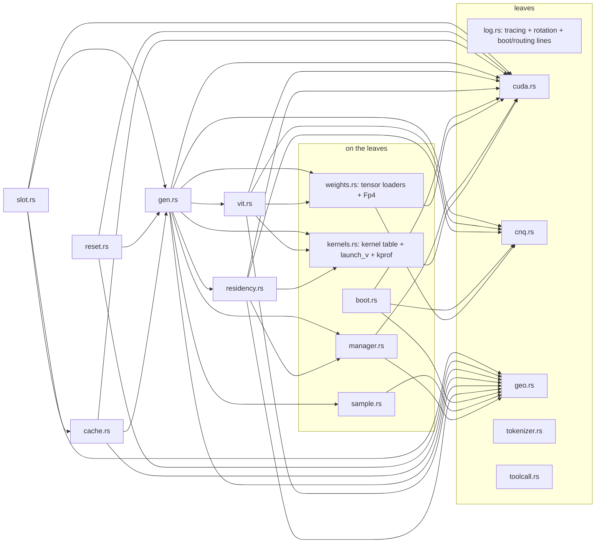

# crow-nest engine spec

**Status: fully approved by robin on 2026-09-02 (all six sections, issue crow-nest #4).**

Approved section by section (issue crow-nest #4; a section is truth only after robin's
approval is recorded there). Environment for every number: `docs/system-landscape.md`.
Methodology: Crow #159. No north star in the record's sense — misses are measured
results that re-cut stages.

---

## Section 0 — goals and operating points (APPROVED by robin 2026-09-02, with the prefill provenance integrated)

### 0.1 Status of the goals

Product requirements from robin (2026-09-01/02, epic #1). They are targets the engine
aims at and the harness reports against — the record's discipline stands: a miss is a
measured result that re-cuts a stage (timebox guard), never a project failure. No goal
is a pass/fail gate.

- Amended 2026-09-11 (robin, chat, recorded on issue #1): an end state below llama.cpp on this
  machine is not acceptable; the performance stage (#37, #38, a per-token kernel profile against
  llama.cpp, #19, #10) runs before the quant upload (F4 to F6), and the comparison is quoted on one
  prompt with both quantizations named (CNQ4.5-M 4.5 bpw against UD-Q2_K_XL 2.4 bpw).

### 0.2 Context

- **Floor 200,000 tokens** — every shipped configuration must hold ≥ 200k; the engine
  refuses a configuration that cannot.
- **Default 262,144** (architecture ceiling) with **FP8-KV**; slider [200k, 262,144].
- The oracle checks FP8-KV against the BF16 reference; if it goes red, the fallback
  operating point is 200k + BF16-KV (~4.6 GiB KV).
- State at default: KV ~3.0 GiB (FP8) / ~6.0 GiB (BF16), GDN ~0.12 GB (f32, fixed),
  QSA per its budget of 2,048 tokens.

### 0.3 Throughput targets, with their measurement points

- **Decode ≥ 42 tok/s** — measured at batch 1 (`-np 1`), session filled to the **200k
  floor** (not the ceiling), after a discarded warm-up request; reported against the
  interleaved llama.cpp baseline on this machine (41 tok/s endstand, same session).
- **Prefill ≥ 972 tok/s**, binding at the **32k operating point**, measured as the
  **completed-prompt average** (prompt tokens ÷ prompt time). Instantaneous rates are
  reported alongside but never substitute for the average.
  - Provenance (grounded 2026-09-02): 972 first appears as the baseline's instantaneous
    rate at 26 % of a ~31.7k-token prefill (`crow-lab/runs/2026-08-30-levers-159/
    control-03`: n_tokens 8,245, 972.24 tok/s). The completed-32k baseline average is
    ~750 tok/s (ladder: 750.75 at 30,777 tokens). The target is therefore honestly a
    ~+29 % stretch over baseline at 32k — a goal, not a gate.
- Every throughput number names: context fill, prompt length, chunk size, quant of both
  engines under test.

### 0.4 Latency metrics

- **TTFT** (time to first token) at the 200k floor with a named prompt length; target
  set by robin against crow-nest's first measured prefill (no invented number now).
- **Mean inter-token latency** is implied by the decode goal: 42 tok/s ⇔ ~23.8 ms.
- "Minimal latency" as a design constraint is already decided and needs no number: no
  host in the hot loop, no kernel launch for synchronization (job ring, stream memops).

### 0.5 Measurement discipline (binding)

Interleaved A/B in the same session, one variable at a time, resolution stated,
environment per `docs/system-landscape.md`. Performance is a measurement, not a
condition.

**The three consequence rules of #38, as robin decided them on 2026-09-18** (the Linux chains
that answered the issue are in `docs/measurement-coverage.md`; the form is `tools/drift-chain.sh`):

1. **The host-RAM gate before an engine start is per OS.** *Windows: the 50.5 GiB gate* — a chain
   waits for more than 50.5 GiB free host RAM before it loads the engine (rule since 2026-09-10).
   *Linux: the derived budget, read off the `[budget]` boot line* — that gate does not apply and
   stays replaced by the pinned budget the engine derives at boot (8.8 point 2, issue #15); a
   `MemAvailable` reading of it would have refused all twelve engine starts of the #38 chains.
2. **A `serve` tok/s is quoted only next to an adjacent `decode run` measured in the same chain**
   (2026-09-10, kept on Linux too). The reason since 2026-09-18 is no longer the run-position
   drift — that is absent on the Linux box, 0.56 % over eight counted serve runs — but the
   operating point: the two arms are not the same one. `serve` pins prompt chunk 2048, gets
   N = 149 hot experts per layer and ticks the stream trickle on every decode step; `decode run`
   lets the policy pick 4096, gets N = 142 and does not tick. A lone serve rate therefore invites
   a comparison the configuration does not support, and the adjacent `decode run` is the anchor.
3. **A `serve` decode number enters THIS document, on Linux, only in the drift-chain form.** The
   2026-09-10 bar ("no serve decode number enters `docs/architecture.md`") is RELAXED for a rate
   that carries all of: at least 3 counted serve runs inside one chain, one fresh process per run,
   the generated-ids sha256 identical across those runs, an adjacent `decode run` arm in the SAME
   chain, and the figure quoted as its arm mean with its max-over-min spread beside that decode
   arm's mean and spread, naming the chain's log. A serve number without that form is refused
   here, whatever it measures. On Windows the bar stays as written until the M2a form is rerun
   on that box.

---

## Section 1 — model format and streaming converter (APPROVED by robin 2026-09-02: BF16 keep-set as proposed; 551 GB free NVMe confirmed)

> **Official name (robin, 2026-09-02): the format and quant family is CNQ; the base
> variant is CNQ4.5** (container magic `CNQ1`, 4.5 bpw NVFP4). Planned follow-ups inherit
> the scheme: CNQ4.5-C (per-expert calibrated scales, stage 2), CNQ4.5-P8 (PLE block
> exchanged to FP8 if the oracle goes red). KV dtype stays runtime config, not part of
> the name. First artifact: `Qwen3.8-Flash-Next-CNQ4.5.cnq`.

### 1.1 Input

The original safetensors: 131 shards, 359,999,963,128 B, revision
`de4b8e4d43b917e7706784d8bb445c9af86a3540`, read with mmap streaming — the model is
never held in RAM. Disk requirement for a conversion: input 360 GB + output ~101 GB
(plus a verification sidecar) — **~470 GB free NVMe**.

### 1.2 Output format (own container, no GGUF)

- **Container**: own binary, shard-aligned, JSON header with the tensor index
  (name, logical dtype, shape, block format, file offset) — conceptually safetensors'
  header, not its code; the container is ours.
- **Quantized weights**: NVFP4 blocks per ggml geometry — 64 values per block, 32 B
  packed E2M1 + 4 ue4m3 scales (one per 16-wide sub-block) = 36 B / 64 values = 4.5 bpw,
  **plus one global f32 scale per tensor** (two-level scaling; probe-pinned hardware
  facts apply, the global scale is a converter convention to be validated numerically in
  the first oracle run).
- **Kept in BF16** (proposal): embeddings and `lm_head` (untied, 2 × 1.27 GB BF16 —
  2.5 GB of 360, no reason to risk them), **router GEMM** (2560 × 512 per layer) and
  `shared_expert_gate`, all norms (`hc_norm` et al.). Routing stability and norm
  precision are cheap to keep.
- **Everything else** (GDN, attention, hyper-connection low-rank, experts, shared
  expert): NVFP4. This is what the CONVERTER emits and it is unchanged. Since #77
  (2026-09-18) the ENGINE can be told to read the 495 dense text tensors from a bf16
  OVERLAY container instead (`CROW_CNQ_OVERLAY`, `converter dense-overlay`,
  `docs/dense-overlay.md`); the shipped container and the default path are untouched by
  it, and the overlay is a measurement instrument, not a shipped variant. (The launcher
  `tools/serve-linux.sh` defaulted to an overlay twice and was reverted both times; since
  `0254ed6`, 2026-09-23, it attaches none unless asked — 8.8 point 6.)
- **PLE block**: NVFP4, **exchangeable** — the header tags it as a self-contained
  section so an FP8 swap (oracle fallback) needs no format change.
- **ViT + MTP**: carried in the format, tagged optional-to-load (decision 2026-09-02).
- **KV dtype is runtime config** (FP8 E4M3 default), not file content.

### 1.3 Stage 1 — calibration-free RTN

Shard-streaming on read AND write; each tensor quantized on the fly, per-tensor global
scale computed before emitting its blocks; output written incrementally so at most one
working copy exists beyond input and output.

### 1.4 Stage 2 — per-expert calibration (separate ticket, later)

Re-emission of scales only (format unchanged) from Crow's routing statistics —
ModelOpt's `--calib_all_experts` idea with real traffic instead of synthetic samples.

### 1.5 Acceptance

- Round-trip decode of sample tensors matches BF16 reference within documented error;
  per-tensor max/mean deltas recorded in a verification sidecar next to the output.
- The oracle (#6) consumes the **unquantized originals** — this stage's output is never
  the quality reference.

### 1.6 Resolved (robin, 2026-09-02)

- BF16 keep-set approved as proposed (embeddings, lm_head, router GEMM, gates, norms).
- Disk: 551 GB free NVMe — conversion runs fit comfortably (~470 GB needed).
- Budget consequence carried into section 2: the BF16 keep-set adds ~1.8 GB dense
  VRAM; the hard hot-set ceiling drops from ~177 to ~169 experts/layer (default 160
  unchanged, loader auto-clamps).

---

## Section 2 — memory layout: residency, PLE window, three-state manager (APPROVED by robin 2026-09-02)

### 2.1 VRAM budget at the default operating point (262k context, FP8-KV)

| item | GB | note |
|---|---|---|
| dense resident | ~6.0 | 12.5 GB BF16 → NVFP4 (~3.5) + BF16 keep-set 2.5 (embeddings, lm_head, router, gates, norms); ViT/MTP carried in file, NOT loaded at this stage |
| hot experts | N × 0.132 | 2.76 MB per expert per layer × 48 layers; default N=160 → 21.2 GB |
| KV cache | ~3.2 | FP8 E4M3, 12 KiB/token × 262,144; BF16 would be 6.4 |
| GDN state + QSA | ~0.3 | GDN f32 36 × ~3.1 MB ≈ 0.11; QSA per budget 2048 |
| PLE hot-row cache | 1.0–2.0 | window cache, sized by telemetry (2.2) |
| activations + graph pools | 1.5–2.0 | decode graphs are small; measured at first integration |
| **total non-expert** | **~13.0–13.5** | of 34.4 (32 GiB) |
| **expert budget** | **~20.9–21.4** | → hard ceiling **~158–162** experts/layer with honest pool sizing |

#77 (2026-09-18) measured what the two-sided clamp does when the dense set GROWS: reading the
495 dense text tensors as bf16 instead of NVFP4 takes dense from 6.63 to 9.99 GiB, the planner
sees it (it derives the dense size from measured free VRAM, not from a constant) and lowers N
from 155 to 128 at the serve operating point — and the LOWER N then needs about 3.4 GiB more
pinned host RAM, which the 46 GiB cap below does not have. The planner refuses by name
(`planner_refusal_msg`), which is the behaviour this rule asks for; the measurement runs at
`CROW_PINNED_BUDGET_GB=50` and is not the operating point of record (`docs/dense-overlay.md` 5).

Loader rule (binding): N=160 is the **target**; the loader verifies the full budget with
measured overheads at load time and auto-clamps N if the sum exceeds VRAM — it refuses
configurations that fall below the 200k context floor, never silently degrades context.

The clamp is **two-sided**: VRAM lowers N, the host pinned budget raises it (fewer cold
experts to pin). That budget is not a constant — it is derived at boot as
`min(46 GiB cap, free_for_pin - CROW_RAM_MARGIN_GB)` and capped at the 46 GiB of `geo.rs:42`
(`manager::derive_host_pinned_budget`, issue #15, 2026-09-17). `free_for_pin` counts the
NVIDIA driver's pinned-page pool as free, because it is reclaimable and the next
`cuMemHostAlloc` is served out of it — but only while THIS is the only CUDA process. When
`cuda::other_cuda_fd` finds another process holding `/dev/nvidia-uvm` open (a `/proc/<pid>/fd`
scan, readable entries only), the pool may be that process's, so the budget falls back to the
conservative `MemAvailable` and the `[budget]` boot line names that basis. `/dev/nvidia-uvm`
is the right node: every CUDA context opens it and no graphics client does — measured
2026-09-17, the compositor and every GL app hold `/dev/nvidiactl` and `/dev/nvidia0` while
owning no pinned pool, and testing for THOSE refused the engine's own operating point. Since
#103 (2026-09-23) the fallback is gone: `free_for_pin` subtracts the driver memory live processes
map (`driver_live`) instead, and the Linux cold tier is registered anonymous memory
(`CROW_PINNED_ALLOC=register`) that returns to the kernel on exit (8.8 points 3 and 7). The planner refuses only when no N satisfies both sides (`planner_refusal_msg`).

The clamp also carries a **vision reserve** (TASK K, 2026-09-17): with `CROW_VIT` on, the VRAM the
image path allocates inside a request — the cap-sized tower scratch and the interleaved-mrope
span tables, 277.3 MB together at `n_ctx` 200,000 — is
added to the planner's `pending` bytes, so N is chosen with it and an image request can never find
the card full. It is named on its own `[budget]` line and costs N 157 -> 155 at the serve operating
point (7.13 has the two numbers and the measurement). `CROW_VIT=0` reserves nothing.

### 2.2 Expert residency (per layer, data-driven)

- Residency sets are **per-layer top-N by selection frequency** — per-layer ranking, not
  the global curve (#3; per-layer selection achieves ≥ the global coverage).
- Warm-up: first runs accumulate per-layer selection counts (every routed choice counts,
  hit or miss — the print_locality discipline), promote the top-N per layer, and persist
  the sets in a sidecar next to the model file; refreshable by config or command.
- Sidecar contract (`residency::sidecar_sets`, `#49`, 2026-09-18): the file is ONE JSON object
  with a `sets` array of 48 rows of expert ids. Row lengths are adapted to the run's N **per
  row** — a short row is padded with the lowest unused ids, a long one is truncated, and every
  adapted row is logged with its own length. Padding is legitimate because the planner gives
  every layer the same N hot slots whatever the file says and residency is numerically invisible
  on the default tier (7.5 condition 2); it is deterministic, so one file at one N is one hot
  set. What no padding can mean is REFUSED by name: not one JSON object, not 48 rows, an entry
  that is not an expert id, an id outside `0..512`, an id twice in one row. The converter writes
  no hot-set file — `converter/*.cnq.sidecar.jsonl` is the per-tensor quantization report, one
  JSON object per line — and is refused here by name.
- Routing-gated skip: a layer whose 10 routed experts are all resident has **no cold
  job at all** — the handoff count responds to this, measured per token (#7 acceptance).

### 2.3 Cold path (variant A; stager built for C from day 1)

- GPU publishes cold jobs (expert IDs per layer) into the pinned job ring via
  `cuStreamWriteValue32`; the stager gathers weights (RAM tier) into pinned staging
  blocks and streams H2D; the GPU waits on per-job flags via `cuStreamWaitValue32`.
- No host in the hot loop, no kernel launch for synchronization, no full-device barrier.
- The stager's source is an interface from day 1: RAM tier now, NVMe tier (variant C) is
  a second backend of the same interface (decision 2026-09-02). "Compute on CPU"
  (variant B) stays a policy option behind the same interface, unbuilt.
- Per-layer policy field chooses the cold path by bandwidth, not hardcoded.

### 2.4 PLE (one layer, 128 tables of [2,500,012, 160])

- On disk NVFP4 (~28.8 GB), accessed as an **NVMe-mmap window** with a VRAM hot-row
  cache (default 1.0–2.0 GB, sized by hit-rate telemetry).
- Row indices computed **host-side per token** first (llama.cpp's proven
  `set_input` pattern — small H2D of indices); GPU-side indexing is a later refinement,
  not a stage gate.
- Row format NVFP4, block-exchangeable to FP8 (section 1); `ple_layer_ids: [2]` vs
  tensors on `layers.1` — the converter resolves the index once and records the
  resolution in the header.
- Row granularity on NVMe: reads happen at page granularity, so the cache design assumes
  read amplification and lets the hot-row cache absorb it — hit rate is measured, never
  assumed. (The 2026-09-02 text said "a row is ~108 B NVFP4, ~37 rows per 4 KB page"; that is
  the PADDED row of the VRAM cache, not the on-disk layout — see the next point.)
- **On-disk row layout, as built (corrected 2026-09-23, #91, `85a48e7`).** A PLE n-gram shard
  of the `-M` container is a FLAT stream of 64-value NVFP4 blocks (36 B each: 4 ue4m3 group
  scales, then 32 B of e2m1 pairs) with 160 values per row: 400,001,920 values = 2,500,012
  rows = 225,001,080 B per shard. Row `r` starts at value `160*r`, i.e. in block
  `floor(160r/64)`, on a block boundary for even `r` and 32 values into the block for odd `r`;
  a row spans up to 4 blocks (144 B) on disk. `gen::ple_row_span(row, n_values)` returns
  (byte offset `b0*36`, blocks to read, value offset 0 or 32) and `gen::ple_row_pad` repacks
  the span into the padded 3-block row (108 B) that the VRAM row cache and `gather_ple_fp4`
  use. `Ple::ensure_rows`, the batched warm fetch (`Cnq::warm().rows(.., 4*36)`) and the
  prefill prefetch (`Ple::row_offsets`) all take their offsets from `ple_row_span`.
- **The bug this replaced.** Until `85a48e7` all three read row `r` at byte `r*108` — the
  padded cache layout applied to the flat file — so every token got bytes of OTHER rows as its
  n-gram embedding. The `row * 108` read is already in the first engine commit (`7ba3ed6`,
  2026-09-05); since when every container matched the flat layout is not established here.
  Evidence (2026-09-23, `tools/layerdiff`, `decode_out/meas-0923/layerdiff`, crow-nest with
  the dense-BF16 overlay, pinned 50 GiB wc, `CROW_GRAPH=0`, against llama.cpp UD-Q2_K_XL
  `ldump` at the corrupt-digit sites mat44-a149 (103,559 tokens) and N33-a131 (98,015 tokens)):
  layer 0 matches (residual cos 0.9985 / 0.9992); layer 1, the PLE layer, splits — gathered
  embedding cos -0.01 to the GGUF row, PLE contribution cos -0.03 / -0.04, residual cos 0.23 /
  0.21 — and never recovers (layer 47 residual cos 0.74 / 0.54). With the flat read: embedding
  cos 0.993, layer-1 residual 0.998 / 0.999, layer 47 0.91 / 0.92; the correct-token margin
  moves from -0.81 / -7.77 to +12.53 / +12.71 nats (llama.cpp +14.60 / +14.16 in the same
  `ldump`). Multi-site teacher-forced probe (23 sites, 2026-09-23, dense overlay, pinned 50 GiB
  wc, KV fp8_e4m3): corrupt token wins 9 of 23 before the fix (build with `488a840`), 4 of 23
  with it, mean margin +0.45 -> +8.40; llama.cpp UD-Q2_K_XL through llama-server 4 of 23. No
  multi-site number exists for the BARE container with the fix (that arm's boot panicked with
  `CUDA_ERROR_INVALID_CONTEXT`). The hot-set sidecar `hotsets-M-longctx2100-n160.json` was
  calibrated on the wrong rows and needs recalibration (live hit rate 0.52-0.70 after the fix
  against 0.77-0.80 before, robin's session of 2026-09-23). Recalibrated 2026-09-24 as
  `hotsets-M-crow0924-n160.json` (`docs/hotset-calibration.md`). Lib tests
  `tests_ple_row`.

### 2.5 Three-state manager

- **KV**: 12 full-attention layers, 2 KV heads × head_dim 256, FP8 E4M3 default, BF16
  fallback via config; allocation at load for the configured context; resize only
  across full reloads (no mid-session shrink in stage 1). As built: `CROW_KV`
  (`bf16` / `fp8` / `fp8_e4m3`), read once in `boot::open_model` for `decode`, `parity` and
  `serve` since #102 (2026-09-23; `serve` ignored it before). bf16 at `n_ctx` 200,000 is
  2343.8 -> 4687.5 MB of KV (+2.29 GiB VRAM), which the planner takes out of the hot set, so the
  pinned cold tier grows and the 46 GiB default cap refuses the bare container (N 155 -> 136
  needs 47.3 GiB); `CROW_PINNED_BUDGET_GB` 48 bare / 52 with the dense overlay — computed from
  the MEAS-0923 boots, not measured; no serve has booted with bf16 KV yet (2026-09-23).
- **GDN recurrent state**: 36 layers, f32 (16 K / 48 V heads at 128, conv kernel 4) —
  fixed size, context-independent.
- **QSA indexer cache**: budget 2,048 tokens, compress ratio 4 — third state kind,
  allocated alongside KV (`llama-memory-hybrid-idx` as the shape reference).
- Hyper-connections: `hc_norm` state is part of the weights, the 10240-wide residual
  stream is activation, not state.
- The manager owns all three kinds; stages never allocate around it (no leaks across
  stages, one accounting).

### 2.6 Acceptance

- Budget table verified by the loader on this machine (measured, not estimated, pool
  sizes); auto-clamp demonstrated by forcing N=192.
- Warm-up promotion demonstrated: coverage of the persisted sets vs the #3 curve.
- Cold-job path end to end on synthetic traffic before the first real decode.

---

## Section 3 — scheduler: job ring, routing-gated skip, cold-path policy (APPROVED by robin 2026-09-02)

### 3.1 The constraint the scheduler exists for

The borrowed engine's fixed term is 67.1 % synchronization at 62 CPU↔GPU handoffs per
token; a swapped barrier costs 4–6 ms (Crow #186). Binding design constraints: **no host
in the hot loop, no kernel launch for synchronization, no full-device barrier between
layers.** The decode loop per token: embeddings + PLE gather → 48 layers (36 GDN, 12
full attention, interleaved per `layer_types`) under hyper-connections → per MoE layer:
router on GPU → top-10 + shared expert → resident experts computed immediately → cold
experts via the job ring → `shared_expert_gate` combine.

### 3.2 Job ring (the handoff)

- Pinned host-memory ring, job descriptors 64-byte aligned (exl3 `moe_handoff.h`
  pattern): layer id, job kind, cold expert ids (≤ 10), sequence number, flag slots.
- The **descriptor is written by device-side mapped writes** from a small GPU kernel
  (the router result never leaves the GPU to produce it); publication of the flag goes
  through `cuStreamWriteValue32`. The stager thread busy-polls the pinned ring (no sync
  primitives), gathers cold expert weights from the RAM tier into pinned staging blocks,
  copies H2D on a dedicated copy stream, and raises the completion flag; the GPU's cold
  expert compute is enqueued behind `cuStreamWaitValue32` on that flag.
- **Overlap is the design goal, not alternation**: resident-expert compute and
  subsequent dense work proceed while the stager services cold jobs.
- Ring sizing: ≥ 256 slots (≤ 48 jobs/token worst case), sequence numbers against
  wraparound; a dead stager fails the engine loudly — no silent stall, ever.

### 3.3 Routing-gated skip

- Residency bitmaps (one per layer, from section 2.2's sets) live on the GPU; the skip
  decision is derived on-GPU from routing vs bitmap. A layer whose 10 routed experts are
  all resident publishes **no job**; a layer with k cold experts publishes exactly one
  job carrying those k ids.

### 3.4 Cold-path policy (AMENDED 2026-09-02, robin approved: zero-copy replaces stream-weights as primary)

Measurement history that drove the amendment: per-layer ring round trips measured
~3.1–3.4 ms on WDDM (28 cold layers/token → dead); speculative cross-token prefetch
measured 0.2–0.7 % prefetch gain (dead — the hot set already IS the temporal
structure); zero-copy direct read measured 21.6–25.1 GB/s (probe 3). HGS probed: no
benefit for driver-API handoffs (4.7 vs 3.1 ms).

- **Cold path A′ "zero-copy direct read" (primary)**: expert GEMM kernels take VRAM
  pointers for resident experts and PINNED HOST pointers for cold ones — the GPU pulls
  weights over PCIe inside the GEMM. No copy, no submission, no stall, no speculation.
  Cost: ~111 MB/token at ~23 GB/s ≈ 4.8 ms (N=160) / ~3.3 ms (N=176), spread across
  layers inside the GEMMs. Pinned cold tier ≈ 43–47 GB of 64 GB host RAM.
- **The job ring + stager remain for the control plane**: residency-set swaps,
  NVMe-tier staging (variant C), refresh, telemetry — off the decode critical path.
  Variant B (CPU compute) stays reserved; variant A (stream-weights) is retired from
  the primary path (kept behind the ring interface for tier transitions).
- Policy is still per layer, chosen at load, fixed per session.
- **Decode staging as built (`CROW_STAGE`, default on)**: after `router_top10` the
  staging kernel pulls every COLD combo of the layer into a VRAM staging slot and
  rewrites the combo pointer tables; hot combos keep their slab pointer. The kernel is
  `stage_cold_ca` since #19e (2026-09-12); `CROW_STAGE_KERNEL=1` restores `stage_cold`,
  which reads with coalesced 16-byte loads and measured 10.248 ms/token at 33.0 GB/s over
  338 MB/token on 2026-09-11 (#19a).
- **`CROW_STAGE_DMA=1` (measurement only, #19b, default off)**: the same staging done by
  the COPY ENGINE, one `cuMemcpyDtoDAsync` per cold combo and matrix issued from the host
  from the mapped pinned pointer. The routed pointers exist on the host only after
  `router_top10` of that layer, so the switch forces the decode graph off and costs one
  host sync per layer. Not an operating default.
- **`stage_cold_ca` (the DEFAULT since #19e, 2026-09-12; `CROW_STAGE_KERNEL=1` falls
  back)**: the same staging done by `stage_cold_ca` (`kernels.rs:2263`), a PERSISTENT
  grid of `CROW_STAGE_BLOCKS` x 256 threads (default 40) launched from `gen.rs:2051`.
  Work item = (matrix, combo); the owning block `item % gridDim.x` rewrites the pointer
  table entry, and the 4 KB tiles of a cold item are split over all blocks, each tile
  read with `cp.async.cg.shared.global` 16 B per thread into a two-deep shared double
  buffer and stored coalesced to VRAM. Same inputs plus the combo count `t * TOPK` by
  value, same outputs, still inside the decode graph.
- **Requirement of `stage_cold_ca`**: both staged slab byte counts must be exact
  multiples of 4096, because the kernel carries no tail tile. `gen.rs:683` asserts it at
  load and `gen.rs:2048` again at the launch site; both panic messages name
  `CROW_STAGE_KERNEL=1` as the fallback. This container: `gate_up` 1843200 B = 450 tiles,
  `down` 921600 B = 225 tiles.
- **`CROW_STAGE_PAR=1` (#19j, 2026-09-18, default off)**: the same kernel, the same
  bytes, issued on a side stream with an event pair — `cuEventRecord` on the compute
  stream, `cuStreamWaitEvent` on the side stream, the launch, and the join immediately
  before the routed gate|up GEMV, the first reader of the pointers the kernel rewrites.
  The shared-expert chain of the same layer (about 22 us per layer, 1.05 ms per decode
  token) reads no staged byte and runs beside the copy. Inside the decode graph the fork
  and the join are capture nodes, so the graph gains one parallel branch per MoE layer.
  Bit-identical by construction and measured so (parity 8 / 512 / P8 teacher-forced with
  the flag ON, plus the `decode run` ids of record); the adjacent pairs read
  **-0.8779 ms per decode token = -3.47 percent**, `docs/architecture.md` 4.8.1.
- **Boot line**: every engine process prints one `[stage]` line naming the kernel it will
  run, its grid, the slab byte counts and (since #19j) the stream the copy is issued on
  (`gen.rs` for `stage_cold_ca` and for `stage_cold`), so every log says which kernel
  produced it and where it ran.

| Switch | Kernel | Grid | Read shape | Mode |
|---|---|---|---|---|
| unset (default) | `stage_cold_ca` | `CROW_STAGE_BLOCKS` x 1 x 1, 256 threads | `cp.async.cg.shared.global` 16 B per thread into 4 KB shared tiles, 2-deep, slab bytes must be 4 KB multiples | operating |
| `CROW_STAGE_KERNEL=1` | `stage_cold` | `t * TOPK` x 2 x `CROW_STAGE_SPLIT`, 256 threads | 4 x 16 B `uint4` loads in flight per thread | operating fallback |
| `CROW_STAGE_DMA=1` | none, copy engine | host-issued `cuMemcpyDtoDAsync` per cold combo | copy engine, decode graph off | measurement |
| `CROW_STAGE_PAR=1` (#19j) | `stage_cold_ca`, same grid and same bytes | issued on a SIDE STREAM, joined before the routed GEMV | one parallel branch per layer inside the decode graph | opt-in, default off |

- The decode operating point that decided the staging default: #19e, 2026-09-12.
- The decode operating point that decided the trickle issue default: #63c, 2026-09-12.
- The decode operating point that decided the QSA selection default: #61b, 2026-09-12.
- The decode operating point that decided the split-count flip: #61d, 2026-09-13, ROLLED BACK by #61e the same day under the improvement-loop quality rule (the ten-task quality bar was not held at 32); #61b is again the split-count default of record.
- The decode operating point that decided the combined fusion default: #19g, 2026-09-13 (the #19f hc-chain fusion and the #62b grouped GDN input projections both default).
- The decode operating point that decided the all-fused default: #19i, 2026-09-13 (the #19h shared-expert fusion joins the same default predicate; the confirmation form is W + 3N, no adjacent B arm post-flip).
- The decode operating point that crossed the llama.cpp line: #62e, 2026-09-13 (the resumed #62d lever, 62a lever 2, the 32-rows-per-block GDN slab geometry, joins the default set with no new env; the no-env N mean 22.1761 ms per token = 45.1 tok/s is the first engine default under the 22.27 llama.cpp row).
- The prefill operating point that opened the compute levers: #10c, 2026-09-14 (the dense GEMM variant B, F50's named next dense form, lands as OPT-IN `CROW_PF_GEMM_B`, no default flip; the clean pairs measured -2.27 and -2.33 s = -11 percent on t1-read 16k, and the llama 922.5 tok/s prefill row stays open: 18.44 s = 871 tok/s is 1.03 s short of it and 0.51 s above the 17.93 s no-copy floor band of F50).
- The Linux prefill of record crosses that row, on the same prompt and a different machine: the 16,064-id t1-read form (`decode run … 128`, `CROW_CHUNK` unset so the policy picks 2048, context fill 16,192, crow-nest CNQ4.5-M NVFP4 4.5 bpw) reads **16.60 s = 968 tok/s and 16.66 s = 964 tok/s** on 2026-09-17, RTX 5090 / Arch Linux, commit `1032bc5`, against **598 / 601 tok/s** on the same two runs of the preceding build — an interleaved A/B in one session, two runs per arm, identical id traces (`CHANGELOG.md` 2026-09-17, the PLE prefill floor). It is NOT a row of the table above and does not close the 922.5 row: the llama.cpp arm of record (17.41 s = 922.5 tok/s, 2026-09-11) is a WINDOWS measurement with GGUF Q2_K_XL at 2.4 bpw, and no llama.cpp arm has been run adjacent to it on this machine. Section 8.7 holds the Linux values of record.
- **The fused rows below are history since 2026-09-23.** The activation-floor fix (`488a840`, 4.2 item 2) made `CROW_QFUSE` opt-in (exact `1`): the engine default is now the pre-scaled separate-launch cascade with the UNFUSED 8-launch hc chain and 6-launch shared chain. The fusions' cost of record is 19f -0.98 and 19h -0.23 ms per token, so the unfused default is expected to be roughly 1.2 ms per token slower than the 22.43 ms all-fused row; that is an estimate, NOT a measurement — no decode time of the 2026-09-23 default has been taken yet.
- Every row of this table is one adjacent pair of one chain; the two crow-nest columns are the two arms of that pair.
- The two arms run different weights: crow-nest CNQ4.5-M (NVFP4, 4.5 bpw); llama.cpp Qwen3.8-Flash-Next-UD-Q2_K_XL (GGUF, 2.4 bpw).
- A tok/s figure is quoted only next to its adjacent arm in the same chain (#38, 0.5 rule 2). For a `serve` rate that rule is about the operating point since 2026-09-18 and not about the drift: `serve` (N 149, chunk 2048, trickle ticking) and `decode run` (N 142, chunk 4096, no tick) are different arms, so the adjacent `decode run` is what anchors the serve number.

| shape metric | crow-nest, engine default | crow-nest, the named fallback | llama.cpp | machine | date | source |
|---|---|---|---|---|---|---|
| prefill, t1-read 16,064 ids, chunk policy 4096, gen 8, the #10c dense variant B pair (F49 form, W + 3 adjacent pairs, purged container, fresh process per run; the switch is OPT-IN, the OFF arm IS the default of record) | 20.73 s = 775 tok/s, the default of record (B2 20.723 / B3 20.728, plateau spread 0.01 percent; B1 18.491 s is a documented whole-run outlier kept in the log, 38a rule 9; plateau reproduction gap -0.49 percent against the 10b stage-1 N arm 20.828 s of 41169f0) | 18.44 s = 871 tok/s with `CROW_PF_GEMM_B=1` (N1 18.460 / N2 18.453 / N3 18.398, spread 0.3 percent; the two clean pairs -2.270 and -2.330 s = -11.0 and -11.2 percent; ids trace sha `16d9e0dab22b07a6`, hot set N=147 and cold 301.1 of 480 identical in all 7 runs; decode watch 32.9 against 33.4 tok/s, a prefill-shaped switch) | 17.41 s = 922.5 tok/s | RTX 5090 | crow-nest 2026-09-14, llama.cpp 2026-09-11 | `decode_out/srv-10c.log`, `decode_out/srv-59b.log` |
| decode, t1-read 16,064 ids, 255 timed steps, the #62e 32-row GDN slab geometry pair (the resumed #62d lever on top of the #19i all-fused default; W + 3 adjacent pairs, ids `5098f885ab3a` in 7 of 7 runs incl. W) | 22.18 ms per token = 45.1 tok/s (N1 22.1327 / N2 22.1627 / N3 22.2330, spread 0.1003; -0.4470 ms = -1.98 percent, 3 of 3 pairs favour N) | 22.62 ms per token = 44.2 tok/s, the 19i-state B arm (B1 22.6322 / B2 22.6142 / B3 22.6230, spread 0.018; a same-source `be7bb60` rebuild `a7d850803e62`, the of-record `5c7919276203` not byte-reproducible; the standing #19i no-adjacent-B row below measured 22.43 = 44.6) | 22.27 ms per token = 44.9 tok/s | RTX 5090 | crow-nest 2026-09-13, llama.cpp 2026-09-11 | `decode_out/srv-62e.log`, `decode_out/srv-59b.log` |
| decode, t1-read 16,064 ids, 255 timed steps, the #19i all-fused default confirmation: hc chain FUSED + shared chain FUSED + grouped GDN + cascade, all default with no env (W + 3N form, NO adjacent B arm post-flip: `CROW_QFUSE=0` would also disable the NVFP4 cascade) | 22.43 ms per token = 44.6 tok/s | 22.80 ms per token = 43.9 tok/s, the previous default (the #19g combined default; the lever's own adjacent-pair reading is the #19h one, -0.2286 ms = -1.00 percent in 3 of 3 pairs) | 22.27 ms per token = 44.9 tok/s | RTX 5090 | crow-nest 2026-09-13, llama.cpp 2026-09-11 | `decode_out/srv-19i.log`, `decode_out/srv-59b.log` |
| decode, t1-read 16,064 ids, 255 timed steps, the #19/#62 combined default pair (#19g): hc chain fused + GDN input projections grouped, both default with no env | 22.80 ms per token = 43.9 tok/s | 23.94 ms per token = 41.8 tok/s, the previous default (61b arm of record; the same-chain double fallback `CROW_QFUSE=0 CROW_GDN_FUSE_IN=0` measured 26.86 ms = 37.2 tok/s, but that arm also runs the NVFP4 cascade in its separate-launch form — the documented `CROW_QFUSE` overload makes it an artifact, not the previous default) | 22.27 ms per token = 44.9 tok/s | RTX 5090 | crow-nest 2026-09-13, llama.cpp 2026-09-11 | `decode_out/srv-19g.log`, `decode_out/srv-59b.log` |
| decode, t1-read 16,064 ids, 255 timed steps, the #61d split-count pair (the flip ROLLED BACK by #61e after the quality verdict; measurement of record for the knob) | 22.85 ms per token = 43.8 tok/s | 24.13 ms per token = 41.4 tok/s with `CROW_ATTN_SPLITS=8` | 22.27 ms per token = 44.9 tok/s | RTX 5090 | crow-nest 2026-09-13, llama.cpp 2026-09-11 | `decode_out/srv-61d.log`, `decode_out/srv-59b.log` |
| decode, t1-read 16,064 ids, 255 timed steps, the #61b QSA selection pair (the engine default of record from #61b until #19g; the QSA and split parts of it are unchanged) | 23.94 ms per token = 41.8 tok/s | 24.87 ms per token = 40.2 tok/s with `CROW_QSA_PAR=0` | 22.27 ms per token = 44.9 tok/s | RTX 5090 | crow-nest 2026-09-12, llama.cpp 2026-09-11 | `decode_out/srv-61b.log`, `decode_out/srv-59b.log` |
| decode, t1-read 16,064 ids, 255 timed steps, the #63c trickle pair (the engine default before #61b) | 24.78 ms per token = 40.3 tok/s | 26.41 ms per token = 37.9 tok/s with `CROW_TRICKLE_DEFER=0` | 22.27 ms per token = 44.9 tok/s | RTX 5090 | crow-nest 2026-09-12, llama.cpp 2026-09-11 | `decode_out/srv-63c.log`, `decode_out/srv-59b.log` |
| decode, same shape, the #19d staging pair (K40 against B, `task-19d-report.md`), both arms on the eager trickle of that day | 26.46 ms per token = 37.8 tok/s | 29.68 ms per token = 33.7 tok/s with `CROW_STAGE_KERNEL=1` | 22.27 ms per token = 44.9 tok/s | RTX 5090 | 2026-09-11 | `decode_out/srv-19d.log`, `decode_out/srv-59b.log` |
| staging row of that step, nsys, 338 MB per token | 7.07 ms per token at 47.78 GB/s | 10.42 ms per token at 32.45 GB/s with `CROW_STAGE_KERNEL=1` | n/a | RTX 5090 | 2026-09-11 | `decode_out/srv-19d.log` |

### 3.5 PLE in the loop

- PLE row indices are computed host-side per token (section 2.4) — the one host touch
  per token outside the ring: pure index math, a few KB H2D, off the critical ring.

### 3.6 Acceptance

- Ring round-trip microbenchmark on Windows (resolution stated) against the 4–6 ms
  barrier cost from #186 — Windows FIRST (strand 2: exl3 memops unexercised on Windows).
- Synthetic 48-layer MoE pass: measured skips, cold jobs, bytes per token.
- A timestamped trace of a decode step shows **zero host wakes per layer** — the 62
  handoffs must collapse to ring jobs only.

---

## Section 4 — kernel path: sm_120a FP4 (APPROVED by robin 2026-09-02)

### 4.1 Target and probe-pinned facts

- Compile target **`compute_120a`** — plain `sm_120` is rejected by ptxas (probe 2);
  llama.cpp builds `120a-real` for the same reason. NVRTC at load time (probe 1/2
  chain), no nvcc dependency at runtime.
- Instruction:
  `mma.sync.aligned…kind::mxf4nvf4.block_scale.scale_vec::4X.m16n8k64.row.col.f32.e2m1.e2m1.f32.ue4m3`.
- Fragment layouts as pinned by probe 2 (LSB-first nibbles at bit 4j in both operands;
  scale operand = one u32 per matrix, byte i = ue4m3 scale of the 16-wide k-sub-block;
  a/b/D geometry per RESULTS.md) — the engine's kernels reuse these layouts verbatim,
  and the probe's CPU reference (delta exactly 0 on dyadic inputs) is the numerics test.

### 4.2 Kernel families the model needs

1. **Expert GEMMs, fused**: `gate_up [512,1280,2560]`, `down [512,2560,640]`, batched
   over the ≤ 10 routed (+ 1 shared) per token. Our format keeps per-expert blocks
   contiguous, so the active set is directly addressable — no used-expert copy stage in
   the graph.
2. **Dense paths**: hidden 2560 ↔ residual stream 10240 (hyper-connections), attention
   QKVO, GDN projections (`in_proj_qkvz`, `out_proj`), `conv1d`, PLE gather + conv.
   - the NVFP4 ACTIVATION cascade (#10), as built since 2026-09-23 (`488a840`, `5c6891a`):
     the whole-row quantizers `quant_x_fp4` / `quant_tiles` take the row amax, choose `k`
     with `amax * 2^k` in [1024, 2048) (clamped to [-64, 64]; `k = 0` for a zero or
     non-finite row), quantize `x * 2^k` into the three levels and store the f32 factor
     `2^-k` after them — row stride `XQ_ROW(bpr) = bpr*108 + 4` (`kernels.rs:280`). Every
     FP4 MMA consumer (`gemv_fp4_mma`, `_d`, `_dg`, `_g`, `_d32`, `_g32`, `gemm_fp4_dense`,
     `gemm_fp4_dense_b`, `gemm_fp4_tiles`, `sh_gate_up_q`) stores `(acc * gs) * rs` with its
     row's factor; exact powers of two, so `k = 0` reproduces the unscaled cascade bit for
     bit. Why: the ue4m3 sub-block scale bottoms out at 2^-9, which left an absolute floor
     of ~4.9e-4 per element with no per-row global scale; host twin
     (`kernels::act_cascade`, rows of 640 N(0, sigma)), cascade mean rel L2 without -> with
     the pre-scale: sigma 0.004 7.08e-2 -> 9.75e-4, sigma 0.0012 2.34e-1 -> 9.81e-4, sigma 3
     1.07e-3 -> 9.79e-4 (lib tests `tests_act_prescale`). `enc_ue4m3_up` (`kernels.rs:248`)
     no longer returns the E4M3 NaN byte `0x7F` for a scale in (448, 480]: at e = 15 the
     mantissa stops at 6 and the band saturates to `0x7E` = 448 (`5c6891a`, test
     `tests_ue4m3_enc`). The fused producers of `CROW_QFUSE=1` (`mix_streams_q`,
     `rmsnorm_gated_q`, `gate_mul_q`, `silu_mul640_q`, `silu_mul_combo_q`, `sh_gate_up_q`)
     never see a whole row, store the factor 1.0 and keep the old floor, which is why
     `CROW_QFUSE` became OPT-IN (exact `1`) with this change and the two chain fusions below
     went off by default with it. Every parity sha256 of record (8.7) moves on purpose; no
     new values of record and no decode time for the unfused default are measured yet
     (2026-09-23).
   - hyper-connection decode chain — OPT-IN since 2026-09-23 (`CROW_QFUSE=1`, exact; the
     default is the unfused 8-launch chain). History: DEFAULT fused from #19g (2026-09-13;
     the 19f fusion of 2026-09-13 behind the flip) until 2026-09-23. Fused form: the eight launches
     of one hc block (`rms_group`, down `gemv_bf16_w`,
     `silu_div4`, up `gemv_bf16_w`, `sigmoid_el`, `mix_streams_q`, `gemv_fp4_b1k`,
     `sig2_div4`) run as FOUR: `rms_group`, `hc_down_inj` (down GEMV + `silu_div4` + the
     4-row inject GEMV + `sig2_div4` in one launch — the `gemv_fp4_b1k` 1024-slot reduce
     emulated bit for bit on 256 threads, 44 blocks x T), `gemv_bf16_ws` (up GEMV storing
     the `sigmoid_el` epilogue) and `mix_streams_q`; `head_run` fuses the same epilogues
     (no inject rows). Launch sites `gen.rs:2331` (`hc_run`) / `gen.rs:3572` (`head_run`)
     behind `hc_fuse_on()` (`gen.rs:1817`), decode `t < 8` only — prefill keeps the
     `gemm_bf16_dense` path verbatim; one `[hc]` boot line names the form (`gen.rs:1163`).
     Until 2026-09-23 `CROW_QFUSE=0` selected the unfused 8-launch fallback (and took the
     NVFP4 cascade to its separate-launch path — the documented overload of `docs/env.md`);
     since then unset or any value but exact `1` is that unfused path, now with the
     pre-scaled cascade above.
   - bit identity: by construction (every epilogue is elementwise on the finished
     accumulator, the merged grid keeps each row's dot product unchanged) and measured:
     the 19f switch-ON P8FUSE (504 teacher-forced rows) and PXFUSE (16,056 rows) forms
     are byte-identical to the reference `d211ab52ad2b` and the 19f switch-OFF gates
     reproduced the 61b sha256 values of record (`decode_out/srv-19f.log`); the #19g
     COMBINED default pass ran BOTH fused levers at once with no env — six short forms
     plus the 16,056-row PXBOTH form byte-identical with the 61b sha256 values of
     record, the double-fallback 8 rows identical, ten tasks 10 of 10 equal BOTH
     splits-8 records (`decode_out/srv-19g.log`).
   - shared-expert decode chain — OPT-IN since 2026-09-23 with the same exact `1`
     (default: the unfused 6-launch chain). History: fused by DEFAULT from #19i
     (2026-09-13; the #19h fusion behind the SAME `CROW_QFUSE`: then unset or any value
     but `0` = hc chain FUSED + shared chain FUSED + cascade, `0` all off) until
     2026-09-23. Fused form: the SIX launches
     of the shared chain (gate|up `gemv_fp4_mma_d` x2, `silu_mul640_q`, down
     `gemv_fp4_mma_d`, the `sgv` `gemv_b`, `gate_shared`) run as THREE:
     `sh_gate_up_q` (both gate|up GEMVs in one launch, the mma_d body twice
     verbatim over the gate and up slabs, the `silu_mul640_q` math warp-wide on
     the finished accumulator pairs, writes `sh2` + `xq_s`, `kernels.rs:3651`),
     the hoisted `gemv_b` (`sgv`, reads `mixed_m` only, data-safe) and
     `gemv_fp4_mma_dg` (down GEMV + the `gate_shared` epilogue at the store:
     `moe_out = sigmoid(sgv) * down` ASSIGN, still the FIRST writer of `moe_out`,
     `kernels.rs:3749`). Launch site `gen.rs:3130` behind `sh_fuse_on()`
     (`gen.rs:1870`), decode `t < 8` and the mma/dense path only: prefill
     (`gemm_fp4_dense`) and the `gemv_fp4_bs` fallback keep the separate launches
     verbatim; the `[hc]` boot line names the shared state too (`gen.rs:1163`).
     Bit identity: epilogue folding only (every op elementwise, or warp-wide with
     the standalone 16-consecutive-j quant layout, on a finished accumulator;
     each k walk in the separate-launch order; the merged grid keeps every row's
     dot product) and measured: parity 12 of 12 (OFF 8 rows = the 19g-committed
     binary, ON = OFF, the P8FUSE form with BOTH dumps at `b7f6419203b4`), ten
     tasks 10 of 10, pairs -0.2286 ms per token in 3 of 3
     (`decode_out/srv-19h.log`). The #19i default verification (repair HEAD
     `be7bb60`, build `5c7919276203`): the trimmed 19g battery with NO env —
     8 / 512 x3 / 1024 / P8 forms, 20 of 20 subchecks GREEN byte-identical to
     `d211ab52ad2b` at the 61b sha256 values of record, the `0` fallback 8 rows
     `bceba6ff7724` — ten tasks 10 of 10, pairs (the coordinator-approved
     W + 3N form, no adjacent B arm post-flip) ids `5098f885ab3a` 4 of 4, the
     all-fused default 22.4266 ms per token = 44.6 tok/s, hard gate < 22.6999
     met (`decode_out/srv-19i.log`).
3. **Router**: BF16 GEMM 2560 × 512 (kept BF16 per section 1).
4. **Attention** (12 layers): 24 heads × head_dim 256, GQA 2 KV heads, partial rotary
   0.25, mrope interleaved [11,11,10] — compute stays BF16/FP8 (flash-attention style);
   FP4 is a weight format, not an attention math format. QSA indexer (budget 2048) as
   its own small kernel family.
5. **GDN** (36 layers): gated delta-net with sigmoid output gate — recurrent/chunked
   custom kernel family; reading templates: mistral.rs `qwen3_next.rs`, the transformers
   reference (oracle-side). SSM state f32.
   - decode input projections, DEFAULT grouped since #19g (2026-09-13; the 62b grouped
     form of 2026-09-13 behind the flip): with `CROW_GDN_FUSE_IN` unset the decode step
     runs the four input projections (qkv 10240 +
     z 6144 + b 48 + a 48 rows, all k 2560, one shared quantized row) as ONE grouped
     `gemv_fp4_mma_g` launch (`kernels.rs:698`, 258 blocks, per-slab global scales kept,
     launch site `gen.rs:2049` behind `gdn_fuse_in_on()`, capture-time only, one `[gdn]`
     boot line names the form); `CROW_GDN_FUSE_IN=0` selects the four per-slab
     `gemv_fp4_mma_d` launches, the fallback of record.
   - 32 rows per block at the three BIG projection launches, DEFAULT since #62e (2026-09-13; the resumed #62d lever, 62a lever 2): the grouped input launch runs `gemv_fp4_mma_g32` at ceil(16480/32) = 515 blocks (from 258 at 64 rows, site `gen.rs:2054`), the per-slab fallback (`CROW_GDN_FUSE_IN=0`) runs `gemv_fp4_mma_d32` at qkv 320 + z 192 (from 160 + 96, `gen.rs:1952`/`:1955`), and the out projection in gdn_step runs `gemv_fp4_mma_d32` at ceil(2560/32) = 80 (from 40, `gen.rs:1995`); the two 32-row twins (`kernels.rs:649`, `kernels.rs:723`) keep the KS machinery verbatim (`CROW_MMA_KS` stays 4, block 64*KS = `mma_bx32()` = 2 row groups x 4 k slices, warp map rg = warp & 1 / ks = warp >> 1), so per-row arithmetic is bit-identical and the sha256 values of record hold on every form (`decode_out/srv-62e.log`: 8 rows `bceba6ff7724`, 512 `14c8628acbec` x3, 1024 `b2e87b2bf99a`, P8/P8FUSE `b7f6419203b4`, PXFUSE 16,056 rows `f217e1c55926` at 15,960,023,040 bytes, plus the `CROW_GDN_FUSE_IN=0` arm); the non-GDN `gemv_fp4_mma_d` users (attention, qsa, shared expert, PLE) keep the 64-row geometry, so the pairs measure the GDN lever only.
   - bit identity proven at logit level, not only by construction: the 62b switch-ON
     P8FUSE (504 rows) and PXFUSE (16,056 rows) teacher-forced decode forms were
     byte-identical to the four-launch path and the 62b switch-OFF parity was 8 of 8
     against the pre-switch binary `d211ab52ad2b` (`decode_out/srv-62b.log`, RTX 5090);
     the #19g COMBINED default pass ran BOTH fused levers at once with no env — six
     short forms plus the 16,056-row PXBOTH form byte-identical with the 61b sha256
     values of record, the double-fallback 8 rows identical, ten tasks 10 of 10 equal
     BOTH splits-8 records (`decode_out/srv-19g.log`); the 62b opt-in pairs put the
     grouped form at -0.33 ms per token in the two clean pairs of three (arm means
     22.1704 vs 22.2627, the third pair reversed by a 0.7 ms B outlier against an N
     spread 17x tighter).

**Decode attention path, per layer (12 attention layers):**

| Step | Kernel | Grid x block | Switch | Mode |
|---|---|---|---|---|
| QSA scores | `qsa_scores_par` | `QSA_SCORES_BLOCKS` x 1 x 1, 128 | `CROW_ATTN_SPLIT` unset = on | operating |
| QSA top-k, one block | `qsa_select_fast` (`kernels.rs:2563`) | 1 x 1 x 1, 256 | `CROW_QSA_PAR=0`, the fallback since #61b | operating |
| QSA top-k, many blocks | `qsa_select_par_h` (`kernels.rs:2783`) then `qsa_select_par_e` (`kernels.rs:2801`) | `CROW_QSA_PAR_BLOCKS` x 1 x 1, 256 then 1 x 1 x 1, 1024 | `CROW_QSA_PAR` unset = on, the default since #61b; `0` = the fallback | operating |
| attention over the selected list | `attn_sel_split` (`kernels.rs:3653`) | `NQ` x 1 x `CROW_ATTN_SPLITS`, `AHD` | `CROW_ATTN_SPLIT` unset = on | operating |
| merge of the partials | `attn_merge` | `NQ` x 1 x 1, `AHD` | reads the device scalar `p.n_splits` | operating |

- Both top-k forms return the same selection list in the same order: selected blocks ascending, 4 tokens each, then the tail tokens ascending.
- `sel_n` = 4 x selected blocks plus the tail; the attention kernel sums in list order, so the order is part of the numerics.
- The parallel form splits the work as histogram (many blocks, 12 top key bits) plus one emit block (threshold refine 10 plus 10 bits, tie fill by lowest index, ascending emit); 2 launches per layer against 1.
- `CROW_QSA_PAR` is the decode path only: the prefill selection at `gen.rs:2231` keeps `qsa_select_fast` on `tb` blocks, one block per query.
- `CROW_QSA_PAR` default since #61b (2026-09-12): the adjacent pair measured 23.9411 against 24.8735 ms per decode token with `0` (-3.75 percent, ids identical), and parity runs 8 of 8 forms including the teacher-forced 16,064 id PX form over the radix path (`decode_out/srv-61b.log`, RTX 5090); every process names its selection in one `[qsa]` boot line.
- `CROW_ATTN_SPLITS` (4, 8, 16, 32) default 8 again since #61e (2026-09-13): the #61d flip to 32 (robin's performance-over-ids ruling of 2026-09-12, kept of record) was ROLLED BACK one day later under the improvement-loop quality rule - the ten-task quality bar is NOT held at 32, judged 0 Pass / 7 Partial / 3 Fail against the crow record 2 / 5 / 3 at 8 and the llama reference 2 / 6 / 2 (`.superpowers/sdd/task-61d-quality-report.md`); the 61d adjacent pair stays the measurement of record for the knob: 22.8545 against 24.1325 ms per decode token with `8` (-5.3 percent, 32.3 x the fallback spread), B ids `5098f885ab3a` 3 of 3, N ids `c65969f7793a` 3 of 3 (the 61a/61c S32 value); the rollback is the const back to 8 plus its `[attn]` boot line and nothing else (engine commit `fdc00c4`, `decode_out/srv-61d.log`, RTX 5090).
- The split count still changes the merge order of the flash-decoding partials, so the last bits of the logits move: the generated ids change (first differing index 45 and 48 of 256 on t1-read, `decode_out/srv-61a.log`), so `16` and `32` stay MEASUREMENT ONLY under the quality verdict, and the splits-8 stream of record is again final4-identical (the 61d per-task baseline `decode_out/t61d-run0-crow.json` is superseded); the `attn_sel_split` row (2.44 ms per token, nsys `decode_out/srv-61a.log`) was the open optimization row of #61 and is re-measured and answered in **section 4.6** (2026-09-18): it is 2.420 ms per token still, its cost is the per-block e4m3 byte decode and not the split count, and `CROW_ATTN_LUT` (4.6.1, the DEFAULT since #61g, 2026-09-18) takes it to 0.779 without moving a bit.
- The partial buffers `part_o` and `part_ml` are sized for 32 splits (`gen.rs:1879-1880`), VRAM plus 0.55 MB against the old size.
- `CROW_ATTN_LUT` (#61f, 2026-09-18; DEFAULT ON since #61g the same day) puts the decode attention launch on `attn_sel_split_l`, the same kernel with the e4m3 KV bytes read through a shared 256-entry table; `CROW_ATTN_LUT=0` is the fallback of record and takes `attn_sel_split` back. Section 4.6.1 carries the measurement, the identity proof and the flip.

### 4.3 Kernel hygiene

- Thin kernels (constant 4): ONE NVRTC module for all families, compiled once per process at
  load from the frozen `KERNEL_SRC` (`gen.rs:1033`), with 111 launched kernels resolved out of it
  (`kernels.rs:4508-4527`; the frozen source defines 117 `__global__`s, six of which have no launch
  site left). Shared block-scaled-MMA core.
- The alternative was weighed and declined on 2026-09-17: `docs/cuda-rust-evaluation.md` measures
  NVIDIA's two CUDA Rust tracks against these families, with one cuTile pilot kernel. The pilot is
  in the tree as `engine/src/cutile_pilot.rs` behind the default-off `cutile-pilot` feature
  (`engine/Cargo.toml`); nothing in the engine calls it.
- Numerics gate in this order: kernel vs probe CPU reference → layer vs oracle (#6).
- No tok/s anywhere in kernel code or comments — measurement goes through the harness.

### 4.4 Ampere/Ada fallback

Own stage after this path works (decision 2026-09-02, amended): separate INT4/Q4 kernel
family without block-scale MMA, dispatch per architecture at load, own ticket and
timebox (created with spec section 6). Until then the engine runs Blackwell-only.

### 4.5 Acceptance

- All families pass numerics (probe reference, then oracle per layer) on this machine.
- `compute_120a` load verified on Windows (probe chain) and on Linux since 2026-09-17 (issue #15):
  Linux is a platform of record, its four parity values are in section 8.7, and `tools/gate-linux.sh`
  is the standing gate. A Linux number is quoted like any other: with its date, its machine and its
  artefact.

### 4.6 The decode kernel decomposition at the Linux operating point (#61, 2026-09-18)

The attention row of profile #59 (Windows, nsys, 2026-09-11) was never re-measured after the #61a/b
and #62e levers landed; this is that re-measurement, on Linux, with the engine's own per-kernel
profiler. It carries the GDN row of #62 and the whole-step table that #19 and #62 read.

**Machine and form.** RTX 5090 / Arch Linux (the second environment block of
`docs/system-landscape.md`), HEAD `77c4d40`, 2026-09-18, `decode run decode_out/srv-a5-t1read-ids.json 256`
on the t1-read prompt of record (16,064 ids, greedy, 256 generated tokens, 255 timed steps, context
16,320 at the timed steps), inside the same bounded scope `tools/drift-chain.sh` runs its D arm in.
Logs: `decode_out/61/`.

| form | ms per decode token | tok/s | ids sha256 |
|---|---|---|---|
| the chain form of record (`CROW_GRAPH=1`), `decode_out/61/ctl-g1-256.log` | 25.1064 | 39.83 | `56305eee11d6` |
| `CROW_GRAPH=0` — what the profiler needs | 25.8363 | 38.71 | `56305eee11d6` |
| `CROW_GRAPH=0 CROW_KPROF=1 CROW_PROFILE=1`, two runs | 33.5811 / 33.5880 | 29.78 | `56305eee11d6` |

The #38 chain of the same morning read 39.81 to 39.86 tok/s over four D runs at the ids sha
`56305eee11d6` (`decode_out/38/c1-sdsd.out`); the profile arm reproduces it and carries the same
sha, so the decomposition below sits on the operating point of record. **`CROW_KPROF` is not a
tok/s form** — it syncs the stream before and after every launch, which is the 7.7 ms per token
between the third row and the second.

**Method, and why the numbers are decode-only.** `CROW_KPROF=1` charges each row kernel time plus
one launch latency, and it accumulates from load, so prefill is inside its totals. Two runs of the
same prompt with `gen` 256 and `gen` 8 have a bit-identical prefill, so
`(total_256 - total_8) / 248` is the per-decode-token cost with prefill removed exactly. The
per-launch floor `CROW_KPROF` adds is 5.0 us, read off the cheapest rows in the table
(`mix_streams[10x1]`, `add_flat[40x1]`, `rope_p[2x1]` all at 5.0 to 5.1 us/call); the last column
subtracts `5.0 us x calls` and is the column to compare with nsys. Two independent run pairs; every
row below agrees between them to better than 0.4 %. Row names carry the grid as `name[gx x gy]`,
which is what separates a decode launch from the prefill launch of the same kernel.

**The attention row — the 12 attention layers, per decode token.**

| kernel | calls/token | ms/token (`CROW_KPROF`) | us/call | ms/token, launch floor removed |
|---|---|---|---|---|
| `attn_sel_split[24x1]` | 12.0 | 2.480 | 206.7 | 2.420 |
| `gemv_bf16_w[1536x1]` (q proj, BF16 keep) | 12.0 | 0.543 | 45.3 | 0.483 |
| `gemv_fp4_mma_d[40x1]` (o proj) | 12.0 | 0.317 | 26.5 | 0.257 |
| `gemv_fp4_mma_d[10x1]` (QSA indexer qk) | 12.0 | 0.153 | 12.8 | 0.093 |
| `gemv_fp4_mma_d[8x1]` (v proj) | 12.0 | 0.152 | 12.7 | 0.092 |
| `qsa_select_par_e[1x1]` | 12.0 | 0.122 | 10.2 | 0.062 |
| `gemv_bf16_w[64x1]` (k proj) | 12.0 | 0.105 | 8.8 | 0.045 |
| `attn_merge[24x1]` | 12.0 | 0.096 | 8.0 | 0.036 |
| `qsa_scores_par[512x1]` | 12.0 | 0.088 | 7.3 | 0.028 |
| `qsa_select_par_h[32x1]` | 12.0 | 0.073 | 6.1 | 0.013 |
| the other 13 rows (`store_kv`, `gate_mul_q`, `rms128`, `split_qg`, `rope64`, `qk_k_append`, `rmsnorm_1pw` x2, `rope_p` x2, and `pool4_cache`/`rms128`/`rope64` every 4th token) | 141.0 | 0.711 | 5.0 to 6.3 | 0.066 |
| **attention row** | **249.0** | **4.840** | | **3.595** |

| item | #59 (Windows, nsys, 2026-09-11) | this pass (Linux, `CROW_KPROF`, 2026-09-18) | llama.cpp (#59) |
|---|---|---|---|
| attention layers, ms per decode token | 4.665 | **3.595** (4.840 with the launch floor) | 0.866 |
| the selection row | `qsa_select_fast` 1.110 | `qsa_select_par_h` + `_e` 0.075 | — |
| `attn_sel_split` | 2.439 | 2.420 | — |
| `attn_merge` | 0.018 | 0.036 | — |
| ratio to llama.cpp | 5.4 x | **4.2 x** | 1 |

The whole move since #59 is the #61b selection lever: `attn_sel_split` itself is unchanged to 0.8 %,
and the two nsys/kprof methods agree on it to within that. The row is -1.07 ms per token = -23 %.

**The GDN row — the 36 GDN layers, per decode token** (this is #62's row; the re-decomposition
#62e left open is **section 4.7**, 2026-09-18, which takes this row apart per kernel).

| kernel | calls/token | ms/token (`CROW_KPROF`) | us/call | ms/token, launch floor removed |
|---|---|---|---|---|
| `gemv_fp4_mma_g32[515x1]` (grouped input projection, #19g + #62e) | 36.0 | 1.174 | 32.6 | 0.994 |
| `gemv_fp4_mma_d32[80x1]` (out projection, #62e) | 36.0 | 0.841 | 23.4 | 0.661 |
| `delta_rule_step_r[48x1]` | 36.0 | 0.325 | 9.0 | 0.145 |
| `l2norm_repeat[48x1]` | 36.0 | 0.239 | 6.6 | 0.059 |
| `rmsnorm_gated_q[48x1]` | 36.0 | 0.230 | 6.4 | 0.050 |
| `conv_step[40x1]` | 36.0 | 0.204 | 5.7 | 0.024 |
| `beta_g[1x1]` | 36.0 | 0.201 | 5.6 | 0.021 |
| **GDN row** | **252.0** | **3.214** | | **1.954** |

Against #59's 2.280 ms per token that is -0.326 = -14 %, which is the #62e geometry lever measured
a second way (62e's pairs read -0.447 ms per token end to end). llama.cpp's row is 0.642, so the
ratio is 3.0 x, from 3.6 x.

**The whole decode step, the 15 largest of 61 rows** (the table #19 and #62 reuse; `CROW_KPROF`
totals 30.05 ms per token of the run's 33.58, the rest is host time and the two syncs per launch).

| # | kernel | calls/token | ms/token | us/call | share | row |
|---|---|---|---|---|---|---|
| 1 | `stage_cold_ca[40x1]` | 48.0 | 11.468 | 238.9 | 38.2 % | cold staging (#19) |
| 2 | `attn_sel_split[24x1]` | 12.0 | 2.480 | 206.7 | 8.3 % | attention |
| 3 | `hc_down_inj[44x1]` | 96.0 | 1.522 | 15.9 | 5.1 % | hyper-connections |
| 4 | `gemv_fp4_mma_g32[515x1]` | 36.0 | 1.174 | 32.6 | 3.9 % | GDN |
| 5 | `rms_group[4x1]` | 100.0 | 1.004 | 10.0 | 3.3 % | hyper-connections |
| 6 | `gemv_bf16_ws[1280x1]` | 97.0 | 0.991 | 10.2 | 3.3 % | hyper-connections |
| 7 | `gemv_fp4_mma[20x10]` | 48.0 | 0.980 | 20.4 | 3.3 % | MoE |
| 8 | `sh_gate_up_q[10x1]` | 48.0 | 0.962 | 20.0 | 3.2 % | shared expert |
| 9 | `gemv_fp4_mma_d32[80x1]` | 36.0 | 0.841 | 23.4 | 2.8 % | GDN |
| 10 | `gemv_bf16_w[31040x1]` | 1.0 | 0.762 | 774.3 | 2.5 % | head |
| 11 | `mix_streams_q[10x1]` | 96.0 | 0.585 | 6.1 | 1.9 % | hyper-connections |
| 12 | `gemv_fp4_mma[40x10]` | 48.0 | 0.569 | 11.8 | 1.9 % | MoE |
| 13 | `router_top10[1x1]` | 48.0 | 0.557 | 11.6 | 1.9 % | MoE |
| 14 | `gemv_bf16_w[1536x1]` | 12.0 | 0.543 | 45.3 | 1.8 % | attention |
| 15 | `gemv_b[512x1]` | 48.0 | 0.510 | 10.6 | 1.7 % | MoE |

**Rank 1 of the whole decode step is not attention and not GDN**: `stage_cold_ca`, the cold-expert
staging of #19, is 11.47 ms per token at 48 calls (one per MoE layer), 38 % of the kprof total.
The `[profile]` host row of the same runs splits the step as `moe` 16.92, `attn` 5.07, `gdn` 3.41,
`hc` 2.14, `tail` 1.08, `head` 0.97, `ple` 0.14 ms per step.

**Why `attn_sel_split` costs what it costs.** The kernel runs grid `(24 heads, 1 token, S splits)`
at 256 threads, one block per query head and split; at 16k the selection is
`sel_n` = 2048 + ((pos+1) mod 4) of 16,320 tokens, so each block walks `ceil(sel_n/S)` selected
tokens. Sweeping `CROW_ATTN_SPLITS` (measurement only — the split count moves the merge order and
the ids, #61e) gives, per attention layer per decode token:

| `CROW_ATTN_SPLITS` | blocks (170 SMs) | selected tokens per block | us/call | model `8.6 + 0.776 x cnt` |
|---|---|---|---|---|
| 4 | 96 | 513 | 406.4 | 406.7 |
| 8 (default) | 192 | 257 | 206.7 | 208.0 |
| 16 | 384 | 129 | 108.6 | 108.7 |
| 32 | 768 | 65 | 59.7 | 59.0 |

The fit is better than 1.2 % at every point, and it is **flat in the block count** from 0.56 waves
to 4.5 waves: 96 blocks on 170 SMs cost exactly twice what 192 blocks cost for exactly twice the
per-block work. So the kernel is not tail-effect bound and not occupancy bound — the per-block
serial walk over the selected list is the whole time. It is not bandwidth bound either: per
attention layer per decode token the kernel REQUESTS 192 x 257 x 512 B = 25.26 MB of KV and touches
2 x 2050 x 256 x 2 = 2.10 MB of UNIQUE KV (a 12.0 x re-read — exactly the GQA ratio, 24 query heads
over 2 KV heads, one block per query head), which over 12 layers is 303 MB requested and 25.2 MB
unique per decode token; at 201.7 us per layer that is 125 GB/s of requests and 10.4 GB/s of unique
bytes against this card's 1,792 GB/s, 7.0 % and 0.58 % of peak. Nor compute bound: 50.4 MFLOP per
layer in 201.7 us is 0.25 TFLOP/s.

What the time was, then: **0.776 us per selected token per block, about 2,250 clocks at the
2.9 GHz the chain's machine blocks record, for 512 e4m3 BYTE decodes** (256 K + 256 V) plus 512 B
of KV and 512 fma. `dec_e4m3` (`kernels.rs:52`) is two `ldexpf`, a float divide and three branches
per byte, and `attn_sel_split` called it straight through `kv_load` — while the NON-split decode
kernel `attn_sel_s8l` and the prefill path have decoded through a shared 256-entry table since #10.
That is the lever of #61f below.

**What the other engines do (source read, 2026-09-18).** llama.cpp does **not** use
`flash_attn_ext_vec` at this shape: `fattn.cu:617` excludes the vec kernel when
`gqa_ratio > 4 && K->ne[1] >= 8192`, so at GQA 12 and 16,320 KV it picks the MMA kernel, and
`fattn.cu:242` sets `ncols2 = 8` there — ONE CTA covers 8 query heads of a KV head, so llama.cpp
re-reads the KV tile `ceil(12/8)` = **2 x** per token where crow re-reads it **12 x**. Its config
(`fattn-mma-f16.cuh:70`) is 128 threads, `nbatch_fa` = 64 KV rows per iteration, `nstages` = 2
(cp.async double-buffered K and V in shared memory), `Q_in_reg`, stream-k over
`ceil(16320/64)` = 255 KV tiles. The vec kernel it would use at lower GQA is 128 threads with
128-token KV tiles straight into registers and a split count taken from
`cudaOccupancyMaxActiveBlocksPerMultiprocessor` and then raised until wave efficiency reaches 95 %
(`fattn-common.cuh:1126-1199`), with `flash_attn_combine_results` as the reduce. There is no
fp8_e4m3 KV in ggml-cuda at all (F16 2 B, Q8_0 1.0625 B per element). FlashInfer makes the GQA
group a **block** dimension (`decode.cuh:685`, `bdy = GROUP_SIZE`, grid `(num_chunks, num_kv_heads)`),
so a KV row is read exactly once for the whole group, with 16-byte vectorised loads and a 256-token
floor on the split size (`decode.cuh:723`). vLLM's PagedAttention V2 (`PARTITION_SIZE` 512, grid
`(head, seq, partition)`) is essentially crow's current geometry — and it has been deleted from
vLLM main. NVIDIA's own guidance is "at least roughly 4 x more thread blocks than SMs" and "only
launches with fewer than 300 thread blocks should be examined for tail effects".

The consequence for this issue, in bytes: at 0.866 ms llama.cpp moves about 401 MB of unique KV per
decode token over the 12 layers if its KV is f16 (dense, 2 x 16,320 x 256 x 2 B x 12; Q8_0 would be
213 MB and the #59 csv does not name the type), crow moves **25.2 MB** — the sparse selection already
buys a 16 x cut in KV bytes, and crow was still 5.4 x slower. **The byte count is not the lever
here; the cost per byte is.** The two byte-level levers the other engines hold and crow does not —
one CTA per GQA group (llama.cpp `ncols2 = 8`, FlashInfer `bdy = GROUP_SIZE`) and 16-byte
vectorised KV loads — remain open, and both change the reduction order or the lane mapping, so both
need the ten-task quality gate, not only parity.

#### 4.6.1 `CROW_ATTN_LUT` — the e4m3 table in the split attention kernel (#61f, the DEFAULT since #61g)

`attn_sel_split_l` IS the decode attention kernel since #61g (2026-09-18); `CROW_ATTN_LUT=0` launches
the pre-61f `attn_sel_split` instead (`gen.rs:2544`, kernel `kernels.rs:3660`). It is the same
kernel: one template on `LUT`, the KV byte read through `kv_ld<LUT>` (`kernels.rs:2005`) instead
of `kv_load`, and with `LUT = 1` a shared 256-entry table
filled once per block with `dec_e4m3(b)` for every byte. **Bit-identical by construction** — the
table holds the same float for the same byte, and the fma chains, the `e` order, the shuffle tree,
the `expf`, the IEEE divide and the `j` order are untouched; it is the change `attn_sel_s8l` has
carried against `attn_sel_s8` since #10, on the one decode kernel that never got it. The block is
`AHD` = 256 threads in both forms, which is what fills the table; the only instruction the table
adds outside the loops is one `__syncthreads`.

**Measured** (RTX 5090 / Arch Linux, 2026-09-18, `decode run` on t1-read, 16,064 ids, 256 tokens,
255 timed steps, one fresh process per run, W + 3 adjacent pairs, `decode_out/61/pair-*.log`):

| pair | B, `CROW_ATTN_LUT` unset | N, `CROW_ATTN_LUT=1` | delta ms | percent |
|---|---|---|---|---|
| 1 | 25.2435 | 23.5934 | -1.6501 | -6.54 |
| 2 | 25.2212 | 23.7104 | -1.5108 | -5.99 |
| 3 | 25.3267 | 23.7278 | -1.5989 | -6.31 |
| mean | **25.2638 = 39.58 tok/s** | **23.6772 = 42.23 tok/s** | **-1.5866** | **-6.28** |

B spread window 0.1055 ms (1.0042), N 0.1344 ms (1.0057), so the gain is **15.0 B spread windows**
and 0 of 3 pairs go the wrong way; the discarded warm-up run W read 25.2150. The ids sha256 is
`56305eee11d6` in **7 of 7** runs, the value the #38 chain's D arm carries.

Under `CROW_KPROF=1` (`CROW_GRAPH=0`) the row it moves reads **206.4 us per attention layer for
`attn_sel_split` against 64.9 for `attn_sel_split_l`, 2.477 -> 0.779 ms per decode token, -3.18 x**,
and the `[profile]` attention bucket falls 5.07 -> 3.35 ms per step; the same binary with the flag
unset reproduces 206.4 us and the ids of record, so the template refactor left the OFF path where it
was. In the model above the per-selected-token cost falls from 0.776 to 0.219 us: **the e4m3 byte
decode was 72 % of what a selected token cost.**

**Identity.** Parity with `CROW_ATTN_LUT=1` against the Linux values of record: 8 rows
`bceba6ff7724...` at 11,919,360 B, 512 rows `8387234709271515...`, and — the form that matters,
because 8 and 512 are prefill-only while this is a DECODE kernel — **P8 teacher-forced
`3bb3e69edf90...`**, 504 of the 512 rows fed through `decode_step` (`decode_out/61/parity-on/`).
Those three forms run in the dense selection regime; the sparse regime (2,050 of 16,320 tokens
selected) is covered by the 4 LUT-on `decode run` 256 runs above, all at the ids sha of record.
`tools/gate-linux.sh` is ALL GREEN with the flag OFF at the same commit (`decode_out/gate61`).

**Flipped — #61g, 2026-09-18.** Robin's call after the numbers above: `attn_lut_on()` takes the
house `!= Ok("0")` pattern (`gen.rs:1707`), so unset or any value but `0` runs `attn_sel_split_l`
and `CROW_ATTN_LUT=0` is the fallback of record that runs the pre-61f `attn_sel_split`; the `[attn]`
boot line names the default. Nothing here needs the ten-task gate — the lever is byte-identical,
which is the whole point of choosing it over the two byte-level levers named at the end of 4.6,
both of which move the reduction order.

**The confirmation runs** (the W + 3N form a flip takes, RTX 5090 / Arch Linux, 2026-09-18, one
fresh process per run, `decode run` on t1-read 16,064 ids, 256 tokens, 255 timed steps,
`CROW_STAGE_PAR` and `CROW_GDN_SPLIT_Z` unset, `decode_out/61g/`). There is no adjacent B arm: the
no-env arm now IS the lever, and the one `CROW_ATTN_LUT=0` run is what reproduces the arm the flip
left behind.

| run | mean ms/token | tok/s | ids sha256 |
|---|---|---|---|
| W (discarded) | 23.5697 | 42.43 | `56305eee11d6` |
| N1 | 23.5571 | 42.45 | `56305eee11d6` |
| N2 | 23.4800 | 42.59 | `56305eee11d6` |
| N3 | 23.5207 | 42.52 | `56305eee11d6` |
| **N mean** | **23.5193** | **42.52** | `56305eee11d6` |
| `CROW_ATTN_LUT=0` fallback | 25.2044 | 39.68 | `56305eee11d6` |

N spread 0.0771 ms (1.0033); the fallback reproduces the pre-flip 25.2 to 25.3 ms arm of the 61f
pairs and of #71, and the ids sha256 is the `56305eee11d6` of record in **5 of 5** runs, so the
flip moved the rate and not one generated id. The lever's own adjacent-pair reading stays the 61f
one above (25.2638 -> 23.6772, -1.5866 ms = -6.28 %, 3 of 3 pairs); these four runs are the
operating point the default now ships at, not a second pair.

**Through `serve`, which is what Crow sees** (one POST `/v1/chat/completions`, the t1-read prompt
rendered by serve itself, `max_tokens` 256, `temperature` 0, `stream` false — the `tools/drift-chain.sh`
S-arm request — one fresh process per run, stopped by pid, `decode_out/61g/*-serve.log`):

| serve arm | `timings.predicted_ms` (and `predicted_per_token_ms`) | tok/s | generated ids sha256 |
|---|---|---|---|
| default (`CROW_ATTN_LUT` unset) | **4,783.711 ms**, 18.686 ms per token | **53.31** (`routing`), 53.515 (response) | `e7c17e064ea2` |
| `CROW_ATTN_LUT=0` | **5,112.712 ms**, 19.972 ms per token | **49.88** (`routing`), 50.071 (response) | `e7c17e064ea2` |

Those two rows are ONE run each: they are the lever's own A/B through the server, not a rate of
record. The `CROW_ATTN_LUT=0` row lands on the pre-flip serve figure of the #38 chain of the same
morning (49.82 tok/s at 5,118 ms predicted, four runs, `docs/measurement-coverage.md`) — 49.88 tok/s
at 5,112.7 ms, inside the 1.0056 within-arm spread that chain measured — and the flipped default
keeps the same 256 generated ids while taking **-329.0 ms = -6.44 percent** off the request's decode,
which is the 6.28 percent of the `decode run` pairs seen through the server. The rate is read off the
`routing` line, which carries it unrounded over the 255 timed steps; the response's own
`timings.predicted_per_second` divides by 256 and reads 53.515 against 50.071. Both runs prefilled
the same 16,064 ids at 874 and 875 tok/s and drained the same 4,494,905 cold selections.

**The serve figure of record at this default, in the form rule 3 of section 0.5 requires** (issue
#38, the rule robin relaxed to on 2026-09-18; `tools/drift-chain.sh c3-sdsd-61g SDSDSDSD` at HEAD
`6c87054`, RTX 5090 / Arch Linux, 2026-09-18, one fresh process per run, `CROW_ATTN_LUT`,
`CROW_STAGE_PAR` and `CROW_GDN_SPLIT_Z` all unset, `decode_out/38/c3-sdsd-61g/chain.log` table at
`:53`, spreads at `:72`):

| arm of the chain | counted runs | tok/s per run | arm mean | within-arm spread, max over min | generated ids sha256 |
|---|---|---|---|---|---|
| `serve`, positions 1, 3, 5, 7 | 4 | 53.282 / 53.412 / 53.209 / 53.375 | **53.32 tok/s** (4,782.499 ms predicted) | **1.0038** | `e7c17e064ea2`, 4 of 4 |
| `decode run`, positions 2, 4, 6, 8 — the adjacent arm | 4 | 42.583 / 42.542 / 42.581 / 42.544 | **42.56 tok/s** (23.4950 ms per token) | **1.0010** | `56305eee11d6`, 4 of 4 |

`serve[1:] == decode[:255]` is TRUE, so the two arms walk the same greedy trajectory and the spreads
are spreads of timing, not of work: serve drained 4,494,905 cold of 7,833,120 selections with
261,104 PLE rows and 8,911 trickle swaps in all four runs, `decode run` 210.4 cold experts per timed
decode token in all four. The gap between the two means is the arm difference of rule 2 — serve
N = 149 and chunk 2048 with the trickle ticking, `decode run` N = 142 and chunk 4096 without it —
and not a finding. The `decode run` arm reproduces the #61g confirmation mean above (23.4950 against
23.5193 ms per token, 0.10 percent) at the same ids, which is what puts the serve number on this
operating point. A `serve` rate that does not carry this form does not enter this document.

**The gate at the new default.** `tools/gate-linux.sh decode_out/gate61g` is ALL GREEN nine of nine
with `CROW_ATTN_LUT` unset —
parity 8 `bceba6ff7724`, 512 `838723470927`, P8 teacher-forced `3bb3e69edf90`, the 32 `decode run`
ids of record, `cargo test --release` 202 / 0, clippy 1421 and the three doc guards — which is the
proof that the numeric contract did not move with the flip. The three parity forms were run once
more with `CROW_ATTN_LUT=0` and reproduce the same three values, so the fallback is still the
fallback of record.

### 4.7 The GDN row, per kernel (#62, 2026-09-18)

Section 4.6 measured the GDN row as one number (1.954 ms per decode token against 2.280 in #59).
This is that row taken apart per kernel, the re-decomposition #62e left open, and the answer to the
issue's own first step — **count the launches per GDN layer per token**.

**Machine and form.** RTX 5090 / Arch Linux (the second environment block of
`docs/system-landscape.md`), HEAD `156e2fe`, 2026-09-18, `decode run decode_out/srv-a5-t1read-ids.json 256`
on the t1-read prompt of record (16,064 ids, greedy, 256 generated tokens, 255 timed steps, context
16,320), inside the bounded scope `tools/drift-chain.sh` runs its D arm in. The 4.6 method exactly:
`CROW_KPROF=1 CROW_PROFILE=1 CROW_GRAPH=0`, prefill removed by differencing `gen` 256 against
`gen` 8 over the 248 extra decode steps, and a 5.0 us per-launch floor subtracted in the last column.
Logs: `decode_out/62/`. The flag-free control at HEAD reads **25.3066 ms per decode token =
39.52 tok/s at the ids sha256 `56305eee11d6`** (`decode_out/62/ctl-g1-256.log`), the value the #38
chain's D arm and the #61 pass carry, so this sits on the operating point of record. All four
`gen` 256 runs below carry that sha — including the `CROW_GDN_FUSE_IN=0` arm, which is the first time
the per-slab fallback has been shown to reproduce the ids in the SPARSE decode regime (#62b proved it
at the parity forms only).

**Seven launches per GDN layer per decode token, 252 per token.**

| kernel | launches per layer | calls/token | ms/token (`CROW_KPROF`) | us/call | ms/token, floor removed | share of the row |
|---|---|---|---|---|---|---|
| `gemv_fp4_mma_g32[515x1]` — the grouped input projection (qkv 10240 + z 6144 + b 48 + a 48, k 2560) | 1 | 36.0 | 1.180 | 32.8 | **1.000** | 51.2 % |
| `gemv_fp4_mma_d32[80x1]` — the out projection (2560 rows, k 6144) | 1 | 36.0 | 0.838 | 23.3 | **0.658** | 33.7 % |
| `delta_rule_step_r[48x1]` — the recurrent state step | 1 | 36.0 | 0.328 | 9.1 | 0.148 | 7.6 % |
| `l2norm_repeat[48x1]` — q/k l2 norm | 1 | 36.0 | 0.239 | 6.6 | 0.059 | 3.0 % |
| `rmsnorm_gated_q[48x1]` — gated rms norm + the out-projection quant epilogue | 1 | 36.0 | 0.224 | 6.2 | 0.044 | 2.3 % |
| `conv_step[40x1]` — the causal conv1d (width 3) + silu | 1 | 36.0 | 0.208 | 5.8 | 0.028 | 1.4 % |
| `beta_g[1x1]` — beta/gate scalars | 1 | 36.0 | 0.197 | 5.5 | 0.017 | 0.9 % |
| **GDN row** | **7** | **252.0** | **3.214** | | **1.954** | 100 % |

| item | #59 (Windows, nsys, 2026-09-11) | this pass (Linux, `CROW_KPROF`, 2026-09-18) | llama.cpp (#59) |
|---|---|---|---|
| GDN layers, ms per decode token | 2.280 | **1.954** (3.214 with the launch floor) | 0.642 |
| launches per layer per token | 10 | **7** | more than 7 — see the external leg |
| the two projection launches | 1.874 over 5 launches | **1.658** over 2 | — |
| the five recurrent-step kernels | 0.406 | 0.296 | — |
| ratio to llama.cpp | 3.6 x | **3.0 x** | 1 |

The row reproduces #61's 1.954 to 0.2 % on a different binary, and the whole-step `CROW_KPROF` total
is 30.07 ms per token, so GDN is 10.7 % of what the profiler attributes and rank 4 and 9 of the
15-row table in 4.6.

**The five projections, measured separately** (`CROW_GDN_FUSE_IN=0`, `decode_out/62/kp-f0-*.log` —
the fallback of record, 10 launches per layer). The slab bytes are the NVFP4 container's 36 B per
64 elements (4.5 bpw), which is what the kernel actually reads:

| slab | rows x k | blocks x threads | blocks per SM (170) | warps | MB per layer | us/call, floor removed | GB/s | % of 1,792 GB/s |
|---|---|---|---|---|---|---|---|---|
| qkv | 10240 x 2560 | 320 x 256 | 1.88 | 2560 | 14.746 | 12.50 | **1,180** | 65.8 |
| z | 6144 x 2560 | 192 x 256 | 1.13 | 1536 | 8.847 | 9.33 | **948** | 52.9 |
| b | 48 x 2560 | 1 x 512 | 0.01 | 16 | 0.069 | 7.06 | 10 | 0.5 |
| a | 48 x 2560 | 1 x 512 | 0.01 | 16 | 0.069 | 7.06 | 10 | 0.5 |
| out | 2560 x 6144 | 80 x 256 | 0.47 | 640 | 8.847 | 18.33 | **483** | 27.0 |
| the grouped launch that replaces the first four (`gemv_fp4_mma_g32`) | 16480 x 2560 | 515 x 256 | 3.03 | 4120 | 23.731 | 27.78 | 854 | 47.7 |

(`mma_bx32()` = 64 x `CROW_MMA_KS` = 256 threads for the 32-row forms, `mma_bx()` = 128 x KS = 512
for the 64-row `gemv_fp4_mma_d` the two tiny slabs still use.)

The four input rows and the out row come from the `CROW_GDN_FUSE_IN=0` arm, the grouped row from the
default arm of the same morning; the two arms read the out projection at 18.33 and 18.27 us, which is
the run-to-run agreement of the method. **Grouping the four input projections is worth -0.294 ms per
decode token** floor-removed (per-slab 0.450 + 0.336 + 0.508 = 1.294 against the grouped 1.000): the
grouped launch is 27 % slower per byte than qkv and z as two separate launches (27.78 us against
12.50 + 9.33 = 21.83 for the same bytes), and it still wins, because the two 48-row slabs cost
7.06 us each as launches of their own for 0.069 MB. That is #62b's lever measured a third way.

#### The internal leg — where the 1.954 ms is, and what it is not

- **Launch count is not the lever, and crow is already ahead on it.** Seven launches per GDN layer
  per decode token, 252 per token; the fallback of record is 10 and #62b plus #19g already removed
  three. The five recurrent-step kernels together are **0.296 ms = 15.1 %** of the row, and
  `delta_rule_step_r` is half of that; the other four are 0.148 ms per decode token over 144
  launches. Fusing all five into one — llama.cpp's `ggml_gated_delta_net` shape — cannot win more
  than about 0.15 ms even if the fused kernel were free.
- **Bytes requested = bytes unique.** At batch 1 the GDN projections read every weight byte exactly
  once per decode token: 32.579 MB per layer, **1.1728 GB per decode token** over 36 layers. There is
  no re-read term at all, unlike attention's 12.0 x (4.6). At this card's 1,792 GB/s that is a HARD
  FLOOR of **0.6545 ms per decode token** on the projections alone, and the measured 1.658 ms over
  them is **707 GB/s = 39.5 % of peak**. Adding the recurrent state traffic below (226.5 MB per
  decode token = 0.126 ms at peak) the whole GDN row's bandwidth floor is **0.781 ms**, so the
  measured 1.954 is **2.5 x its own floor**.
- **No per-element decode chain — the 4.6.1 method has no target here.** The GDN projections decode
  FP4 in HARDWARE: `mma_fp4_16n8k64` is the block-scaled `mma.sync m16n8k64`, the nibbles and the
  4-byte per-block scale go straight to the tensor core, so there is no software `dec_e4m3`-style
  chain anywhere on this path and no shared table to give it. The only software transcendentals in
  the GDN row are `beta_g`'s `expf`/`logf` (48 elements per layer) and `conv_step`'s sigmoid (10,240),
  together 0.045 ms per decode token = 2.3 % of the row. `CROW_ATTN_LUT` was the right lever for
  attention precisely because `attn_sel_split` decoded 512 e4m3 bytes per selected token in software;
  GDN never does.
- **`delta_rule_step_r` is already at the roofline.** It reads and writes the whole 48 x 128 x 128 f32
  state: 6.291 MB per layer per decode token in 4.12 us floor-removed = **1,527 GB/s = 85 % of peak**,
  226 MB per decode token over the 36 layers. Nothing is available there.
- **The out projection is the one GDN launch that does not fill the card — and the block count is
  NOT how to fix it.** 80 blocks x 256 threads is 0.47 blocks per SM on 170 SMs and 640 warps, where
  qkv has 2560. Among the three `gemv_fp4_mma_d32` launches the throughput rises with the TOTAL WARP
  count and not with the block count: 640 warps -> 484 GB/s, 1536 -> 948, 2560 -> 1,180. The lever
  this pass built and measured — `gemv_fp4_mma_d16`, one 16-row group per block instead of two, so
  the out projection runs 160 blocks of `32*KS` threads instead of 80 of `64*KS`, per-row arithmetic
  bit-identical by construction — **doubles the block count and keeps the warp count at 640, and the
  row does not move: 19.00 us per call against 18.27, 466 GB/s against 484** (`decode_out/62/kp2-*.log`,
  same binary both arms, ids `56305eee11d6` in both, `run 32` reproducing the 32 ids of record in
  both). It is flat in the block count from 0.47 waves to 0.94, which is the same shape #61 found for
  `attn_sel_split` from 96 to 768 blocks. **The lever is therefore NOT in the tree** — it adds a
  kernel to `KERNEL_SRC` and an env row and buys nothing. At `CROW_MMA_KS` = 4 the warp count of a
  2560-row slab is pinned at 640 by the row geometry, and the only bit-identical way to raise it,
  more k slices, moves the fixed ascending smem reduce and therefore the bits.

#### The external leg — llama.cpp's gated delta net, read at source 2026-09-18

- **The graph.** `src/models/qwen3next.cpp` builds a linear-attention layer as 13 graph nodes:
  THREE input-projection `mul_mat`s (`wqkv` for q|k|v, `wqkv_gate` for z, `ssm_beta_alpha` for beta
  and alpha) where crow has ONE grouped launch, then `ggml_ssm_conv`, `ggml_silu`, two
  `build_gdn_l2_norm`, `ggml_sigmoid` on beta, `ggml_softplus` on alpha, `ggml_mul` against `ssm_a`,
  `build_recurrent_attn`, `build_norm_gated` (rms_norm + silu + mul) and the `ssm_out` `mul_mat`.
  Before ggml's elementwise fusion that is 13 kernels or more per layer against crow's 7. **The
  launch count — the issue's first step — is not where llama.cpp's advantage is.**
- **What it does fuse that crow does not.** `ggml/src/ggml-cuda/gated_delta_net.cu` runs
  `gated_delta_net_cuda<S_v, KDA, keep_rs_t>` at `grid_dims(H, n_seqs, ceil(S_v/num_warps))`,
  `block_dims(min(warp_size, S_v), num_warps)` with `num_warps` = 4, and does the state decay
  `S = g*S + k*delta`, the `kv` reduce, `delta = (v - kv)*beta`, the state update and the output
  reduce in ONE kernel; crow's `beta_g` + `l2norm_repeat` + `delta_rule_step_r` are three launches.
  Ceiling on that, measured above: about 0.076 ms per decode token.
- **The bytes, which is where the headline gap actually lives.** The llama.cpp arm of record is
  `Qwen3.8-Flash-Next-UD-Q2_K_XL`, GGUF, **2.4 bpw** container average (section 0.3); crow is
  CNQ4.5-M, NVFP4, **4.5 bpw**. The GDN projections are 57,917,440 parameters per layer and
  2,085,027,840 over the 36 layers, so per decode token they are **1.1728 GB for crow and 0.6255 GB
  for llama.cpp at that average**. Reading the #59 llama row of 0.642 ms against CROW's parameter
  bytes would require **1,827 GB/s = 102 % of this card's peak**, which is impossible — so the
  2.280-against-0.642 headline of this issue was never measuring the same bytes. Against the 2.4 bpw
  bytes, 0.642 ms is 974 GB/s = 54 % of peak, a perfectly ordinary number; crow's projections run at
  707 GB/s = 39.5 %. The PER-TENSOR mix of a UD quant is not in the record and 62a saw `Q6_K` matvecs
  in that csv, so the GDN slabs may sit above the 2.4 average — which only makes 0.642 ms cover less
  of them, never more, and pushes the same way as the mapping caveat below.
- **The remaining 1.312 ms, split three ways** (crow 1.954 against llama 0.642):

  | term | ms per decode token | share |
  |---|---|---|
  | weight format — the same projections at 4.5 bpw instead of 2.4, at crow's own 707 GB/s | 0.774 | 59 % |
  | crow's five recurrent-step launches (llama fuses most of them) | 0.296 | 23 % |
  | projection efficiency — 707 GB/s against 974 on the same bytes | 0.242 | 18 % |

  The format term is not a kernel lever at all: it is the price of 4.5 bpw against 2.4, a quality
  decision, and it is the majority of what is left. On top of that the 62a caveat still stands and
  runs the same way — only 36 of llama's 62 `mul_mat_vec_q<Q6_K>` instances mapped to `ssm_out`, so
  0.642 probably UNDERSTATES llama's true GDN cost and the real gap is smaller than 1.312.
- The two levers other engines hold that crow does not are the ones #61 already named for attention
  and they apply here too: 16-byte vectorised weight loads, and more work in flight per warp. Neither
  is a launch-count change.

#### What to do next, with the numbers that name it

1. **Split the grouped input launch in two, 3 slabs + 1** — the largest bit-identical lever the
   decomposition names. `gemv_fp4_mma_g32` at 515 blocks reads 854 GB/s; the same bytes as
   `qkv[320]` + `z[192]` read 1,180 and 948 (12.50 + 9.33 = 21.83 us against 27.78). Running
   qkv + b + a as one grouped launch (323 blocks — the two tiny slabs stay inside a big launch and
   never pay their own 7.06 us again) and z as the existing `gemv_fp4_mma_d32[192x1]` is
   **-5.95 us per layer = about -0.21 ms per decode token**, at the cost of one extra launch per
   layer. It needs no new kernel: `gemv_fp4_mma_g32` already takes four slabs and four row counts,
   so it needs one device `0` scalar for the unused fourth. Bit-identical by exactly #62b's argument
   — each row keeps its k split, its op order, its fixed smem reduce and its per-slab `gs`; only
   which warp computes it moves.
2. **16-byte vectorised weight loads in the mma GEMV body.** The kernel reads the 36-byte fp4 block
   as 4-byte loads per lane; staging a warp's 8 rows x 36 B through shared memory with `uint4` loads
   and feeding the mma fragments out of smem raises the bytes in flight per warp without touching the
   arithmetic. It is the only route to more parallelism on the out projection, whose warp count is
   pinned at 640 by the row geometry. Bigger job than 1, same identity class if the fragment values
   are unchanged.
3. **Fuse `beta_g` + `l2norm_repeat` into `delta_rule_step_r`** (llama.cpp's `ggml_gated_delta_net`
   shape). Ceiling 0.076 ms per decode token, on the kernel with the documented contraction trap
   (`kernels.rs:1690`, the `__fmul_rn`/`__fmaf_rn` intrinsics that stop nvcc contracting the step).
   Lowest value, highest risk — last, if ever.

**Nothing in this section flips a default and no engine code changed for it.** `tools/gate-linux.sh`
is ALL GREEN at this commit (`decode_out/gate62`). Lever 1 of the list above landed one day later,
behind an opt-in flag and still without flipping anything — the paragraph below.

#### Lever 1 landed — `CROW_GDN_SPLIT_Z`, the z slab out of the grouped launch (#71, 2026-09-18)

`CROW_GDN_SPLIT_Z=1` (DEFAULT OFF, opt-in) keeps the grouping for qkv + b + a and launches z
beside it: `gemv_fp4_mma_g32[323x1]` over 10240 + 48 + 48 = 10336 rows — the kernel's fourth slab
slot is given ZERO rows through the device scalar `p.zero`, so no warp ever maps into it and its
pointers are never read — plus, for z's 6144 rows, the `gemv_fp4_mma_d32[192x1]` launch the
per-slab fallback already uses, verbatim. Launch site `gen.rs:2182`, flag `gen.rs:1611`, one
`[gdn]` boot line per process names the launch shape in effect. **No new kernel and no kernel
source change**: `KERNEL_SRC` still defines 117 `__global__`s and the host still resolves 111. The
GDN layer goes from 7 launches per decode token to 8, 252 per token to 288.

**Bit-identical by construction**, by exactly #62b's argument: every row keeps its k split
(`bpb = ceil(bpr/ks_n)`, `ks_n = blockDim >> 6` = 4 in both launches), its `bpr` loop bounds, its
mma order, its two residual levels, its fixed ascending smem slice reduce and its own per-slab
`gs` at the store; 10240 and 10240 + 48 are both multiples of 16, so the warp-granular group
selection still never spans two groups. Only WHICH launch and which warp carries the z rows moves.
**Proven, not only argued** — with the flag ON, parity reproduces the three Linux values of
record: 8 rows `bceba6ff7724…` at 11,919,360 B, 512 rows `838723470927…`, and — the form that
matters, because 8 and 512 are prefill-only (`gdn_prompt`) while this is a DECODE-path change —
**P8 teacher-forced `3bb3e69edf90…`**, 504 of the 512 rows through `decode_step`. The sparse
decode regime is covered by the generated ids: `decode run` on t1-read carries the sha256
`56305eee11d6` of record in **12 of 12 runs** across both arms (`decode_out/71/`).

**Measured** (RTX 5090 / Arch Linux, 2026-09-18, `decode run decode_out/srv-a5-t1read-ids.json 256`
— 16,064 ids, greedy, 255 timed steps, context 16,320 — one fresh process per run inside the
bounded scope, W + 3 adjacent pairs, `CROW_ATTN_LUT` and `CROW_STAGE_PAR` unset in BOTH arms so B
was the operating point of record ON THAT DAY — `CROW_ATTN_LUT` became the default a few hours
later, #61g in 4.6.1, which moves both arms of this pair down by the same lever,
`decode_out/71/pair-*.log`):

| pair | B, `CROW_GDN_SPLIT_Z` unset | N, `CROW_GDN_SPLIT_Z=1` | delta ms | percent |
|---|---|---|---|---|
| 1 | 25.1230 | 24.9994 | -0.1236 | -0.49 |
| 2 | 25.2200 | 25.0126 | -0.2074 | -0.82 |
| 3 | 25.2004 | 24.9707 | -0.2298 | -0.91 |
| mean | **25.1812 = 39.71 tok/s** | **24.9942 = 40.01 tok/s** | **-0.1869** | **-0.74** |

B spread window 0.0969 ms (1.0039), N 0.0419 ms (1.0017), so the gain is **1.9 B spread windows**
and 0 of 3 pairs go the wrong way; the discarded warm-up W read 25.1207. This is the smallest of
the three opt-in levers of these two days and the one with the least margin over its own noise —
1.9 windows against `CROW_ATTN_LUT`'s 15.0 and `CROW_STAGE_PAR`'s 10.0 — which is what a -0.19 ms
lever on a 25 ms step looks like; the sign is carried by 3 of 3 pairs and by the `CROW_KPROF`
reading below, which is an independent measurement of the same kernels.

**The `CROW_KPROF` reading, against this section's own prediction** (`CROW_KPROF=1 CROW_PROFILE=1
CROW_GRAPH=0`, `gen` 256, same binary both arms, `decode_out/71/kp2-on-256.log` and
`kp2-off-256.log`; the last column removes the 5.0 us per-launch profiler floor, as the tables
above do):

| arm | the input-projection launches | us/call | us per GDN layer, floor removed | ms per decode token |
|---|---|---|---|---|
| `CROW_GDN_SPLIT_Z` unset | `gemv_fp4_mma_g32[515x1]` | 32.7 | 27.7 | **0.997** |
| `CROW_GDN_SPLIT_Z=1` | `gemv_fp4_mma_g32[323x1]` + `gemv_fp4_mma_d32[192x1]` | 18.2 + 14.4 | 13.2 + 9.4 = 22.6 | **0.814** |
| delta | one more launch per layer | +0.1 raw (two floors, not one) | **-5.1** | **-0.184** |

The prediction at the head of this list was -5.95 us per layer = about -0.21 ms per decode token,
from #62's separate readings of qkv[320] 12.50 and z[192] 9.33 against the grouped 27.78. The
measurement is **-5.1 us per layer = -0.184 ms**, 86 % of it: the 0.8 us that is missing is the
b and a rows, which now ride inside the qkv launch and take it from the 17.5 us/call #62 read for
`d32[320x1]` to 18.2 for `g32[323x1]` — the price of never paying their own 7.06 us again. The
z row reproduces #62's `d32[192x1]` to 0.7 % (14.4 against 14.3) and the untouched out projection
to 0.9 % (23.3 and 23.5 against 23.3), which is this method's run-to-run agreement. **The two
measurements agree**: -0.184 ms from the profiler against -0.1869 ms from the pairs, 1.5 % apart
on numbers taken a different way.

**Not flipped.** The default stays the one grouped launch; the flag is opt-in and robin decides.
Nothing here needs the ten-task quality gate — the lever is byte-identical, which is the whole
point of choosing it. `tools/gate-linux.sh` is ALL GREEN with the flag OFF at the landing commit
(`decode_out/gate71`).

### 4.8 The cold-expert staging row: 11.7 ms per decode token, and all but 0.3 of it is the PCIe link (#19, 2026-09-18)

`stage_cold_ca` is **rank 1 of the whole decode step** in the 4.6 table — 11.468 ms per decode token
over 48 calls, 38.2 % of what the profiler attributes. This is that row taken apart: how many cold
experts, how many bytes, at what rate, and what a launch costs before the first byte. The issue body
of #19 describes it (2026-09-04, Windows, context 528) as "`stage_cold` 8.1 ms for about 108 cold
experts, 169 us per layer launch, **latency bound at 2 to 3 cold experts per layer**". At this
operating point that reading is dead: the per-launch term is 2 to 4 % of the row and everything else
is bytes over a link that is already running at 99 % of what this machine can reach.

**Machine and form.** RTX 5090 / Arch Linux (the second environment block of
`docs/system-landscape.md`), HEAD `cb1895a`, 2026-09-18,
`decode run decode_out/srv-a5-t1read-ids.json 256` on the t1-read prompt of record (16,064 ids,
greedy, 256 generated tokens, 255 timed steps, context 16,320), inside the bounded scope
`tools/drift-chain.sh` runs its D arm in. Logs: `decode_out/19/`. The flag-free control at HEAD reads
**25.32 ms per decode token = 39.5 tok/s at the ids sha256 `56305eee11d6`**
(`decode_out/19/ctl-g1-256.log`), the value the #38 chain's D arm, #61 and #62 all carry.

**Method, and why this row needs no prefill differencing.** `CROW_KPROF=1 CROW_PROFILE=1
CROW_GRAPH=0`, as in 4.6 and 4.7. Unlike every other row in that table, `stage_cold_ca` is launched
**only in decode steps**: the staging branch is taken when `t * TOPK <= stage.max` (`gen.rs`, 128
slots) and a prefill chunk is 4,096 tokens = 40,960 combos, so prefill runs the grouped tile path
instead. `calls/step` reads exactly **48.0** in every run — one per MoE layer, nothing else — so the
`CROW_KPROF` row IS the per-decode-token cost and the 4.6 differencing is unnecessary here. The 5.0 us
per-launch floor the profiler adds is subtracted where the text says "floor-removed". Two runs of the
same arm reproduce **244.7 us/call to four digits**.

**What one launch moves.** One cold expert is `gate_up [1280 x 2560]` + `down [2560 x 640]` =
4,915,200 NVFP4 elements at 4.5 bpw = 1,843,200 + 921,600 = **2,764,800 B = 2.765 MB** — the
`expert_bytes` field of the boot JSON line, and the two slab sizes the `[stage]` boot line prints.

| item | value at the operating point |
|---|---|
| calls per decode token | 48.0, one per MoE layer |
| cold experts per timed decode token | **212.6 of 480 selections** (hot set N = 142 logical of 149 slots) |
| cold experts per layer per launch | 4.43 |
| bytes per cold expert | 2,764,800 B |
| bytes per decode token over PCIe | **587.8 MB** |
| `stage_cold_ca` per decode token | **11.746 ms** (`CROW_KPROF`), 11.506 floor-removed |
| achieved rate | 50.0 GB/s raw, **51.1 GB/s** floor-removed |

**The latency term, fitted: `a + b x experts` per layer.** The cold count per token is not a knob, but
it is a known function of the run length — the stream trickle moves experts into the hot set as the
generation proceeds, so a `gen` 8 run stages 6.4 cold experts per layer and a `gen` 256 run 4.4. Six
runs of the identical prompt at `gen` 8 / 16 / 32 / 64 / 128 / 256 therefore sweep the per-launch
expert count with everything else fixed (`decode_out/19/kp-*.log`). The counters cover the timed steps
only and `CROW_KPROF` normalizes over all steps including the warm-up, so the warm-up step's own cold
count `c0` is the third parameter of the fit:

| `gen` | cold experts per layer per launch | us/call measured | `4.74 + 54.07 x` | delta |
|---|---|---|---|---|
| 8 | 6.377 | 349.5 | 349.6 | +0.02 % |
| 16 | 5.693 | 312.7 | 312.5 | -0.05 % |
| 32 | 5.133 | 282.2 | 282.3 | +0.02 % |
| 64 | 5.276 | 290.0 | 290.0 | -0.00 % |
| 128 | 4.733 | 260.5 | 260.6 | +0.05 % |
| 256 | 4.436 | 244.7 | 244.6 | -0.04 % |

**rms 0.100 us = 0.04 %**, at `c0` = 290.5 (between the 269.8 of the `gen` 8 run and the 308.3 mean of
its timed steps — a physically right warm-up value, not a free-floating fudge). Pinning `c0` at 308.3
instead gives `10.50 + 52.83 x` at rms 0.29 us, which is the honest error band on the two terms:

- **`a` = 4.7 to 10.5 us per launch**, and the profiler's own floor is 5.0 us of that, so the kernel's
  fixed cost is **0 to 5.5 us** — over 48 launches, **0.00 to 0.26 ms per decode token, 0 to 2 %** of
  the row.
- **`b` = 52.8 to 54.1 us per cold expert** = **51.1 to 52.4 GB/s** for 2.765 MB.

What a launch costs by cold count, from the fit: **0 experts 4.7 us, 1 → 59, 2 → 113, 4 → 221, 8 →
437 us.** The 2026-09-04 reading — 169 us per layer, latency bound at 2 to 3 experts — measured a
platform where one expert cost about 60 us of bytes and the launch cost a comparable amount; here the
launch is under 5 % of a single expert's transfer.

**Out-of-sample check.** `CROW_CHUNK=2048` makes the loader plan the prefill scratch and the QSA ring
the way `serve` does, which frees the VRAM for 7 more hot slots per layer: N = 149 of 156 slots, the
`serve` figure of record (#38), and the cold count falls to 202.4 per token. The fit, with no
refitting, predicts **234.0 us/call**; the run measures **234.0** (`decode_out/19/kp-c2048.log`), with
the ids sha256 unchanged. A different hot set, a different chunk policy, four digits.

**The ceiling of this box, measured the same morning** (`engine/src/bin/pcie_probe.rs`, 1 GiB per row,
5 reps, two runs, every row byte-checked against the pinned source; `decode_out/19/pcie-*.log`). The
19b/19c probe tables were Windows; these are the **Linux** numbers of record, RTX 5090 on PCIe 5.0
x16 (`pcie.link.gen.current` 5, width 16 — 63 GB/s raw):

| variant | GB/s (median of 5, both runs) |
|---|---|
| **x-k) `cp.async.cg` 4 KB tiles, 40 x 256 — the exact shape `stage_cold_ca` runs** | **51.6** |
| k) `cp.async.cg` 4 KB / 16 KB / 32 KB tiles, 160 to 640 blocks | 50.0 to 50.9 |
| l) TMA bulk 16 / 32 / 48 KB, 20 to 320 blocks | 50.1 to 50.9 |
| i-a) `ld.global.v8.b32`, 40 to 320 blocks | 50.1 to 50.9 |
| a) the plain 16 B kernel copy, 160 x 256 | 50.6 to 50.7 |
| g) the same kernel from WRITE-COMBINED pinned memory | 50.3 |
| d) two streams, m) two and four streams | 50.1 to 51.5 aggregate — no gain |
| e) `cuMemcpyHtoDAsync` pinned to VRAM, f) `cuMemcpyDtoDAsync` from the mapped host pointer | **54.5 / 54.6** (copy engine) |
| c) kernel VRAM to VRAM | 746.5 |
| h) host `memcpy` pinned to heap, one thread | 7.5 |

So the device-issued ceiling of this machine is **51.6 GB/s** and the copy engine's is **54.6**. The
staging kernel's fitted rate is **51.1 to 52.4 GB/s = 99 to 101 % of the device-issued ceiling**. The
floors that follow, for the 587.8 MB a decode token stages:

| bound, for the 587.8 MB a decode token stages | ms per decode token |
|---|---|
| measured, `CROW_KPROF` raw | 11.746 |
| measured, launch floor removed | 11.506 |
| the fit's bytes term alone, `b x 212.6` | 11.50 |
| **at the best device-issued rate this box reaches, 51.6 GB/s** | **11.39** |
| at the copy engine's 54.6 GB/s (unreachable in the graph, see below) | 10.77 |
| at the PCIe 5.0 x16 raw 63 GB/s | 9.34 |

**Three independent ways the kernel shape does not matter.** Each of these is one `CROW_KPROF` run at
`gen` 256 with the same 211.8 cold experts per token, against the 244.7 us/call of the default:

| arm | us/call | reading |
|---|---|---|
| `CROW_STAGE_BLOCKS` 8 / 20 / 40 / 80 / 160 / 320 | 258.1 / **240.7** / 244.7 / 245.0 / 245.2 / 244.9 | flat to 1.8 % over a 16 x block range; only 8 blocks (2,048 threads) falls off, by 5.5 % |
| `CROW_STAGE_KERNEL=1` — the pre-#19e `stage_cold`, a completely different read shape (grid `t*TOPK` x 2 x 8, four 16 B `uint4` loads in flight per thread) | **244.7** | the same number to four digits. On Windows (#19d, 2026-09-11) the same comparison read 10.42 against 7.07 ms per token, **1.47 x** |
| `CROW_PINNED_WC=0` — cacheable pinned instead of write-combined | 244.5 | no difference; the 47.6-against-24 GB/s figure in `residency.rs` is a 2026-09-04 Windows measurement of the OLD kernel and does not describe this path on Linux (`pcie_probe` agrees: g) 50.3 against b) 50.2 to 50.6) |

The #19d/#19e lever — the reason `stage_cold_ca` is the default at all — **buys nothing on this box**.
Both kernels sit on the link. That is what "bandwidth bound" means when it is true.

#### The verdict, and what it rules out

**Bandwidth bound, at the link, with under 3 % of headroom.** Of the 11.746 ms the row costs per
decode token the fit puts **11.50 ms in bytes** (587.8 MB at 51.1 GB/s) and **0.23 ms in launches**
(48 x 4.74 us, itself inside the profiler's own 5.0 us floor); the same bytes at the fastest rate any
of the 35 probe variants reaches on this machine would be 11.39 ms, so the whole distance between
what runs today and a perfect copy is **0.34 ms per decode token, 2.9 %**. It is not
latency bound (the per-launch term is at most 2 % and most of that is the profiler's own floor), not
occupancy bound (flat from 20 to 320 blocks), not per-expert-chain bound (the fit is linear in the
expert count to 0.04 %, so there is no fixed cost per cold item that the tile loop does not already
overlap), and not a property of the read instruction (`cp.async.cg`, TMA bulk, `ld.global.v8.b32` and
plain 16 B loads are within 3 % of each other in the probe, and the two production kernels are within
0.0 %).

What that rules out, in order of how much was hoped for it:

1. **A faster staging kernel.** There is at most 0.15 ms per decode token between the measured rate
   and the best rate any of the 35 probe variants reaches. 19c's 4.23 ms estimate was a Windows number
   against a Windows baseline.
2. **The copy engine** (54.6 GB/s, 6 % more). 19b measured this end to end in 2026-09-11: the routed
   pointers exist on the host only after `router_top10` of that layer, so a host-issued
   `cuMemcpyDtoDAsync` forces the decode graph off, and the graph is worth 6.03 ms per token. It loses
   by 6.49 ms to win 0.78. Unchanged by this pass.
3. **Fewer launches.** The 48 launches cannot become one: layer L+1's routing needs layer L's output,
   which is the whole reason this engine has a cold path at all. And at 4.7 to 10.5 us each there is
   nothing to win — 0.26 ms if they were free.
4. **Fewer bytes** is the only lever that moves 1 ms or more, and it is #8's territory, not this
   issue's. Measured here in passing: `CROW_CHUNK=2048` buys 5 to 7 hot slots per layer and takes the
   staging row from **11.746 to 11.234 ms** (`CROW_KPROF`, N 149 of 156 slots, 202.4 cold experts per
   token) and the wall from **25.30 to 25.06 ms** per token (graph on, N 147 of 154 slots, 204.3
   cold), at the identical ids sha256 — about **-0.07 ms of staging per hot expert per layer**, which
   is the exchange rate the hot-set policy trades VRAM in. (The 147 against 149 between those two runs
   is the planner measuring free VRAM at load, which the desktop moves by a few MiB between starts,
   not the switch.) **Why `decode run` sits at N 142 where `serve` sits at 149**: the chunk policy.
   `decode run` picks chunk 4,096 for a 16k prompt and `serve` picks 2,048, and the bigger chunk's
   scratch plus a QSA ring of 4,100 rows instead of 2,052 is exactly the VRAM the loader then cannot
   give the hot set — `[budget]` clamps 160 to 149 slots instead of 160 to 156, and the stream trickle
   holds 7 of them spare in both cases.
5. **Overlap** — the one thing left, and the lever this pass built: 4.8.1.

#### The internal leg — what `stage_cold_ca` does per expert, and what can run beside it

`stage_cold_ca` (`kernels.rs`, launched at `gen.rs` inside the decode graph) is a **persistent grid of
`CROW_STAGE_BLOCKS` x 256** (default 40 blocks = 10,240 threads on a 170-SM card). A work item is a
(matrix, combo) pair over the layer's `t * TOPK` = 10 combos; the owning block `item % gridDim.x`
rewrites that combo's pointer-table entry, and the **4 KB tiles of a cold item are split over all
blocks** (block b takes tiles b, b+G, b+2G, ...), each tile one `cp.async.cg.shared.global` of 16 B
per thread into a two-deep shared double buffer, then coalesced 16 B stores to the VRAM staging slot.
Static partition, no atomics, graph-capturable. `gate_up` is 450 tiles and `down` 225, so at 40 blocks
a block moves 11.25 and 5.6 tiles per cold expert.

The consequence for the decode step is not the kernel's internals but its **shape**: 40 blocks is
0.24 blocks per SM. For the 11.7 ms this row costs, **130 of the 170 SMs have no block on them at
all**, and the 40 that do are waiting on PCIe. The `[profile]` host row of the same `CROW_KPROF` runs reads
`moe` 17.02 ms per step — and 11.7 of that is this one kernel.

Inside one layer the order is `gemv_b` (router logits) -> `router_top10` -> **`stage_cold_ca`** ->
the shared-expert chain -> the routed GEMVs -> `acc_combo`. Of those, exactly one block reads no
staged byte: the **shared expert** (`sh_gate_up_q` 20.0 us/call, the `sgv` `gemv_b[1x1]` 8.8, the fused
down `gemv_fp4_mma_dg` 8.1 — 36.9 us/call under `CROW_KPROF`, **about 22 us per layer = 1.05 ms per
decode token** once the 5.0 us floor is taken off each launch). It reads `mixed_m` and the dense
shared-expert weights, which are resident. Everything else in the layer either produces the routing
(before) or consumes the staged pointers (after). **1.05 ms per decode token is therefore the exact
size of the overlap window**, and 4.8.1 takes 0.88 of it.

#### The external leg — what the other engines do with CPU-resident MoE experts (source read 2026-09-18)

- **llama.cpp does not stream expert weights over PCIe at all.** `-ot` / `--override-tensor`,
  `-cmoe` / `--cpu-moe` and `-ncmoe` / `--n-cpu-moe` (`common/arg.cpp`, read at
  `~/.local/share/crow/src/llama.cpp`) set a tensor's **buffer type** to the CPU backend; ggml's
  scheduler then splits the graph and runs those matmuls **on the CPU**. The weights never cross the
  bus — only the activations do, a few KB per layer. There is no expert-cache or weight-prefetch path
  in `ggml-cuda` (the one `prefetch` in `mmvq.cu` is for bias and scales inside a kernel). The
  `--moe-stream` expert cache with a host-RAM L2 tier that exists in `crow`'s own llama.cpp patch set
  (`~/Projects/crow/patches/moe-stream-on-b10269.patch`) is exactly the shape of crow-nest's residency
  model, and it is a patch, not upstream.
- **What that trades.** The CPU path is bounded by host DRAM bandwidth and CPU FLOPs instead of PCIe:
  at batch 1 it reads the same expert bytes out of DRAM, computes 2 x 2.5 MFLOP per expert on cores,
  and returns 2,560 floats. crow-nest's zero-copy path reads the same bytes over a 51 GB/s link and
  computes on 170 SMs. The two are the same order on this machine — `pcie_probe` h) reads 7.5 GB/s for
  a single-threaded host `memcpy` here, so a CPU expert path needs most of the cores busy to beat
  51 GB/s, and it costs them. The decisive difference is elsewhere: **llama.cpp's arm of record is
  2.4 bpw** (`UD-Q2_K_XL`) against crow's 4.5, so the same 212.6 cold experts are 313 MB per token for
  it and 588 MB for crow. At crow's own measured 51.6 GB/s the 2.4 bpw bytes would be **6.07 ms per
  decode token instead of 11.35** — the single biggest term in this row is the weight format, exactly
  as #62 found for the GDN row.
- **From the literature, not re-read at source in this pass. PowerInfer's** answer is prediction: keep the neurons/experts that are hot for the *current
  activation* on the GPU and compute the cold remainder on the CPU, with a predictor per layer.
  crow-nest's hot set is the same idea measured offline instead of predicted online, and #8 owns it.
  **ktransformers** likewise keeps the MoE experts on the CPU (AMX/llamafile kernels) and the dense
  path on the GPU. **Fiddler** explicitly compares the two and picks CPU compute over PCIe transfer
  whenever the expert's bytes cost more to move than to compute on the host.
- **Nobody streams 588 MB per token over PCIe at decode.** That number, not the kernel, is what this
  row is. The engines that hold CPU-resident experts pay host DRAM bandwidth for them; crow-nest pays
  PCIe and keeps the GPU's compute. At 4.5 bpw and N 142 the bill is 11.4 ms per token, which is 45 %
  of the step — and it is the price of the residency model, not a kernel that is doing it wrong.

#### 4.8.1 `CROW_STAGE_PAR` — the staging copy on a side stream, joined before the routed GEMV (#19j, opt-in)

`CROW_STAGE_PAR=1` issues `stage_cold_ca` on a **side stream** instead of the compute stream
(`gen.rs`, the `stage_par` branch in `moe_run`): `cuEventRecord` on the compute stream,
`cuStreamWaitEvent` on the side stream, the launch, `cuEventRecord` on the side stream, and back —
with the matching `cuStreamWaitEvent` on the compute stream sitting immediately before the routed
gate|up GEMV, which is the first reader of the pointers the staging kernel rewrites. Inside the decode
graph both are capture nodes, so the captured graph gains **one parallel branch per MoE layer** and no
host work at all; outside the graph the same two events order the same two streams. Default OFF.

**What it overlaps, and the two hazards it does not break.** Between the fork and the join sit the
activation quant and the whole shared-expert chain — the 1.05 ms per decode token measured above — and
nothing there reads a staged byte. The fork event carries **everything already issued on the compute
stream**, which is both hazards at once: `router_top10` of *this* layer (the combo pointers and the
cold mask the staging kernel reads) and the routed GEMVs of the *previous* layer (the staging slots it
is about to overwrite).

**Bit-identical by construction.** Nothing moves numerically. The staging kernel is a pure copy into
its own slots, the shared expert reads and writes disjoint buffers, and every floating-point operation
keeps its kernel, its operands and its order — no reduce order moves, so this lever owes the parity
gate and not the ten-task quality gate. Measured so, with the flag ON, against the Linux values of
record (`decode_out/19/`):

| form | result |
|---|---|
| parity 8 rows | `bceba6ff7724...` at 11,919,360 B — IDENTICAL |
| parity 512 rows | `8387234709271515...` — IDENTICAL |
| **P8 teacher-forced** (504 of 512 rows fed through `decode_step` — the form that puts this DECODE kernel under the parity contract) | `3bb3e69edf90...` — IDENTICAL |
| `decode run … 32` | the 32 generated ids of record |
| `decode run … 256` on t1-read, 4 runs | ids sha256 `56305eee11d6`, the sparse-selection regime no parity form reaches |

**Measured** (RTX 5090 / Arch Linux, 2026-09-18, `decode run` on t1-read, 16,064 ids, 256 tokens, 255
timed steps, one fresh process per run, W + 3 adjacent pairs, `decode_out/19/pair-*.log`):

| pair | B, `CROW_STAGE_PAR` unset | N, `CROW_STAGE_PAR=1` | delta ms | percent |
|---|---|---|---|---|
| 1 | 25.3043 | 24.4467 | -0.8575 | -3.39 |
| 2 | 25.2482 | 24.4292 | -0.8190 | -3.24 |
| 3 | 25.3360 | 24.3788 | -0.9573 | -3.78 |
| mean | **25.2962 = 39.53 tok/s** | **24.4182 = 40.95 tok/s** | **-0.8779** | **-3.47** |

B spread window 0.0878 ms (1.00348), N 0.0680 ms (1.00279), so the gain is **10.0 B spread windows**
and 0 of 3 pairs go the wrong way; the discarded warm-up run W read 25.2831. Both arms report the same
212.6 cold experts per timed decode token and the same 3,964 trickle swaps — the flag moves the
schedule and nothing else. **-0.8779 ms is 84 % of the 1.05 ms window the internal leg measured**,
which is what a scheduling lever looks like when it works.

Under `CROW_KPROF` the row does **not** move (244.7 us/call flag-free against 242.7 with the flag, at
1 % fewer cold experts in that arm) — as it must not: the profiler syncs the stream before and after
every launch, which is exactly the serialization this flag removes. The gain is only visible in wall
time, and the `CROW_KPROF` arm is the control that proves no kernel got faster.

**Not flipped.** The default stays the compute stream; the flag is opt-in and robin decides. What a
flip would owe: this is the first parallel branch in the decode graph, so a `serve` arm (the graph is
captured there too, with a different chunk policy and N 149) and one ten-task run for the record —
nothing numeric, but the capture shape is new.


---

## Section 5 — correctness: oracle, parity gates, ten-task gate (APPROVED by robin 2026-09-02)

### 5.1 Oracles

- **Layer-wise oracle from the unquantized originals**: the transformers 5.8.x
  `qwen4_exp` reference, one layer at a time from the safetensors (one layer fits
  64 GB RAM; the model does not), no `trust_remote_code` needed (reference lives
  upstream). Early acceptance item: verify the reference's kernel imports
  (`fla`, `causal_conv1d`, triton) have CPU fallbacks so a layer runs oracle-side
  without a GPU path — strand 1 flagged this as unverified; it gates the oracle.
- **QSA-under-budget density oracle**: below `indexer_top_k + compress_ratio − 1`
  cached tokens, QSA is dense by construction — bit-identical on BF16/F32 (PR #27742:
  max logit delta 0.0 over 2,051 rows). A free correctness gate for the whole attention
  path.
- **`test-llama-archs` is not the oracle** (no PLE tensors, insensitive to the GDN QKV
  segmentation — plumbing only).
- **Quantization quality**: converter emits a per-tensor delta sidecar (section 1.5);
  FP8-KV vs BF16 and PLE-NVFP4 vs BF16 are oracle comparisons with pre-agreed fallbacks
  (sections 0.2, 1.2) — the converter never judges its own output.

### 5.2 Gates per stage

- **Parity gate**: every stage is measured against llama.cpp on this machine (#159:
  interleaved, same session, one variable, resolution stated) **and** against its own
  previous stage. Every number carries its operating point (section 0).
- **Ten-task gate**: before anything ships into Crow, the fixed ten-task series runs
  identically on both engines and the answers are compared for correctness (not speed).
  The concrete ten tasks are fixed from Crow's real workload before stage #11 starts;
  crow-lab's 2026-09-01-tasks series (t1–t6) is the seed set.

### 5.3 Honesty rules (binding)

Numbers only through the harness; no foreign tok/s transferred onto this machine; every
claim has an object (a file, a run, a commit); provenance is recorded like the 972 note
in section 0.3.

### 5.4 The router GEMM second probe, and what the ten-task gate can and cannot decide (#10 10e, 2026-09-18)

`CROW_ROUTER_GEMM=1` (`engine/src/gen.rs:2614`, the bf16 tensor-core GEMM on the exact bf16 router
twin at `t >= 8`, launched through `launch_bf16_dense` `gen.rs:1480`) was stood down on 2026-09-14
(#10 10d, Windows) because the ten-task quality gate read **0 Pass / 7 Partial / 3 Fail** against
the series record of **2 / 5 / 3** — below the improve-loop line of reference minus one. The 10d
report left three things open: the verdict rested on ONE greedy sample per task (C1), real routing
margins were never measured (C3), and the 0.8–1.0 s prefill estimate was never measured at all.
robin commissioned the second probe on 2026-09-18. It ran on the Linux box, one engine at a time,
**with no engine source change**; chain `decode_out/10e/srv-10e.log` at HEAD `3feec4d`, binaries
`decode` `b5a46e10ee84` / `parity` `8172e1159a66`.

**Greedy is deterministic, so a repeat greedy run is the same sample, not a second one** — and both
repeats confirm it: the control and the switch each reproduce **byte-identically, 10 of 10**, ids
and text, degeneration included. A second sample therefore had to come from somewhere else, and two
places were used: this platform re-rolls the ten-task stream on its own, so the Linux ON arm is an
independent realization of the lever with its own control in the same chain (which 10d never had);
and a sampled draw at the data-sheet non-thinking profile with one seed on both arms.

#### The reference the 10d verdict was scored against is not reproducible on this platform

The no-env control arm is **byte-identical, ids and text, on all ten tasks** to
`decode_out/final/ten-run0-crow.json` (2026-09-17, commit `0667e0b`) — across nine commits and two
tokenizer paths. It is a Linux value of record. It is **not** `final4`: nine of the ten answers
differ from that Windows record **with no flag set at all** (first differing index 5 to 138; only
`t6b-reason-multi` reproduces it, over 1024 ids and 2006 characters). The cause is the measured
Windows-vs-Linux logit drift of section 8.7, which flips near-ties over a 1024-token generation at
margins of 0.0371 and 0.0758.

Judged against `docs/ten-task-expected.md` with the 10d rubric, the lever now has six arms:

| arm | platform | operating point | switch | Pass / Partial / Fail | degeneration |
|---|---|---|---|---|---|
| `final4`, the series record | Windows | greedy | off | **2 / 5 / 3** | none |
| 10d ON | Windows | greedy | on | 0 / 7 / 3 | none |
| 10e `a1` = `a2` | Linux | greedy | off | **0 / 5 / 5** | none |
| 10e `b1` = `b2` | Linux | greedy | **on** | **1 / 5 / 4** | t5-agent repetition loop |
| 10e `as` | Linux | sampled | off | **0 / 7 / 3** | none |
| 10e `bs` | Linux | sampled | **on** | **1 / 6 / 3** | none |

**The pass column is 2 in exactly one of the four, and that one is the Windows default** — the arm
the 10d RED line was measured against. Two arms with no flag set read 0. A judging control was run
and holds: re-judging the two tasks the record scores Pass, from the tracked `final4` texts,
returns Pass on both (t1-read says outright that the shown code "does not contain the final copy
into the backend buffer"; t4-prose names the ceiling and the driver spill), so the 0 is a property
of the answers and not of the judge. The 10d pass clause therefore never discriminated this lever.

#### What the ON arm did, and where the gate actually fires

All ten answers move against the control, first differing index 0 to 172. On counts the ON arm is strictly
better than its own control — **1 Pass / 5 Partial / 4 Fail against 0 / 5 / 5** — with three
upgrades against one downgrade: `t3-debug` retracts the `Get-Content` misreading the control commits
to and draws the `Snap-In` conclusion with the single-line-versus-line-621 argument, `t3b-debug-syn`
delivers 5 of the 6 required parts against the control's 3, and `t4-prose` becomes the only Pass
either greedy arm produced (it names the constant-slot-cost assumption, quotes the text's own
driver-spill warning and keeps every number traceable, where the control names none of it).
`t5-agent` moves DOWN into degeneration: it runs its full 1536-token budget as a repetition loop
(106 repeats, 901 backticked items in one sentence) and never reaches the assumptions list.

**The degeneration is a re-rolled near-tie, not a failure mode the lever introduces.** All six
arms write the same sentence with the same false premise ("the transcript uses non-standard CMake
syntax like `CMakeLists.txt`, `add_subdirectory`, `set_property`, `add_compile_options`…"); five
emit "etc." and finish the answer, and this one has no exit token.

Per task, across the six arms — the same engine, the same prompts, six defensible numeric states:

| task | `final4` Win off | 10d Win ON | 10e Lin greedy off | 10e Lin greedy ON | 10e Lin sampled off | 10e Lin sampled ON | stable? |
|---|---|---|---|---|---|---|---|
| t1-read | **Pass** | Fail | Fail | Fail | Fail | Fail | no |
| t2-write | Partial | Partial | Partial | Partial | Partial | Partial | **yes** |
| t3-debug | Partial | Partial | **Fail** | Partial | Partial | Partial | no |
| t4-prose | **Pass** | Partial | Partial | **Pass** | Partial | **Pass** | no |
| t5-agent | Partial | Partial | Partial | **Fail** | Partial | Partial | no |
| t6-reason | Fail | Fail | Fail | Fail | Fail | Fail | **yes** |
| t1b-read-lang | Partial | Partial | Partial | Partial | Partial | Partial | **yes** |
| t3b-debug-syn | Partial | Partial | **Fail** | Partial | Partial | Partial | no |
| t2b-write-refactor | **Fail** | Partial | Partial | Partial | Partial | Partial | no |
| t6b-reason-multi | Fail | Fail | Fail | Fail | Fail | Fail | **yes** |
| | 2 / 5 / 3 | 0 / 7 / 3 | 0 / 5 / 5 | 1 / 5 / 4 | 0 / 7 / 3 | 1 / 6 / 3 | **4 of 10 stable** |

**Only four of the ten tasks hold their verdict across all six arms.** Of the six that move, the
odd one out is the plain Windows default three times, the Linux greedy default twice, and the
switched Linux arm once — and `t4-prose` is Pass in three of the six, including both switched arms.

| clause (`docs/improve-loop.md` R8) | bar (reference = the control of this chain) | greedy ON | sampled ON |
|---|---|---|---|
| no new degeneration | Rev3 | one repetition loop — **NO** | none — yes |
| pass at least reference minus one | >= -1 | 1 — yes | 1 — yes |
| fail at most reference | greedy <= 5, sampled <= 3 | 4 — yes | 3 — yes |

So the greedy form is RED on one clause only. **And the sampled pair is GREEN.** At the data-sheet
non-thinking operating point (`CROW_SAMPLE=1 CROW_SEED=20260918`, both arms, same seed) the control
reads 0 / 7 / 3 and the switch 1 / 6 / 3, with no degeneration in either — every clause holds. The
same default engine reads 0 / 5 / 5 greedy and 0 / 7 / 3 sampled, so the operating point alone moves
the counts by two steps, as much as any lever in this series has. In BOTH operating points the
switch arm carries one more Pass than its own control.

The switch is **not landed** and stays opt-in, default off; no default was flipped in this chain,
and the landing rule needs byte-identical parity, which this switch cannot give.

#### The house already measured this instrument's noise, and 10d's verdict sits inside it

`#40` / `#44` (the C1 and C2 rows of section 7.12, robin-decided 2026-09-11 in `#55`) ran the ten
tasks over **six sampling seeds of the unchanged default engine**, 60 answers, one reader, with a
reviewer re-judging all 60:

| seed series | smpv1 | smpv2 | smp3 | smp4 | smp5 | smp6 |
|---|---|---|---|---|---|---|
| Pass / Partial / Fail | 1 / 6 / 3 | 1 / 6 / 3 | 0 / 6 / 4 | 1 / 7 / 2 | **0 / 7 / 3** | 1 / 5 / 4 |

**Pass ranges 0 to 2 and Fail 2 to 4 with nothing changed but the seed** (4 / 37 / 19 of 60,
degeneration 0 of 60). Against that established band:

- **10d's ON arm read 0 / 7 / 3 — to the digit, the line the unchanged default produced on seed 5.**
- this chain's sampled control reads 0 / 7 / 3, the same line again;
- this chain's sampled ON arm reads 1 / 6 / 3, the line `smpv1` and `smpv2` produced;
- this chain's greedy ON arm reads 1 / 5 / 4, inside the same band.

Every judged arm of this lever, on both platforms, falls inside the spread the default engine
already produces from a seed change alone. That is the sharpest statement this chain can make about
what the ten-task gate can and cannot attribute at one sample per task, and it was measurable from
the project's own records before 10d ran.

#### The prefill the 10a estimate owed

F49 form, W + 3 adjacent pairs, one fresh process per run, `decode run <ids> 32`; B is the no-env
default, N is `CROW_ROUTER_GEMM=1`.

| prompt | B (default) | N (switch on) | delta | pairs favouring N |
|---|---|---|---|---|
| `longctx_ids.json`, 2,100 ids | **2.065 s = 1017 tok/s** (spread 0.001 s) | **1.840 s = 1141 tok/s** (spread 0.002 s) | **-0.225 s = -10.88 %** | 3 of 3 |
| t1-read, 16,064 ids | **16.184 s = 993 tok/s** (spread 0.052 s) | **14.434 s = 1113 tok/s** (spread 0.041 s) | **-1.750 s = -10.81 %** | 3 of 3 |

Ids are stable inside each arm across all four runs of that arm and differ between the arms (from
index 0 on the 2,100-token prompt, index 10 on t1-read); the hot set is identical in both arms
(147 and 142). **The 10a plan estimated 0.8-1.0 s for this lever on t1-read 16k; it measures
-1.750 s, between 1.75x and 2.19x that band**, and the two prompt sizes agree on the relative
figure to 0.07 percentage points. The ten-task arms replicate the same effect ten more ways
(+11.5 to +13.2 % on every prompt above ~3.7k tokens, +1.9 to +3.9 % below 600, against a worst
within-arm spread of 1.74 %).

#### C3: the routing margin on real tokens

The engine's committed `CROW_DUMP_H` sites write layer 0's router logits and the router INPUT per
prefill chunk. The 2,100-token prompt of record prefills as ONE chunk (`[policy] chunk 2560`), and
layer 0 is the only layer where the two arms still share a **bit-identical** router input — checked,
and it is — so the delta there is the kernel and nothing else.

| quantity | synthetic (10d probe) | **real (10e)** |
|---|---|---|
| max_abs over all router logits | 1.059e-4 | **1.211e-4** |
| masked max-rel (`ref` >= 1e-3 rowmax) | 3.777e-3 | **1.094e-5** |
| top-10 expert SETS that differ | 0 of 2048 | **0 of 2100** |
| top-10 ORDER that differs | — | **0 of 2100** |

The same `router_probe` binary re-run on this box reproduces the Windows synthetic numbers to every
digit, so that 345x gap is the activation distribution, not the toolchain: uniform random logits are
cancellation-dominated, real router logits are not.

The margin itself, per token, under the `gemv_b` form of record: min 3.05e-5, p1 3.94e-4, p5
2.97e-3, p25 1.48e-2, median 3.70e-2, max 5.19e-1. And the counts C3 asked for:

| tokens whose top-10 boundary margin is within… | count |
|---|---|
| 2x the MEASURED per-token perturbation of this switch | **10 of 2100 (0.48 %)** |
| the 10d synthetic masked max-rel (3.777e-3) x rowmax | **1171 of 2100 (55.76 %)** |

**C3 was right that real margins are tight — 56 % of real tokens sit inside the band the synthetic
probe reported — and wrong about the consequence, because the switch's real error is 345x smaller
than that band.** Only 0.48 % of tokens could flip at all, and none do. What propagates instead is
continuous: with every top-10 set and order identical, the softmax weights over those ten experts
still move by up to 3.755e-6 (2.30e-5 relative), and those weights multiply the expert outputs into
the residual stream.

#### The numeric contract

| form | switch OFF | switch ON |
|---|---|---|
| parity 8 rows | GREEN IDENTICAL `bceba6ff7724`, 11,919,360 B | DIFFERS `4b09df9e7720` |
| parity 512 rows | GREEN IDENTICAL `838723470927`, 512,532,480 B | DIFFERS `205e6e9e3963` |
| P8 teacher-forced | GREEN IDENTICAL `3bb3e69edf90`, 512,532,480 B | DIFFERS `4e4081b8fb29` |

The default path is proven untouched by this chain (3 of 3 at the section 8.7 values, plus
`decode run 32` reproducing the 32 ids of record), and the switch is **not** bit-identical —
measured, not assumed, which is why a landing was unreachable whatever the quality gate said.

How far it moves (`decode parity` teacher-forces every row from the same ids, so this is pure
numerics): on the 8-row form every row differs, max `|d|` 27.5 against a logit scale of 31.3, and
the greedy argmax differs on 3 of 12 rows; on the 512-row form every row differs, max `|d|` 8.33,
argmax differs on **41 of 516 rows (7.9 %)**. So a 1.2e-4 perturbation of the layer-0 router logits
comes out of 48 layers as a max `|d|` of 8 to 27 and flips about 8 % of greedy argmaxes — that, and
not a mis-routed expert, is the mechanism behind the ten-task stream shift. For comparison the
Windows-to-Linux drift reads max `|d|` 7.0 on the same form with the ids identical in all 517
positions: this lever's perturbation is the larger of the two.

#### What this says about the gate, and what the switch costs while it waits

The ten-task gate, at one greedy sample per task, is a sharp instrument for bit-identity
regressions and a blunt one for numeric-drift levers: the same lever reads RED greedy and GREEN
sampled, six of ten task verdicts move across six equally defensible arms of the same engine, and
the plain Windows-to-Linux toolchain change moved nine of ten answers and cost two Passes with no
code change at all. Before this switch — or any successor that moves the numerics — can be argued
into the default set, the gate needs an instrument that survives a re-roll: more than one sample
per task, scored over the set. That is robin's call.

One cost belongs on the record with it: **`MoeW::router_bf` is loaded unconditionally**
(`gen.rs:863`, `load_bf16_twin` in `weights.rs:15`), 512 x 2560 x 2 B per layer x 48 layers =
**120 MiB of VRAM resident for a switch that is off by default**, on top of the 240 MiB the f32
router the default path uses. The recommendation of this chain is to **keep the switch opt-in** —
it is the largest unlanded prefill lever measured on this box and the quality evidence does not
support removing it — but if it is removed, the twin has to go with it to free anything, and the
middle path is to make the twin lazy so the default gets its 120 MiB back while the lever stays
measurable.

---

## Section 6 — stages and timeboxes (APPROVED by robin 2026-09-02 — boxes are guards, not deadlines)

### 6.1 Sequencing

Three parallel tracks at the start, then the long pole:

| track | stage (ticket) | proposed box | parallel with |
|---|---|---|---|
| A | #5 streaming converter (format, RTN stage 1) | 2 weeks | B, C |
| B | #6 oracle + parity harness | 2 weeks | A, C |
| C | #7 job ring + stream memops, Windows first | 1 week | A, B |
| D | #10 FP4 kernels (five families) | **5 weeks** | runs after C, alongside E, F |
| E | #8 residency scheduler + cold path | 3 weeks | after C, alongside D |
| F | #9 three-state memory manager | 2 weeks | after B, alongside D |
| G | #11 first end-to-end decode + standing parity series | 2 weeks | after D, E, F |

Critical path ≈ **12–14 weeks** to the first measured decode. The Ampere/Ada fallback
stage gets its ticket with this section's approval (section 4.4) and runs after #10.

### 6.2 The cut rule (constant 5)

A stage that misses its box is **re-cut** — split into smaller stages with a new box —
never terminated, and the project carries no end date. A box is a guard that forces the
re-cut conversation, nothing else.

### 6.3 Definition of done

Per stage: the acceptance section of its ticket, plus the parity gate (5.2) with the
operating points of section 0. "Done" is recorded on the ticket, board follows.

---

## Section 7: server and prefix cache (approved by robin 2026-09-09 at M1. Sections 0-6 unchanged)

**Status of this section:**

| item | value |
|---|---|
| proposed | 2026-09-09, task A1, issue #23 |
| approved | 2026-09-09 by robin, M1 decision comment on issue #1 |
| corrected against the built server | 2026-09-10, task A11, issue #33 |
| evidence for the corrections | closing comments of #24 to #32, gate logs `decode_out/srv-a*.log` |
| corrected rows | 7.2 graph assumption, 7.3 KV row claim, 7.6 point 2 and the never-cold claim, 7.7 to 7.9 numbers |
| added after the build | 7.11 endpoint contract as built, 7.12 stage A gate table |
| sections 0 to 6 | unchanged, approved 2026-09-02 |

### 7.1 What the server is, and the one question this section answers

**Given:**

- The Crow client sends the **whole chat history on every turn** (`crow_core.py:4672-4700`).
- Without a prefix cache every turn pays the full prefill again.
- The plan's reference point is a **16k prefill = 24.13 s wall (measured)**.
- Provenance: measured 2026-09-06 by chain F43 (t1-read 16,064 tokens, chunk 2048).
- Provenance: 24.19 s on 2026-09-09 by chain F49 on the installed build d211ab52ad2b.
- The logs live in the session scratchpad and the vault, not in this repository.
- The server ("serve") is a **blocking single-request binary** (robin's decision, not
  reopened here).
- **One engine process per machine** (robin's decision, not reopened here).

**Measured on the serve build of 2026-09-10 (A9, #31, `decode_out/srv-a9.log`):**

| quantity | value | note |
|---|---|---|
| cold 16k prefill, turn 1, 16,064 ids | **21.6 to 22.0 s** | the same work the 24.13 s reference names, on the serve binary |
| warm turn prefill, 95 of 16,159 ids | **404 ms** | 99.41 % of the prompt reused |
| rollback into the last turn (HtoD) | **11.98 to 13.12 ms** | 7.9 acceptance point 3 |

- Rule: 24.13 s stays the plan's reference number, with the provenance above.
- Rule: 21.6 to 22.0 s is the number of THIS build and is the one 7.8 costs are read against.
- Neither number is a correction of the other: different binary, same operating point.

**Decided before the plumbing:**

1. Which of the four engine states survives a request boundary.
2. How a prefix divergence is detected.
3. What happens when one occurs.

**The failure mode this section exists to prevent:**

- Rule: a recurrent state must never be silently carried along.
- Reason: it produces answers that look right and come from the wrong state.
- Consequence: the A9 gate (ids bit-identical to a cold run, twice) is built against
  exactly that.
- Consequence: reaching A9 with a wrong design costs the whole stage.

### 7.2 What the engine does today (read from the code, 2026-09-09)

**No reset path:**

- The engine has **no reset path**.
- `Engine::pos`, `Engine::history` and `Engine::done_blocks` are initialised once at load
  (`gen.rs:788-790`).
- From then on they only grow: in `prefill` (`gen.rs:2804-2806`) and in `decode_step`
  (`gen.rs:3052-3055`).
- Every binary before serve built a fresh `Engine` per process and ran exactly one prefill
  from position 0 (`bin/decode.rs:78-83`, `bin/decode.rs:150-153`).
- "Start over" was a process restart.
- A server has to introduce the concept of *setting the position back*.
- Built as `Engine::reset_to_zero` (`engine/src/reset.rs`, #26 A4) and, warm, as
  `PrefixCache::rollback` (`engine/src/cache.rs:452`, #31 A9).

**Two structural facts decide everything else.**

**Fact 1: absolute positions are baked into the states.**

- RoPE is applied from the `[context][32]` cos/sin tables at the absolute position before
  the KV store (`manager.rs:238-249`).
- RoPE for prefill: `gen.rs:1608-1609`.
- RoPE for decode: `gen.rs:1762-1765`.
- The KV row address is `slot = pos` (`manager.rs:305-311`, `kernels.rs:1190-1207`).
- The pooled QSA block index is `pos / 4` (`gen.rs:1668-1682`).
- Consequence: a cached state is reusable **as a prefix only**.
- Consequence: a fragment cannot be reused at a different offset.
- Consequence: there is no block-reuse / paged-attention story here without recomputing
  RoPE.

**Fact 2: the recurrent states carry no position at all.**

- `delta_rule_persist` (`kernels.rs:987-1012`) folds each token into `S` in place.
- `delta_rule_step` (`kernels.rs:1025-1045`) folds each token into `S` in place.
- `conv_state_update` (`kernels.rs:920-928`) shifts a 3-wide window.
- `conv_step` (`kernels.rs:1013-1024`) shifts a 3-wide window.
- The `init` flag that zeroes `S` is set only for the first chunk of the first prefill
  (`gen.rs:2541`, `gen.rs:2691`).
- Consequence: **a recurrent state cannot be rewound to an earlier position unless it was
  saved there.**

**A third fact, and the assumption A4 measured FALSE.**

- The decode CUDA graph is captured **once per process**:
  `let capturing = graph && self.graph_exec == 0` (`gen.rs:2941`).
- It is instantiated at `gen.rs:3021`.
- Every token after that replays the instantiated graph.
- A server therefore runs its **second** prefill against an already-instantiated decode
  graph.
- The proposal assumed that graph is position-agnostic, because `rope_p` takes
  `p.pos_base` as a device pointer rather than a host-computed table offset
  (`gen.rs:1754-1756`).
- **Measured 2026-09-09 (A4, issue #26 (comment), `reset.rs` module doc): the assumption does not hold.**

| step | what the code does | evidence |
|---|---|---|
| 1 | `decode_step` creates the capture stream ONCE and leaves it ACTIVE | `gen.rs:2848-2851` |
| 2 | `launch_v` and `upload_into` both read that active stream | `kernels.rs` (`launch_v`), `cuda.rs` (`cur_stream`) |
| 3 | `upload_into` skips its sync on any stream but the legacy one | `cuda.rs:384-386` |
| 4 | `prefill` uploads its per chunk scalars and the embedding block from TEMPORARIES | `gen.rs:2601-2618`, `gen.rs:2625-2634` |
| 5 | so a second `prefill` posted async HtoD copies whose host source had already died | measured |
| result | same prompt, greedy: request 1 gave id 18622, request 2 gave id 17 | issue #26 (comment) |

**The remedy, exactly the one this section named as the fallback:**

- `Engine::drop_decode_graph` (`engine/src/reset.rs`) destroys `graph_exec`, destroys
  `cap_stream` and puts the legacy stream (0) back; `impl Drop for Engine` (`gen.rs`) calls
  THIS function, so there is one teardown, not two spellings of it.
- It is the ONE definition of that teardown.
- The cold path `Engine::reset_to_zero` calls it before any prefill.
- The warm path `PrefixCache::rollback` (`cache.rs:452`) calls it before any prefill.
- `slot::restore` (`slot.rs:577`) calls it before its uploads.
- `decode_step` then re-creates the stream and re-captures on the first step of the next
  request (`gen.rs:2848`, `gen.rs:2944`).
- Rule: **the decode graph is dropped and recaptured per request.** It is not carried.
- Cost: one eager decode step plus one graph instantiate per request.
- Not measured against keeping the graph: keeping it is what broke the ids.
- A4 gate, 18 token prompt, 29 generated: decode **1154.2 to 1213.2 ms** over the seven
  logged runs (`decode_out/srv-a4.stderr.log:199`, `:207`, `:215`,
  `decode_out/srv-a4-fresh.stderr.log:143`, `:158`,
  `decode_out/srv-a4-fix.stderr.log:146`, `:154`).

### 7.3 The four states

| state | reusable across requests | prefix divergence detection | behaviour on divergence | cost of a cache miss at 16k |
|---|---|---|---|---|
| **KV cache**: 12 attention layers, `[12][2][2][context][256]`, FP8 E4M3 default (`geo.rs:23-25`, `manager.rs:43`, `manager.rs:200`) | **Yes, for rows PREFILL wrote.** A row is addressed by the absolute slot `pos` and its RoPE was applied at that absolute position before the store, so rows `0..L` stay valid for any request whose ids agree on `0..L`. **Corrected 2026-09-10 (A9, #31): a row DOES depend on the code path that wrote it.** `decode_step` rows are not bit-equal to `prefill` rows at the same position. A reuse point is valid only while every row below it was written by `prefill` (PREFILL CLEAN, `engine/src/cache.rs`). | Host-side only, from the id lists (7.4). The cache is never probed: there is no key in a KV row to compare against. **Plus the prefill-clean flag per slot**, which is state the server keeps, not something read out of a row. | **Nothing is erased.** `pos` is set back to P. Rows `>= P` are stale but unreachable: the selector only scans blocks below `ncb = (pos+1)/4` (`gen.rs:2611-2614`, `gen.rs:2854`). The new suffix overwrites them as it is prefilled. | Full miss (P = 0) = one 16k prefill = **21.6 to 22.0 s** on the serve build (A9, #31); **24.13 s** is the plan's reference on the installed decode build. A partial miss of n tokens is `n/16384 x` that as a **linear estimate only** (unmeasured). Prefill is not linear in n: the chunk policy (`geo.rs:138-152`) and the one-cold-tier-pass-per-chunk cost (`gen.rs:2552-2556`) both bend it. |
| **QSA indexer state**: raw-key **ring** `[12][ring][128]` f32 with `row = pos % ring`, `ring = min(ceil4(prompt_chunk + 4), context)` (`manager.rs:37-41`, `manager.rs:58`, `kernels.rs:1759-1769`). Plus the **full-length pooled cache** `[12][ceil(context/4)][128]` f32 indexed by the absolute block `pos/4` (`manager.rs:46`, `manager.rs:60`, `kernels.rs:1747-1758`) | **Pooled cache: yes, under the same prefill-clean rule as KV** (A9, #31: a pooled block over decode-written rows is not bit-equal either). **Ring: conditionally.** The ring is modular and holds only the last `ring` positions. Its only reader is `pool4_cache`, which for a resume at P needs the `P mod 4` rows of the still-incomplete block. Those are live iff the held run advanced fewer than `ring - 3` positions past P. Made unconditional by snapshotting the ring (7.6) or by rounding P down to a multiple of 4. | Host-side only (7.4). | Set `done_blocks = P/4` and restore the ring from the snapshot. Pooled blocks `>= P/4` are stale but unreachable by the same `ncb` bound. Block `P/4` is re-pooled by the resumed prefill **before** any query scores it (pooling precedes scoring inside `attn_prompt`: `gen.rs:1668-1682` then `gen.rs:1701-1704`). | No separate cost. The ring and the pooled blocks of the diverged suffix are rebuilt inside the same prefill pass that rebuilds KV. They add no pass of their own. Their share of the prefill is **unmeasured** (`CROW_KPROF=1` would produce a per-kernel breakdown; none is recorded). |
| **GDN recurrent state**: 36 layers, `S[48][128][128]` f32 + `conv[10240][3]` f32, **112.22 MiB**, fixed and context-independent (`geo.rs:24`, `geo.rs:12-15`, `manager.rs:47-48`, `manager.rs:226-237`) | **No, not without a snapshot.** The state holds no position. It is the fold of every token seen so far. After the held run reached L there is no `S` at any P < L anywhere in the process. It is reusable **exactly at P = L**, and for any P < L **only from a snapshot taken at P** (7.6). | Host-side only, and this is the point: the state itself **cannot be probed**. Nothing in `S` says which ids produced it. If the id comparison is wrong, nothing downstream notices. | Restore `S` and `conv` from the newest prefill-clean snapshot at a position `S_pos <= L`, then re-prefill from `S_pos`. With **no** such snapshot, the only correct move is a **cold start** (`S_pos = 0`): the KV and pooled rows that are still valid must be thrown away with it, because a KV prefix without the matching GDN state is precisely the silent-wrong-answer case. | **This is the state that sets the price.** The suffix to re-prefill starts at the last snapshot, not at the divergence point: extra cost = `(L - S_pos)` tokens of prefill on top of the diverged suffix. No snapshot at all = the full **21.6 to 22.0 s** at 16k on this build. Its own share of a prefill is **unmeasured**. |
| **PLE row cache**: hot rows of the 128 n-gram shards, `n_slots = cache_bytes / 112`, default 128 MB = **1,198,372 slots** (`geo.rs:72`, `geo.rs:108`, `gen.rs:913-916`) | **Yes, unconditionally.** It is **content-addressed**, not position-addressed: `slot = ngram_row_id % n_slots` with `slot_map[slot]` holding the id (`Ple::ensure_rows`, `gen.rs:1590`), and a slot's content is a container row repacked into the padded 108 B layout (since `85a48e7`, 2026-09-23, read from the flat block stream at value `160*r`, 2.4; before that the slot held the bytes at `r*108`, which were other rows' bytes). It carries no position and does not depend on which request filled it. | **Not needed.** Divergence cannot invalidate it: a slot either already holds the row a token asks for, or is refilled from the container. | **Nothing.** The cache survives every divergence, every request, and every rollback. Rows filled by a discarded prefix stay useful. | A PLE miss is a container row read, **not** a prefill. It never forces recomputation. Not measured in seconds anywhere in the repo; the measured quantity is the **miss rate** (#16, 2026-09-05: 128 MB costs +0.2 % misses against 1 GB and frees ~7 hot-set units, `geo.rs:108`). |

**The prefill-clean rule (A9, #31, measured 2026-09-10, binding):**

| run | reuse point | rows below it written by | ids vs a fresh process |
|---|---|---|---|
| A9 gate part 2, turn 2 | 16127 (after the answer) | prefill AND `decode_step` | equal over 35 ids, 5 runs |
| A9 gate part 3, turn 3 | 16159 (after a prompt) | prefill AND `decode_step` | DIFFERENT, first at generated id 43 |
| A9 probe, turn 4 | 16064 (after a prompt) | prefill only | equal over 49 ids |
| A9 control, turn 3 | none, cold, chunk cut changed | prefill only | equal, so the chunk cut is not the cause |

- Evidence: `decode_out/srv-a9.log` and its appendix, `-control.log`, `-chunkcut.log`, `-probe.log`.
- Rule: a snapshot is a reuse candidate only while every row below its position was written
  by `prefill`. That property is called **PREFILL CLEAN**.
- Reason: 7.5 is binding, and a decode-written row cannot be PROVEN to be the row a cold run
  would have.
- Consequence: the after-answer snapshot was never offered to `reuse_slot`, so M2b DROPPED
  it (robin 2026-09-10, #36; `cache.rs:336`, `cache.rs:182`, 7.6).
- Induction that point 1 is always prefill clean: a cold request prefills `0..prompt_len`; a
  warm request rolls back only to a prefill-clean `P` and prefills `P..prompt_len`, which
  REWRITES the re-rendered previous answer as prefill rows.

**KV and the snapshot, within a process and across a restart:**

| scope | what carries KV | evidence |
|---|---|---|
| within one process | nothing: KV rows and pooled blocks stay in VRAM, absolutely addressed, and rows `>= P` are unreachable | 7.6, `cache.rs` module doc |
| across a restart | the slot file: KV rows `0..pos` and pooled blocks `0..floor(pos/4)` | `engine/src/slot.rs` module doc, #32 A10 |

- Rule: the pooled range is `floor(pos/4)`, not `ceil`.
- Reason: block `ceil(pos/4)` is written only by `decode_step` at that position
  (`gen.rs:1668`, `gen.rs:2804`), so a saved `ceil` block would be a decode row.
- A restore refuses `done_blocks != pos / 4` before the first device upload (`slot.rs`).

**A fifth state hides inside the fourth row.**

- "PLE" in the plan means the *row cache*.
- The PLE layer also owns a **recurrent conv state** `Ple::state`, `[10240][9]` f32 =
  368,640 B (`gen.rs:916`).
- The conv is dilated (`src = t + k*3 - 9`, `kernels.rs:4159`), so it needs nine
  history rows.
- `ple_state_update` (`kernels.rs:4169`) refreshes it per prefill chunk.
- `ple_conv_step` (`kernels.rs:4183`) shifts it per decode token.
- Fixed 2026-09-23 (`c4d37ca`, #91 audit): `ple_state_update` (9 rows) and the GDN
  `conv_state_update` (3 rows, `kernels.rs:1620`) wrote only the slots the chunk fed and left
  the older slots in place instead of shifting them down by `tt`. A prefill chunk shorter than
  the window — a prompt's tail chunk, or a warm prefix-cache resume with a short suffix — left
  a wrong x[t-3]/x[t-2] (GDN) or up to 8 wrong PLE rows for the following steps, and the
  snapshot taken after that prefill stored the wrong state. Robin's 2026-09-23 session hit it
  on 7 of 612 requests (engine.log, prefill n < 9). Both kernels now shift first, the way
  `tt` single `ple_conv_step` / `conv_step` calls would.
- It behaves exactly like the GDN conv window and **must be snapshotted with it**.
- The #11 finding of 2026-09-05 (`gen.rs:2376-2381`) records what a wrong row in this path
  costs.
- Recorded: decode rows drifted 5-15 logit units from the prefill rows over the same
  context.
- Recorded: the same comparison with PLE off agreed within 1.8.

### 7.4 Detection: the longest common id prefix

**What the server holds:**

- Per cached conversation, the exact id sequence the engine consumed.
- That is `Engine::history` (`gen.rs:359`).
- It is appended in prefill (`gen.rs:2806`) and in decode (`gen.rs:3053`).
- Consequence: it covers prompt tokens **and** generated tokens.
- Consequence: it is exactly the transcript Crow will resend.

> **Detection rule.**
>
> - `L = ` length of the longest common prefix of the new request's ids and the held ids.
> - Compare ids, nothing else.
> - Never text, never a hash of the rendered prompt, never the tokenizer's input string.
> - The reuse point is `P = max { snapshot position S_pos : S_pos <= L }`.
> - The tokens `P..` of the new request are prefilled.

**As built (`engine/src/cache.rs`, #31 A9):**

| symbol | implementation | anchor |
|---|---|---|
| `L` | `common_prefix_len(history, ids)` | `cache.rs:175` |
| `P` | `reuse_slot(reuse_candidates, l, new_len)` | `cache.rs:182`, `cache.rs:336` |
| candidates | only PREFILL CLEAN slots (7.3) | `cache.rs:336` |
| extra guard | `S_pos < request length` | `cache.rs:182` |
| decision | `PrefixCache::decide` | `cache.rs:345` |

- Reason for the extra guard: `prefill` of an empty slice has no last position to return a
  greedy id from. It is a guard, not a change of the rule.
- #100 (2026-09-23): the guard is lifted for a slot that holds its prompt's last logits row
  and greedy id (`reuse_slot_with_logits`, `PrefixCache::restore_logits`): an identical
  re-send rolls back onto it and prefills nothing. A slot filled from a slot file has no row
  and keeps the guard. #101: a rollback onto `P` forgets every slot above `P`, and a snapshot
  at a held position replaces that slot instead of adding a duplicate (`cache.rs` module doc,
  "Slot bookkeeping").

**Why ids and not text:**

- Rule: comparing ids and not text is not a stylistic choice.
- Reason: the states are built from ids, so ids are the only thing whose equality implies
  state equality.
- Consequence: two id lists that differ at position i produce different states from
  position i on, whatever the text looked like.

### 7.5 The invariant (binding)

> **The cache never changes the output.**
>
> - For any request, the ids produced with a warm cache are **bit-identical** to the ids
>   produced by a cold engine on the same request.

**What the invariant is:**

- This is the A9 gate: bit-identical ids against a cold run, **twice**.
- Twice, because once is not evidence, per the engine's own race-hunting rule.
- The invariant is what makes every "behaviour on divergence" cell above conservative.
- Rule: where the correct state cannot be proven present, the answer is *recompute*, never
  *carry on*.
- Measured 2026-09-10: this rule is what removed the after-answer snapshot from the reuse
  candidates (7.3, A9 #31).

**Two conditions the invariant depends on, both outside the four states.**

**Condition 1: greedy only, or a reseeded RNG. BOTH hold as built (A6, #28).**

- The device sampler's xorshift state (`DevSampler::rng`, `gen.rs:3063-3077`) advances per
  token.
- It lives for the engine's lifetime.
- Consequence: under sampling, a second request on a warm engine would draw from a
  different RNG position than a cold engine.
- Built: `Engine::enable_dev_sampler` runs for EVERY sampled request and uploads
  `Rng::new(seed)`, so request k starts cold (M1 decision, robin 2026-09-09).
- Built: a greedy request PARKS the sampler in `Srv::parked_sampler`, so it cannot sample
  silently (`serve.rs:2065` the field, `serve.rs:1746` park, `serve.rs:1729` hand back).
- Measured: seed 7 warm equals seed 7 cold, 2 of 2; seed 8 differs; greedy between two
  sampled requests still identical (`decode_out/srv-a6.log`, `decode_out/srv-a6-fix.log`).
- Rule: A9 runs greedy (M1 decision).

**Condition 2: residency stays numerically invisible.**

- A cold expert is read zero-copy through the pointer table (`residency.rs:1-16`).
- Consequence: hot-set adaptation between requests changes *where* an expert is read from,
  not *what* is read (`residency.rs:1-16`).
- This holds for the default tier only.
- `CROW_COLD_TIER` (`residency.rs:206`) installs a **low-bit** cold tier.
- The low-bit cold tier is lossy and would break bit-identity between two runs with
  different hot sets.
- Rule: the server must not enable it while A9 is the gate.
- As built (#37): `serve` TICKS the stream trickle once per `decode_step`
  (`bin/serve.rs:2332`), the mirror of `bin/decode.rs:224-231`.
- Condition 2 is what allows it: the tick moves where an expert is read from, not what.
- `adapt_tick`, the post-prefill re-cut of `CROW_ADAPT=1`, is still never called by `serve`.
- The tick also runs for sampled requests, not only greedy: intended, harmless for identity
  since logits are untouched, not measured (every #37 chain ran greedy).
- The two preconditions `trickle_tick` asserts are read once at start
  (`bin/serve.rs:1653-1655`), so a `CROW_COLD_TIER` process logs a line instead of panicking.
- Fix round 1 of #37: `serve` sets `CROW_ADAPT_WINDOW=1` when it is unset, next to `CROW_GRAPH`
  and `CROW_MMA` (`bin/serve.rs:2930`), so the tick ranks swaps by the decayed selections since
  the last tick instead of the prefill-dominated cumulative count.
- Condition 2 covers that too: the ranking signal picks WHICH expert moves, not what is read.

**Where the trickle's copies are issued (#63b, default flipped by #63c, 2026-09-12).**

| `CROW_TRICKLE_DEFER` | issue point of the side-stream copies | mode |
|---|---|---|
| unset or any value but `0` (default) | inside `decode_step`, AFTER the graph launch and before the end-of-step sync (`gen.rs:3145`, `Engine::trickle_drain_after_launch` at `gen.rs:3449`) | operating |
| `0` | inside `trickle_tick`, BEFORE the token's graph launch (`gen.rs:3412-3422`) | operating fallback |

- Every engine process prints one `[trickle]` boot line naming the order it runs (`gen.rs:721`), next to the `[stage]` line.
- 63a measured the eager form: 2.5968 ms per token of copies, class b (before the graph) 19,364 of 19,364, class a 0.
- 63b measured the deferred form: 3.2123 ms per token of copies, class a 83.96 % of the copy ms, 0.5131 ms per token still exposed.
- The switch moves only the HOST issue order; `event_record(ev_commit)` and the table flip stay before the launch.
- Condition 2 covers the switch: it changes WHEN an expert moves, not what is read.

### 7.6 Snapshot and rollback (GDN, PLE conv, QSA ring)

**What needs no snapshot:**

- Rule: KV and the pooled QSA cache need **no** snapshot within a process.
- Reason: they are absolutely addressed, append-only, and a stale row past `pos` is never
  read (7.3).
- Consequence: only the states that fold history into a fixed-size buffer do.
- Exception, across a restart: the slot file carries them (7.3 table, `slot.rs`).

**Snapshot = a device-to-host copy of:**

1. the 36 GDN `S` buffers,
2. the 36 GDN `conv` buffers,
3. the PLE conv state,
4. the QSA raw-key ring,
5. plus the host-side triple `(pos, done_blocks, history[..pos])` that names the position
   it belongs to.

**Why the ring is in the snapshot:**

- Rule: the ring is in the snapshot so that the reuse point may be **any** position, not
  only a multiple of 4.
- Consequence without it: P must be rounded down to `4 * floor(P/4)` and the ring's live
  window checked.

**Do not confuse the ring with the selection budget:**

- The `ring` here is the **raw-key ring**.
- It has nothing to do with the QSA **selection budget**.
- The "budget 2,048 tokens" of section 2.1 is `QSA_BLOCK_TOPK` 512 selected blocks x
  compression ratio 4 = 2,048 tokens a *query* may attend to (`geo.rs:40-41`).
- The ring is a `ceil4(prompt_chunk + 4)`-row scratch buffer of raw indexer keys awaiting
  pooling.
- The two numbers are unrelated and only happen to sit close together at chunk 2048.

**When to snapshot. ONE point per turn, taken unconditionally (M2b, robin 2026-09-10, #36):**

| slot | point | position | reuse candidate |
|---|---|---|---|
| `SLOT_PROMPT` (`cache.rs:158`) | after the prefill of this turn's prompt | rendered prompt length | **yes**, it is prefill clean (7.3) |

- `SLOTS = 1` (`cache.rs:162`): one slot per process, and it is the prompt slot.
- The last generated id is never fed back, so it is not in `history` and not in `pos`.
- ONE held conversation per process (M1): a request that shares no prefix replaces it.
- The M1 after-answer point is gone from `chat_stream`; the block below says why.

**The after-answer snapshot was never the reuse case, and is DROPPED (M2b, #36):**

- The proposal said it is the normal case and spares the answer's prefill.
- Measured 2026-09-10 (A9, #31): it was taken, reported and never consumed
  (`prefill_clean` guard, `cache.rs:336`).
- Decision M2 option b (robin, 2026-09-10, #1 comment): drop it. Built in #36.
- Unchanged by the drop: the reuse behaviour, the `[cache]` stderr lines, `GET /slots`,
  the slot file format of 7.3 and `slot.rs`.
- Gone with it, per process: **130,646,016 B = 124.60 MiB** of pageable host RAM and one
  **14.5 ms** DtoH per request (**35 to 64 ms** on the first request of a process).
- Consequence, before and after the drop alike: every turn re-prefills the previous answer.
- Measured cost: **63 to 95 tokens** at the 16k operating point, still **99.41 % cached**
  (16,064 of 16,159), prefill **404 ms** (`decode_out/srv-a9.log`).
- The 63 is the answer alone: the M1 after-answer position 16,127 minus the prefill clean
  `P` 16,064 (`decode_out/srv-a9.log:42-43`).
- The 404 ms times all 95 re-prefilled tokens at 234.95 tok/s (`decode_out/srv-a9.log:29`);
  the answer's own share of those ms is **unmeasured**.
- For scale, the cold turn in the same log prefilled 16,064 ids in **21.63 s** of a
  **24.33 s** wall (`decode_out/srv-a9.log:21`, `:24`).
- The rollback lands on the prompt snapshot whether the divergence sits in the answer or
  not; that is the rule working, not a special case.
- The re-rendered assistant message need not reproduce the generated ids exactly, which is a
  second reason the after-answer position rarely matched anyway.

**Point 1 covers the regenerate / edited-answer case:**

- The prompt's ids are unchanged and the divergence sits in the *answer*.
- Consequence: `L >= ` the end of that prompt.
- Consequence: the point-1 snapshot is the newest candidate at or below `L`, and the
  rollback lands on it.
- Consequence: **the prompt's prefill is spared** and only the answer is recomputed.

**Point 1 does not cover the edited-prompt case, and the fallback CAN be cold. Corrected 2026-09-10 (A9, #31):**

- If the user rewrites their last message, the common prefix ends at the **start** of that
  prompt.
- That is below the point-1 snapshot, which is taken at prompt *end*.
- The proposal said: with any earlier snapshot held, the fallback is never cold.
- Measured: **false for this implementation.** There is exactly ONE usable slot, the current
  prompt end: one conversation is held, and since M2b (#36) there is one slot to hold it.
- Consequence: an edit below that position is a **cold prefill**, 21.6 to 22.0 s at 16k.
- The rule itself is unchanged and needs no special-casing:
  `P = max { prefill-clean S_pos : S_pos <= L }`.

**M2 DECISION (robin, 2026-09-10, #1 comment 5612308881): option b, built in #36.**

| option | effect | cost | decided |
|---|---|---|---|
| a: keep as built (M1) | the after-answer point is taken and never used | 124.60 MiB of host RAM and one DtoH of 14.5 ms per request, for nothing | no |
| b: drop the after-answer point | one slot, same reuse behaviour | saves that RAM and that copy | **YES** |
| c: reassign slot 2 to the PREVIOUS turn's after-prompt point | two prefill-clean positions, an edited last prompt stays warm | same RAM, same copies, more bookkeeping | no |

- A third slot is the same question with one more buffer; not taken either.
- Source: A9 review, issue #31, the plan's M2 list, and issue #36 for the build.
- Gate of the build: `decode_out/srv-a9b.log` (7.12 row M2b).

**Rollback (`PrefixCache::rollback`, `cache.rs:452`):**

1. `cuda::sync`, then `Engine::drop_decode_graph` (7.2, `reset.rs`).
2. Restore the four buffers with host-to-device copies.
3. Set `pos = S_pos`.
4. Set `done_blocks = S_pos / 4`.
5. Truncate `history` to `S_pos`, clear `route_log`.
6. Call `prefill` with the new ids from `S_pos` on.

- Note: `prefill`'s `init` flag zeroes `S` only when `self.pos == 0` (`gen.rs:2541`).
- That is exactly the cold-start case.
- Consequence: the restored path must leave it at 0.
- The current signature already does the right thing once `pos` is set.
- Measured HtoD: **11.98 to 13.12 ms** (A9, #31, `decode_out/srv-a9.log:43`, `:46`,
  `:142`, `:145`).

**What must NOT be reused:**

- Rule: never reuse a snapshot from a different engine load.
- Reason: the chunk size fixes the ring rows, the scratch, and the clamped hot-set N
  (`manager.rs:31`, `manager.rs:108-170`).
- Consequence: a snapshot's shape is only valid for the process that produced it.
- Consequence: snapshots are in-process state, not a file format.

**The ONE deliberate exception: the slot file (#32 A10, `engine/src/slot.rs`):**

- Rule: `POST /slots/0?action=save|restore` writes the `SLOT_PROMPT` slot to a file and
  reads it back, because Crow saves at exit and restores at the next start
  (`crow_core.py:2458`, `:2688`).
- Rule: because it IS a file, the file carries the whole load shape in its header, and a
  restore refuses any mismatch **before the first device write**.
- Rule: only `SLOT_PROMPT` is ever written. Since M2b (#36) it is the only slot, and it is
  the one prefill-clean position (7.3).

| header field | what it pins |
|---|---|
| `magic` `CROWSLT\x01` | the file kind |
| `format_version` (1) | payload order and header layout |
| `load_id` | fnv1a-64 of the container path mixed with `n_hot`; catches the obvious model swap, NOT a content hash |
| `n_ctx` | the context of the load |
| `prompt_chunk` | 2048 as pinned (M1) |
| `qsa_ring_rows` | `ring`, which follows from the chunk |
| `gdn_layers`, `attn_layers` | the geometry |
| `kv_groups` (`attn_layers * 2 * NKV`) | the KV fan-out |
| `kv_row_bytes` | `AHD * bytes per KV value`, so the KV dtype by size |
| `pooled_row_bytes` (`QSA_HIDD * 4`) | the pooled block row |
| `state_bytes` | `Shape::snapshot_bytes`, the four recurrent buffers |
| `pos` | the saved prefill-clean position, and `n_saved` on the wire |
| `done_blocks` | `pos / 4`, refused when it differs |
| `history_len` | must equal `pos` |

- Header size: 120 bytes, magic plus fourteen little-endian u64 (`slot.rs`).
- Payload order: `gdn_s`, `gdn_conv`, `ple_state`, `qsa_ring`, `kv` rows `0..pos`, pooled
  blocks `0..done_blocks`, `history[..pos]`.
- Save is atomic: sibling `.part-<pid>`, fsync, `fs::rename` over the target.
- Restore fills `SLOT_PROMPT` and sets `pos`, `done_blocks`, `history`.
- Consequence: the next chat request is an ordinary warm turn of 7.4, `L >= pos`, `P = pos`.
- Measured at 16k (A10, #32, `decode_out/srv-a10-fix.log`): file **352,843,384 B**,
  `n_saved` = `n_restored` = **16,064**, save **173 ms** (108 ms before the fsync was added),
  restore **137 ms** in the same process and **225 to 235 ms** into a fresh one.

### 7.7 Memory cost of a snapshot

- All four buffers are exactly sized by the geometry constants.
- Nothing here is estimated.

```
snapshot_bytes =
    GDN_LAYERS * GDN_VHEADS * GD * GD * 4   (GDN S)     = 36 * 48 * 128 * 128 * 4 = 113,246,208 B = 108.00 MiB
  + GDN_LAYERS * GDN_CONV   * 3      * 4   (GDN conv)  = 36 * 10240 * 3 * 4       =   4,423,680 B =   4.22 MiB
  + GDN_CONV   * 9          * 4            (PLE conv)  = 10240 * 9 * 4            =     368,640 B =   0.35 MiB
  + ATTN_LAYERS * ring * QSA_HIDD * 4      (QSA ring)  = 12 * ring * 128 * 4
```

with `ring = ceil4(prompt_chunk + 4).min(context)` (`manager.rs:37-41`):

| prompt_chunk | ring | QSA ring bytes | snapshot total |
|---|---|---|---|
| 512 (default `Config`) | 516 | 3,170,304 B = 3.02 MiB | **121,208,832 B = 115.60 MiB** |
| 2048 (the serve default, M1) | 2052 | 12,607,488 B = 12.02 MiB | **130,646,016 B = 124.60 MiB** |

**Totals per held conversation, ONE snapshot since M2b (robin 2026-09-10, #36):**

| build | chunk 512 | chunk 2048 (the serve default) |
|---|---|---|
| M1, two snapshots | 231.19 MiB | 249.19 MiB = 261,292,032 B |
| M2b, one snapshot | **115.60 MiB** | **124.60 MiB = 130,646,016 B** |
| saved by M2b | 115.60 MiB | **124.60 MiB = 130,646,016 B** |

- #100 (2026-09-23) adds, per slot, the prompt's last logits row (`s.logits` row 0, 248,320 f32 =
  993,280 B) and its greedy id, so an identical re-send reuses the slot with zero prefill (7.4). The
  row is NOT part of `Shape::snapshot_bytes` and the slot file does not carry it (`cache.rs`
  module doc). Host tests only; the live check is pending (2026-09-23).

**Confirmed against the build (A9, #31, `decode_out/srv-a9.log`, `cache.rs:235`):**

| quantity | value | note |
|---|---|---|
| snapshot bytes at chunk 2048 | **130,646,016 B** | exactly the table row above |
| DtoH per snapshot, warm | **14.5 ms** | steady state |
| DtoH per snapshot, first request of a process | **35 to 64 ms** | first-touch of the host pages |
| HtoD per rollback | **11.98 to 13.12 ms** | 7.9 acceptance point 1 and 3 |

**Where snapshots live:**

- Rule: snapshots belong in **pageable host RAM**.
- Not VRAM: VRAM is already the binding budget, and the loader clamps N against it
  (`manager.rs:122-170`).
- Not the pinned tier: its budget is DERIVED at boot and capped at 46 GiB. The cap is
  `geo.rs:110`, the measured ~48.5 GiB host ceiling of the 64 GB machine the default was
  written on; the boot takes the smaller of that cap and `free_for_pin - CROW_RAM_MARGIN_GB`
  measured on the running host (`manager::derive_host_pinned_budget`, issue #15). A smaller
  budget raises N through the two-sided planner loop instead of refusing.
- Allocated once at process start and reused per snapshot (`cache.rs:306`, `cache.rs:310`).

**The formula holds for the default QSA layout only.**

- `CROW_QSA_FULL=1` (`manager.rs:37-41`) sets `ring = context`.
- That is the full-length raw-key layout from before 2026-09-05 (`manager.rs:20-21`),
  which is still supported.
- The ring term is then `12 * 262,144 * 128 * 4 = 1,610,612,736 B` (about **1.5 GiB**) at
  the default context of 262,144 (`geo.rs:105`).
- That is roughly **12.3x one snapshot** (1,610,612,736 / 130,646,016 B), and it would
  dominate every number in this section.
- Rule: `CROW_QSA_FULL=1` is therefore **out of scope for serve**.
- Consequence: the server runs the default layout, and every size above assumes it.

### 7.8 What a cache miss actually costs

- One number carries the section: **a full 16k prefill**.
- Plan reference: **24.13 s wall** (chain F43, 2026-09-06; 24.19 s by chain F49 on the
  installed build d211ab52ad2b).
- This build: **21.6 to 22.0 s** (A9, #31, `decode_out/srv-a9.log`, cold turn 1, 16,064 ids).
- It is also the honest ceiling for every row of the 7.3 table.
- Reason: the four states are produced by **one interleaved 48-layer pass**.
- Reason: there is no way to rebuild KV without also rebuilding the GDN fold.
- Reason: there is no way to rebuild the GDN fold cheaply on its own.

Therefore:

- the cost of a miss is the cost of **re-prefilling from `P` to the end of the new
  prompt**, once, for all four states together;
- the **per-state fraction is unmeasured** and is not invented here. `CROW_KPROF=1`
  (`gen.rs:58-83`) produces a per-kernel breakdown and would settle it;
- the practical lever is **P**, and P is set by the GDN snapshot policy, not by KV. A
  design that caches KV and forgets GDN has a cache that is always cold.

**What the built server actually pays per turn at 16k (A9, #31):**

| turn | prompt ids | cached | prefilled | prefill wall |
|---|---|---|---|---|
| cold turn 1 | 16,064 | 0 | 16,064 | 21.6 to 22.0 s |
| warm turn 2 | 16,159 | 16,064 (99.41 %) | 95 (0.59 %) | 404 ms |
| rollback into the last turn | n/a | n/a | n/a | 11.98 to 13.12 ms HtoD |

- `prompt_ms` on the wire is the `Engine::prefill` call only: it excludes the rollback, the
  reset, the snapshots and the tokenizer (`serve.rs` module doc).
- Consequence: a low `prompt_per_second` on a warm turn is a small-batch effect, not a
  regression.

### 7.9 Acceptance

- Section 7 approved by robin at M1 on 2026-09-09, as sections 0-6 were on 2026-09-02.
- The A9 gate stands as written: **ids bit-identical to a cold run, twice**, greedy, with
  the default cold tier.
- The three measurements this section asked for, delivered by #31 A9:

| # | measurement | result | source |
|---|---|---|---|
| 1 | snapshot copy time, DtoH and HtoD | DtoH 14.5 ms warm, 35 to 64 ms on the first request; HtoD 11.98 to 13.12 ms | `decode_out/srv-a9.log` |
| 2 | warm-turn time for a 16k transcript whose next turn appends a short prompt | prefill 404 ms, 16,064 of 16,159 ids cached (99.41 %) | `decode_out/srv-a9.log` |
| 3 | rollback time when the divergence lands inside the last turn | 11.98 to 13.12 ms, `L` 16,172, `P` 16,159 | `decode_out/srv-a9.log` |

- The A9 identity gate itself: part 1 cached 99.41 %, 2 of 2; part 2 identity 2 of 2, one
  sha over 5 runs; part 3 rollback PASS 2 of 2 (`decode_out/srv-a9.log`,
  `decode_out/srv-a9-fix.log`, same three shas).

### 7.10 M1 decisions (answered by robin 2026-09-09, issue #1)

| # | question of the proposal | decision | where it lives in the build |
|---|---|---|---|
| 1 | which prefill chunk is pinned for the process | **2048**, pinned at load; `geo::apply_chunk_policy` is NOT applied | `serve.rs:449` (`SERVE_CHUNK`), `serve.rs` module doc |
| 2 | how many conversations are held, how many snapshots each | **ONE** conversation, **two** snapshots (249.19 MiB at chunk 2048) | `cache.rs:162` (`SLOTS`), `cache.rs` module doc |
| 3 | is the post-answer snapshot taken unconditionally | **yes**, both points unconditional | `cache.rs` module doc, 7.6 |
| 4 | concurrency: queue or reject | **a second request waits** in the accept queue, no 503 | `serve.rs` module doc, blocking `TcpListener` |
| 5 | sampling: out of scope, or reseed per request | **reseeded per request**; the A9 identity gate runs **greedy** | `Engine::enable_dev_sampler`, `serve.rs:1158` (`sampler_from`) |

- Rows 2 and 3 are SUPERSEDED by M2 option b (robin 2026-09-10, #36): **ONE** snapshot per
  process, **124.60 MiB** at chunk 2048, the after-answer point dropped. See 7.6 and 7.7.
- Row 5 confirmed by C2 (robin 2026-09-11, #55): the default stays request driven, greedy
  without `temperature`, sampled above 0; the ten-task gate under sampling is met in 1 of 6
  seeds (#44), under greedy in 0 of 1 (#11). See 7.12.

**Note carried from the proposal, still open as a measurement, not a doc edit:**

- `geo.rs:157` says hot set **N 147** for chunk 2048; `geo.rs:132` says **140** for the same
  operating point.
- The source disagrees with itself; settling it is a measurement.
- The serve gates ran with the sidecar `decode_out/hotsets-M-longctx2100-n160.json`, so this
  disagreement did not decide anything in stage A.

### 7.11 The endpoint contract as built (stage A, #24 to #32)

**Rule for this section: every row names the crow-nest anchor AND the `crow_core.py` reader.**

- Crow's readers were read on 2026-09-09 from `C:\Users\robin\dev\Crow\cli\crow_core.py`
  (worktrees under `.claude/worktrees/` excluded).
- Line numbers are of that reading.

**7.11.1 `GET /health`**

| item | as built | crow-nest anchor | Crow reader |
|---|---|---|---|
| route | `GET /health`, query and trailing slash dropped | `serve.rs:541`, `serve.rs:772` | `crow_core.py:14801` (`health_url`) |
| body | `{"status":"ok"}` | `serve.rs:2836` | `crow_core.py:14814` (`check_endpoint`) |

**7.11.2 `GET /props`**

| field | as built | crow-nest anchor | Crow reader |
|---|---|---|---|
| `model_path` | the container path of this load | `serve.rs:836` (`props_json`) | `crow_core.py:1408` (`server_model_path`) |
| `model` | the container file stem, `.cnq` stripped | `serve.rs:826` (`model_name`) | `crow_core.py:14884` (`fetch_model_name`) |
| `n_ctx` | `Engine::st.context`, read back from the load, 200,000 (`CONTEXT_FLOOR`) | `serve.rs:836` | `crow_core.py:14837` (`fetch_n_ctx`) |
| `default_generation_settings.n_ctx` | the same number | `serve.rs:836` | `crow_core.py:14837` |
| `modalities.vision` | `true` when the vit tower is loaded (`CROW_VIT` unset, the default), `false` with `CROW_VIT=0` (#VIT, 2026-09-14) | `serve.rs` (`props_json`) | `crow_core.py:1429` (`refuse_images`) |
| `prompt_chunk` | 2048 (M1) | `serve.rs:836` | no reader in Crow, informational |
| `build` | `crow-nest-engine 0.1.0` | `serve.rs:836` | no reader in Crow, informational |

**7.11.3 `POST /v1/chat/completions`, request body**

| field | as built | crow-nest anchor | Crow writer |
|---|---|---|---|
| `messages` | required, non empty, every entry needs a string `role` | `serve.rs:970` (`parse_chat`) | `crow_core.py:4672-4700` |
| `model` | echoed into every chunk, default `crow-nest` | `serve.rs:970`, `serve.rs:1281` | `crow_core.py:4672-4700` |
| `stream` | `true` streams `chat.completion.chunk` frames; `false` or absent answers ONE `chat.completion` document (#39 B3a, 7.11.13) | `serve.rs:970`, `serve.rs:2062` | `crow_core.py:4672-4700` (always `true`), `:2971` (digest path, no `stream` field) |
| `stream_options.include_usage` | `true` puts `usage` on the final chunk | `serve.rs:970`, `serve.rs:1340` | `crow_core.py:4672-4700` |
| `timings_per_token` | `true` puts `timings` on the final chunk | `serve.rs:970`, `serve.rs:1340` | `crow_core.py:4672-4700` |
| `max_tokens` | default 8192 (1024 until 2026-09-18), capped at 32768, clamped to `n_ctx - prompt ids` | `serve.rs:1363` (`clamped_max_tokens`) | `crow_core.py:4672-4700` |
| `temperature` | absent, `null` or `<= 0` is GREEDY; `> 0` samples | `serve.rs:1158` (`sampler_from`) | `crow_core.py:4672-4700` |
| `top_p` | nucleus mass, default 0.8 (data sheet), read only when `temperature > 0` | `serve.rs:509`, `serve.rs:1158` | `crow_core.py:4672-4700` |
| `top_k` | default 20 (data sheet), clamped to 64 by the device sampler (`SAMPLE_MAXK`, `engine/src/kernels.rs:3994`), read only when `temperature > 0` | `serve.rs:511`, `serve.rs:1158` | not sent by Crow |
| `presence_penalty` | default **0** since `56e0297` (2026-09-22; the data sheet's 1.5 applies only when the client sends it, `DEFAULT_PRESENCE`), read only when `temperature > 0`. Until then the default was 1.5 and applied to every sampled Crow request | `serve.rs` (`DEFAULT_PRESENCE`, `parse_chat`), `sampler_from` | **never sent by Crow** — the string does not occur in `crow_core.py` (measured 2026-09-18, #68, 7.11.17) |
| `seed` | RNG seed of THIS request, default 0, reseeded per request (M1) | `serve.rs:515`, `serve.rs:1158` | not sent by Crow |
| `min_p` | **read since #83**: the log-space tail filter (llama.cpp PR #3841) after top-k and before the temperature softmax, on the device and the host sampler alike; absent, `null` or `<= 0` disables; read only when `temperature > 0`. Before #83 accepted and ignored | `parse_chat`, `sampler_from` | `crow_core.py:4672-4700` (0.01 at Crow's operating point) |
| `repeat_penalty`, `frequency_penalty`, `penalty_last_n` | #84: llama.cpp windowed penalties over prompt tail + generated ids, read in greedy AND sampled requests; neutral when absent (1.0 / 0 / window 64, clamped to 1024) | `parse_chat`, `serve.rs` module doc | not sent by Crow |
| `dry_multiplier`, `dry_base`, `dry_allowed_length`, `dry_last_n` | #85: DRY (llama.cpp PR #9702); off when the multiplier is absent or 0; a DRY request samples on the HOST | as above | not sent by Crow |
| `top_n_sigma`, `typical_p`, `xtc_probability`, `xtc_threshold`, `mirostat`, `mirostat_tau`, `mirostat_eta` | #92: the optional sampler tier, all neutral when absent; any of them armed routes the request to the HOST sampler; `mirostat: 1` is a 400 | as above | not sent by Crow |
| `stop`, `logit_bias` | #86: OpenAI stop strings (generation ends BEFORE the sequence, `finish_reason` `stop`) and a token-id -> additive bias on the raw logits, applied first, outside the sampler chain | as above | not sent by Crow |
| `crow_force_ids` | #91 (`d7f484a`, 2026-09-22), a crow-nest extension: an array of token ids that REPLACE the generated ids one per step from the first generated position on (teacher forcing through the #81 injection door); with `logprobs: true` each entry prices the forced id under the raw distribution and carries `crow_id`; `[]` forces nothing but adds `crow_id`; a 400 together with `reasoning_budget_tokens` or with an id >= V; after the list runs out generation continues as requested | `parse_chat` | `tools/teacher-forced-91.sh`, `tools/multisite-corruption-probe.py` (not Crow) |
| `tools` | rendered as the template variable `tools` | `serve.rs:970`, `tokenizer::render_chat` | `crow_core.py:4672-4700`, `TOOLS` (25 builtin at `crow_core.py:579-838`, frozen at `:846`, plus the `mcp.json` tools added at import, `:841`) |
| `chat_template_kwargs.enable_thinking` | template variable, default false; an EXPLICIT `false` beats a named level (7.11.20) | `serve.rs` (`parse_chat`) | `crow_core.py:2970` (digest path) |
| `reasoning_effort` | **read since #74 (2026-09-18)**, top level and in `chat_template_kwargs`, top level first. `none` and an absent field render the prompt of record; `low` and `medium` pass through; `high` and `xhigh` both render `xhigh`; anything else is a 400 naming the five words (7.11.20) | `serve.rs` (`map_reasoning_effort`, `parse_chat`) | `crow_core.py:5017` (`stream_reply`, top level, since Crow #176) |
| `chat_template_kwargs.reasoning_effort` | the second door of the same field, read when the top-level one is absent | `serve.rs` (`parse_chat`) | not sent by Crow — it sends the top-level field |
| `messages[].role = "tool"` | `content` rendered as `<tool_response>...</tool_response>` | `serve.rs:1481` (`normalize_messages`) | `crow_core.py` tool turns |
| `messages[].tool_calls[].function.arguments` | a JSON STRING from Crow is parsed into the MAPPING the template needs; **nothing that is not a mapping reaches the template** (7.11.14) | `serve.rs:1481` (`normalize_messages`) | `crow_core.py:5068`, stored `:3756-3761`, re-sent `:3783-3785` |
| `messages[].content` of an `assistant` turn | a leading `<think>...</think>` block and a TRAILING `</think>` are stripped before the render; every other shape is left byte-identical (7.11.16) | `normalize_messages`, `strip_stored_think` | `crow_core.py:3754-3761`, re-sent `:3783-3785` |
| `messages[].reasoning_content` | passed through untouched; the template renders a STRING one into the assistant turn's think block, ignores any other type (`chat:112`) | `normalize_messages` | `crow_core.py:3755` (stored when the stream carried one) |
| every other `messages[]` shape | checked BEFORE the render; a refusal names the message index and the field (7.11.14) | `serve.rs:1564` (`check_messages`) | — |
| `tool_call_id` | carried, never read; this template pairs by order | `serve.rs:1481` | `crow_core.py` tool turns |
| `logprobs` | **read since #91 (2026-09-22)**: `true` adds the log-probability of every generated id, from the RAW model distribution (before `logit_bias`, penalties, temperature and every filter); absent, `null` or `false` is the behaviour of record, no readback and no new key (7.11.22) | `parse_chat`, `chat_generate`, `sample::pos_logprobs` | not sent by Crow; `tools/corruption-replay-probe.py --top-logprobs N` |
| `top_logprobs` | 0..=20 alternatives per position, default 0; only with `logprobs: true`, otherwise a 400 (OpenAI's rule) (7.11.22) | `parse_chat` | as above |
| `post_sampling_probs` | llama-server's post-sampler switch: **not offered**, `true` is a 400 naming why; `false` is accepted (7.11.22) | `parse_chat` | — |
| `tool_choice` | **read since #93 (2026-09-22)**; before, accepted and ignored. `auto` (default) = the lazy tool grammar, `required` = the same plus EOS refused before the first closed call, `{"type":"function","function":{"name":N}}` = required with tool N only, `none` = no grammar (7.11.23) | `parse_chat`, `tool_gate` | not sent by Crow (auto) |
| `parallel_tool_calls` | default `true`; `false` = only EOS after the first `</tool_call>` (7.11.23) | `parse_chat`, `tool_gate` | not sent by Crow |

**7.11.4 `POST /v1/chat/completions`, the stream**

| order | line as built | crow-nest anchor | Crow reader |
|---|---|---|---|
| 1 | `delta:{"role":"assistant"}`, `finish_reason` null | `serve.rs:1299` (`chunk_role`) | `crow_core.py:4831-4877` |
| 2..n | `delta:{"content":"..."}` , one per emitted piece | `serve.rs:1304` (`chunk_content`) | `crow_core.py:4831-4877` (`delta.content`) |
| 2..n | `delta:{"reasoning_content":"..."}` — the whole reasoning of a THINKING request (#74, 7.11.20), or the `<think>` block a non-thinking model opened by itself (7.11.16); never an empty frame | `chunk_reasoning` | `crow_core.py:5045` (`reasoning_delta`), shown behind `--show-reasoning`, stored at `:3755` |
| 2..n | `delta:{}` plus `logprobs:{"content":[<one entry>],"refusal":null}` — ONLY with `logprobs: true`, one per generated id, before any text of that id (#91, 7.11.22) | `chunk_logprobs`, `logprob_entry` | not read by Crow |
| n+1 | `delta:{}` plus `finish_reason`, optionally `usage` and `timings`; `crow_malformed_calls` when the parser abandoned a call (#99, 7.11.21) | `chunk_finish`, `attach_malformed` | `crow_core.py:4831-4877`, `:4999-5018` |
| n+2 | `data: [DONE]` | `serve.rs:517` (`SSE_DONE`) | `crow_core.py:4035` |
| framing | `data: <compact json>` plus a blank line, one flush per frame | `serve.rs:1354` (`sse_frame`) | `crow_core.py:4831-4877` |
| headers | `text/event-stream`, `no-cache`, `Connection: close`, no `Content-Length` | `serve.rs:2072` (`chat_stream`) | `crow_core.py:4821` (the train) |
| `finish_reason` | `stop` (EOS or a stop string), `length` (budget), `tool_calls` (a call was closed); `abort` is RECORDED for a gone client or a shutdown but never reaches a stream, which gets no final chunk (#99, 7.11.21) | `decide_finish` | `crow_core.py:4831-4877` |

- One exception to "one token, one frame": a content token whose tail is a prefix of
  `<tool_call>` is HELD until the next token resolves it (`engine/src/toolcall.rs`).
- The concatenated content is the same either way; only the frame boundary moves.

**7.11.5 `usage` and `timings` on the final chunk**

| object | field | as built | crow-nest anchor | Crow reader |
|---|---|---|---|---|
| `usage` | `prompt_tokens` | rendered prompt ids, cached part included | `serve.rs:1226` (`usage_json`) | `crow_core.py:4831-4877` |
| `usage` | `completion_tokens` | generated ids, **the prefill token included**: it is `t.predicted_n` itself (`serve.rs:1112`), the same value as `timings.predicted_n` | `serve.rs:1226` | `crow_core.py:4831-4877` |
| `usage` | `total_tokens` | `prompt_tokens + completion_tokens` | `serve.rs:1226` | `crow_core.py:4831-4877` |
| `usage` | `prompt_tokens_details.cached_tokens` | `P`, ALWAYS present as an integer | `serve.rs:1226` | `crow_core.py:4831-4877`, fallback at `:14923` |
| `timings` | `prompt_n` | `prompt_tokens - cached_tokens`, the ids actually prefilled | `serve.rs:1239` (`timings_json`) | `crow_core.py:4999-5018` |
| `timings` | `prompt_ms` | wall of the `Engine::prefill` call only | `serve.rs:1239` | `crow_core.py:4999-5018` |
| `timings` | `prompt_per_second` | `prompt_n / prompt_ms * 1000` | `serve.rs:1198` (`per_second`) | `crow_core.py:4999-5018` |
| `timings` | `prompt_per_token_ms` | `prompt_ms / prompt_n` | `serve.rs:1207` | no reader in Crow |
| `timings` | `predicted_n` | generated ids, **the prefill token included** (llama-server convention); the same value as `usage.completion_tokens` (`serve.rs:1112`, `serve.rs:1128`) | `serve.rs:1239` | `crow_core.py:4999-5018` |
| `timings` | `predicted_ms` | wall of the decode loop, first `decode_step` to the last | `serve.rs:1239` | `crow_core.py:4999-5018` |
| `timings` | `predicted_per_second` | `predicted_n / predicted_ms * 1000` | `serve.rs:1198` | `crow_core.py:4999-5018` |
| `timings` | `predicted_per_token_ms` | `predicted_ms / predicted_n` | `serve.rs:1207` | no reader in Crow |
| `timings` | `cache_n` | `P`, the same number as `cached_tokens` | `serve.rs:1239` | Crow's measuring tools |
| `timings` | `crow_expert_selections` | u64, cumulative, `atomicAdd(&counters[0], 10ull)` per token per layer | `kernels.rs:2961`, launched `gen.rs:2511` | Crow #54 rule, tools |
| `timings` | `crow_expert_cold` | u64, cumulative, `atomicAdd(&counters[1], __popc(s_cold))` | `kernels.rs:2962` | Crow #54 rule, tools |
| `timings` | `crow_ple_rows` | u64, cumulative, PLE rows requested | `gen.rs:1287` | Crow #54 rule, tools |
| `timings` | `crow_ple_misses` | u64, cumulative, PLE rows filled from the container | `gen.rs:1288` | Crow #54 rule, tools |
| `timings` | `crow_layers` | int, `geo::LAYERS` = 48, the divisor | `serve.rs:1239` | Crow #54 rule, tools |

- Rule: the five `crow_*` counters are **cumulative per process and never reset**, in any
  place, per request or otherwise (the Crow #54 rule).
- Reason: a request-local value is the DIFFERENCE of two consecutive blocks; a reset would
  break that for every reader at once.
- They are read by `Engine::drain_counters` (`gen.rs:3978`, `residency.rs:645`), a
  `dtoh_u64` of 48 x 2 u64 = 768 bytes; "drain" READS, it does not zero.
- Measured cost of that read: **0.026 ms** per request (A8, #30, `decode_out/srv-a8.log`).
- Two decode rates on purpose: stderr prints `(gen - 1) / decode_ms * 1000`, the wire prints
  `gen / decode_ms * 1000`. Same `decode_ms`, different numerator, because `predicted_n`
  counts the prefill token and Crow's reader expects that ratio.
- Every rate is 0.0 when its ms is 0, negative or not finite; no NaN reaches the wire.

**7.11.6 `tool_calls` on the wire (#29 A7)**

| order | `delta` as built | crow-nest anchor | Crow reader |
|---|---|---|---|
| 1 | `{"tool_calls":[{"index":0,"id":"call_0","type":"function","function":{"name":"...","arguments":""}}]}` | `serve.rs:1311` (`chunk_tool_open`) | `crow_core.py:4864-4877`, `:4869-4874` |
| 2..n | `{"tool_calls":[{"index":0,"function":{"arguments":"<fragment>"}}]}` | `serve.rs:1326` (`chunk_tool_args`) | `crow_core.py:4864-4877` |
| last | `{}` with `finish_reason":"tool_calls"` | `serve.rs:1340` | `crow_core.py:4831-4877` |

- `id` and `name` ride on chunk 1 ONLY; Crow overwrites them only on a truthy value, so a
  later chunk can never erase them.
- The concatenation of every `arguments` fragment of one index is the arguments JSON text.
- A second call gets `index` 1, a third `index` 2; each has its own `call_<index>`.
- The model's markup is XML-like, NOT the JSON form:

```text
<tool_call>
<function=read_file>
<parameter=path>
C:/x/y.md
</parameter>
</function>
</tool_call>
```

- `<tool_call>` is added token 248058 and is matched by TOKEN ID; `</tool_call>` is 248059
  and is matched by TEXT (the ids at `toolcall.rs:27`, the two constants at
  `toolcall.rs:71` and `toolcall.rs:96`, the arming call `arm()` at `toolcall.rs:310`).
- The OpenAI `arguments` object is BUILT from the parameter blocks by declared schema type
  (`tool_param_types` at `toolcall.rs:186`, `value()` at `toolcall.rs:423`; the piece feed
  that drives them is `feed()` at `toolcall.rs:326`).
- EOS after `</function>` CLOSES the call: `finish_reason` `tool_calls`, trailing markup
  dropped and counted, never replayed as content (`toolcall.rs:339`).
- Malformed markup (no `</function>`, no name): the RAW markup goes out as `delta.content`
  ONLY when no call was named - once the call went out as `tool_calls[i]` its markup is dropped
  (#99, 7.11.21) - and `finish_reason` stays `stop` or `length`. Every abandoned call is one
  `crow_malformed_calls` record and one WARN.
- **TASK J (2026-09-17)**: such a call CLOSES its `arguments` object and marks it
  `"_truncated": true` (`toolcall.rs:485`, `close_args_truncated`). The concatenation of the
  `Emit::Args` fragments of every index the parser NAMED is therefore a parseable JSON object
  for every input there is. It used to be left unterminated so Crow's `json.loads` would fail;
  that unterminated string is what Crow stored and re-sent until the session died (7.11.14).
  The marker keeps the safety the old contract bought: no tool declares `_truncated`, so half
  a command is not runnable.
- `crow_core.TOOLS` is **25 builtin declarations** (`crow_core.py:579-838`, frozen as
  `BUILTIN_TOOLS` at `:846`) plus whatever `mcp.json` adds at import (`:841`, grown at
  `Crow/cli/crow_core.py:9159`, reset at `Crow/cli/crow_core.py:9154`).
- Measured on this machine on 2026-09-09: **31** declarations, 25 builtin plus 6 MCP
  (`decode_out/srv-a7-tools.json`). The plan said seven.
- The rendered tools block is byte-identical to the Python oracle at **322 ids**
  (A3 #25, A7 #29).

**7.11.7 `GET /slots` and `POST /slots/0`**

| item | as built | crow-nest anchor | Crow reader |
|---|---|---|---|
| `GET /slots` | `[{"id":0,"n_ctx":...,"n_prompt_tokens":...,"is_processing":false}]` | `serve.rs:860` (`slots_json`) | `tools/measure-slot-restart.ps1:87`, `tools/probe-slot-persistence.py:152` |
| `n_prompt_tokens` | the held PREFILL CLEAN position, 0 while none is held | `serve.rs:860` | the same two tools, element 0 |
| `POST /slots/0?action=save` | body `{"filename": "<bare name>"}` | `serve.rs:893` (`slot_filename`), `serve.rs:2723` (`slot_route`) | `crow_core.py:2458` |
| save answer | `id_slot`, `filename`, **`n_saved`**, `n_written`, `timings.save_ms` | `serve.rs:870` (`slot_saved_json`) | `crow_core.py:2458` reads `n_saved` |
| `POST /slots/0?action=restore` | body `{"filename": "<bare name>"}` | `serve.rs:893`, `serve.rs:2723` | `crow_core.py:2688` |
| restore answer | `id_slot`, `filename`, **`n_restored`**, `n_read`, `timings.restore_ms` | `serve.rs:881` (`slot_restored_json`) | `crow_core.py:2688` reads `n_restored` |
| the contract | `n_saved == n_restored`; Crow withdraws the warm-cache claim when they differ | `slot.rs`, `serve.rs` module doc | `crow_core.py:2694` |
| `--slot-save-path <existing dir>` | required for both actions; a typo exits **2 at boot** | `serve.rs:623` (`check_slot_save_path`) | not read by Crow |
| without `--slot-save-path` | both actions answer **400**, as llama-server refuses them | `serve.rs:2723` | not read by Crow |
| `filename` | bare name only, allowlist `[A-Za-z0-9._-]`, Windows device names refused | `slot.rs:342` (`sanitize_filename`) | not read by Crow |

- Only `n_saved` and `n_restored` are contractual; Crow reads nothing else of these bodies.
- Both numbers are the PREFILL CLEAN position, so `SLOT_PROMPT`, never the answer.
- Save is atomic (temp, fsync, rename); restore refuses every shape, content and size
  mismatch BEFORE the first engine write (7.6, `slot.rs`).

**7.11.8 Refusals and status codes**

| case | answer | crow-nest anchor |
|---|---|---|
| unknown route, or a wrong method on a known path | 404 JSON naming every route this server answers | `serve.rs:903` (`not_found_json`), `serve.rs:541` (`route`) |
| garbage request line | 400 JSON `{"error":"bad request"}` | `serve.rs:2563` (`read_head_from`) |
| malformed or repeated `Content-Length` | 400 JSON | `serve.rs:2563` |
| head (request line plus headers) over 64 KiB | 431 JSON, then close | `serve.rs:501`, `serve.rs:2563` |
| body over 16 MiB | 413 JSON, then close | `serve.rs:503`, `serve.rs:2563` |
| `Transfer-Encoding: chunked` | 501 JSON | `serve.rs:2563` |
| `stream: false` or absent | **200, one `chat.completion` document** (501 until #39) | `serve.rs:2062` (`chat_route` branch), `serve.rs:2099` (`chat_document`) |
| prompt ids `>= n_ctx` | 413 before any GPU work | `serve.rs:1363` (`clamped_max_tokens`) |
| `/slots/0` save with no prefill-clean position held | 409 | `serve.rs:2723`, `slot.rs` |
| `/slots/0` bad filename, missing file, shape or content mismatch | 400, engine untouched | `slot.rs:342`, `slot.rs:288` (`check_content`) |
| a second `serve` process | non-zero exit on `engine/.engine.lock` | `serve.rs` module doc, `Engine::load` |
| read or write timeout (10 s per connection) | one stderr line, that connection closed, accept loop continues | `serve.rs:499` |
| a client that sent nothing | closed silently, no response | `serve.rs:2563` (`read_head_from`) |
| `top_logprobs` without `logprobs: true`, over 20 or not a non-negative integer; a non-boolean `logprobs`; `post_sampling_probs: true` | 400 JSON naming the field (#91, 7.11.22) | `parse_chat` |
| `tool_choice` not `auto`/`none`/`required`/a function object, a function object naming an undeclared tool; a non-boolean `parallel_tool_calls` | 400 JSON naming the field (7.11.23) | `parse_chat` |
| a `messages` shape the chat template cannot render (content that is not string/list/null, a part that is not text or `image_url`, `tool_calls` not an array, a call or `function` that is not an object, a non-string `function.name`, an unknown role, a system message that is not first) | 400 JSON naming the message index and the field, BEFORE the render | `serve.rs:1564` (`check_messages`), `:1601` (`check_content`), `:1640` (`check_tool_call`) |
| an `image_url` block without `image_url.url` | 400 JSON naming the message index | `serve.rs:1006` |
| an image over `CROW_VIT_MAX_TOKENS` (default 1,280 visual tokens) | not refused: downscaled into the cap (`vit::resized_dims`; corrected 2026-09-24, this row said 413 and named a `VIT_MAX_PATCHES` that never refused) | `vit.rs` module doc |
| a CUDA allocation refused INSIDE a request (tower scratch, mrope tables, a state buffer) | **503 JSON naming the allocation, its byte count and the free VRAM**; the request is dropped, the engine is reset and stays up. An SSE error frame instead when the head is already out. The only 503 this server answers; any other panic still ends the process (TASK K, 2026-09-17) | `serve.rs:2678` (`guarded`), `:2684` (`cuda::RequestScope`), `:2691` (`AllocFailed` downcast), `:2716` |

- Measured (A2, #24): `engine/.engine.lock` is held for the process life and is **left
  behind by a `Stop-Process` kill**; it must be removed by hand before the next engine run.

**7.11.9 What is deliberately NOT built**

| item | state | reason |
|---|---|---|
| `min_p` | parsed, ignored, logged once per request | the device sampler `sample_k` implements top_k, top_p and presence only; adding it is a kernel change. **Open for robin at M2** (#28) |
| `/tokenize` | not built | no caller in the client; the mentions in Crow's `CHANGELOG.md:1172`, `:1768` are measurement prose |
| `/v1/models`, `/v1/messages` | not built | those are the REMOTE providers in Crow (`crow_core.py:13593`, `:13649`, `:13669`, `:3600-3610`), not the local server |
| `/completion` | not built | appears only in Crow's log-parser test fixtures |
| `/apply-template` | not built | only Crow's probes call it (`tools/probe_reasoning_levels.py:92`, `tools/check_chat_template.py:19`) |
| `delta.reasoning_content` | **emitted since #67 (2026-09-18)**: the `<think>` block the model opens of its own leaves as `reasoning_content` instead of `content` (7.11.16). Since **#74** (same day) it is also the ordinary output of a request that asked to think (7.11.20) | the default is still `enable_thinking` false, so an unasked block is rare; Crow reads, shows, stores and re-sends the key (`crow_core.py:5045`, `:3755`) and this template renders it into the assistant turn's think block |
| stream trickle in serve | ticked once per `decode_step` (#37) | `bin/serve.rs:2332`, the mirror of `bin/decode.rs:224-231`; drained after the last step; one `[serve]` line at start says whether this process ticks, and the `[chat]` line carries `crow_trickle_swaps` per request |
| the trickle's ranking signal in serve | `CROW_ADAPT_WINDOW=1` by default (#37 fix round 1) | `bin/serve.rs:2930` sets it when unset, the same loop as `CROW_GRAPH` and `CROW_MMA`; an explicit `CROW_ADAPT_WINDOW=0` restores the cumulative ranking |
| `adapt_tick` in serve | never called | the post-prefill re-cut of `CROW_ADAPT=1` stays a harness path; callers are `bin/decode.rs:230` and `bin/parity.rs:216` |
| `CROW_QSA_FULL=1` | out of scope | 7.7, the ring would dominate every size |
| `CROW_COLD_TIER` low-bit tier | must stay off | 7.5 condition 2 |

- Every `CROW_*` variable of the engine has one row in `docs/env.md`; `tools/check_env_docs.py` guards code against doc.

- `stream: false` left this table with #39 (B3a): the probe-suite and Crow's rollover
  digest send no `stream` field, and both are served now. See 7.11.13.

**7.11.10 Two measured traps for a Crow-driven test (stage B)**

| trap | evidence | consequence |
|---|---|---|
| Crow looks for the server binary at `<install>/bin/llama-server.exe` and builds a llama-server command line | `crow_core.py:1222`, `:1234` | Crow cannot BOOT crow-nest without a change to Crow; `--base-url` is enough for a test |
| Crow's overbooking guard looks for processes `Name like 'llama-server%'` | `crow_core.py:1309` (`_PROCESS_QUERY`) | a running crow-nest server is INVISIBLE to it; no llama-server may run during stage B, and that is checked before every run, not assumed |

**7.11.11 The tokenizer and the template behind every chat request (#25 A3)**

| item | as built | evidence |
|---|---|---|
| tokenizer | in-engine (`crow_nest_engine::tokenizer`), no Python process is started | A3 #25 |
| template | minijinja, the model's own `tokenizer_config.json` chat template | A3 #25 |
| template variables | `messages`, `tools`, `documents`, `add_generation_prompt`, `enable_thinking`, and since #74 `reasoning_effort` — all of them variables, never string surgery | `tokenizer.rs` (`render_chat_effort`) |
| gate | ids identical to the Python oracle on **10 of 10** prompts, plus a 6 of 6 docs file | `decode_out/srv-a3-tok.log`, `srv-a3-rust-ids.json`, `srv-a3-oracle-ids.json` |
| tools render | byte-identical to the oracle at **322 ids**, but ONLY with `preserve_order` on serde_json AND on minijinja | A3 #25 |
| warm-up | the tokenizer loads right after argument parsing, BEFORE `cuda::Ctx::init`; failure exits 3 in a second | `serve.rs` module doc |
| subcommand | `serve tokenize --chat\|--raw` runs without CUDA and without `engine/.engine.lock` | `serve.rs` module doc |
| harness trap | the Python oracle decodes STDIN as cp1252 unless `PYTHONIOENCODING=utf-8` is set; 4 of 10 prompts are affected when it is bare | issue #34 |

**7.11.12 Open items for M2 (not decided here)**

| # | item | state | source |
|---|---|---|---|
| 1 | `min_p` in the device sampler | accepted and ignored; kernel change or drop it from Crow's profile | #28 |
| 2 | serve decode rate | serve reaches **18 to 24 tok/s** across the A4 to A6 gates. The **35.7 tok/s** #35 compares against is `decode run` on the **t3-debug** prompt (3,769 prompt ids; the named file records `decode_tok_s` **36.19**, `decode_out/final4-t3-debug-run0-crow.json`, harness of 2026-09-05/06), NOT the 16k t1-read prompt: on that prompt the A5 `decode run` control measures 17.1 tok/s over one timed decode token (58.50 ms, `decode_out/srv-a5-decoderun.log:151-154`). Prefill on the 16k prompt is equal, 662.33 (serve) vs 664.08 (`decode run`) tok/s, -0.26 % (`decode_out/srv-a5.log:144-145`). **Cause unmeasured**, and the two rates are not on one prompt | #35, `decode_out/final4-t3-debug-run0-crow.json`, `srv-a5.log`, `srv-a5-decoderun.log` |
| 3 | the after-answer snapshot slot | DECIDED 2026-09-10: option b, dropped; built in #36, gate `decode_out/srv-a9b.log` | #31, #36, 7.6 |

- Rule: items 1 and 2 are not decided in this document; item 3 is, and 7.6 carries it.

**7.11.13 `POST /v1/chat/completions`, the non-streaming document (#39 B3a)**

- Sent to every caller that omits `stream`, or sets it to `false`.
- Two such callers exist in Crow: the probe-suite (`tools/probe-suite.py:604-639`, `ask_model`)
  and the rollover digest (`cli/crow_core.py:2960-2990`).
- Until #39 both got a 501; that is why `stream: false` left the 7.11.9 table.

| field | as built | crow-nest anchor | reader |
|---|---|---|---|
| `id` | `chatcmpl-<created>-<seq>`, the same form the stream uses | `serve.rs:1477` (`completion_json`), `serve.rs:1648` (`chat_generate`) | not read by either caller |
| `object` | `chat.completion` | `serve.rs:1477` | not read by either caller |
| `created` | unix seconds of this request | `serve.rs:1477` | not read by either caller |
| `model` | echoed from the request, default `crow-nest` | `serve.rs:1477` | not read by either caller |
| `choices[0].index` | `0`, one choice per request | `serve.rs:1477` | not read by either caller |
| `choices[0].message.role` | `assistant` | `serve.rs:1477` | not read by either caller |
| `choices[0].message.content` | ALWAYS a string: every content delta of the stream, concatenated; empty when a tool call was the whole answer | `serve.rs:1397` (`CollectSink`), `serve.rs:1477` | `probe-suite.py:679`, `crow_core.py:2984` |
| `choices[0].message.tool_calls` | present ONLY when the parser closed a call: `[{id, type "function", function{name, arguments}}]`, `arguments` a JSON STRING | `serve.rs:1388` (`CallBuf`), `serve.rs:1477` | neither caller reads it |
| `choices[0].message.reasoning_content` | present when the reasoning filter has reasoning to give: a block the model opened itself (#67, 7.11.16) or the whole thought of a request that asked to think (#74, 7.11.20); absent otherwise, as before | `completion_json` | `probe-suite.py:680` reads it when present |
| `choices[0].finish_reason` | `stop`, `length` or `tool_calls`, the stream's rules unchanged; `abort` when the generation was cut by a gone client or a shutdown (#99: the document is still written, 7.11.21) | `decide_finish` | `probe-suite.py:678` |
| `crow_malformed_calls` | top level, present ONLY when the parser abandoned a call, the same array as the stream's final chunk (#99, 7.11.21) | `attach_malformed` | Crow #217 |
| `choices[0].logprobs` | present ONLY with `logprobs: true`: `{"content": [one entry per generated id], "refusal": null}`, the entries the stream sends one per chunk (#91, 7.11.22) | `attach_logprobs` | `corruption-replay-probe.py --top-logprobs` |
| `usage` | `usage_json`, the object of the final stream chunk, ALWAYS present | `serve.rs:1109` (`usage_json`), `serve.rs:1477` | `probe-suite.py:681-683` (`completion_tokens`) |
| `timings` | `timings_json`, the object of the final stream chunk, ALWAYS present | `serve.rs:1122` (`timings_json`), `serve.rs:1477` | neither caller reads it |
| headers | `application/json`, `Content-Length`, `Connection: close`, as on every other JSON route | `serve.rs:2099` (`chat_document`), `serve.rs:1947` (`respond`) | `urllib.request` in both callers |
| a client that is GONE | since `#54` (2026-09-18) the generation ENDS instead of running the whole `max_tokens` budget out: one `poll(POLLRDHUP)` on the request socket between two decode steps, `PROBE_EVERY = 1` (7.11.18). A client that only half-closed its write side still gets its document. | `ClientProbe`, `CollectSink::still_there`, `chat_document` | — |

**The decisions #39 took, and why:**

| decision | choice | reason |
|---|---|---|
| `usage` and `timings` on the document | ALWAYS, neither flag consulted | ONE document shape; the probe-suite reads `usage.completion_tokens` while sending neither `stream_options` nor `timings_per_token`; llama-server also carries `timings` on the non-streaming document |
| `stream_options` on a non-streaming request | accepted, ignored | it names a stream that does not exist |
| `message.content` when a tool call is the whole answer | the empty STRING, never `null` | both readers use `or ""`, so either works; a string keeps one type on the wire |
| `tool_calls[]` entry shape | OpenAI non-streaming: `id`, `type`, `function`, no `index` | `index` is a stream reassembly field, meaningless on a document |
| the generation | ONE loop, two sinks | a second loop would let the two request forms drift apart |

**The sink split (the refactor #39 made, `serve.rs`):**

| element | where it lives | shared by both request forms |
|---|---|---|
| prefix cache decide, rollback or reset, snapshot point 1 | `chat_generate` (`serve.rs:1648`) | yes |
| prefill, device sampler arm or park, decode loop, stop rules | `chat_generate` | yes |
| detokenizer and the hold back of an incomplete character | `chat_generate`, `next_delta` (`serve.rs:1266`) | yes |
| tool-call parser `ToolStream` and the `finish_reason` rules | `chat_generate` | yes |
| engine counters and the `Timing` block | `chat_generate` | yes |
| the three `[chat]` stderr lines, `[chat] ids` included | `chat_generate` | yes |
| the per delta side effect | `ChatSink::on_emit` (`serve.rs:1327`) | no, this is the split |
| the gone-client detector | `ChatSink::still_there` — the failed flush of `SseSink` (the trait default), the socket probe of `CollectSink` (#54, 7.11.18) | no, this is the split |
| the wire form | `SseSink` writes frames (`serve.rs:1346`), `CollectSink` fills two strings (`serve.rs:1397`) | no |
| the route switch | `chat_route` (`serve.rs:1532`), branch at `serve.rs:2062` | no |

- `chat_stream` (`serve.rs:2072`) writes the SSE head, then runs `chat_generate` with `SseSink`.
- `chat_document` (`serve.rs:2099`) runs `chat_generate` with `CollectSink`, then answers
  `completion_json`.
- Wire proof of the refactor: the raw SSE bytes of one streaming request are identical
  before and after, `id`, `created` and the wall-clock `timings` numbers excepted
  (`decode_out/srv-b3a.log`, WIRE DIFF).

**7.11.14 The `arguments` contract, both ends (TASK J, 2026-09-17)**

The bug, as robin hit it live: a Crow goal-mode session of 79 tool rounds, then EVERY
`POST /v1/chat/completions` answered

```text
400 {"error":"chat template render failed: invalid operation: cannot convert value into pairs (in chat:136)"}
```

with the request body growing by about 350 bytes per turn (358,654 -> 386,444 B). Line 136 of
`models/Qwen3.8-Flash-Next-original/chat_template.jinja` is
``, and `|items` needs a mapping.

Why one bad turn killed the whole session (the three facts together, none of them enough alone):

| fact | where |
|---|---|
| the engine could emit an `arguments` text that is not a JSON object - a call truncated at `max_tokens` left the fragments unterminated ON PURPOSE | `toolcall.rs`, the old `finish` / `give_up` |
| Crow concatenates the fragments into a STRING, never parses it, stores it verbatim and re-sends the WHOLE history every turn | `crow_core.py:5068`, `:3756-3761`, `:3783-3785`, `:4866` |
| a 400 ends the turn and Crow has no way to drop or repair a stored message (`Conversation` is append-only) | `crow_core.py:13485-13487`, `:3592-3607` |

Reproduced without robin on 2026-09-17 with `tools/replay-toolcalls.py`, which is the Crow
reader and the Crow history builder in 200 lines. Against the pre-fix binary, with round 0 at
the budget that cuts the call in half (`max_tokens` 44 on this machine):

```text
round 0: 200, finish=length, 1 call(s), arguments=NOT JSON '{"path":"'
round 1: HTTP 400, body 657 B -> ... cannot convert value into pairs (in chat:136)
round 2: HTTP 400, body 741 B -> ... (in chat:136)
round 3: HTTP 400, body 823 B -> ... (in chat:136)
```

Against the fixed binary, same budget: `round 0 ... arguments=object, _truncated
'{"path":"","_truncated":true}'` and rounds 1 to 3 all 200. Logs in `decode_out/taskj/`.

**The fix, end 1 - the engine cannot produce it** (`toolcall.rs:485`, `:110`):

| the call | the `arguments` fragments add up to |
|---|---|
| complete, with parameters | `{"p":...}` - unchanged, byte for byte |
| complete, no parameter | `{}` - unchanged |
| ABANDONED (truncated at `max_tokens`, or markup the parser gives up on) | the value in flight is closed as `</parameter>` would have closed it, then `,"_truncated":true}` - or `{"_truncated":true}` when no parameter had opened |

- Why the marker and not a bare `}`: `{"path":"C:/x/y.m"}` parses, and Crow RUNS an accumulated
  call whatever the `finish_reason` was (`crow_core.py:13509-13523`), so a bare close would run
  half a command. No tool declares `_truncated`, and `run_tool` dispatches with `impl(**args)`
  and catches `TypeError` as a RESULT (`crow_core.py:12807-12809`), so the truncated call comes
  back to the model as `error: wrong arguments for <tool>: ... unexpected keyword argument
  '_truncated'` - which is the same refusal the old unterminated JSON bought, with a message
  that says what happened and without a history the template cannot render.

**The fix, end 2 - nothing that is not a mapping reaches `|items`** (`serve.rs:1481`):

| `arguments` as it arrives | what the render sees | why |
|---|---|---|
| an object | unchanged | the template's own form |
| a string that parses to an object | that object | Crow's form, the A7 path, bytes unchanged |
| the EMPTY string | unchanged | the template's own `arguments != ''` guard skips it; it is what the engine's open chunk sends for a call with no fragments |
| any other string (truncated JSON, prose, a Python repr, a JSON array / number / bool / string) | `{"_raw": "<the string, verbatim>"}` | the model must still SEE what the previous turn asked for; `{}` would rewrite history silently, and the leading underscore says it is not a declared parameter |
| JSON `null` | `{}` | null means there are no arguments; a `_raw` of `"null"` would invent content that was never sent |
| any other value (array, number, bool) | `{"_raw": "<its compact JSON>"}` | as the string row |

**The diagnostic** (`serve.rs:1668` `message_digest`, `serve.rs:1710` `log_messages_400`): the
live log had only `400 Bad Request` and nothing else, which is why this took a session to find.
Now every rewrite writes `[chat] normalised: message <i> tool_call <j> function.arguments is
<kind> the template cannot iterate, rendered as ...: <first 200 bytes>`, and every messages 400
writes the reason plus one line per message with its role, its content kind and, per tool call,
the name and the first 200 bytes of `arguments`.

**The neighbouring hazards, each measured against this template** (`serve.rs:1564`
`check_messages`, run on the NORMALIZED messages before the render; a shape that renders is
never refused, so no request that worked before is refused now):

| shape | template | answer |
|---|---|---|
| `content` a string, `null`, absent, or a list of text / `image_url` parts | renders | served (the tool-result-with-an-image list of `crow_core.py:13739-13741` included) |
| `content` an object, a number or a boolean | `raise_exception` at `chat:39` | 400 naming the message index |
| a `content` list part that is not an object, or carries no `text` / `image` / `image_url` / `video` | containment error at `chat:8`, or `raise_exception` at `chat:33` | 400 naming the message index and the part index |
| `tool_calls` absent or `null` | the `if` is falsy | served |
| `tool_calls` not an array | SILENTLY DROPPED (`is iterable and is not mapping`) | 400: a dropped call is a history that no longer says what happened |
| a `tool_calls` entry that is not an object, or whose `function` is not an object | `+` on undefined at `chat:128` | 400 naming the message and the entry |
| `function.name` not a string | `+` on undefined / none / number at `chat:128-133` | 400 naming the message and the entry |
| `reasoning_content` of any type | a non-string is ignored (`chat:112`) | served; Crow re-sends it on every turn (`crow_core.py:3754-3755`) |
| a role other than system / user / assistant / tool, or a system message that is not first | `raise_exception` at `chat:160` / `chat:106` | 400 naming the message index |

- Six tests pin it: `toolcall.rs` `every_abandoned_call_leaves_a_parseable_arguments_object`
  (every byte prefix of a real call and of four give-up shapes, at four piece sizes),
  `a_parameter_name_that_never_completes_closes_what_it_opened`,
  `a_call_truncated_before_its_first_parameter_gets_a_marked_object`; `bin/serve.rs`
  `no_arguments_shape_reaches_the_template_as_a_non_mapping` (which also asserts the OLD 400
  text on the un-normalized form, against the real template),
  `a_rewrite_note_names_the_message_the_call_and_the_first_200_bytes`,
  `every_neighbouring_template_hazard_renders_or_is_named`.
- The A7 oracle fixture tests are untouched and still byte-identical
  (`a_history_with_a_tool_turn_renders_byte_identical_to_the_oracle`): the happy path did not
  move.

**7.11.15 The second `arguments` case, and what it was not (TASK K, 2026-09-17)**

The same live log carried a second `[chat] normalised` line — 3,112 bytes of `write_file`
arguments with a multi-line HTML `content` parameter, `{"path":"/home/.../crow-readme-sheet.html",
"content":"<!doctype html>\n<html lang=\"en\" data-theme=\"dark\">..."` — that `serde_json`
refused, so the turn rendered as `{"_raw": ...}`. The visible prefix is CORRECTLY escaped (the log
prints the string's own text, so `\n` and `\"` in it are the two-character escapes, not a Debug
rendering), and the call was not engine-truncated (7.11.14 would have closed it with
`,"_truncated":true`). So the question was whether `ToolStream` can emit such a string at all.

It cannot, and that is now swept rather than argued
(`toolcall.rs` `mod arguments_contract`):

- `an_html_content_parameter_always_concatenates_to_an_object`: ten hazards — a full HTML5
  document with quotes, backslashes, tabs, a `<script>` block, a non-BMP emoji, U+007F and a
  vertical tab; a value that itself contains `</parameter>`; a value containing `<parameter=`;
  the tool undeclared; a parameter name carrying a quote, a backslash and a tab; an empty value;
  CRLF; a value ending in a backslash; no separator newline; a cut in the middle of the HTML —
  each at eight piece sizes with the types declared AND undeclared.
- `random_parameter_values_always_concatenate_to_an_object`: 4,000 random markups over the marker
  fragments, quotes, backslashes, control characters, `U+2028`, `U+FFFD` and non-BMP scalars, at
  four piece sizes, with and without declared types.
- End to end through the real model and the real server: `tools/replay-toolcalls.py --write-file`
  drives three rounds of a `write_file` tool whose `content` is an HTML document, a markdown note
  with a Windows path, and a JSON config with escaped quotes. All three rounds answered 200 with
  `arguments=object` (`decode_out/taskk/write-after.txt`, the strings in
  `decode_out/taskk/args-after/`).

Every index this parser names concatenates to a parseable JSON object, for every input — the
invariant of 7.11.14, now with a sweep behind it. What TASK K added is that the contract is
CHECKED where it is produced and DIAGNOSABLE where it is consumed:

- `serve.rs` accumulates the `Emit::Args` fragments per call index exactly as Crow does
  (`accumulate_args`, `crow_core.py:5069`) and parses each one after the flush. A violation is one
  loud line — `[chat] BUG: the arguments of tool call N are not a JSON object - serde_json: ...` —
  at the moment it is produced, instead of a `{"_raw": ...}` two turns later in someone else's
  history. A stream cannot be repaired; the `stream:false` document can, and is
  (`args_object_or_raw`): an arguments string that is not an object leaves as
  `{"_raw": "<verbatim>"}`, the same shape `normalize_messages` uses on the way in.
- The `[chat] normalised` line now carries `serde_json`'s own message AND the byte window it
  stopped in: `... is a string the template cannot iterate; serde_json: EOF while parsing a string
  at line 1 column 3112 (byte 3112 of 3112: "...<title>C" <HERE> ""), rendered as {"_raw": ...}`.
  The shape that window will show for a string cut mid-value is the signature of a TRUNCATION, not
  of an escaping defect: proper escaping up to a cut, no closing brace and no `_truncated` marker.
  The engine cannot produce it; a client that slices a stored `arguments` string by byte count, or
  that keeps what it accumulated after a stream it abandoned, can.

**7.11.16 The reasoning filter, both ends, and what the template really does (#67, 2026-09-18)**

The bug, as robin hit it live (2026-09-17, Crow 2.2.1 against `serve` at `487128d`, goal mode):
after Crow pasted a large block of code into the chat, **every following assistant turn ended
with a literal `</think>` line** in the visible content. Context 118k to 126k of 200,000, 88 tool
calls in the session. On the 40-minute session of `#68` the tag is on **67 of 273** assistant
turns.

**What the template actually does with a stored `</think>` — measured, and it is NOT what the
issue assumed.** The issue expected the HF history rule `content.split('</think>')[-1]`, which
would make a stored turn that ENDS with the tag render as an EMPTY assistant turn. This model's
template (`models/Qwen3.8-Flash-Next-original/tokenizer_config.json`, field `chat_template`) has
no such rule. Its assistant branch is

```jinja
    
        
        
            
        
        
        
            {{- '<|im_start|>' + message.role + '\n<think>\n' + reasoning_content + '\n</think>\n\n' + content }}
        
            {{- '<|im_start|>' + message.role + '\n' + content }}
        
```

- Prior reasoning comes from the separate `reasoning_content` field, not from `content`.
- `content` is `render_content(message.content, true)|trim` — **verbatim**, tag and all.
- `serve` sets no `preserve_thinking`, so the first branch is the one that runs, always.

So the text is never lost. What happens instead is worse to diagnose and exactly as bad to live
with: the stored turn is rendered INSIDE the template's own think block, and the assistant turn
the model reads back carries **two** closing tags —

```text
<|im_start|>assistant
<think>

</think>

Let me test the screenshot at width 1280:
</think><|im_end|>
```

— which is the shape the model then imitates, every turn, for the rest of the session. Pinned by
`bin/serve.rs::a_history_whose_last_assistant_turn_ends_with_the_tag_keeps_its_text`, which
renders that history through the REAL template and asserts both: the text survives (the
`split()` claim is refuted) and the turn carries three `</think>` where a clean one carries two.

**End 1 — the generation path cannot emit the tag** (`bin/serve.rs`, `ThinkFilter`,
`send_emits`, `chunk_reasoning`). This is what llama.cpp's chat parser does under
`reasoning_format`, and `serve` had none:

| state | `<think>` | `</think>` | anything else |
|---|---|---|---|
| `Lead` — only whitespace emitted so far | opens the block; the whitespace before it is dropped | dropped with the whitespace before it | whitespace is HELD, the first real character flushes it and opens `Body` |
| `Inside` — the block the model opened | ordinary reasoning text | closes the block, back to `Lead`, so the `\n\n` after it is trimmed | goes out as `delta.reasoning_content` |
| `Body` — the answer is running | ordinary content (only a LEADING block is owned) | **DROPPED**, the stray of this issue | goes out as `delta.content` |

- **Token boundaries.** The tag is ordinary text (it is not an added token like `<tool_call>`)
  and arrives across several deltas. A tail that is a PREFIX of a candidate tag is HELD until
  the next piece resolves it; a prefix that never completes leaves as content at `flush()`, so
  no byte of an answer is ever lost to the filter. `a_stray_closing_tag_never_reaches_the_content_at_any_split`
  drives every split point of the live line, and `filtered()` asserts that every piece size
  gives the same answer.
- **Where it sits.** Between the tool-call parser and the sink, on `Emit::Content` alone. An
  `Emit::Args` fragment is never rewritten, so the `arguments` contract of 7.11.14 stays bytes.
  The malformed-tool-call path carries its raw markup as `Emit::Content`, so that path is
  filtered too: the tag leaves as content on NO path.
- **Both request forms.** `SseSink` writes a `reasoning_content` frame, `CollectSink` fills a
  second string and `completion_json` carries it as `message.reasoning_content` — present only
  when something was stripped (7.11.13).
- **OFF the numeric path, by construction.** The filter reads the DECODED text and writes to the
  sink. Nothing it does feeds back into `decode_step`, the sampler or `out`, so the generated
  ids, the `[chat] ids` line and every gate value are untouched. That is what `tools/gate-linux.sh`
  ALL GREEN proves for this commit.
- One `[chat]` line per request that stripped anything, and the request line carries
  `content chunks`, `reasoning chunks`, `tool chunks` and `think tags stripped`.

**End 2 — a history that is already poisoned cannot poison the next turn**
(`normalize_messages`, `strip_stored_think`). Crow stores the turn verbatim and re-sends the
whole history every turn (`crow_core.py:3754-3761`, `:3783-3785`), and it has no way to drop or
repair a stored message (`:13485-13487`), so the engine repairs it on the way in:

| stored assistant `content` | what the render sees | why |
|---|---|---|
| no tag | unchanged, byte for byte | the A7 oracle renders are untouched, and so is every request that worked before |
| ends with `</think>` (whitespace after it allowed) | the tag and the whitespace around it go, the text stays | the shape a pre-fix stream left in the client |
| starts with `<think>...</think>` | the whole block goes, the answer after it stays | the template puts its own think block around this one |
| a `</think>` in the MIDDLE, or a `<think>` that never closes | unchanged | it can be quoted text, and neither shape nests |
| `reasoning_content` | never touched, any type | it is the template's own field for prior reasoning, and it is where the stream now puts it |

- Every strip writes one `[chat] normalised` line naming the message index and the first 200
  bytes, the same diagnostic 7.11.14 built.
- Pinned by `the_normaliser_strips_only_the_two_shapes_that_nest` (the table above, plus the
  role and field rules) and by the template test named further up.

**No env switch.** The project keeps flags for perf levers; this is a correctness fix, and a
switch that lets the tag back onto the wire would only be a way to reproduce the bug. `docs/env.md`
stays at 82 rows.

**The other end of the same filter (#74, same day).** Everything above is the filter of a request
that did NOT ask to think: it starts in `Lead` and owns a block only if the model opens one. A
request that asks to think gets a prompt that has already opened the block, so its filter starts
`Inside` — see 7.11.20.

**The replay.** `tools/replay-toolcalls.py --think` is the live shape in one command: a ~3 KB code
paste in the first user turn, then three ordinary turns, the whole history re-sent every turn the
way Crow does it, and no `tools` at all — the tags are a content-path bug. Every round must answer
200 with no `<think>` and no `</think>` anywhere in its streamed content.

**7.11.17 The penalty scope, and who sent which sampling value (#68, 2026-09-18)**

`#68` asked whether `presence_penalty 1.5` on the device sampler behaves as the reference at 170k
of context — "the penalty set is the whole context or the generated tokens?" — because a wrong
scope at long context can push a model into a digit loop. Measured against the code and against
the card row this project recorded (`probes/p5_STATUS.md:539-545`, robin's check): **the scope is
right, there was nothing to fix.**

| question | as built | evidence |
|---|---|---|
| the penalty set | the tokens THIS request generated, and nothing else | `gen.rs:3641` `enable_dev_sampler` uploads a zeroed `mask[V]`; `kernels.rs sample_k` sets `mask[tok] = 1` for the token it just drew |
| the prompt | never in it. The mask is zeroed after `prefill`, before the first `decode_step`; the first token comes from the prefill's last logits row with an empty mask | `gen.rs:443` (`arm_sampler` = `enable_dev_sampler` + `sample_last`) |
| a last-n window | none, and none is wanted: the card knob is the HF/vLLM `presence_penalty`, not llama.cpp's windowed `repeat_penalty` over prompt plus generation | `sample.rs:1-14`, `probes/p5_STATUS.md:539-545` |
| presence or frequency | presence: the set is a `u8` mask and cannot count, so a token drawn ten times is penalized once | `kernels.rs` `mask[tok] = 1`, host twin `sample.rs` `seen` |
| across the turns of a prefix-cached session | reset per request. `arm_sampler` runs for EVERY sampled request, whatever the prefix cache reused, so turn 300 starts with an empty set and `Rng::new(seed)` | `bin/serve.rs:2550-2562` |
| a greedy request | no penalty at all — the sampler is parked out of the engine and the head ends in `argmax_k`. This is why the parity ids cannot move under any of this | `bin/serve.rs:2567`, `gen.rs:448` |

- Pinned by `sample.rs::the_presence_penalty_is_applied_once_per_distinct_token` (presence and
  frequency pick DIFFERENT tokens on the test's logits, so the test cannot pass under a
  count-scaled penalty) and `sample.rs::the_penalty_set_is_this_answers_tokens_only`.
- Consequence, recorded because `#68` needs it: `presence_penalty` cannot brake a loop that spans
  TURNS. The live session's late answers are one token long, and the set is empty when that token
  is drawn, so no penalty value would have changed them.

**Who sent which sampling value.** The live `[chat]` line read
`temperature 1 top_p 0.95 top_k 20 presence_penalty 1.5 seed 0` and `#68` quoted it as "sampling as
sent by Crow". Crow's wire list is `SAMPLING_FIELDS = ("temperature", "top_p", "min_p", "top_k")`
(`crow_core.py:716`, build of 2026-09-16) and the string `presence_penalty` does not occur in its
source at all: `top_k`, `presence_penalty` and `seed` were `DEFAULT_TOP_K`, `DEFAULT_PRESENCE` and
`DEFAULT_SEED` of this file. Since `#68` the line says so per value, and one more line names the
scope:

```text
[chat] sampling on the device: temperature 1 (request) top_p 0.95 (request) top_k 20 (data sheet) presence_penalty 1.5 (data sheet) seed 0 (data sheet)
[chat] presence penalty set: cleared for this request, generated tokens only (#68)
```

- `ChatReq::sampling_sent` (`SamplingSent`, four bools) carries it; a field counts as sent when the
  body has it as a non-null value, the same condition every reader uses for "absent", so the tag
  can never disagree with the value. Read by the log line only — the sampler never sees it.
- Pinned by `bin/serve.rs::the_sampling_line_says_which_values_the_request_carried`.
- The defaults themselves do NOT change (`#28` A6 decided them): the data sheet's non-thinking row
  stays what an absent field gets.

**What the long-context replay found** (the whole record is `docs/long-context-goalmode.md`): with
the `#67` filter active and every stored tag stripped, robin's session replayed at **168,928**
tokens reproduces both late stages — the nudge echoed verbatim, then single-token `3` answers with
`finish stop` — under Crow's row AND under **greedy**, while the same history at **120,924** tokens
answers normally under greedy, the card row and Crow's row alike. The sampler is therefore not the
cause of the degeneration, and neither is `#67`; the trigger is context length on this model and
quant. `tools/replay-session.py` and `tools/longctx-gate.py` are the two commands that reproduce it.

**7.11.18 The gone-client probe of the `stream:false` path (#54, 2026-09-18)**

The asymmetry the whole-branch review of 2026-09-11 found: `CollectSink`'s methods returned
`true` unconditionally, so the document path could not notice a client that left. The stream
path learns it from the first failed flush (`sse_send`), because it writes and flushes per
token; the document path writes NOTHING until the generation is over, so a client that
disconnected after a `stream:false` POST with `max_tokens: 512` held the one slot of this
process for the whole budget. Measured on this machine before the fix: the dropped request ran
`generated 512 tok, decode 8097.1 ms, finish length` to the end and the next request waited
**7.463 s** (`decode_out/gate54/gone-client-pre2.txt`).

**What the probe is, and what it cannot be.** One `poll` on the request socket's descriptor
with `timeout 0`, `events = POLLRDHUP`, between two decode steps. No byte is read and no byte
is written: a zero-byte write sends no segment, so it cannot tell a closed peer from a live one
either. The one thing a probe cannot do is separate the two meanings of a FIN by itself
(measured 2026-09-18, five client shapes on a loopback socket):

| what the client did | `poll` revents | `recv(MSG_PEEK)` | what it means |
|---|---|---|---|
| nothing, still there | none | `EWOULDBLOCK` | open |
| `close()` | `POLLIN\|POLLRDHUP` | `Ok(0)` | **gone** |
| `shutdown(SHUT_WR)`, still reading | `POLLIN\|POLLRDHUP` | `Ok(0)` | finished SENDING, wants its answer |
| the process `SIGKILL`ed | `POLLIN\|POLLRDHUP` | `Ok(0)` | **gone** |
| `close()` with `SO_LINGER 0` (RST) | `POLLIN\|POLLERR\|POLLHUP\|POLLRDHUP` | `ECONNRESET` | **gone** |

- Rows 2 and 3 are the SAME wire event and the TCP state is `CLOSE_WAIT` for both. Only a WRITE
  discovers the difference (the closed peer answers the first byte with an RST, so the second
  write gives `EPIPE`) — and the document path has nothing it may write yet.
- So the decision is made at the HTTP layer, with a BASELINE: `ClientProbe::new` probes once
  when the sink is built — after the body, the head, the template render and the tokenizer, and
  before the prefill. An EOF that is already there is a client that half-closed after sending
  its request, and it gets its document. An EOF that appears LATER is a client that was there
  when this request started and has closed the connection while it was our turn to speak, and
  the generation ends. `POLLERR`/`POLLHUP`/`POLLNVAL` end it at any time.
- The race that baseline could lose is bounded by construction: a half-closing client's FIN
  crosses the loopback in microseconds while the render and the tokenizer cost milliseconds, so
  it is always in before the baseline; a client that dies during the prefill is NOT in before it
  and is therefore correctly gone at the first in-loop probe.
- No client of record half-closes: `curl`, Python `requests`/`urllib` and Crow all keep the read
  side open until the response arrives. It is legal HTTP nonetheless, and `nginx` and
  `cpp-httplib` (llama-server's HTTP layer) both treat that client as gone — this server does
  not, and pays one baseline probe for it.

| item | as built | anchor |
|---|---|---|
| the probe | `poll(POLLRDHUP)`, `timeout 0`, one descriptor, nothing on the wire | `poll_peer`, `bin/serve.rs` |
| the cadence | EVERY step (`PROBE_EVERY = 1`); the rule is `probe_due(step, every)` | `bin/serve.rs` |
| the cost | 0.10 us mean, 0.14 us worst over 1,000,000 calls, against a 13.6 ms token: 1/136,000 | measured 2026-09-18, this machine |
| the decision | `gone_reason(base_eof, Peer)`, pure, four lines | `bin/serve.rs` |
| where it is asked | `ChatSink::still_there(step)` between two `decode_step` calls | `chat_generate` |
| the stream path | the trait default `true` — its detector is the failed flush, unchanged | `SseSink` |
| the platform | Linux only (`POLLRDHUP`); elsewhere the probe is inert and that path is what it was | `#[cfg(target_os = "linux")]` |
| the log | one `[chat]` line naming the reason and the step, plus `client gone` on the summary line | `CollectSink::still_there` |
| the status | `[serve] ... -> 200 OK (client gone)`, the label `chat_stream` has always used | `chat_document` |
| the document | still written: one document shape, and the write either lands unread or fails with one `[serve] response write failed: Broken pipe` line | `chat_document` |
| `finish_reason` | `abort` since #99 (2026-09-22) in the `[chat]` line, the routing JSON and the document. It used to stay the loop's default `length`, so a closed window read as a spent budget in every statistic built on those lines (7.11.21) | `decide_finish` |

**Live, at this commit** (`tools/replay-toolcalls.py --gone-client`, the reproducible test;
`decode_out/gate54/gone-client-post3.txt`):

```text
[chat] the client is gone at step 62: the peer closed the connection mid-generation (POLLRDHUP; its read side was open at the first probe) - ending the generation, the slot is free for the next request (#54)
[chat] prompt 39 tok (0 cached, 39 prefilled), generated 63 tok, ... decode 856.4 ms, 72.4 tok/s, finish length, ..., client gone
```

- The drop is a plain `close()` one second into a `max_tokens: 512` generation: the probe fires
  at step 62, the generation stops ONE step later at 63 tokens, and the next request is served
  **0.172 s** after the drop (before the fix: 7.463 s, 512 tokens).
- The half-closed client in the same run — `shutdown(SHUT_WR)`, then waiting — logs
  `the client had already closed its write side when this request started` and gets its whole
  document (32 of 32 tokens, `finish length`).
- Per-token cost, the server's own `timings.predicted_per_token_ms` at steady state, same prompt
  and same budget on both builds: **13.592 / 13.617 / 13.592 / 13.604 ms** before,
  **13.585 / 13.589 / 13.595 ms** after. The probe is below the reading's own spread.
- Streaming identity: the same greedy prompt answers with the same 355 bytes,
  `sha256 39cbf9a3fd5d2d61...`, on both builds.

**7.11.19 The cross-turn repeat counter (#68, 2026-09-18)**

Open question 4 of `docs/long-context-goalmode.md` asked whether the engine owes the client a
brake. robin's decision: **observability, not a brake.** Nothing inside one request can see the
live stage-3 shape — 48 of the 293 answers of the goal-mode session were the single id 18 (`3`)
with `finish stop`, and *every one of those requests was correct on its own*. What no request can
see, the PROCESS can, because `serve` is stateful per process: one client, one held conversation,
one prefix cache. So it counts, says what it sees, and changes nothing.

| field | meaning | where |
|---|---|---|
| `repeat_of` | how many answers back the most recent IDENTICAL answer of this process is; `0` = none within the ring | the `routing` JSON line, every request |
| `repeat_run` | how many identical answers in a row ended with this one; `1` = none | the `routing` line, and `, repeat run N` on the `[chat]` summary line when `N > 1` |
| `single_token` | the answer is exactly ONE generated id and the model ended it itself (`finish stop`) | the `routing` line, and `, single-token answer` on the `[chat]` line when true |

- **What is hashed: the generated ids.** FNV-1a 64 over `out`, the id list the `[chat] ids` line
  prints — what the model produced, before the detokenizer, the tool-call parser or the `#67`
  reasoning filter touch it. Two answers with the same ids are the same answer whatever those
  make of it downstream. A collision costs one wrong number on a log line and nothing else.
- **The ring is eight deep** (`REPEAT_RING`), which bounds `repeat_of` only. `repeat_run` is
  counted separately and is NOT capped: the live session's 48 identical answers would read 48.
- **`single_token` needs the model to have stopped.** A one-id answer that ran into the client's
  own `max_tokens 1` budget is `finish length` and says nothing about the model, so it is not
  counted (`single_token_answer`, pinned by a test). One single-token answer is a reading, not a
  verdict — `Paris` is a perfectly good one-token answer. The live shape is the RUN of them.
- **The WARN**: at `LOOP_WARN_AT = 3` one line at WARN on target `chat`,
  `[chat] the client is looping: N identical answers in a row (#68) - an observation, nothing
  about this generation was changed: no brake, no refusal, the sampler is untouched`. Three
  consecutive single-token answers that are NOT identical get the same line in their own words.
  Never two lines per request; a run of identical single-token answers is reported as the run of
  identical answers that it is.
- **No env flag and no wire field.** The threshold is a constant, the counter is always on, and
  `finish_reason`, the status code, the chunks, the `usage`/`timings` blocks and the generated
  ids are all exactly what they were. It runs after the last `decode_step`: one hash pass over at
  most `max_tokens` ids, eight `u64` of state, off the numeric path by construction.
- **A healthy answer adds NOTHING to the `[chat]` line**, which is what keeps
  `tools/replay-toolcalls.py`, `tools/drift-chain.sh`'s parser and `tools/gate-linux.sh` reading
  the line of record.

**Scope: per process, and deliberately not per "session".** `serve` holds ONE conversation
(7.4, #31 A9) and the wire carries no session id, so there is nothing else to key on. A cold
prefill would be the wrong key: an identical re-send was cold BY CONSTRUCTION until #100 — the
snapshot sat at that prompt's own length and the reuse rule needed `S_pos < len` — and is a
zero-prefill WARM request since; either way an identical re-send is exactly the case this
counter exists to see. The ring therefore lives as
long as the process does, and a restart is what clears it.

**Live at this commit** (`serve` on 8099, four identical greedy requests, then `max_tokens 1`,
then a fresh prompt; `decode_out/68b/serve-part1-proof.log`):

```text
[chat] prompt 21 tok ..., generated 1 tok, ..., finish stop, ..., crow_trickle_swaps 0, single-token answer
[chat] prompt 21 tok ..., finish stop, ..., crow_trickle_swaps 0, repeat run 2, single-token answer
[chat] the client is looping: 3 identical answers in a row (#68) - an observation, ...
[chat] prompt 21 tok ..., finish stop, ..., crow_trickle_swaps 0, repeat run 3, single-token answer
[chat] the client is looping: 4 identical answers in a row (#68) - an observation, ...
[chat] prompt 21 tok ..., finish stop, ..., crow_trickle_swaps 0, repeat run 4, single-token answer
[chat] prompt 20 tok ..., generated 1 tok, ..., finish length, ..., crow_trickle_swaps 0
[chat] prompt 18 tok ..., generated 21 tok, ..., finish stop, ..., crow_trickle_swaps 672
```

- The four `Paris` answers are one id each and identical, so they carry both marks; the WARN
  fires on the third and again on the fourth. Three identical 21-token answers in the same run
  read `repeat run 3` with no `single-token answer`.
- The `max_tokens 1` line is the rule working: one generated id, `finish length`, no mark.
- The last line is a fresh answer and is byte-identical in shape to the line of record.
- The `routing` line of the answer that came BACK after one different answer reads
  `"repeat_of":2,"repeat_run":1,"single_token":false` — the `[chat]` line says nothing (the run
  is broken) and the log reader can still plot the distance. Unit tests:
  `the_repeat_ring_counts_the_run_and_the_distance_back`,
  `the_repeat_ring_sees_the_generated_ids_and_only_the_last_eight`,
  `a_single_token_answer_is_one_id_the_model_ended_itself`,
  `the_loop_warning_and_the_chat_line_suffix_fire_at_three` (`bin/serve.rs`).

**7.11.20 Thinking, and the three reasons it never ran (#74, 2026-09-18)**

Measured before the fix: **758 of 758** `[chat]` lines of `~/.local/state/crow/logs/engine.log`
read `reasoning chunks 0`. This engine had never thought in a live Crow session, and three
independent things had to be true for that.

**1. The field was never read.** `serve` read `chat_template_kwargs.enable_thinking` and nothing
else. Crow sends the TOP-LEVEL `reasoning_effort` (since its #176, `crow_core.py:5017`), which is
the door llama-server owns: `none` sets `enable_thinking = false` and drops the key, any other
value goes into the template kwargs. `serve` ignored it, so every Crow turn rendered
`enable_thinking false` and the prompt carried the CLOSED empty think block.

**2. The two vocabularies are not the same one.** Crow's ladder for these weights on llama-server
is `none / low / medium / high`; this model's own template
(`models/Qwen3.8-Flash-Next-original/chat_template.jinja:46-53`) accepts `xhigh`, `medium`, `low`,
defaults to `xhigh` and RAISES on anything else. So a mapping had to be chosen and written down:

| sent | template `reasoning_effort` | `enable_thinking` | why this and not something else |
|---|---|---|---|
| absent | **undefined** | false | the prompt of record, byte for byte: every parity value, every gate value and every warm prefix of a running session |
| `none` | undefined | false | the meaning llama-server gives the top-level field (`server-common.cpp:1323`), which renders exactly the row above |
| `low` | `low` | true | the template's own word |
| `medium` | `medium` | true | the template's own word |
| `high` | **`xhigh`** | true | this template has no `high`. On the unsloth template that serves the SAME weights under llama-server, `high` renders byte-identically to the unset key — and the unset key is `xhigh` (Crow's manifest, `flash-next-q2-k-xl` `reasoning_groups` `["off", "high"]`, measured 2026-08-30, Crow #160). `high -> xhigh` is therefore the step llama-server already gives the word, not a promotion to a dearer one |
| `xhigh` | `xhigh` | true | the template's own top word, reachable under its own name |
| anything else | — | — | **400**, naming the five words. `max`, `minimal` and an explicit `off` are fatal on llama-server too, so a silent downgrade would hide a client bug the reference engine reports |

- `none` cannot be passed to the template as a VALUE: `reasoning_effort|default('xhigh')` keeps a
  defined `none`, and the template's own `not in ('xhigh', 'medium', 'low')` then raises. Undefined
  is the only spelling of "the client did not choose".
- Matching is exact and lower case, as llama-server matches it. `High` is a 400.
- Both doors are read, top level first, because that is the order llama-server resolves them in.
  An explicit `chat_template_kwargs.enable_thinking: false` still wins over a named level: it is
  the direct template variable, and the digest path of `crow_core.py:2970` must not move.
- `reasoning_effort` is a real template VARIABLE (`tokenizer::render_chat_effort`), defined only
  for a request that thinks. `render_chat` is the same call with `None`, so every existing call
  site and every oracle test renders the bytes it rendered before #74.

**3. The reasoning filter started in the wrong state.** `ThinkFilter` (#67, 7.11.16) starts in
`Lead` and waits for the model to open `<think>` itself. With thinking on the generation prompt
already ENDS in `<think>\n` (`chat_template.jinja:167`), so the model is inside the block at its
first token and opens nothing. A filter in `Lead` would have streamed the whole thought as
`content` and then dropped the model's own `</think>` as a stray — the answer would carry the
reasoning, Crow would store it verbatim and re-send it every turn, which is the same wound #67
was cut for, one field over. `ThinkFilter::for_request(enable_thinking)` starts the filter where
the PROMPT put it. Both request forms are the same filter with a different sink, so `stream:false`
carries it as `message.reasoning_content` unchanged.

**The budget.** `max_tokens` (default 8192, cap 32768) covers thinking plus answer. A request that
runs out mid-thought is an ordinary `finish length`: the reasoning leaves as `reasoning_content`,
`content` is the empty string, and a tag the filter was still holding back leaves as reasoning
text — nothing half-open ever reaches the wire.

**The history.** Nothing had to change. The template's assistant branch renders
`'<think>\n' + reasoning_content|trim + '\n</think>\n\n' + content` (7.11.16), which is the field
the stream now fills; `strip_stored_think` still repairs a `content` that carries a tag. A
multi-turn conversation therefore renders prior reasoning in the template's own block and the
answer beside it.

**What the log says.** One line per request, in the provenance shape #68 gave the sampling line:

```text
[chat] thinking on (request): reasoning_effort xhigh, asked as "high"; the generation prompt ends in <think> and the reasoning filter starts Inside (#74)
[chat] thinking off (data sheet); the generation prompt carries the closed empty think block, the render of record (#74)
```

- `(request)` means the body named a door, `(data sheet)` means this file decided.
- The word the client SENT is quoted when it is not the word the template got — `high -> xhigh`
  is the one place the two vocabularies differ, and a line that hid it would make a step look
  like a step it is not.
- The request summary line carries `thinking <word>` beside `reasoning chunks`; the field sits
  AFTER `finish`, so `tools/drift-chain.sh`'s reader is untouched.
- A thinking request owes one `</think>` — its own block's close — so the `[chat] reasoning
  filter` line says so instead of reporting a stray.

**No env switch, no new default.** Thinking is opt-in per request. `docs/env.md` is unchanged, no
sampling default moved, and a request that names neither door renders the ids of record — which
is what `tools/gate-linux.sh` ALL GREEN proves for this commit.

**Measured live, 2026-09-18**, `serve` on 8099 through `tools/serve-linux.sh`, requests through
Crow's own `crow_core.stream_reply` at this model's operating point (`temperature` 1.0, `top_p`
0.95, `min_p` 0.01), plus a raw `stream:false` probe for the levels.

| what | measured |
|---|---|
| the levels, same four messages | `off` 61 prompt tok, `none` 61, `medium` 59, `low` 85, `high` 97, `xhigh` 97 |
| which of them are ONE prompt | `off` = `none` and `high` = `xhigh`: same `prompt_tokens` AND the same 48 greedy tokens, character for character. `low` and `medium` are their own. Four distinct prompts for six words |
| `medium` is the CHEAPEST step, not the middle one | it renders no reasoning sentence at all, so its prompt is 2 tokens SHORTER than the non-thinking one (which carries the closed empty think block) |
| the kwargs door | `enable_thinking: true` renders 97 tok — the template's own `xhigh` default; `chat_template_kwargs.reasoning_effort: "medium"` renders 59; `enable_thinking: false` renders 61 |
| the refusals | `max`, `minimal`, `off`, `High` and `""` all answer 400 with the five words in the body; none of them reaches the GPU |
| one prompt, both arms (a shop-arithmetic puzzle with a rounding trap) | thinking OFF: prompt 102 tok, 640 generated, 54.2 tok/s, 12.2 s, 0 reasoning chunks. Thinking `high`: prompt 138 tok, 765 generated, 57.3 tok/s, 13.8 s, 721 reasoning chunks and 38 content chunks |
| was the thinking answer better | **yes, n = 1.** The non-thinking answer opened with the wrong total (`**42 euros, 6 notebooks**`) and then argued with itself inside the visible answer (`totaling €48? Wait, let me re-read carefully`). The thinking answer was `48, 6 — 9 pens cost 21 euros; 5 notebooks require 3 two-pack purchases costing 27 euros`, which is right, and the working stayed in `reasoning_content` |
| `none` against the absent field | byte-identical end to end: 102 prompt tok, 640 generated tok and the same answer text as the arm that sent nothing |
| the wire | `<think>` and `</think>` appear in NO delta of any turn — content or reasoning — in any of the runs; the reasoning arrived as `reasoning_content` and the answer as `content`, in that order (`rrrr…cccc`) |
| a multi-turn conversation, thinking on, whole history re-sent | three turns, 3 assistant turns carrying `reasoning_content`, prefix reuse 71 then 1,093 cached ids, and the third turn correctly repeated the list the first one gave |
| an image turn with thinking on | 1 image, 64 visual tokens, `[vit-chat] … vision 186.6 ms`, 91 reasoning chunks, answer `Blue` |
| the image regression set | `tools/vit-colorprobe.py` 10 of 10 rows as expected, unchanged by this commit |
| a tool round with thinking on | `finish tool_calls`, 20 reasoning chunks then 13 tool chunks, `read_file` closed; the turn after the tool result answered from the file |
| a big `write_file` | thinking OFF: `finish tool_calls`, 418 generated, one call with 1,751 bytes of arguments that parse. Thinking `high` on the SAME task: `finish length` at the 8,192 budget with **8,192 reasoning chunks and no call at all** — 29,771 characters of thought and nothing left for the answer |

- That last row is the cap case, and it ends CLEANLY: `content chunks 0`, `think tags stripped 0`,
  nothing half-open on the wire, `finish length`. It is also a real warning about `xhigh` on a
  long tool call at this budget. `reasoning_budget_tokens`, which llama-server has and Crow sends
  for the GGUF twin, is NOT implemented here; a client that wants `high` on a file-writing turn
  has to raise `max_tokens` instead. Not in scope for #74.

**7.11.21 End-of-generation accounting: malformed calls, the byte rule, `abort` (#99, 2026-09-22)**

What the engine REPORTS about how a generation ended was wrong three ways on 2026-09-22
(engine.log, UTC, crow-nest `b6d57f8`), and a fourth defect turned up while fixing them:

| defect | evidence | root cause | fix |
|---|---|---|---|
| (1) malformed calls without a line | `[chat] … generated 8 tok … finish stop, content chunks 1 … tool calls 0` at 15:17:12, 15:20:04, 15:39:50, 15:45:28 (11 tok), no WARN; the client stored `<tool_call>\n\n</function>\n</tool_call>` | only `ToolStream::finish` returned "malformed", and only when the stream ENDED inside a call; the three `give_up` paths flushed the markup silently | every abandoned call pushes one `Malformed` record (`ToolStream::abandon`); serve logs one WARN per record and `malformed N` on the `[chat]` line |
| (2) a cut named call delivered twice | 10:23:37 `MALFORMED`, `generated 6986 tok … finish stop … tool chunks 6920`; Crow stored the call AND its raw markup as content | `flush_raw` emitted the markup whenever `index == 0`, ignoring `named`, although the call already went out as `Emit::Call` | `flush_raw` drops (and counts) the markup once ANY call was named, `named` included - the rule `content()` already applied to prose |
| (3) a disconnect as `finish length` plus `ERROR … BUG` | 13:58:31 `ERROR … BUG: the arguments of tool call 0 … EOF while parsing a string`, then `finish length … client gone`, routing `"finish":"length"`; 15:54:30 `write failed … Connection reset by peer`, `generated 2 tok … finish length … client gone` | `let mut finish = "length"` was never overwritten on an abort path, and the TASK K invariant loop ran over fragments `ts.finish` never got to close | `decide_finish` answers `abort` for every abort; the invariant loop is skipped after an abort and one INFO line names the calls left open |
| (4) the parser was not split-invariant after a `give_up` | found by the new sweep: `<tool_call>\n\n</function>\n</tool_call>` then a complete call, in ONE piece, lost the second call; split finer, it was parsed | `flush_raw` also flushed the UNREAD rest of the piece (`buf`) with the abandoned markup | `flush_raw` flushes only what the call consumed; `finish` moves its held-back tail into `raw` itself |

**The client contract** (the stream's final chunk and the `stream:false` document alike):

| what the model produced | `content` | `tool_calls` | `finish_reason` | `crow_malformed_calls` |
|---|---|---|---|---|
| prose | the prose | — | `stop` / `length` | absent |
| a closed call (also EOS after `</function>`) | prose before it | the call | `tool_calls` | absent |
| `</tool_call>` before `<function=` (the live 15:17 shape) | the raw markup, byte for byte | — | `stop` / `length` | `[{"kind":"close-before-function","index":null,"raw_in_content":true}]` |
| an empty or unclosed (> 128 B) function name | the raw markup | — | `stop` / `length` | `kind` `bad-name`, `index` null, `raw_in_content` true |
| the end (EOS, budget or stop string) before a name (15:16:42) | the raw markup | — | `stop` / `length` | `kind` `end-in-call`, `index` null, `raw_in_content` true |
| the end inside a NAMED call (10:23:37) | prose before it, NO markup | `tool_calls[i]`, arguments closed with `"_truncated":true` | `stop` / `length` - the only way to tell a stop inside the arguments from the token cap | `kind` `end-in-call`, `index` i, `raw_in_content` false |
| a bad parameter name inside a named call | prose before it, NO markup | `tool_calls[i]` with `"_truncated":true`; a later closed call keeps its own index | `tool_calls` when a later call closed, else `stop` / `length` | `kind` `bad-param-name`, `index` i, `raw_in_content` false |
| any abandoned call after an earlier NAMED one | unchanged, its markup is dropped | the earlier call(s) | as above | `index` null, `raw_in_content` false |
| the client left / the server shut down | — (stream: no final chunk and no `[DONE]`; document: still written) | — | `abort` (log, routing, document) | on the document when a record exists |

- ONE byte rule: a byte of an abandoned call leaves either in `tool_calls` (named, `_truncated`)
  or in `content` (never named), never in both; `raw_in_content` says which. vLLM's Qwen parser
  fixes converge on the same rule (vllm#22975).
- `crow_malformed_calls` is ABSENT from an ordinary answer, so every chunk and document of record
  is byte-identical; `crow_` because it is this engine's extension, like `timings.crow_*`.
- `kind` names a defect of the MARKUP; the cause of an `end-in-call` (EOS, `max_tokens` or a stop
  string) is `finish_reason`. A record with `index` i is the explanation of the `_truncated` on
  `tool_calls[i]`.
- `abort` is vLLM's word for the same event (vllm PR #47933). A stream never carries it: the
  client is gone, or the shutdown ends the stream without a final chunk. The `[chat]` line says
  `, client gone` or `, shutdown`.
- The parser records are split-invariant, swept over every byte prefix of the give-up shapes at
  four piece sizes (`every_abandoned_call_is_recorded_once_and_its_bytes_go_one_way`).

The WARN, one per record (target `chat`):

```text
[chat] MALFORMED tool call (close-before-function): </tool_call> before any <function=; never named: its raw markup went out as content, finish stop
[chat] MALFORMED tool call (end-in-call): the generation ended before </function>; sent once, as tool_calls[0] with "_truncated" arguments; its raw markup was dropped, finish stop
```

Replayed against 2026-09-22 (by the parser tests over the stored shapes; no engine run): the
four silent rounds give one `close-before-function` record each, 15:16:42 one `end-in-call`,
so the log counts 8 of 8, not 4; 10:23:37 reaches the client once; 13:58:31 and 15:54:30 log
`finish abort` and no `ERROR`.

**7.11.22 `logprobs` / `top_logprobs`: the raw distribution at every generated id (#91, 2026-09-22)**

Why: at replay point K=2 of #91 the engine writes `/home/nibor11896` for `/home/nibor1896` under
GREEDY on the bare container, and a numerically neutral BF16 "placebo" overlay flips it back.
The hypothesis is a near-tie between the right and the wrong id at that position; the margin
is a property of the MODEL's distribution, so that is what this reports.

| question | as built |
|---|---|
| which distribution | the RAW one: `log_softmax` of the lm_head row as it left the device - BEFORE `logit_bias` (#86), the penalties (#68/#84), DRY (#85), temperature, top-k, top-p, min-p and the #92 tier. This is llama-server's default (`n_probs` without `post_sampling_probs`: "a simple softmax of the logits without considering any other sampler settings", `tools/server/README.md`; `get_token_probabilities`, `tools/server/server-common.cpp`). Under greedy without bias or penalties the chosen id IS the raw argmax |
| the post-sampler distribution | **not offered**. The device node `sample_k` never materialises its truncated, tempered distribution on the host and the host chain returns only the drawn id; `post_sampling_probs: true` is a 400 instead of raw numbers under a flag that says otherwise |
| wire, one entry | OpenAI `ChatCompletionTokenLogprob`: `{"token", "logprob", "bytes", "top_logprobs": [{"token", "logprob", "bytes"}]}`. `bytes` are the id's exact bytes (`ChatTokenizer::token_bytes`: an added token is its content, a vocabulary token its GPT-2 byte-level string mapped back); `token` is their lossy UTF-8, so half of a split character is U+FFFD in `token` and its true byte in `bytes` |
| wire, stream | one extra chunk per generated id: `delta:{}`, `logprobs:{"content":[entry],"refusal":null}`, `finish_reason` null; sent right after the id is generated, before any text it produces (text can be held back by the UTF-8, tool-call, think and stop holds, an entry never is). A client concatenates `logprobs.content` across chunks |
| wire, document | `choices[0].logprobs = {"content":[every entry],"refusal":null}` |
| which ids | EVERY generated id, in generation order, whatever channel its text ends in - reasoning, content, tool-call markup (`<tool_call>`, `<function=...>`), a tool call's `arguments`, a stop string the stop filter swallowed, an #81-injected close. `token` is the RAW token text, so the entries of a tool call spell its markup, not the `arguments` JSON: a client finds a corrupt argument by concatenating `token` bytes. EOS is not an entry (it is not generated text, as with OpenAI). An #81-injected id is priced under the distribution of the position it was forced into |
| ordering, ties | `top_logprobs` by value descending, id ascending on an exact tie (the total order of `sample.rs`); the device `argmax_k` may pick another id of an exact tie, so `chosen != top_logprobs[0]` with a margin of exactly 0 is possible and means a tie |
| non-finite | NaN logits are skipped (not in the list, not in Z); a `-inf` logit is probability 0; a non-finite logprob is reported as `-9999.0` (OpenAI's floor; JSON has no `-inf`) |
| where the row is read | `chat_generate`, right after `out.push(next)`: `s.logits` (row 0, `V` f32) still holds the row that produced `next` - the prefill or the last `decode_step` wrote it, `arm_sampler`, the device `sample_topk_part`/`sample_k` nodes and `draw_biased` only read it, and the next `decode_step` has not run |
| cost OFF | nothing: one `if req.logprobs` per token; no readback, no chunk, no key. Every chunk and document of record is byte-identical (`without_logprobs_no_chunk_and_no_document_carries_the_key`) |
| cost ON | the host route `draw_biased` already pays: one `cuda::dtoh` of the row (248,320 f32 = 0.99 MB, pageable) plus two host passes over it (max and top-n with a bounded insertion list, then `ln Z` in f64); the `[chat]` line reports the total wall of both. A device top-k plus a ~200 B copy would remove the MB but is a kernel change that needs a GPU oracle; it is the follow-up if the readback ever matters (it does not for a measurement run) |
| the `[chat]` line | `[chat] logprobs (#91): N entries, top_logprobs k, raw distribution (pre-sampler), readback + log-softmax X ms in total, narrowest top-1/top-2 gap G nats at generated id i` |

Refusals (400, named): `top_logprobs` without `logprobs: true`, over 20, or not a non-negative
integer; `logprobs` not a boolean; `post_sampling_probs: true`. Unlike llama-server
(`logprobs is not supported with tools + stream`), a streamed request WITH tools is served: the
tool-call argument is exactly where #91's corruption sits.

**7.11.23 The lazy tool-call grammar (#93, 2026-09-22)**

Why: over the stored Crow sessions, malformed calls ran at 0.28 per 100 on llama.cpp and 2.93
per 100 on crow-nest, wrong argument names (`old_string` for `old`, ...) at 0 vs 2.68 per 100.
llama.cpp constrains every call with a LAZY grammar built from the request's `tools`
(`common_chat_params_init_qwen3_coder`, pinned tree cbca449 `common/chat.cpp:1162-1330`;
`tools/server/server-common.cpp:1299-1351` hands it to the sampler); crow-nest parsed the
markup after the fact (`toolcall.rs`) and could only report what went wrong (#99).

| question | as built |
|---|---|
| when | from the `<tool_call>` token ID on (the id that also arms `ToolStream`; llama.cpp triggers on the word, which this model always emits as that token) until the end of the answer. Before it nothing is checked in `auto` mode |
| the frame | `\n<function=NAME>\n` (NAME declared), then any number of `<parameter=P>\nVALUE\n</parameter>\n` (P declared for that tool, each at most once), `</function>` (since `492f137`, 2026-09-23, also while a required P is still owed: the call closes and the client reports the missing parameter; before, `</function>` was refused there, which FORCED `<parameter=` plus filler into the model's context), `\n</tool_call>`; after it `space` (llama.cpp's: at most 2 newlines, 22 bytes), then EOS or, with `parallel_tool_calls`, the next `<tool_call>` id. No prose after a call (llama.cpp's root, and the template's "NO suffix") |
| VALUE | by schema, llama.cpp's `resolves_to_string` split: a string is free text closed by `</parameter>` with OR without a newline before it (since `492f137`, 2026-09-23: `toolcall::find_marker` cuts at any complete `</parameter>`, so the old newline-only closer refused the model's own id and forced a junk token — live shapes of 2026-09-23: a path `src/scene.js\nparameter_path`, a delegate `task` of `parameter`); `</tool_call>` inside a value stays refused (llama.cpp only stops at the full `\n</parameter>\n`); a string `enum` is one of its options (stricter than llama.cpp, which leaves it free); every other type is JSON: integer `-?(0\|[1-9][0-9]{0,15})`, number, boolean, null, enum/const literals, arrays by `items`, objects by `properties`/`required`/`additionalProperties`; untyped, unions, `$ref`, `allOf` = any JSON value. Not enforced: `minimum`/`maximum`, `minItems`/`maxItems`, `pattern`, `format` |
| order | parameters in ANY order (llama.cpp: required ones first, permuted, then optionals); an optional one cannot repeat (llama.cpp's `zero_or_more` allows it; the parser would emit a duplicate key) |
| token level | a byte machine (`ToolGrammar::step`, a fixed-size `Copy` state, JSON nesting to depth 6); a token is allowed when all its bytes step, so a token may span `>\n`, `\n</parameter>\n<parameter=` or any other boundary. The full mask walks a preorder byte TRIE of the vocabulary (591,646 nodes): a refused byte skips its subtree. Special tokens are not in the trie (the detokenizer skips them): inside a call only EOS (where complete) and `<tool_call>` (between calls) pass, by id |
| where it hooks in | `chat_generate`, top of the loop, after the #81 injection: `gate.armed()` (inside a call, or `required`) then `gate.check(next)`; a refused id goes to `grammar_redraw`. After `out.push`, `gate.accept(next)` advances the state |
| the redraw | llama.cpp's rejection order (`common_sampler_sample`): the drawn id is checked; only a refused one costs the row. `s.logits` still holds the row (the #91 rule), it is read back, the mask sets `-inf` on every refused id, then greedy = the masked argmax; sampled = a host twin of the device sampler at this position (request profile, prompt tail in the #84 window, this answer's ids booked, an RNG seeded from `seed` and the position), then `Engine::rebook_sampler` moves the device's presence bit / window slot / count from the refused id to the kept one (`sample::rebook_plan`, checked against a host model of the kernel's accept); without it a refused EOS would carry the presence penalty to the end of the answer. The biased host route (#86) checks inside `draw_biased`, before `observe` |
| #81, logprobs, stop | an injected id is not checked; if it is outside the grammar (a budget spent inside a call opened in the think block) the grammar steps aside for the rest of the answer, with one WARN. Logprobs stay the RAW distribution (a redrawn id is priced under it). Stop strings are unchanged |
| cost | measured on CPU (`toolgrammar::tests::mask_cost_on_cpu`, release, this machine): trie built once per process in 104-119 ms; per generated id inside a call 27 ns (check + advance); outside a call 2.8 ns (the `armed()` branch 0.38 ns + the advance 2.4 ns); a full mask 4.75 ms in a string value, <= 0.01 ms in every other phase, built only for a refused id and cached per state (256 masks max). The redraw adds one 0.99 MB readback. GPU: NOT measured (the box was RAM-locked, #82) |
| switch and lines | `CROW_TOOL_GRAMMAR=0` = off (ids byte-identical to before). Per request with tools: `[chat] tool grammar ON (CROW_TOOL_GRAMMAR): lazy at the <tool_call> id, tool_choice auto, parallel_tool_calls true; 26 tools / 51 parameters compiled in X ms`; per request whose grammar checked an id: `[chat] tool grammar: N call(s) closed under it, C id(s) checked, R refused and redrawn (M mask(s) built, X ms; redraw path Y ms in total)`. Since `492f137` (2026-09-23) every refusal is also one INFO line with the text of the refused and the kept id (DEBUG before), because each refusal puts a token the model did not pick into its context; one live request of 2026-09-23 refused and redrew 36 ids and closed no call |

### 7.12 The stage A gate table (what was measured, and where the artefact is)

**Rule: a gate without a log artefact does not count.**

| task | issue | what its gate measured | artefact under `decode_out/` |
|---|---|---|---|
| A1 | #23 | this section written, reviewed, approved | none (documentation) |
| A2 | #24 | `/health` and `/props` through Crow's own readers 4 of 4, lock 1 of 1, 404/400/413/431/timeout | `srv-a2.log`, `srv-a2.stderr.log`, `srv-a2-fix.stderr.log` |
| A3 | #25 | in-engine tokenizer vs the Python oracle, ids identical 10 of 10 prompts, tools block 322 ids byte-identical | `srv-a3-tok.log`, `srv-a3-rust-ids.json`, `srv-a3-oracle-ids.json` |
| A4 | #26 | SSE stream through `crow_core.stream_reply`, two identical requests in one process give the fresh-process ids (4 of 4, t3-debug 2 of 2) | `srv-a4-gateA.log`, `srv-a4-gateB-procA.log`, `srv-a4-gateB-procB.log`, `srv-a4-fix.log`, `srv-a4-parity.log` |
| A5 | #27 | the eight `usage` and `timings` fields, totals 16,072 = 16,064 + 8, control serve 662.33 vs `decode run` 664.08 tok/s | `srv-a5.log`, `srv-a5-decoderun.log` |
| A6 | #28 | greedy identity 1 of 1, seed 7 warm equals cold 2 of 2, seed 8 differs, `finish_reason` 10 of 10 | `srv-a6.log`, `srv-a6-fix.log` |
| A7 | #29 | a real tool call in 24 fragments with `finish_reason` `tool_calls`, control without tools `stop`, identity 64 of 64 | `srv-a7.log`, `srv-a7-fix.log` |
| A8 | #30 | the five `crow_*` counters monotone 10 of 10, delta 2 to 3 = +22,560, fresh process starts at 0, read 0.026 ms | `srv-a8.log` |
| A9 | #31 | prefix cache: cached 99.41 %, warm ids bit-identical to cold 2 of 2, rollback 2 of 2, snapshot 130,646,016 B | `srv-a9.log`, `srv-a9-fix.log`, `srv-a9-control.log`, `srv-a9-chunkcut.log`, `srv-a9-probe.log` |
| A10 | #32 | slot file save and restore across processes, 30 of 30 then 22 of 22, `n_saved` = `n_restored` = 16,064, six refusals 4xx with a working chat after | `srv-a10.log`, `srv-a10-fix.log`, `srv-a10-smoke.log` |
| A11 | #33 | this section corrected, `cargo test` in engine and converter, parity 8 / 512 twice / 1024 against the installed build | `srv-a11.log` |
| M2b | #36 | after-answer snapshot dropped: A9 gate re-run in full, cached 99.41 % 2 of 2, warm turn 2 ids `b6eaffb2` 2 of 2, rollback `addbbcb5` 2 of 2, every run equals the A9 reference 10 of 10, serve `PrivateMemorySize64` 139,309,056 B lower after turn 1, 0 point-2 snapshot lines, A10 restore into a fresh process 6 of 6 | `srv-a9b.log` |
| B3a | #39 | `stream:false` answers ONE `chat.completion` document: probe-suite request form 15 of 15 field checks, greedy identity stream vs document 2 of 2 on a one token answer and 2 of 2 on a longer one, Crow digest form 200 with content, the A7 tool call equal in `function.name` and `arguments` with `finish_reason` `tool_calls`, A9 gate part 2 warm turn 2 `b6eaffb2` 1 of 1 at 99.41 % cached, the raw SSE bytes of one streaming request identical before and after the refactor 1 of 1 | `srv-b3a.log` |
| B4 | #11, Crow #192 | ten tasks arm-phased greedy, crow ids == final4 10 of 10, quality result per engine in the "decided" table below (this section), one reader Rev3 | `srv-b4.log`, the ten `final4-*-run0-crow.json` |
| C1 | #40 | sampling seeds 3 and 4, gate 0 seed 2 ids == smpv2 1,536 tokens, smp3 0/6/4, smp4 2/6/2 by the C1 reader | `srv-c1.log` (untracked since E3, named on #40) |
| C2 | #44 | sampling seeds 5 and 6 plus one reader over six series, 60 answers, gate met in 1 of 6 seeds (smpv1 1/6/3, smpv2 1/6/3, smp3 0/6/4, smp4 1/7/2, smp5 0/7/3, smp6 1/5/4), 4 / 37 / 19 of 60, degeneration 0 of 60, reviewer re-judged 60 of 60 with 55 agreeing | `srv-c2.log`, `srv-c2-reader.log`, `srv-c2-review.log` (untracked since E3, named on #44) |
| 19e | #19 | the decode staging kernel default flipped to `stage_cold_ca`: parity 7 of 7 forms byte-identical against `d211ab52ad2b` including the fallback `CROW_STAGE_KERNEL=1`, ten-task greedy ids == `final4` 10 of 10, A9 parts 1 to 3 PASS with reference shas 10 of 10, A10 smoke 6 of 6, three adjacent pairs 26.42 against 29.68 ms per token (mean, RTX 5090, 2026-09-12), ids sha `5098f885ab3a` in 7 of 7 runs | `srv-19e.log` |
| 63c | #63 | the trickle issue point default flipped to deferred: parity 7 of 7 forms byte-identical against `d211ab52ad2b` including the fallback `CROW_TRICKLE_DEFER=0`, ten-task greedy ids == `final4` 10 of 10, A9 parts 1 to 3 PASS with reference shas 10 of 10, A10 smoke 6 of 6, three adjacent pairs 24.78 against 26.41 ms per token (mean, RTX 5090, 2026-09-12), ids sha `5098f885ab3a` in 7 of 7 runs | `srv-63c.log` |

**The ten-task gate on the server path, decided (C2, robin 2026-09-11, #55):**

| item | value |
|---|---|
| gate rule | pass >= 1 of 10, fail <= 2 of 10, no degeneration (#11) |
| sampled result | gate met in 1 of 6 seeds, 4 Pass / 37 Partial / 19 Fail of 60, degeneration 0 of 60 (`decode_out/srv-c2-reader.log:301-312`, #44) |
| greedy result | gate met in 0 of 1 arms, 2 Pass / 5 Partial / 3 Fail of 10 (#11, Crow #192) |
| reference llama.cpp | 2 Pass / 6 Partial / 2 Fail of 10 on UD-Q2_K_XL greedy, gate met (#11, Crow #192) |
| decision | the default stays as built (#28 A6), the request decides: `sampler_from` at `engine/src/bin/serve.rs:1158` |
| request without `temperature` | greedy, the A4 path; `null` or `<= 0` is the same path (`engine/src/bin/serve.rs:1158`, `sampler_from`) |
| request with `temperature > 0` | samples; absent fields take the data sheet `top_p` 0.8, `top_k` 20, `presence_penalty` 1.5, `seed` 0 reseeded per request (`engine/src/bin/serve.rs:509-515`) |
| what a Crow turn gets | sampled at `temperature` 1.0, `top_p` 0.95, `min_p` 0.01 accepted and ignored (`Crow cli/crow_core.py:472`, #28); `top_k` 20, `presence_penalty` 1.5 and `seed` 0 come from THIS file's defaults, not from Crow (measured 2026-09-18, #68, 7.11.17) |
| unmeasured | the ten-task gate at Crow's own profile (temperature 1.0, top_p 0.95); the six series ran temp 0.7, top_p 0.8, top_k 20, presence 1.5 (`engine/src/sample.rs:76-81`) |
| t2b-write-refactor | Fail under greedy after 21 ids (#11), Partial on 6 of 6 sampled seeds (`decode_out/srv-c2-reader.log:214`, #44) |

**The server-path unit tests the A11 gate names (existing since A2 to A9):**

| category | test | file:line |
|---|---|---|
| request parsing | `the_two_stream_flags_parse_out_of_the_body_crow_sends` | `engine/src/bin/serve.rs:3734` |
| request parsing | `tools_and_tool_turns_parse_out_of_the_body_crow_sends` | `engine/src/bin/serve.rs:3852` |
| SSE framing | `an_sse_frame_is_one_data_line_and_a_blank_line` | `engine/src/bin/serve.rs:3763` |
| prefix length determination | `common_prefix_stops_at_the_first_difference` | `engine/src/cache.rs:558` |
| prefix length determination | `the_newest_snapshot_at_or_below_l_wins` | `engine/src/cache.rs:590` |
| one slot per process | `the_process_holds_one_slot_and_one_reuse_candidate` — REMOVED with M3, which made `SLOTS = 3` (`cache.rs:169`); no such test exists at `487128d` | — |

- Counts at commit 9054592: engine lib **79 of 79**, `bin/serve` **52 of 52**, every other
  binary 0 tests, doc-tests 0; converter **7 of 7**.
- Counts after M2b (#36): engine lib **80 of 80** (the new one-slot test), `bin/serve`
  **52 of 52**, every other binary 0 tests, doc-tests 0; converter untouched
  (`decode_out/srv-a9b.log:473`, `:488`).
- CI (E7, #50, 2026-09-11) runs engine lib **72 of 80** and `bin/serve` **55 of 57** on the
  windows-latest runner (the runner moved to ubuntu-latest with the Linux port on 2026-09-17 and no
  run of that workflow is recorded in this repository yet, so these are still the counts of record
  for CI while the local counts are the 103 lib / 78 serve / 6 parity of 2026-09-18 above); the gap is 10 tokenizer tests that need `../models/`, not present on a
  fresh clone. The full counts above hold locally, where the models directory exists.

**The unit tests #39 added (`engine/src/bin/serve.rs`):**

| category | test | file:line |
|---|---|---|
| document builder | `the_non_streaming_document_carries_every_field_the_probe_suite_reads` | `engine/src/bin/serve.rs:4435` |
| document builder | `the_non_streaming_document_carries_the_tool_calls_the_parser_closed` | `engine/src/bin/serve.rs:4474` |
| sink equivalence | `the_collector_and_the_sse_sink_see_the_same_delta_sequence` | `engine/src/bin/serve.rs:4499` |
| request parsing | `the_two_callers_that_send_no_stream_field_parse_as_non_streaming` | `engine/src/bin/serve.rs:4565` |
| collector | `the_collector_holds_one_buffer_per_tool_call_index` | `engine/src/bin/serve.rs:4593` |

- Counts after B3a (#39): engine lib **80 of 80**, `bin/serve` **57 of 57** (the five new
  tests above), every other binary 0 tests, doc-tests 0; converter untouched. The warning
  set is byte-identical to the adb34b6 baseline `decode_out/srv-m2b-orch-tests.txt`
  (`decode_out/srv-b3a-tests.txt`).
- Counts at `487128d` (2026-09-17): engine lib **98 of 98**, `bin/serve` **67 of 67**, total
  **165 passed, 0 failed**. The series over the day: 142 (`74c79f2`) → 144 (`bb9d2ca`, `7ddd296`,
  `0667e0b`) → 147 (`1032bc5`, the three `cnq::tests::page_runs_*`) → 153 (`e2b9845`, the six of the
  `arguments` contract) → 165 (`8ff2055`, twelve more: `toolcall::arguments_contract`,
  `cuda::alloc_failure`, `vit::reserve`, four in `bin/serve.rs`). Converter untouched at 7 tests.
  The warning set is no longer the adb34b6 baseline: clippy went 1494 → 1480 → 1426 → 1422
  over the three refactor cuts, and → **1421** on 2026-09-18 with `#13`, which removed the one
  `redundant reference in eprintln! argument` at `gen.rs:2890` by making that line a `tracing`
  event (`tools/gate-linux.sh`).
- Counts at `8bad310` (v0.3.1, 2026-09-18): engine lib **128 of 128**, `bin/serve` **82 of 82**,
  `bin/parity` **6**, `bin/decode` **5**, total **221 passed, 0 failed**, every one of them without
  a GPU and without the container. The rise from the 165 of `487128d` is the twenty-six commits of
  that day, and `tools/gate-linux.sh` carries the issue and the reason of every step in its header.
  Clippy is **1421** over the same tree, one lower than the 1422 of `487128d` and for the one named
  reason above.
- The `file:line` anchors in the two test tables above are the positions at the commit that added
  each test; `bin/serve.rs` grew by 1,238 lines on 2026-09-17, so they are read by name, not by line.
- Commands: `cd engine && cargo test --release --target-dir target_srv`, and
  `cd converter && cargo test --release`.

**The parity rule after every rebuild (falls out of trap F44):**

| rule | reason |
|---|---|
| a rebuild of the same source has a different sha and is therefore **ungated** | the sha is what a gate names, not the source |
| parity runs **8, 512 and 1024** ids against the installed `engine/target/release/decode.exe` | three prompt lengths cross the chunk and selection regimes |
| the **512 run twice**, and the two candidate runs compared against each other | one green run does not prove the absence of a race |
| the candidate binary is built into its own target directory (`engine/target_srv/`) | never build under a running chain; `engine/target/release` is the reference and is not touched |
| the comparison is `cmp` of `gpu-logits.f32`, byte for byte | rows are `ids + 4`: 12, 516, 1028 |
| environment of both arms | `CROW_GRAPH=1`, `CROW_MMA=1`, `CROW_CNQ`, `CROW_HOTSETS` set, `CROW_ADAPT` unset |
| a green identity gate is separate | greedy ids of a warm run against a cold run, twice |

- Rule: the server work must not move the decode path, and "nothing in the kernels changed"
  is not evidence of that.
- Reason: the PLE bug of epic #1 stayed hidden for two days behind exactly that sentence.


### 7.13 The image path (#VIT, 2026-09-14)

- The container's `vit` section (27 vision blocks x 12 tensors + patch embed + learned position table + merger; 112 NVFP4 + 221 bf16 keeps) loads beside the text sections when `CROW_VIT` is unset (default ON); `CROW_VIT=0` is the text-only placeholder of record. Weights resident at load; the cap-sized scratch (228.5 MiB at 4,096 patches = 1,024 visual tokens - corrected 2026-09-24, this line said 16,384 patches = 4,096 tokens; 285.6 MiB at the #107 default of 5,120 patches = 1,280 tokens; `vit::scratch_bytes_for(4096)` = 239,599,616 B, pinned by the test at `vit.rs:1084`) allocates lazily on the first image request, so text-only boots keep the full planner budget.
- Serve accepts Crow's image wire exactly (`image_url` data-URL blocks, `crow_core.py image_part`), decodes the five client formats (the `image` crate, decode features), preprocesses per the HF fast processor (smart_resize factor 32, min 65,536 / max 16,777,216 px, antialiased bicubic, 0.5/0.5 normalize, spatial-merge-block patch order), and runs the tower in f32 on the NVFP4 weights (`engine/src/vit.rs`).
- The visual embeddings splice into the text stream at the expanded `<|image_pad|>` rows (host-side, pre-upload), and the rope kernels read a per-request INTERLEAVED-mrope cos/sin span table (section [11, 11, 10], partial rotary 0.25, theta 1e7 — the `get_rope_index` positions) instead of the load-time table while an image conversation is live. All physical indexing (KV rows, QSA rings, pooled blocks) stays sequential; only the table content changes.
- Measured (RTX 5090, 2026-09-14, `decode_out/srv-vit.log`): ViT embeddings vs the f32 container-dequant oracle max_abs 3.43e-06 at cos 1.000000; text parity with the tower loaded AND with `CROW_VIT=0` byte-identical to `d211ab52ad2b` at the 61b sha256 values of record including the PX teacher-forced 16,064-row form `f217e1c55926` under the > 26 GiB VRAM headroom gate (23 of 23 subchecks); ten tasks 10 of 10 identical to final4; image-prompt pairs (text-only 26-token prompt vs the 224-token image prompt, fresh process per run): text prefill 406.1 ms vs 1,626.2 ms, pair delta mean +1,220.1 ms, plus the vision window of 35.3 s per request (`[vit-chat]`) — the tower GEMVs run the text-style per-token shape and are the known optimization lever.
- **What that measurement did NOT cover (`#73`, 2026-09-18).** Every figure in the bullet above was taken with ONE image per process, and that is the only case the visual path got right. `Vit::run` handed its device buffer back with the tower still in flight, so `build_plan`'s blocking D2H (legacy null stream, not ordered against a non-blocking one) read the PREVIOUS image's embeddings: from the second image of a process on, the model answered for the image before it, and the wrong rows were then cached under the new image's hash. The oracle cos of 1.000000 was therefore true and blind at the same time. `Vit::run` now synchronizes before it returns; the end-to-end guard is the probe set in `tools/vit-colorprobe.py` / `vit-lag.py` / `vit-imgprobe.py` (a colour or shape claim about this path needs one of them, not a single-image oracle run), and the host-side layout tests in `vit.rs` pin the patch, channel, merge-block, position-tap and rotary order that the symptom imitated.
- **The attention was the tower's cost, not the GEMVs (`#98`, 2026-09-22).** `vit_attn` (one query row per block, online softmax) gave every one of its 72 active threads the whole `acc[72]`, so the P·V product ran 72 times over: n² · 72 · 72 FMAs per head and layer. The time grew with the square of the patch count (912 patches 1.6 s, 3,520 patches 19.9 s, 4,000 patches 25.3 s of `[vit-chat] vision`; 402 s of tower on 2026-09-22 with the single-slot engine blocked). Step 1: thread t < 72 carries ONE accumulator, for output dim t, and the V row of one key is one coalesced 288-byte read. Per output dim the operations and their order are unchanged, so the output is **bit-identical** to the kernel it replaced: `vit::attn_98` (GPU, `#[ignore]`d for CI; `cargo test --release attn_98 -- --ignored --nocapture`) runs the pre-#98 kernel, kept verbatim in the test, against the shipped one on synthetic q/k/v at n = 1, 255, 256, 257, 512, 912, 1,000 (twice) and 3,520 / 4,000 and requires every output bit to match. Kernel time per layer, RTX 5090, cuEvent: 912 patches 46.0 -> 2.29 ms, 3,520 patches 664.3 -> 33.7 ms, 4,000 patches 849.6 -> 43.7 ms (x19-20); over the 27 blocks that is 17.9 s -> 0.91 s at 3,520 patches, i.e. the old kernel alone was ~90 % of the logged 19.9 s. A deliberate unfused-FMA mutation of the new kernel fails the test (41 % of outputs at n = 255), so the test does see a changed reduction. Step 2, the same day: a block owns a tile of 16 query rows of one head (`VIT_ATTN_ROWS`, grid (ceil(n/16), 16), block 256, 47 KiB static smem), K and V are staged in 64-key chunks at a padded stride of 73 and reused by all 16 rows, and all 256 threads work in both phases. It is **still bit-identical** by construction, not within a tolerance: the key tile stays 256 wide, each score is the same sequential 72-term fma chain, the tile max is `fmaxf` (exact, order-free), the tile sum is the same 256-leaf pairwise tree (levels 128/64/32 in smem, 16..1 as `shfl_down`, which pairs lane k with k + off exactly as `red[k] += red[k + off]` did), and `l = l*r + ln`, `acc *= r`, the ascending-jj fma walk and the final divide are the old expressions in the old order. The same test holds it (every bit, all ten shapes; a mutation that pairs the sum tree's first level differently fails it at 126,183 of 293,760 outputs). Per layer: 912 patches 0.40 ms, 3,520 patches 5.38 ms, 4,000 patches 6.99 ms, i.e. x6 over step 1 and x120 over the pre-#98 kernel; the 27 blocks' attention at 3,520 patches is 0.145 s (was 17.96 s). No tensor cores and no reassociation: an `mma.sync` path would be faster again, but would leave bit-identity and need the #73 visual oracle with a stated band. The #73 oracle record and the parity records stand without re-measuring.

- **The token window and the weight source (#107, #108, #109, 2026-09-24).** (1) Every image is resized into `CROW_VIT_MIN_TOKENS`..`CROW_VIT_MAX_TOKENS` visual tokens, default 1,024..1,280 (`vit::VitBudget`, smart_resize with min/max pixels = tokens x 1,024). The old window (the preprocessor's 64-token floor, a 1,024-token cap) gave Crow's 1000x560 / 1280x720 renders 558 / 880 tokens where llama.cpp's `--image-min-tokens 1024` point gives 1,032; the new default gives 1,032 for both (unit-tested against the logged grids). The tower scratch and the `[budget]` vit reserve follow the cap (285.6 MiB, +57.1 MiB). (2) The tower's 112 linears run in F16 from llama.cpp's projector `mmproj-F16.gguf` when `CROW_VIT_MMPROJ` finds and validates one (`engine/src/gguf.rs` reads the header, `vit::validate_mmproj` checks the projector type, the geometry and all 334 tensors, `vit::interleave_patch_kernel` rebuilds the Conv3d kernel from its two temporal halves), through `gemm_f16_f32x` - the `gemm_fp4_f32x` tile with an exact f16 widening instead of the e2m1 decode. Else the container's NVFP4 section runs, and the `[vit]` line says why. Cost: +611 MiB of weights (891,740,160 B F16 vs 250,801,920 B NVFP4 linears), about 4.8 hot-set units, taken before the planner chooses N. (3) `gemm_fp4_f32x` had no row guard: fc1's 4,304 rows are 67 x 64 + 16, and the last row tile decoded 48 rows past the weight and wrote them into the next token's first 48 fc1 outputs (a race with that token's own tile). `vit::gemm_vit` (GPU, `--ignored`) shows it: relative error 1.1e4 at token 65 row 45 without the guard, < 1e-3 on all seven tower shapes with it.

**The VRAM reserve, and why the lazy allocation needed one (TASK K, 2026-09-17).** The first bullet's
"allocates lazily on the first image request, so text-only boots keep the full planner budget" was
half a design: the budget was kept, but nothing ever gave the image path its VRAM back. The planner
maximises the hot set against the free VRAM at boot (section 2.1), leaves `manager::SAFETY` = 512 MiB
plus `LAUNCH_SLACK` = 128 MiB of planned slack, and the NVRTC module load takes about 220 MB of that
after the planner has run — so an image request had to find its whole working set in roughly 400 MiB
that nothing had promised it. Robin's 2026-09-17 goal-mode session did not, and the engine died:

```
[vit-chat] 2 image(s) in request, decoding data URLs ...
[vit-cache] image 0: HIT grid (1, 40, 76), 760 visual tokens
[vit-cache] image 1: HIT grid (1, 60, 60), 900 visual tokens
[vit-cache] 2 image(s): 0 through the tower, 2 cached; cache 2 entries, 16.2 MiB of 256 MiB
thread 'main' panicked at src/cuda.rs:252:5: CUDA error: CUDA_ERROR_OUT_OF_MEMORY
```

Both images were cache HITS, so `Vit::run` — and with it `ensure_scratch` — never ran; the only
device allocation left between that last line and the panic is the per-request spliced embedding
buffer, `sum(n_visual) * 2560` f32 = 1,660 x 2560 x 4 = **17,000,000 B (16.21 MiB)**. Crow then got
`Connection refused` for the rest of the session.

Two allocations live inside a request, and both are PLANNED since TASK K (`vit::reserve_bytes`,
added to the planner's `pending` bytes in `Engine::load` when `CROW_VIT` is on) and HELD since
`#72` (`74970b5`, 2026-09-18 — see the three paragraphs after the table):

| allocation | where | bytes at the default operating point |
|---|---|---|
| the cap-sized tower scratch (12 buffers + 16 scalar slots) | `vit::ensure_scratch`, first image request | 239,599,616 = 228.5 MiB |
| the interleaved-mrope span tables | `Engine::begin_vision`, grown on demand | `n_ctx` x 32 x cos+sin x 4 = 48.8 MiB at 200,000 |
| **reserve** | one `[budget]` line names it | **277.3 MB** |

The per-request spliced embedding buffer (`sum(n_visual)` x 2560 f32, `build_plan`) is gone (2026-09-17, the same day): the prefill splices from the plan's HOST copy row by row into the chunk's embedding upload, so the device copy was never read - and it was the allocation a 12-image history request (9,939 visual tokens, 97.1 MiB) could not get inside the 4-image reserve. No per-request VRAM is allocated for images now; the image count per request is bounded by the context, not by VRAM.

- The span tables are exactly `n_ctx` rows because `chat_route` now clamps the generation budget
  BEFORE it arms them (it used to arm them with the raw `max_tokens` and clamp afterwards, so a
  request that the next line refused with 413 had already allocated its tables). The table content
  of a served request is unchanged: only rows past the budget disappear, and no kernel read those.
- `CROW_VIT=0` reserves nothing and keeps the full budget, as before. `CROW_VIT_RESERVE_MB` pins the
  number, `0` restores the pre-TASK-K planner for a measurement and, since `#72`, also turns the
  hold off.

**The reserve is an allocation, not an intention (`#72`, `74970b5`, 2026-09-18).** Planning it was
half the job: the scratch stayed "lazy, allocated on the first image request", so everything the
engine took AFTER the plan — the NVRTC module, the decode graph, the driver pools, the device
sampler — spent the slack the reserve was supposed to name, and robin's first image request of
2026-09-18 found **35.7 MiB free** and got the named 503 of the rule below
(`[vit] scratch allocation refused after 23 buffer(s)`). `Engine::load` now calls
`vit::arm_scratch` right after the tower weights and takes the two interleaved-mrope span tables at
`n_ctx` in the same place — BEFORE the budget verify, so `free0` excludes them exactly as it
excludes the dense weights and `pending` carries only what is LEFT of the reserve, which at the
derived value is nothing. The device sampler's five buffers (0.27 MB, the last thing the engine
took after the plan) are held beside them and handed to `enable_dev_sampler` on demand.
`begin_vision` and `ensure_scratch` keep their lazy paths as the fallback.

**The post-plan ledger.** One `[budget]` line lists every allocation that used to happen after N
was chosen, with its side of the bus: `post-plan allocations held at boot: vit tower scratch
228.5 MB + vit mrope span 48.8 MB + device sampler 0.3 MB = 277.6 MB VRAM; host RAM only (never on
the card): vit image cache 256.0 MB`, followed by `free VRAM after load 0.54 GiB >= floor 0.25 GiB`
(`manager::POST_PLAN_FLOOR`, what the decode graph and the driver pools still have to fit in). The
prefix-cache snapshots (3 x 124.6 MiB) were the issue's prime suspect and they are **host RAM**, not
VRAM — `Vec<f32>` per `cache.rs`'s memory section — so they stay out of the VRAM total; subtracting
them would have cost about 150 hot experts for nothing.

**Live at the full operating point** (`n_ctx` 200,000, prefix cache on, 3 snapshots, 2026-09-18):
`N 160 → 155` and `148 of 155` as before the change — the reserve moved from `pending` to resident,
so the plan is the same — free VRAM 551 MiB after load, then three text requests, one image request
and a four-image request, all 200, with no `[vit] scratch allocated` line at any of them (the tower
armed from the held scratch), free VRAM 544.1 MiB at both image requests and `engine live allocs`
unchanged at 2243. That is what "an image request allocates no VRAM at all" means in numbers.
- Cost, measured on two boots of the same binary with the same free-at-start (22.86 GiB, `n_ctx`
  200,000, chunk 2048): **N 157 -> 155**, VRAM used 30.83 -> 30.58 GiB. N is not part of the numeric
  contract; the ids are, and the parity forms run `decode`, which has no vision.

**The no-panic rule (binding).** A CUDA allocation that fails inside a REQUEST answers the request;
it does not end the process.

- Every `cuMemAlloc_v2` on a REQUEST path goes through `cuda::try_alloc_zeroed(what, bytes)`, which names
  the allocation. The failure line and the response body both carry the name, the byte count and the
  free VRAM: `CUDA error: CUDA_ERROR_OUT_OF_MEMORY allocating the vit block MLP scratch
  (70516736 B = 67.2 MiB); free VRAM 76.6 MiB`.
- `serve` wraps the chat route in `guarded`, which arms a `cuda::RequestScope`. Inside it a refusal
  raises `cuda::AllocFailed` as the panic PAYLOAD; `guarded` catches exactly that payload, answers
  **503** with the message, puts the engine back (`end_vision`, `PrefixCache::invalidate`,
  `reset_to_zero`) and keeps serving. Anything else that panics is re-raised unchanged — a bug is
  still a crash.
- Every allocation site frees what it already took before it raises: `ensure_scratch` takes its twelve buffers plus sixteen scalar slots, 28 allocations in all, as its 28
  buffers as a group and frees the ones it holds (`[vit] scratch allocation refused after N
  buffer(s) - they were freed, the tower stays unarmed`), `begin_vision` frees the cos table if the
  sin table is refused; the plan itself holds no device memory.
- If the SSE head is already on the wire the 503 cannot be a status any more, so it rides an error
  frame followed by `[DONE]`. The image path runs before the head, so the normal case is a clean
  JSON 503.
- Reproduced both ways with a second CUDA process holding the card down to ~50 MiB free
  (`scratchpad/taskk/ballast.py`): `e2b9845` panics at `cuda.rs:252` and `/health` is DEAD; this
  build answers two 503s in a row naming `the vit block MLP scratch` and `/health` is ALIVE.

- The oracle chain lives in `oracle/` (`cnq_weights.py`, `ref_vit_golden.py`, `ref_vit_stages.py`, `ref_image_prompt_logits.py`): f32 references over the SAME container-dequantized weights (orchestrator ruling 2026-09-14 — the band is math precision only). The llama.cpp mmproj comparison was deferred to the B-series (orchestrator ruling).

### 7.14 The PLE row path, and what a warm turn actually pays (TASK H, 2026-09-17)

Section 2.4 designed the PLE as an NVMe-mmap window with a VRAM hot-row cache and said the read
amplification would be measured, never assumed. This is that measurement, on Linux, and it moved
two things: the row read is no longer a mapping fault, and a chunk's misses are no longer read one
at a time. It also names the cost that the PLE was being blamed for and is not.

**Correction, 2026-09-23 (#91, `85a48e7`).** Every measurement in this section read each row at
byte `row*108` of the shard — the wrong address (2.4: the shard is a flat 64-value block stream,
row `r` starts at value `160*r`). The rows fetched were the wrong rows' bytes; the timings below
are the timings of those reads. Since the fix a miss reads the row's span of up to 4 blocks
(144 B, `ple_row_span`) and repacks it to the 108 B cache row (`ple_row_pad`); the batched fetch
warms `4*36` B per row. The per-row cost, the batch figures and the miss counts of this section
were NOT re-measured with the fixed offsets.

**1. The row read.** `Ple::ensure_rows` reads every miss with `Cnq::read_range`, one 108 B row at a
time, at addresses scattered over the 26.8 GiB `ple` section. Through the mapping that is one page
fault per row, and a COLD fault of that mapping cost **~1.09 ms** against **~0.20 ms** for a
`pread` of the same row — 0.094 ms of which is the device. Measured on the 1024-token form, chunk
1024, 10,192 row misses of 16,400 rows on every arm, identical bytes on every arm:

| arm | prefill | PLE host time per decode step | decode step |
|---|---|---|---|
| `f8f75c0`, mapping, page cache cold | 11.14 s, 92 tok/s | 27.07 ms | 54.56 ms, 18.3 tok/s |
| `f8f75c0`, mapping, the `ple` pages warm | 1.41 s, 728 tok/s | 0.08 ms | 26.46 ms, 37.8 tok/s |
| `f8f75c0` with `CROW_MMAP=0` (`pread`), cold | 2.04 s, 502 tok/s | 1.49 ms | 27.52 ms, 36.3 tok/s |
| this build (`pread` + batch), cold | 1.39 s, 735 tok/s | 0.53 ms | 26.62 ms, 37.6 tok/s |
| this build, the `ple` pages warm | 1.36 s, 753 tok/s | — | — |

Read the second row first: with the section's pages in the page cache the OLD binary is already
fast, so `f8f75c0` was never slow at reading PLE rows — it was slow at MISSING them. (The warm arm
has to be built deliberately: the pages were left behind by a run of the fixed build, because
`f8f75c0`'s own exit purge takes them away. An earlier attempt at this row — two runs with
`CROW_CNQ_PURGE=0` — read 10.66 s and looked like proof that the page cache does not matter; it was
not, because `CROW_CNQ_PURGE=0` also switches off `fadvise_consumed`, so the 100 GB load flooded the
page cache and evicted the 40 MB of PLE pages before the prefill asked for them.) What the mapping
costs is the COLD fault: it faults with the file's readahead state, and `Cnq::open` sets
`POSIX_FADV_SEQUENTIAL` on that descriptor, which doubles the window — a quarter megabyte read per
108-byte row. The same comparison outside the engine, on the same file in the same memory cgroup:
0.193 ms per row fault with the SEQUENTIAL hint, 0.142 ms without it, against 0.094 ms for a
`pread`. `Cnq::read_at` therefore reads `ple` with `pread` on unix. Windows keeps the mapping: the
measurement is a Linux one.

**2. The batch.** Every row address a chunk needs is a pure function of its ids, known before the
forward pass, so the misses are issued together (`Cnq::warm`, `CROW_PLE_FETCH`, default 16 reader
threads) and `read_range` then finds them in the page cache. Device floor at 4 KiB: 10,607 IOPS on
one thread, 201,305 at 16, 280,198 at 32, 251,588 at 64, 209,652 at 128. On the 1024-token form,
cold, prefill wall / PLE host time per decode step: no batch 2.05 s / 1.54 ms, 8 threads 1.44 s /
0.63, 16 threads 1.39 s / 0.53, 32 threads 1.37 s / 0.45, `madvise(MADV_WILLNEED)` 1.38 s / 0.31
(three runs each for the last three; the prefill figure repeats to within 0.02 s, the per-step
figure is four decode steps and scatters over 0.21 to 0.56 ms). 16 is the default: inside the
spread of 32, and unlike `madv` it needs no mapping and reads the bytes instead of hinting at them. The prefill's existing next-chunk prefetch thread
(`CROW_PLE_PREFETCH`) issues the same batch, queued behind every urgent one — a prefetch of 10k
pages one chunk ahead must not stand in front of the 2k pages the current chunk is blocked on.

**3. What a warm serve turn pays, and it is not the PLE.** Replayed in robin's shape (a 3,296-token
cached prefix, then six turns of 39 to 101 new ids, greedy, `CROW_CHUNK=2048`, so one chunk per
turn), `f8f75c0` spends 251.5 to 319.8 ms of prefill per turn (mean 277.6 and 276.2 over two runs) and the
fixed build 241.4 to 311.1 ms (mean 267.5 and 267.2). The per-turn prefill does not follow the PLE miss count at all:
the turn with 1,218 misses is the FASTEST (241.6 ms) and the turn with 128 misses the slowest
(311.0 ms). A least-squares read of prefill against new ids gives **~225 ms of fixed cost per
prefill call plus ~0.43 ms per token**, and a 64-token cold prefill measures 0.27 s on its own.
That floor is the per-chunk pass over the cold expert tier (`Engine::prefill`: "every chunk costs
one full PCIe pass over the cold tier"), not the PLE.

Therefore, as of this section:

- the PLE row path costs about 0.5 ms per decode step and is no longer the reason a 1024-token
  chunk takes 11 s: **the fixed build COLD (735 tok/s) is the old build WARM (728 tok/s)**, so what
  the fix removed is the entire cold-start penalty, not a warm-path inefficiency;
- the two halves of that penalty are separable and both were paid: the fault itself (mapping 1.09 ms
  against `pread` 0.20 ms, cold) and the serialization (`CROW_PLE_FETCH=0`, `pread`, no batch:
  2.05 s against 1.39 s);
- the remaining per-turn prefill floor of a multi-turn session is the cold-tier pass, and it is
  where the next measurement belongs — not in the PLE;
- **the container should not live on a compressed mount, but that is not what this was.** The `-M`
  container sat on btrfs `compress=zstd:3` with 27,665 of its 31,146 extents compressed, and every
  random 4 KiB read of a compressed extent decompresses the whole extent. It was rewritten
  uncompressed for this task (`chattr +m` plus `btrfs filesystem defragment` was a NO-OP — 27,659
  extents still encoded; only a full rewrite cleared it: 0 encoded extents, 2,817 extents, sha256
  unchanged). The honest result of that rewrite on the 1024-token cold form with the `f8f75c0`
  binary is **nothing**: 95.7 / 93.4 tok/s compressed (TASK G, `f8f75c0`) against 92 tok/s
  uncompressed, because the mapping fault dominated both. The recommendation stands for what comes
  AFTER the fix — the device read is now on the critical path, where a decompression per 4 KiB
  would be — but it is a recommendation, not a measured delta, and this build has no measurement of
  the fixed engine on a compressed container.

**4. Where the milliseconds of a warm turn go, and what the floor is (TASK I, 2026-09-17).** Part 3
above left the warm-turn floor as "~225 ms fixed per prefill call plus ~0.43 ms per token". It is
not a fixed cost, and the linear fit hid what it is: **a chunk stages every cold expert its tokens
route to, once per layer, over PCIe, and that byte count barely follows the token count.** Measured
with CUDA events around the four spans of every prefill chunk and a byte counter on the staging
copies of `moe_run` (the `CROW_PF_ASYNC=2` copy-engine branch), on the same 6-turn replay, warm turn
1 (42 new ids on a 3,296-token prefix), `1032bc5` against this build:

| span | what runs in it | before | after |
|---|---|---|---|
| rollback (`[cache] reset`) | 130.6 MB HtoD, pageable | 9.5 ms | 9.6 ms |
| prefill, pre-MoE | HC x2, GDN/attention, PLE, the two residual injects, 48 layers | 55.2 ms | 54.8 ms |
| prefill, router + plan | router GEMV, `router_top10`, `moe_count` / `moe_plan` / `moe_scatter` | 7.0 ms | 7.0 ms |
| prefill, MoE group loop | the staging copies and the tile GEMMs they feed | 205.8 ms (10,122 MB at 49.2 GB/s) | 192.8 ms (9,431 MB at 48.9 GB/s) |
| prefill, head | mixer, `lm_head`, `argmax` | 1.4 ms | 1.4 ms |
| snapshot (`[cache] snapshot point 1`) | 130.6 MB DtoH, pageable | 45.5 ms (8.8 once the pages exist) | 8.8 ms |
| **time to first token** | the sum, which is what the caller waits | **324.1 ms** | **271.8 ms** |

The four prefill spans are CUDA-event spans from the instrumented arms (a temporary build, stripped
before the gates; it costs nothing — the same replay reads 267.7 ms of mean warm prefill with it and
267.1 without). The other three rows and the total are the paired cold-state runs of the clean
binaries. The two prefill readings agree: 55.2 + 7.0 + 205.8 + 1.4 = 269.4 against 269.1 ms measured
before, 54.8 + 7.0 + 192.8 + 1.4 = 256.0 against 252.9 after, the 2.3 ms difference being the empty
tile groups the "after" instrumented arm still launched (it carries the tick change, not the group
bound — the two changes were measured on separate arms so that neither hides the other).

Read the group-loop row first: **10.1 GB over PCIe for 42 new tokens**, 3,661 expert copies of
2.76 MB (1,843,200 B gate_up + 921,600 B down), 76 cold experts per layer of the 144 distinct
experts those 420 combos route to, at 48 to 49 GB/s against the 55 GB/s of `pcie_probe` variant f.
Three quarters of a warm turn is that transfer, and the rest of the turn is small next to it. The
byte count is a property of the ROUTING, not of `t`: over the six turns of the replay it reads
10,122 / 11,504 / 9,704 / 8,737 / 8,247 / 7,462 MB for 42 / 66 / 62 / 39 / 101 / 85 new ids — the
101-token turn moves 19 % FEWER bytes than the 42-token one. That is why prefill looked like a fixed
cost per call: a chunk of 40 tokens already touches most of the cold experts a chunk of 100 would.

What is therefore NOT the cost, each measured rather than assumed:

- the decode graph, rebuilt on every request by design (`reset.rs`, the A4 teardown): **1.4 ms** of
  `EndCapture` + `Instantiate` plus 0.55 ms of eager issue, and the first `decode_step` of a request
  is 20 to 31 ms against a 17 to 25 ms steady step. Not worth caching across requests;
- the stream trickle: it ticks inside the decode loop and its copies are parked behind the graph
  launch (`#63b`), so no swap is on the prefill's critical path. It is not a cost at all — it is the
  one thing that makes the next turn cheaper (below);
- the PLE, after TASK H: **6 to 9 ms** of host time per warm turn, inside the pre-MoE span;
- the host: 0.2 ms of embedding assembly, 8 ms of copy issue, 10 ms of group-loop launch issue, all
  of it behind a device that is 180 ms busy;
- the empty tile groups: the host used to run the group loop over the worst case a host that has not
  seen the plan must assume (`E + t * TOPK / 8` tiles = 9 groups of 64 for a 42-token chunk), while
  the plan holds 144 tiles = 3 groups. The six empty groups per layer launched five kernels each
  that every block exited on `ti >= n_tiles`, and made the two streams wait on each other's events
  for nothing: **2.3 ms** per turn, now not launched (`gen.rs`, the `ce` branch reads the plan
  anyway, so the loop bound is the real tile count).

What moved the number is the **hot set**, through the tick interval of the stream trickle. Each
expert the hot set does not hold is 2.76 MB over PCIe for every layer that routes to it, every turn,
for as long as the conversation stays on the same material — and #17 cut the tick at one per 16
decode tokens on single-prompt evidence, where the hot set has exactly one prefill to be wrong
about. At one tick per 8 the hot set converges to the conversation in half the tokens:

| trickle | staged cold bytes, turn 1 -> turn 6 | prefill ms (mean, turns 1-6) | decode ms (6 turns) | swaps |
|---|---|---|---|---|
| every 16 (#17) | 10,122 -> 7,462 MB | 267.7 | 5,219 | 4,030 |
| every 8 (this build) | 9,431 -> 6,301 MB | 231.3 | 5,033 | 9,160 |
| every 4 | 8,098 -> 5,980 MB | 209.3 | 5,128 | 16,134 |
| no trickle (`CROW_ADAPT_STREAM=0`) | 9,790 -> 12,809 MB | 312.5 | 6,056 | 0 |

The ids of all four arms are identical turn for turn: a swap moves bytes between residency tiers and
never changes a number, which is what makes this a free lever. `every 4` is measured and not taken:
it buys 22 ms more of prefill for twice the swap traffic again, a total turn time inside 0.6 % of
`every 8`, and a `CROW_ADAPT_DECAY` window four decode tokens long to rank a 512-expert layer with.
The last row is the control: without adaptation the staged bytes GROW over the session, because the
sidecar hot set was cut on another workload.

The floor that remains is the first row of the same arithmetic: **a turn must move the cold experts
its new tokens route to and the hot set does not hold, once per layer, and the PCIe link does that
at about 49 GB/s.** Nothing in the loop is compute-bound, the copy engine is inside 12 % of what
`pcie_probe` measures for it, and the 55 ms of pre-MoE compute per turn is time the copy engine
cannot use because the routing of layer `l` is not known until layer `l` has run. The levers left
are all "fewer bytes": a hot set that matches the session (the trickle, above — `every 4` shows it
is not exhausted), more VRAM for the hot set (the planner already maximizes N against a 262k-context
KV budget; N=155 with 7 slots surrendered to the trickle), or a cold tier that is smaller per expert
(a low-bit tier, which is not bit-identical and therefore not this).

## Section 8 — the code map (2026-09-17, 8.9 and 8.10 added 2026-09-18, `log.rs` 2026-09-18 with #13; re-read at `8bad310`, v0.3.1, 2026-09-18)

Sections 0 to 7 say what the engine must do. This section says how the crate is put together,
so a reader who opens `engine/src` knows which file to open and what it may reach for. It was
read from the tree at `487128d` on branch `main`, after the three refactor cuts
(`74c79f2`, `bb9d2ca`, `7ddd296`); the graph below was regenerated from the `use crate::`
edges of the current tree, not copied from an earlier note. It was read again at `8bad310`
(v0.3.1, 2026-09-18): the twenty-six commits of that day add one module, `log.rs` (8.1, section 9),
and move no module edge, so the graph and the layering below are the ones of record.

Nothing in this section is a proposal. Where a number appears it carries its date, its machine
and its artefact, like every other number in this document.

### 8.1 The module graph



- The graph is acyclic. It was not before `bb9d2ca`: `gen <-> residency` and `gen <-> vit` were
  two-way, because `residency` and `vit` reached back into `gen` for `launch_v` and for the
  NVFP4 loaders. `launch_v`/`launch_sync` moved to `kernels.rs` beside the kernel table, the
  loaders and `Fp4` into the new `weights.rs`; both back edges are gone and no re-export was
  left behind.
- `log.rs` (#13, 2026-09-18) is an L0 leaf — it uses no module of this crate — and it is the
  one module every other module depends on: every line the engine says is a `tracing` event on
  it now. The graph above draws no edge INTO it, because a `tracing::info!` call reaches it
  through the crate-global subscriber and not through a `use`: the same shape as the `reset.rs`
  edge below, and the reason the picture stays readable with 12 modules pointing at one leaf.
  `log.rs` itself has its own section, 9.
- `tokenizer.rs` and `toolcall.rs` have no in-crate dependency at all and no in-crate
  dependent: they are used by `bin/serve` only.
- The feature-gated `cutile_pilot.rs` (`--features cutile-pilot`, default off) depends on
  `cuda` and `kernels` and is drawn nowhere, because nothing in the engine calls it
  (`docs/cuda-rust-evaluation.md`).
- **The one edge a use-graph cannot show**: `impl Drop for Engine` lives in `gen.rs` and calls
  `Engine::drop_decode_graph`, which is defined in `reset.rs` as an inherent method on a
  foreign type of that module. The call needs no `use`, so `gen` appears not to depend on
  `reset` while the teardown order of every engine in the process runs through it. `reset.rs`
  is the only foreign `impl Engine` in the crate; `cache.rs` and `slot.rs` call `Engine`
  methods and touch its `pub(crate)` fields, but define none.

### 8.2 The modules

**`cuda.rs`** — the CUDA driver-API facade for the whole crate: `Ctx::init`, NVRTC `compile`
and module load, device alloc/copy/free, the active-stream register, the CUDA-Graphs entry
points loaded by hand out of `nvcuda.dll` / `libcuda.so.1` (cudarc 0.19.9 binds them for CUDA
11.4–11.8 only), pinned host memory (`Pinned`), and the host-RAM reading the pinned budget is
derived from (`free_physical_ram_parts` → `HostRam`, `other_cuda_fd`), and the request-scoped
allocation contract of TASK K (`try_alloc_zeroed`, `AllocFailed`, `RequestScope`). Surface: 69 `pub fn`
plus `Ctx`, `Module`, `Pinned`, `HostRam`. Depends on nothing in the crate and may never
depend on anything: it is the bottom. Every `#[cfg(windows)]` / `#[cfg(unix)]` split in the
crate lives here except three: `cnq.rs`'s container mapping, `gen.rs`'s `pid_alive`, and the
oracle python path in `bin/parity.rs`.

**`cnq.rs`** — the CNQ container reader: magic, trailer index, the whole-file read-only
mapping, `read_bytes` / `read_range` behind which every weight read in the engine happens, the
FP4/FP8 host twins (`e2m1`, `ue4m3`, `dequant_block`), the scale search the two low-bit tier
builders share (`bin/coldtier`, `bin/hybrid`), the Linux page-cache discipline (`fadvise_consumed`,
`fadvise_flush`, `purge_cache`'s kept range) and, since TASK H, the row fetch: `page_runs`,
`warm_mode`, the process's one reader pool and the `Send` handle `Cnq::warm` hands out (7.14).
Surface: 25 `pub fn` plus `Cnq`, `TensorInfo`, `Warm`, `WarmMode`. Depends on nothing in the
crate. It may not learn about geometry: what a tensor MEANS is `geo`'s and `gen`'s business — the
row fetch takes byte offsets and a row length and knows nothing about n-grams. Since #77 it also
owns the OVERLAY (`attach_overlay`, `Overlay`, `OverlayReport`, `overlay_refusal`, `kind_of`,
`parse_tensor_index`): a second CNQ1 container whose tensors `find` returns in preference to the
base ones, so the shadowing is invisible to every reader above it.

**`geo.rs`** — the model geometry and the runtime `Config`: the probe-pinned constants and
their derivation chain, `KvDtype`, `Adapt` with `knobs()`, the two policy functions
(`apply_chunk_policy`, `apply_adapt_policy`) and `env_parse::<T>`. Surface: 10 `pub fn`, 3
types, 51 `pub const`. Depends on nothing. It is the one place a number that two modules must
agree on is allowed to live (8.6).

**`tokenizer.rs`** — the in-engine HF tokenizer and the minijinja chat template, producing ids
identical to `tools/tokenize_ids.py --chat`; process-wide `OnceLock` instance. Surface: 12
`pub fn` plus `ChatTokenizer`. Leaf, used by `bin/serve` only.

**`toolcall.rs`** — the streaming `<tool_call>` parser extracted from `serve.rs` (#29 A7) so it
is unit-tested in the library. Surface: 7 `pub fn` plus `ToolStream`, `Emit`. Leaf, used by
`bin/serve` only.

**`kernels.rs`** — `KERNEL_SRC`, the frozen CUDA source (lines 15 to 4479 of the file; the
Rust host shell around it is the remaining ~180), the kernel table (`Kernels::new`, `f`), the
two launch shims every kernel goes through (`launch_v`, `launch_sync`), the per-kernel profile
(`kprof_init`, `kprof_add`, `kprof_report`, `CROW_KPROF`), and `define_u32`, which parses a
`#define` out of the frozen source so the Rust twin can be asserted against it. Depends on
`cuda` only. It may not depend on `gen`: that was the cycle `bb9d2ca` broke. `KERNEL_SRC` is
byte-frozen — a refactor may not touch one character of it.

**`manager.rs`** — the three-state memory manager: `StateSizes::plan` derives every state byte
count from `geo` and the context, `ThreeStates::allocate` is the planner with the two-sided
clamp loop (VRAM lowers N, the host pinned budget raises it), `derive_host_pinned_budget` and
`ram_margin_bytes` are the host-memory half of that loop (8.8), and `kv_row_ptr` is the KV
addressing. Surface: 6 `pub fn` plus `StateSizes`, `ThreeStates`, `AllocReport`, the consts
`SAFETY` and `N_MIN`. Depends on `cuda` and `geo`; it may not know about the container or the
kernels.

**`sample.rs`** — the host-side sampling reference and the sampler profile: `Rng` (the xorshift
whose state the device sampler continues), `Sampler::from_env` / `describe` / `sample`,
`argmax`, `EOS_IDS` and `stop_on_eos`. Surface: 14 `pub fn` plus `Rng`, `Sampler`. Depends on
`geo` (for `PLE_EOS`, 8.6) and nothing else.

**`weights.rs`** — the container tensor → device loaders and the NVFP4 pair: `Fp4`,
`load_bf16_twin`, `load_f32`, `load_fp4`, `dequant_fp4_dev`, `load_small_f32`. 64 lines, five
`pub fn`. Depends on `cnq` and `cuda`. It holds no launch policy on purpose — `PW` and the
policy-carrying loaders stayed in `gen`, so this module can be what `gen` and `vit` both use
without either reaching into the other.

**`boot.rs`** — one front door for the bins that load an engine: `open_model(cnq_default,
sidecar_default)` reads `CROW_CNQ` / `CROW_HOTSETS`, opens the container, creates the CUDA
primary context and returns the starting `Config` at `CONTEXT_FLOOR`. 28 lines, one `pub unsafe
fn`. Depends on `cnq`, `cuda`, `geo`. The returned tuple order IS the drop order — the order
`decode`, `parity` and `serve` each wrote by hand before `7ddd296`.

**`residency.rs`** — the #8 residency scheduler: `Residency::build` picks the hot set, checks
free physical RAM, allocates the hot expert slabs in VRAM and the pinned cold tier, streams
every expert tensor into them in ONE ascending sweep (8.8), and builds the slot tables; at run
time it serves the swaps (`plan_swaps`, `swap_in`, `swap_in_bundled`) and the three-phase
stream trickle (`swap_stream_a` / `swap_commit_a` / `swap_stream_b` / `swap_commit_b`). The
sidecar side is two pure functions around the JSON: `persist_sidecar` writes it and
`sidecar_sets` reads it — the parse, the per-row length rule and every refusal of `#49`, unit
tested without a GPU. Surface: 18 `pub fn` plus `Residency`, `PendingSwap`, `LowBit`,
`ExpertSlabs`. Depends on `cnq`, `cuda`, `geo`, `kernels`, `manager`. It may not depend on `gen`
any more.

**`vit.rs`** — the #VIT visual tower: `VitW::load` / `Vit::new` (27 blocks from the container's
`vit` section), the lazy cap-sized scratch, `Vit::run`, image decode and the hand-rolled HF
preprocessing (`decode_rgb`, `prep_image`, smart_resize), `expand_ids`, `mrope_positions`,
`mrope_tables`, the bounded image-embedding LRU, `build_plan` → `VisionPlan`, and the planner's
reserve (`reserve_bytes`, `reserve_line`, `CROW_VIT_RESERVE_MB`). Surface: 17
`pub fn` plus `VitW`, `Vit`, `VitBlockW`, `ImagePrep`, `VisionPlan`, `Grid`, 16 `pub const`.
Depends on `cnq`, `cuda`, `geo`, `kernels`, `weights`. It may not depend on `gen`: `gen` calls
IT, through `Engine::build_vision_plan` and `begin_vision`.

**`gen.rs`** — the engine proper (4,240 lines at `487128d`; `kernels.rs` at 4,645 lines is the larger file, because it carries `KERNEL_SRC`): the
weight structs, the device scalar block (`Params`) and scratch, `Engine` itself (8.3), the boot
(`Engine::load`), every layer primitive (`hc_run`, `gdn_prompt` / `gdn_step`, `attn_prompt` /
`attn_step`, `moe_run`, `ple_run`, `head_run`, `lm_head_row`), the two hot paths `prefill` and
`decode_step`, the device sampler, the hot-set adaptation and the stream trickle, the engine
file lock, and five `Drop` impls. Depends on everything below it: `cnq`, `cuda`, `geo`,
`kernels`, `manager`, `residency`, `sample`, `vit`, `weights`. Nothing in L0/L1 may depend on
it.

**`cache.rs`** — the #31 A9 prefix cache: the ids-only prefix rule (`common_prefix_len`,
`reuse_slot`, `decide`), the snapshot shape, and the two state transfers `snapshot` (DtoH) and
`rollback` (HtoD), over `SLOTS = 3` snapshots: #36 (M2b) cut it to one slot, M3 made it three
(`cache.rs:762`). `faulted` (`cache.rs:279`) writes one volatile store per 4 KiB at boot so the
slot's pages exist before a request asks for a snapshot. Surface: 18 `pub fn` plus
`PrefixCache`, `Decision`, `Shape`. Depends on `cuda`, `gen`, `geo`.

**`reset.rs`** — the teardown and the zero state, as two inherent `Engine` methods:
`drop_decode_graph` (destroys the captured graph and the capture stream, makes the legacy
stream active) and `reset_to_zero` (zeroes the GDN conv and S states and the PLE conv state,
`pos = 0`, history cleared). 134 lines. Depends on `cuda`, `gen`, `geo`. See the caveat in 8.1.

**`slot.rs`** — the #32 A10 slot file behind `POST /slots/0?action=save|restore`: the header,
the shape and content compatibility checks, `kv_row_order` (the one iterator both `save` and
`restore` walk) and the two operations. Surface: 13 `pub fn` plus `Header`, `Saved`,
`Restored`. Depends on `cache`, `cuda`, `gen`, `geo`. Top of the graph; nothing depends on it
but `bin/serve`.

### 8.3 The `Engine` API surface (`7ddd296`, re-counted at `487128d`)

Before `7ddd296`, `Engine` had 43 `pub` fields and no private ones, so there was no statement
anywhere about what was API. It now has 42 fields, in three groups, and the bins are separate
crates, which makes `pub(crate)` a hard wall rather than a hint:

| group | count | what |
|---|---|---|
| `pub` | 1 | `cfg` — the operating point. The honest API: `serve` reads `cfg.prompt_chunk` and `cfg.adapt`, `decode` and `parity` set the chunk before the load |
| `pub(crate)` | 8 | `st`, `ple`, `pos`, `history`, `done_blocks`, `graph_exec`, `cap_stream`, `route_log` — reached by `cache.rs`, `slot.rs` and `reset.rs`, by no bin |
| private | 33 | everything else. The 43rd field of the old struct was dead and is gone (`cnq: *mut Cnq`, null at construction and never read; `pub` had hidden the lint), which is where 43 became 42 |

Fifteen named methods carry what the bins used to take from the fields:

```
residency()   weights()   logits()   ple()   pos()   history()   route_log()
n_ctx()       qsa_ring_rows()
has_vision()  vision_plan()  build_vision_plan()
arm_sampler() park_sampler() unpark_sampler()
```

The rest of `Engine`'s public API is the work itself: `load`, `prefill`, `decode_step`,
`enable_dev_sampler`, `sample_last`, `adapt_after_prefill`, `adapt_hot_set`, `adapt_tick`,
`window_counts`, `trickle_tick`, `trickle_drain_after_launch`, `trickle_drain`,
`drain_counters`, `drain_sel_counts`, `begin_vision` / `end_vision`, `cos_tbl` / `sin_tbl`, the
two debug entries `run_layer0_with_stage_dumps` and `run_attn_subblock`, and, from `reset.rs`,
`drop_decode_graph` and `reset_to_zero`.

### 8.4 The boot path

`serve`, `decode` and `parity` boot the same way; `serve` is written out here. Function names,
not line numbers — the files move.

1. `main` (`bin/serve.rs`): the `tokenize` subcommand short-circuits before CUDA and before the
   lock (`tokenize_main`), then `parse_args` and `check_slot_save_path` (one `stat`, so a bad
   `--slot-save-path` fails now and not at the first save).
2. `tokenizer::default_paths` → `tokenizer::global` (`OnceLock`, `ChatTokenizer::load`) — the
   tokenizer and chat template load BEFORE any CUDA call.
3. `CROW_GRAPH`, `CROW_MMA`, `CROW_ADAPT_WINDOW` forced to `1` if unset, single-threaded,
   before the context exists; one `[serve]` line each.
4. `boot::open_model(DEFAULT_CNQ, DEFAULT_HOTSETS)` → `CROW_KV` parsed once for all three bins
   (#102, 2026-09-23: `bf16` / `fp8` / `fp8_e4m3`, anything else — the empty string included —
   panics `[boot] refused` before the container is mapped; until then only `decode parity` read
   it, so `serve` booted FP8 under `CROW_KV=bf16`), one WARN per `CROW_*` name in the environment
   that has no row in `docs/env.md` (compiled in, names only), the #94 metadata gate, then
   `Cnq::open` (trailer index, whole-file mapping), then `CROW_CNQ_OVERLAY` →
   `Cnq::attach_overlay` when it is set AND non-empty (#77: the bf16 dense overlay, with its
   refusal table and the `[overlay]` lines; unset or empty attaches nothing — the engine
   default; what the launcher sets is 8.8 point 6),
   `cuda::Ctx::init`, `Config` at `CONTEXT_FLOOR`. The binding order is the drop order.
5. `cfg.prompt_chunk = SERVE_CHUNK` (= `geo::TRICKLE_CHUNK_THRESHOLD`), `geo::apply_adapt_policy`
   (the `[policy]` line).
6. `Engine::load`, in this order:
   0. the `CROW_KPROF` x `CROW_GRAPH=1` refusal (`gen.rs:717-720`, since 2026-09-17): a sync inside
      an open decode-graph capture is `CUDA_ERROR_STREAM_CAPTURE_UNSUPPORTED`, so the pair is
      refused before anything is allocated, with one message naming both switches and the escape.
   1. `engine_lock_acquire` — `engine/.engine.lock`, `pid_alive` via `/proc/<pid>` on unix and
      `tasklist` on Windows; a second engine on the machine dies here.
   2. `manager::derive_host_pinned_budget` — the `[budget]` line, before anything is pinned (8.8).
   3. embeddings and `lm_head`, then the 48 dense layer bundles through `weights::load_f32` /
      `load_fp4` / `load_bf16_twin` / `dequant_fp4_dev` / `load_small_f32` and `gen`'s own
      `load_pw` (it carries a launch policy, so it stayed).
   4. `Ple::load` (`CROW_PLE_CACHE_MB` or `cfg.ple_cache_bytes`).
   5. `vit::vit_on` → `vit::Vit::new`, the `[vit]` line; weights resident, scratch lazy.
   6. `residency::expert_slab_info`, then `Scratch::alloc(cfg.prompt_chunk)` — scratch must be
      resident before the planner measures free VRAM.
   7. the `[stage]` / `[trickle]` / `[qsa]` / `[attn]` / `[gdn]` / `[hc]` / `[pf-gemm-b]` provenance
      lines and the `Stage` device allocations.
   8. `ThreeStates::allocate` — the two-sided clamp loop, then KV, QSA, GDN and rope allocation.
      The planner's `pending` bytes are `LAUNCH_SLACK + ring_reserve + vit_reserve` (`gen.rs:976-977`):
      `vit::reserve_bytes(cfg.context)` enters here, with its own `[budget]` line, so the image path
      is subtracted BEFORE N is chosen (7.13, TASK K).
   9. `Residency::build` — hot set, the RAM gate, the VRAM hot slabs, the pinned cold tier
      (`Pinned::alloc_cold`, `CROW_PINNED_ALLOC`: registered anonymous memory by default on
      Linux since #103, 2026-09-23; 8.8 point 7), one ascending sweep per expert tensor, the
      slot tables.
   10. the prefetch ring and its non-blocking stream.
   11. `kernels::kprof_init`, `cuda::compile(KERNEL_SRC)` (NVRTC, `--gpu-architecture=compute_120a`),
       `Kernels::new`, `assert_kernel_defines` (8.6), `Params::setup`.
7. `PrefixCache::new` — the three snapshot slots, the `[serve] prefix cache` line.
8. `TcpListener::bind("127.0.0.1:<port>")`, then `serve_one` per connection, blocking, one
   request at a time.

There is no warm-up forward pass. The hot-set warm-up is offline (`decode warmup`), and `serve`
only loads the sidecar it wrote.

### 8.5 The request path

1. `serve_one` → `read_head` → `parse_request_line` → `route_path` → `route`; `Route::Chat` →
   `guarded(chat_route)` (`serve.rs:2678`, armed at `serve.rs:2831`). `guarded` arms a
   `cuda::RequestScope` and catches exactly `cuda::AllocFailed`: it frees what was taken, calls
   `end_vision`, invalidates the cache, resets the engine and answers 503 (or an SSE error frame if
   the head is already out). Any other panic still ends the process.
2. `parse_chat` (messages, tools, sampling parameters, `image_url` blocks) → `normalize_messages`
   → `tk.encode_chat` (minijinja render + HF encode).
3. Image branch when the request carries images and the tower is loaded:
   `Engine::build_vision_plan` (hash lookup in the bounded LRU, else `prep_image` → `Vit::run`).
   The plan holds HOST rows only; no device memory.
4. `clamped_max_tokens`, then `Engine::begin_vision`, which builds the interleaved-mrope tables for
   the request. Since TASK K (2026-09-17) the clamp runs BEFORE `begin_vision`, not after, so the
   span is at most `n_ctx`: a request refused with 413 used to have allocated its tables already.
   Then `chat_stream` (SSE) or `chat_document` (one JSON document) —
   both call the same `chat_generate`.
5. `chat_generate`: `Engine::end_vision` when the request has no images;
   `PrefixCache::decide(eng.history(), &prompt)` — the ids-only prefix rule; WARM →
   `PrefixCache::rollback` (which calls `drop_decode_graph`), COLD → `Engine::reset_to_zero` +
   `PrefixCache::invalidate`; the `[cache] WARM/COLD` line.
6. `Engine::prefill(cnq, &prompt[cached_n..], collect)` — the chunk loop, the PLE row prefetch on
   a helper thread, the per-chunk scalar upload (`upload_chunk_scalars`), the embedding rows plus
   the visual splice, the cold-tier prefetch, then per layer `ple_run` at `PLE_LAYER`, `hc_run`,
   `gdn_prompt` / `attn_prompt`, `inject_residual`, `hc_run`, `moe_run`, `inject_residual`, and
   finally `head_run` / `lm_head_row` / `argmax_k` for the first id.
7. `PrefixCache::snapshot(eng, true)` — DtoH of the recurrent blocks into slot 0.
8. The sampler prologue: `Engine::unpark_sampler` + `Engine::arm_sampler(s)` for a sampled
   request, `Engine::park_sampler` for a greedy one.
9. `ToolStream::new(req.tools)`, `sink.open(&cx)` — SSE head and role chunk.
10. The decode loop, per token: EOS check against `sample::EOS_IDS`, `ts.arm` when the id is the
    tool-open token, `tk.decode` of the whole output, `next_delta` → `ts.feed` → `send_emits`,
    `Engine::trickle_tick` when the trickle is armed, then `Engine::decode_step` — one CUDA graph
    replay, the scalar refresh from pinned staging, and one blocking D2H for the id.
11. `Engine::trickle_drain` after the loop, the tail detokenize, `ts.finish`, the final chunk with
    `usage` and `timings`, `[DONE]`.

### 8.6 The sources of truth

A number that two places must agree on is written once, and the second place derives it or is
asserted against it.

- **`geo.rs`** holds the geometry and the operating constants. `HOST_PINNED_CAP = 46 << 30` is
  the CAP on the pinned cold tier, not the budget (8.8). `CHUNK_ROUND = 512` is the
  `Config::default` chunk and the rounding step; `CHUNK_CAP = 4096` is the ceiling of the auto
  policy; `TRICKLE_CHUNK_THRESHOLD = 2048` is the chunk at which the default adapt policy arms
  the stream trickle AND the chunk `serve` pins — `bin/serve.rs::SERVE_CHUNK` derives from it,
  which is the lesson of `42e2b67` written into the code. `MIB` / `GIB` replace 54 inline
  divisors, `DEFAULT_CNQ` / `DEFAULT_HOTSETS` / `from_engine_dir` replace 12 path literals.
- **The four kernel `#define`s** are read out of the frozen `KERNEL_SRC` by
  `kernels::define_u32` and compared with their Rust twins by `gen::assert_kernel_defines()`,
  once per `Engine::load`: `QSA_PAR_BINS`, `SAMPLE_MAXK`, `SAMPLE_PARTS`, `SAMPLE_THREADS`. The
  sampler's `cand_v` / `cand_i` allocation and both sampler launches read the Rust twins, so a
  divergence panics at load instead of producing wrong logits.
- **The ViT chain** derives instead of repeating: `VIT_HEAD_DIM = VIT_HIDDEN / VIT_HEADS`,
  `VIT_ROT = VIT_HEAD_DIM / 2`, `VIT_MERGED = 4 * VIT_HIDDEN`, `VIT_IN = 3 * VIT_TPATCH *
  VIT_PATCH * VIT_PATCH`, `VIT_QKV = 3 * VIT_HIDDEN`. Eleven literals in `vit.rs` became
  derivations of `VIT_IN` / `VIT_HIDDEN` / `VIT_INTER` / `VIT_MERGED` / `VIT_QKV` / `geo::H` in
  `74c79f2`; no value changed.
- **`sample::EOS_IDS`** is `[248046, geo::PLE_EOS as usize]`: the PLE shard reader's end marker
  and the sampler's stop id are the same token, written once. `parity`'s own `EOS_STOP` copy is
  gone.
- **The engine's own geometry twins** in `geo.rs` — `GDN_KEY = GDN_KHEADS * GD`,
  `PLE_NHEADS = PLE_CTX * PLE_HEADS_PER_NGRAM`, `QSA_SEL_MAX` — are derivations, not documented
  literals, since `bb9d2ca`.

### 8.7 The numeric contract on Linux

The contract for every commit on this branch is byte-identical logits, and the values of record
are per platform. All four were measured on the Linux box of `docs/system-landscape.md` (RTX
5090, driver 610.57.04, CUDA 13.3.1, NVRTC 13.3.33, rustc 1.98.1, Arch Linux), inside the
memory-bounded scope, one engine at a time.

| form | value of record | established | note |
|---|---|---|---|
| parity 8 rows | `bceba6ff7724…`, 11,919,360 B | `9f12429`, 2026-09-17 | identical to the WINDOWS reference `decode_out/parity-62d-ref8` — the one form that survives the toolchain drift |
| parity 512 rows | `8387234709271515…`, 512,532,480 B | `9f12429`, 2026-09-17 | a Linux value; the Windows bytes differ |
| P8 teacher-forced | `3bb3e69edf90…`, 512,532,480 B | `9f12429`, 2026-09-17 | prefill 8 ids, the other 504 through `decode_step`: it puts the DECODE path under the contract |
| parity 1024 rows | `117dd8d9d8dc…`, 1,021,091,840 B | 2026-09-17, on the `9f12429` build first | the Windows value is `b2e87b2bf99a…`; `decode_out/final/GATES.md` item 4 |

- **Why 512 and 1024 differ between the platforms**: the NVRTC and driver JIT differ (Windows
  NVRTC 13.3.73 + driver 616.56, Linux NVRTC 13.3.33 + driver 610.57). At `9f12429` the 512-row
  form was bit-identical for rows 0–22 and drifted from row 23 with max |d| 7.0, while the ids
  stayed identical in all 517 positions; the drift was deterministic across `CROW_MMAP=0`,
  `CROW_PINNED_WC=0` (the cacheable pinned tier; `CROW_PINNED_ALLOC=host` since #103),
  `CROW_PF_ASYNC=0` and `CROW_GRAPH=0`, which exonerates the port surface.
  Over a 1024-token generation the same drift does flip near-ties (`GATES.md` section 3).
- **The gate**: `tools/gate-linux.sh [outdir]` from the repo root runs the three parity forms,
  `decode run 32`, `cargo test`, clippy and the doc guards against the first three values
  above, prints GREEN/RED per item and exits non-zero on any RED. Nine items; all nine green at
  commit `8ff2055` on 2026-09-17, and green at eight commits of 2026-09-18 — `decode_out/gate13-final`,
  `gate61`, `gate61g`, `gate62`, `gate69`, `gate68b`, `gate71` and the `#73` run at `bc9cd9b`, the
  last GPU run of the release. The two host-side values it pins are `TESTS=221`
  (128 lib + 82 serve + 6 parity + 5 decode at `8bad310`, 2026-09-18; it was 165 at the close of
  2026-09-17 and every step of the day's rise to 221 carries its issue and its reason in the
  script header) and `CLIPPY=1421` (the `--all-targets`
  form, counted as `grep -cE '^warning: '`), plus `check_env_docs` exit 0 (`code 89, doc 89`,
  2026-09-18),
  `check_readme_dates` 0 offenders and, since 2026-09-18, `check_model_card_dates` 0 offenders —
  that third guard was written in F4 and never committed, so every run before that date printed
  it as "not in this tree - skipped" (8.10). The 1024-row form is not in
  the script — it costs a full long-prompt run and is checked by hand. Every expected value is hard-coded with its
  provenance in the script header. It is not a tuning knob: a value there is changed only when a
  new reference run establishes a new record, and the commit that does it says so.
- **The values above are not the current engine's (2026-09-23).** Three commits of
  `release-2026-09-23` change the numerics on purpose: the per-row activation pre-scale with
  `CROW_QFUSE` opt-in (`488a840`), the flat PLE row read (`85a48e7`) and the short-chunk
  window shift (`c4d37ca`; it can only move a form where a chunk shorter than the conv window
  follows earlier state — a multi-chunk prompt's short tail or a warm resume; a cold
  single-chunk prefill shifts in zeros either way). No new sha256 values of record have been measured for them yet;
  `tools/gate-linux.sh` still carries the four of the table and pins `TESTS="358"` /
  `CLIPPY="1505"` (read off the script, 2026-09-23). Measured on the branch the same day:
  `cargo test --release --lib` 237 passed / 0 failed / 1 ignored, `--bin serve` 110 passed /
  0 failed (`85a48e7`).
- **The full battery** behind those values — eleven items, the ten-task gate, the throughput
  readings and what could not be run — is `decode_out/final/GATES.md` (gitignored; the summary
  is in `CHANGELOG.md`, 2026-09-17).

### 8.8 The host-memory model as built

Section 2.1 carries the budget rule and 7.7 the snapshot placement; this is the shape of the
mechanism in one place, without repeating them.

1. **The budget is derived, not assumed.** `manager::derive_host_pinned_budget(cap, log)` takes
   `min(geo::HOST_PINNED_CAP, free_for_pin - CROW_RAM_MARGIN_GB)` and is called from
   `Engine::load` before the planner, so every bin gets it. One `[budget]` boot line names the
   value and its basis. `CROW_PINNED_BUDGET_GB` holds it fixed for a measurement.
2. **`free_for_pin` is not `MemAvailable` on Linux.** `cuda::free_physical_ram_parts` returns
   `HostRam { free_for_pin, mem_available, other_cuda, driver_live, driver_held }`, with
   `free_for_pin = MemTotal - (AnonPages + Shmem + SUnreclaim + KernelStack + PageTables +
   Percpu) - driver_live` — what cannot be reclaimed, subtracted from the total (`driver_live`
   since #103, 2026-09-23, point 3). `Unevictable` and `Mlocked`
   are deliberately not subtracted: they already sit inside `AnonPages` / `Shmem`. The reason is
   the NVIDIA driver's pinned-page pool: after an engine exits, ~45 GiB stays in it, in no
   `/proc/meminfo` class, invisible to `MemAvailable`, yet reclaimable and served straight back
   to the next `cuMemHostAlloc`. Measured 2026-09-17 with the pool present: free for pinning
   60.76 GiB against `MemAvailable` 10.89 GiB (the `0c9feb5` reading; section 2.1 quotes a
   second reading of the same day, 60.78 against 12.44 GiB — the pool is stable across readings,
   `MemAvailable` is not, which is the point).
3. **The `/dev/nvidia-uvm` rule — REPLACED 2026-09-23 (#103, `e46090c`).** Since then
   `free_for_pin` subtracts `driver_live`, the NVIDIA driver memory that live processes (this one
   included) still map, read from `/proc/<pid>/smaps` (`/dev/nvidiactl` and `/dev/nvidia<N>`
   mappings by size, `/dev/nvidia-uvm` mappings by `Rss`), and the `MemAvailable` fallback is
   gone: it refused every boot where an old driver pool and any other CUDA client (an Electron
   app, a llama-server) met, because the pool is invisible to `MemAvailable`. `other_cuda` is still
   read and only named on the `[budget]` line, which also names the driver pages (held and live).
   Driver memory a process owns without mapping it (GPU page tables, UVM eviction buffers,
   ~0.7-1.7 GiB on this host with the desktop running, per the `cuda.rs` doc) stays uncounted; the
   margin covers it. The rule as it stood from 2026-09-17: that pool is only ours to count while
   no other CUDA process is alive. `cuda::other_cuda_fd` scans `/proc/<pid>/fd` (readable entries only) for
   `/dev/nvidia-uvm*` held by another process — the node every CUDA context opens and no
   graphics client does. `/dev/nvidia0` and `/dev/nvidiactl` are the WRONG test: measured
   2026-09-17, the compositor, quickshell, Xwayland and GTK hold them permanently and own no
   pinned pool, and testing for those refused the engine's own operating point. When a second
   CUDA process is found the budget falls back to `MemAvailable` and the `[budget]` line says
   so — measured with a second engine alive (`CROW_LOCK=0`): budget 6.18 GiB from
   `MemAvailable` 9.18 GiB, a refusal instead of a second 45 GiB pin.
4. **The load leaves no page-cache trail.** The cold tier and the hot slabs are filled by ONE
   ascending sweep per expert tensor instead of two passes over disjoint id sets — same bytes
   into the same destinations, but the tensor is read whole and in order — and
   `Cnq::fadvise_consumed` drops the pages behind the cursor in 64 MiB batches for every section
   but `ple` (`CROW_CNQ_PURGE=0` disables it). The order is what closed it: the naive per-range
   `DONTNEED` only got the page cache from 33 to 17.8 GiB, because the readahead window sailed
   over every skipped hot expert. Measured 2026-09-17 on the 8-row form: max `Cached`
   33.04 → 5.14 GiB, min `MemFree` 1.15 → 7.70 GiB, load 44 → 25 s, bytes `bceba6ff7724` on
   both arms.
5. **The exit purge steps over the `ple` section (TASK H, 2026-09-17).** `Cnq::drop` still hands
   the container's pages back on the way out, but on unix it now issues two `DONTNEED` calls around
   the `ple` byte range instead of one over the whole file, so the rows the NEXT process wants are
   the one thing it leaves warm. The range is read from the container index at `open` (the 128 shard
   tables are contiguous: `[3_240_788_100, 32_040_949_636)`, 26.82 GiB on the `-M` container), and
   `(0, 0)` — a container with no `ple` section — purges everything as before. It costs the next
   process nothing: page cache is not part of `free_for_pin` (point 2) and is reclaimable, which is
   exactly why the reclaim-aware Linux figure of `0c9feb5` replaced `MemAvailable`. Windows keeps
   the whole-file purge, because there the reason was the standby list counting against the next
   load's available RAM. `CROW_CNQ_PURGE=0` still means no purge at all.
6. **The launcher's scope is where the rest is bounded.** `tools/serve-linux.sh` starts `serve`
   in `systemd-run --user --scope --slice=session.slice` with `MemorySwapMax=0`,
   `MemoryHigh=MemTotal-8G`, `MemoryMax=MemTotal-6G`, computed from `/proc/meminfo`. The scope
   is a property of the launcher, not of the engine: the engine never raises its own limits, and
   a run outside the scope is a run without that floor. `session.slice` is deliberate —
   `systemd-oomd` watches `app.slice` on this machine. Since #103 the registered cold tier is
   anonymous memory and is CHARGED to that scope (a 45.1 GiB tier boots at `memory.current`
   ~49.9 GiB under `MemoryHigh` 54.2 GiB on the 62 GiB host, 2026-09-23, script header); the old
   `wc` tier was driver memory and escaped it (3.0 GiB with the same tier). The launcher's
   overlay default, as of `0254ed6` (2026-09-23 18:43): NONE — the bare container with the
   engine's default pinned budget and allocation; `CROW_CNQ_OVERLAY=<file>` opts in,
   `CROW_CNQ_OVERLAY=none` is accepted and unset by the script, and an empty value attaches
   nothing because `boot::open_model` skips it. History: the attn-v-out bf16 overlay was the
   default from `723d18f` until `0efe3b5` removed it (it was the one arm of the #91 100k ladder
   that got WORSE with depth, 28/320 wrong lines against the bare container's 8/320);
   `0924406` (2026-09-23 13:57) made the dense BF16 overlay `converter/dense-bf16-originals.cnq`
   the default with pinned 50 GiB, `wc`, margin 1, and `0254ed6` (18:43) reverted it: the
   corruption's cause was the PLE row read (2.4), the overlay only masked part of it and cost
   the operating point — at pinned 50 GiB wc robin's serve was OOM-killed at 18:38 CEST with the
   desktop left ~14 GiB, and the hot set was 128 instead of 156 (prefill 500-600 tok/s, decode
   33-37 tok/s in that run).
7. **The cold tier's allocation (#103, 2026-09-23).** `Pinned::alloc_cold` follows
   `CROW_PINNED_ALLOC`: `register` (the Linux default: anonymous mmap, 2 MiB aligned,
   `MADV_HUGEPAGE`, `MADV_DONTFORK`, then `cuMemHostRegister(PORTABLE|DEVICEMAP)` in pieces of at
   most 1 GiB), `wc` (`cuMemHostAlloc(..|WRITECOMBINED)`, the Windows default and the Linux
   default before 2026-09-23) or `host` (the same without WRITECOMBINED). It replaces
   `CROW_PINNED_WC`, which is no longer read. Why: a freed `wc` block goes to the driver's sysmem
   page pool (`nv-vm.c`) and stays there after exit, invisible to `MemAvailable` until pressure
   runs the pool's shrinker — the "pool flat at 44 GiB, REBOOT needed" state; registered pages
   are kernel anon pages and return on free, exit and SIGKILL. Measured 2026-09-23 on this host
   (`pin_return_probe`, commit `e46090c`): stage-pattern read 51.6 GB/s for all three kinds,
   serve decode 49.3-49.9 tok/s registered against 49.8 wc. Scripts gate a boot on the engine's
   own view: `ramcheck --need <GiB>` prints `free_for_pin` and the driver pages, and
   `tools/pin-room.sh` (`pin_room <need_gib>`) retries it for up to 120 s while a previous serve
   exits; it replaced the `MemAvailable` + balloon loops of the tool scripts (`01a2f43`).

### 8.9 The oracle children of the `parity` harness (#65, 2026-09-18)

The ten-task harness spawns two python children out of the oracle venv: `tools/tokenize_ids.py
--chat` once per task (the crow arm's token stream, `bin/parity.rs::tokenize`) and
`tools/detokenize_ids.py` once per phase (`detokenize_all`). Three times — chain 19f and chain 19g
on 2026-09-13, once more in the 62b pairs preflight — the tokenize child died mid-phase with a
NON-ZERO exit and an EMPTY stderr, the fail-closed assert stopped the phase, and every retry on
the identical binaries and the identical frozen prompt ran green. The cost was a full ten-task
re-run, about 15 min.

**What the call site recorded, and why that was the whole problem.** It was
`assert!(out.status.success(), "tokenize stderr: {}", ..)`: the child's stderr, and nothing else.
No exit status, no stdout length, no size of what had been sent, no name of the task. An empty
stderr is not a Python error — a Python error writes its traceback to that pipe, as the missing
`jinja2` of a fresh venv does. An empty stderr with a non-zero status is a process that died
WITHOUT running Python's own error path, and the name of that death is the exit code, which is
the one thing the harness threw away. So the three reports had nothing to work with, and the
first half of the fix is that the exit code now leads the diagnosis (`child_verdict`,
`exit_code_name`).

**What the code can be cleared of, by construction.** Read off this tree at `20bc121`, before
anything was changed:

| candidate | why it is not this |
|---|---|
| the prompt through `argv`, against the 32,767-char `CreateProcess` cap | the prompt has gone through STDIN since 2026-09-03 (`tokenize_ids.py:25`); the argv of the call is `tools/tokenize_ids.py --chat`, 32 chars, whatever the prompt is. Two of the ten prompts (t1-read 60,290 chars, t1b-read-lang 53,889) would exceed the cap and neither is the task that failed |
| a stdout or stderr pipe filling and stalling the child | `wait_with_output` drains BOTH pipes while it waits; neither can fill |
| stdin never closed, so the child's read-to-EOF never ends | `wait_with_output` drops the parent's stdin before it reads. A child stuck on its own `sys.stdin.read()` would HANG; all three failures were a fast non-zero EXIT |
| a timeout or a kill from the parent | there is none on this path — no `wait_timeout`, no `kill`, no deadline anywhere in `bin/parity.rs` |
| the stderr being consumed somewhere else | stderr is `Stdio::piped()` and `wait_with_output` is its only reader |
| the console encoding | `PYTHONIOENCODING=utf-8` / `PYTHONUTF8=1` are set on the process, not inherited from the shell, since `#34`. An encoding mismatch changes the ID COUNT — 9,522 against 9,398 on t4-prose, measured 2026-09-09 — it does not make a child exit non-zero |
| inherited handles | Rust's `Stdio::piped` ends are not inheritable, and the parent's copies of the child's ends are closed at spawn |
| the prompt, or the tokenizer state | the ten prompts are frozen and every retry on the identical input was green, three times |

**What is left, and the window it sits in.** A child that started, exited non-zero and wrote
nothing to stderr, on Windows, is one of: `STATUS_DLL_INIT_FAILED` (`0xC0000142` — the loader
could not initialise a DLL of the venv, before any Python ran), `STATUS_ACCESS_VIOLATION`
(`0xC0000005` — a native crash in an extension module, no traceback), `STATUS_NO_MEMORY` /
`STATUS_COMMITMENT_LIMIT`, or an outside kill (AV, a management agent). All of them are
environmental, all of them say their name only in the exit code, and all of them are made more
likely by the window the child was spawned in: BETWEEN the previous task's `Cnq::drop` — on
Windows a whole-file purge of the standby pages of a 104 GB container (8.8 point 5) — and the
release of its ~44.6 GB pinned tier, and the `Cnq::open` + `Ctx::init` of the next one. Starting
a load in that window is what `engine/README.md`'s Windows rule is about (wait for 50.5 GiB of
free host RAM, `#38`, 2026-09-10), and starting a python interpreter that imports `transformers`
in it is the same bet. That it was task 5 of ten on all three chains, and never task 1, fits a
pressure that accumulates over a phase; it is consistent with the disk churn the 19f report
suspected (concern C3) and it does not distinguish between these candidates.

So: **every cause inside the harness is excluded with code evidence, and the residual is
environmental. WHICH environmental failure it was is not recoverable from what was recorded** —
that is the honest verdict, and the guard below is what makes the next occurrence name itself in
one line instead of costing a chain.

**The guard.** All four oracle calls of a phase go through `oracle_child(program, args,
stdin_bytes, what, backoff_ms)`:

1. **Bounded retry, per CALL, not per phase.** Three attempts, `ORACLE_BACKOFF_MS = [2000, 5000]`
   between them — seconds and not milliseconds because a host resource that is being reclaimed
   needs wall-clock time. Worst case 7 s of waiting against the ~15 min a lost phase costs. The
   ten-task phase now retries the single task and goes on; it is never restarted.
2. **Still fail-closed.** When all three attempts fail the harness panics with the whole table of
   attempts, so nothing is recorded for the task it was on. Each failed attempt is ALSO printed
   the moment it happens, because the process may not live to write the record.
3. **The record names the retry.** A failed attempt that a later one made good lands in the run
   record as `oracle_retries` on that task's measurement row (`oracle_retries_warmup` /
   `oracle_retries_detok` in the meta block), with the task, the child, the attempt, the bytes
   sent, the milliseconds and the diagnosis. The keys appear ONLY when something was retried, so
   a clean phase writes exactly the record it wrote before the guard existed.
4. **The diagnosis leads with the exit code** and names it where the name is the whole message
   (`exit_code_name`: the four NTSTATUS values above, plus CPython's silent `120`). An empty
   stderr is said to be empty, in those words.
5. **A short write can never be accepted.** The write to the child's stdin is no longer
   `unwrap`ed — the CHILD knows why its read end went away, so the error is kept, the child is
   waited for anyway and its own stderr and exit code are reported with it; and a partial write
   fails the attempt even behind a zero exit. A zero exit with an EMPTY stdout fails too, and
   `tokenize` refuses an empty id list: a child that read a truncated stdin must not be recorded
   as a measurement of a prompt that was never sent.
6. **The child is spawned BEFORE `open_model`.** `crow_complete` tokenizes first and maps the
   container and creates the CUDA context after. Numerically inert — `tokenize` runs no kernel
   and reads no config, and the chunk policy still sees the same `ids.len()` before
   `Engine::load` — but it takes the python child out of the worst host-memory window of the
   process, which is the window above.

**Measured on this Linux box, 2026-09-18.** The oracle venv rebuilt at transformers 5.16.1 and
run against the in-engine tokenizer over the ten frozen prompts: **10 of 10 identical**, and
t4-prose reads 9,398 ids, the `#34` value of record, which is what says the venv is the oracle
and not a lookalike. The retry live, with a stub interpreter that dies the #65 death — non-zero
exit, nothing on stderr, after it has read its whole stdin — on the SECOND of the phase's
tokenize calls: `[oracle] tokenize_ids.py --chat: attempt 1 of 3 FAILED after 4 ms — exit code 1
(0x00000001); 0 B on stdout; stderr EMPTY …`, `attempt 2 of 3 succeeded (1140 B on stdout)`, the
task ran at `prompt_tokens 220` — the oracle's own count for that prompt — and the phase exited
0 with the failed attempt in its record (`decode_out/gate65/`). Four unit tests pin it with no
venv, no llama-server and no GPU: the verdict table, and three against a real `/bin/sh` child
(fails once and is retried, fails every attempt and still fails the task, and a 60,290-byte
payload that arrives whole through stdin).

**Not covered.** A child that HANGS instead of exiting still hangs the phase: `wait_with_output`
has no deadline and a timeout needs a waiting thread. No occurrence has had that shape.

### 8.10 The package self-test (F5, issue #64, 2026-09-18; the layer-3 check, issue #69, 2026-09-18)

Sections 5 and 8.7 gate the engine against its own references: the layer-wise oracle needs
`models/` and a torch environment, and the parity forms need the reference dumps of this
repository. **Neither can be run by somebody who downloaded the container.** 8.10 is the gate
that can.

**What travels.** `selftest/` is tracked and ships with the quant package: `layer0-input.f32`
and `layer0-golden-output.f32` (327,680 B each, `[8][10240]` f32 little-endian, no header),
`layer3-attn-input.f32` and `layer3-attn-output.f32` (81,920 B each, `[8][2560]`, added by #69 on
2026-09-18) plus `manifest.json` — 825,424 B in total, 0.79 MiB against a 105 GB container. The
four arrays are the p10 layer-0 golden and the p7 layer-3 attention golden the oracle produced
from the UNQUANTIZED originals on 2026-09-02 (transformers 5.16.1, torch 2.13.0+cpu, f32,
`model.language_model.layers.0.*` 24 of 24 tensors suffix-matched and
`model.language_model.layers.3.self_attn.*` 9 of 9, eager attention, seed 20260902). They were
copied byte-identically out of the Windows working tree, because `oracle/golden/` is gitignored
and the originals' safetensors do not exist on this Linux box
(`models/Qwen3.8-Flash-Next-original` holds the config and the tokenizer, 23 MB, and no weights):
the goldens could be SHIPPED here but not re-derived here, and their sha256 in `SHA256SUMS` plus
`SHA256SUMS.log` is what carries that.

**What runs.** `decode selftest [<golden_dir>]` (`bin/decode.rs`). The manifest names a list of
checks — layer, kind, `[T][width]` shapes, the file names and `max_abs_gate` per check — and the
mode loads the engine ONCE, runs each check's sub-block on the golden input and prints one
`max_abs` / `rel_L2` / NaN line per layer plus `PASS n of n checks`. Its EXIT CODE is the
verdict, the only mode of that bin where that is true. Two `kind`s are implemented and both are
checks since #69: `decoder_layer` (layer 0 through `Engine::run_layer0_with_stage_dumps`, the
same call `layercheck` makes) and `attn_subblock` (layer 3 through `Engine::run_attn_subblock`,
the same call `layercheck3` makes, which is the production `attn_prompt`). Every field of a
check is required — a manifest that left `max_abs_gate` out would otherwise read as a gate of
0 — and a golden whose byte length does not match its declared shape is refused BEFORE the
compare, because a truncated download read as a measurement would report a delta against the
wrong rows. **An engine output that is IDENTICALLY ZERO is a FAIL of its own, named, before the
gate is consulted** (#69): zeros against a golden are not a small delta but the golden's own
numbers back — `max_abs` becomes `max|golden|`, `rel_L2` exactly 1, `corr` exactly 0 — and on a
gate wide enough they would PASS. Five unit tests in `bin/decode.rs` pin the manifest contract,
the shipped manifest's two checks and their kinds, the inclusive bound with the NaN rule
(`f32::max` drops a NaN operand, so only the count sees one), the length refusal and the
zero-output refusal, with no GPU and no package.

**The positive control.** `tools/selftest.sh [package-dir] [--with-originals] [--full]` is the
wrapper, and `test ! -d models` in the package directory is the control the ticket names. It is
a REFUSAL, not a warning: with a `models/` directory present and no `--with-originals`, the
script exits 1 and the engine is never started, because a run in a tree that holds the originals
cannot be presented as a run without them whatever its numbers say. The script's other two items
are the golden set's own sha256 (`grep ' selftest/' SHA256SUMS | sha256sum -c -`, which costs no
read of the container; `--full` checks every line and does) and the engine. The engine itself
prints one line naming the package's `models/` path and whether it existed, so a log is
self-describing; it tests the GOLDEN DIRECTORY's parent and not the process's cwd.

**Measured 2026-09-18** (RTX 5090 / Arch Linux / driver 610.57.04 / CUDA 13.3.1 / NVRTC 13.3.33,
inside the memory-bounded scope, one engine at a time):

| arm | package directory | `models/` | result |
|---|---|---|---|
| the gate of record, for comparison | the repository, from `engine/` | present | `decode layercheck` `max_abs` **9.184837e-2**, NaN 0 — the first Linux reading of this gate |
| with the originals | the repository | present, `--with-originals` | ALL GREEN 2 of 2, layer 0 `max_abs` **9.184837e-2** / `rel_L2` 1.3671e-2, layer 3 `max_abs` **4.473233e-1** / `rel_L2` 1.2821e-1, NaN 0, 27.1 s (24.2 s at one check, 2026-09-18) |
| WITHOUT the originals | `/home/nibor1896/pkgtest-69`, hard links to the container, the sidecar, the hot sets and the golden set, outside the repository | absent | ALL GREEN 2 of 2, the same two `max_abs` to all seven digits, NaN 0, 32.0 s |
| the control | the same copy plus an empty `models/` | present | RED, exit 1, refused before the engine was started |

- The two arms agree to all digits, and layer 0 agrees with `decode layercheck` against
  `oracle/golden/` while layer 3 agrees with `decode layercheck3` against the same directory
  (`max_abs` 0.4473, `rel_L2` 0.1282, `corr` 0.99179): the shipped copies are the goldens of
  record and not lookalikes. Layer 0's `max_abs` is 73.5 percent of the 0.125 bound, hard since
  2026-09-04; layer 3's is 71.6 percent of the 0.625 bound, set on 2026-09-18 by #69.
- **Why the layer-3 gate is 0.625 and not 0.125.** The gate is read off the measured
  distribution, not carried over: `|err|` p50 0.0550, p90 0.1391, p99 0.2355, p999 0.3133, max
  0.4473 over the 20,480 values. The reference is f32 and the whole sub-block here is NVFP4 at
  4.5 bpw — the p16 chain measured this very golden at `max_abs` 0.582 / `rel_L2` 0.165 with the
  q and k projections FP4 too (this container keeps them BF16, which is the difference between
  0.582 and 0.4473). 0.625 = 5 × the layer-0 gate sits just above that mark, carries the same
  headroom the layer-0 gate carries (measured at 71.6 against 73.5 percent) and is 8.4× below the
  5.2512 an all-zero output reports — and an all-zero output now fails on its own anyway.
- The whole cost is one container load (23 s of the 32.0 s) — both checks are 8 tokens.

**What it does not cover.** Two sub-blocks on one 8-token input: the whole of layer 0 (GDN, MoE,
both hyper-connection mixes) and the attention mixer of layer 3. It catches a container that was
corrupted, truncated, converted with the wrong scales or loaded by a broken build, and since #69
the 12 full-attention layers are represented in it at all — layer 0 is a GDN layer, so until then
no attention kernel was under the package self-test. It is still not the numeric contract of 8.7,
which is the byte-identical parity gate.

**The finding that made the layer-3 check possible (#69, 2026-09-18).** F5 measured `decode
layercheck3` on the `-M` container at an ALL-ZERO `o_proj` output — `max_abs` 5.2512 and
`mean_abs` 0.5188, exactly `max|golden|` and `mean|golden|` of that file, `rel_L2` 1.0000, `corr`
0.00000, NaN 0 — and concluded the debug path was stale. It was, in one launch. `Engine::
run_attn_subblock` hands `mixed` to the production `attn_prompt` from the host, which skips
`hc_run` — and since #19g (2026-09-13) `hc_run`'s last launch is `mix_streams_q`, which writes
`mixed` AND the NVFP4 activation cascade `xq_m` that the v projection and the QSA indexer read
under `CROW_MMA=1` (`attn_prompt` quantizes `mixed` itself only when `CROW_QFUSE=0`, precisely
because the fused producer is the default). (That was the state of 2026-09-18. Since 2026-09-23, `488a840`, the fused producer is opt-in: `attn_prompt` quantizes `mixed` itself, pre-scaled, unless `CROW_QFUSE=1`, and `hc_run` no longer
ends in `mix_streams_q` by default.) So `xq_m` stayed at its allocation zeros — measured
0 of 34,560 bytes non-zero — `q` was fine at `max_abs` 5.08 while `v` and the indexer `qk` were
0.0, attention had nothing to weight, and gate, `xq_v` and `o_proj` were zero in turn. The fix is
the missing launch: `run_attn_subblock` emits `quant_x_fp4` into `xq_m` after the upload, which
is the documented bit-identical twin of the cascade `mix_streams_q` fuses and the launch
`attn_prompt` makes itself when the fusion is off. With `CROW_MMA` unset the same golden read
`max_abs` 0.4475 / `corr` 0.99180 all along, at HEAD and before the fix, which is what pinned the
cause to the cascade and not to the kernels, the ring or the selection.

## Section 9 — logging, telemetry and the operating-point report (#13, 2026-09-18)

Logging is cross-cutting: it touches every stage ticket, so it has its own section instead of a
paragraph inside section 8. Everything below was read off the tree of this commit and measured on
the machine of the second environment block of `docs/system-landscape.md` (RTX 5090 / Arch Linux /
driver 610.57.04 / CUDA 13.3.1 / NVRTC 13.3.33).

### 9.1 What it replaced, and the one rule that shaped the design

Before this commit every line the engine said was an `eprintln!`: **153 sites** in `engine/src`
— 72 in `bin/serve.rs`, 52 in `gen.rs`, 11 in `cuda.rs`, 8 in `vit.rs`, 5 in `kernels.rs`, 2 in
`toolcall.rs`, one each in `manager.rs`, `geo.rs` and `cnq.rs`. Always on, never levelled, never in
a file, and synchronous on the calling thread. **152 of the 153** are `tracing` events now, with
the message text byte-identical and in the same source order — verified site by site against
`5a58e0b` — at 119 `info`, 18 `warn`, 14 `error` and 1 `debug` (the `[chat] ids` line). The one
left alone is a test helper inside `#[cfg(test)]` in `toolcall.rs`: no test installs a subscriber,
so an event there would swallow the diagnosis of a failing test instead of printing it. The bins
`decode`, `parity` and the sixteen probe bins keep their own `println!` harness output untouched —
they only call `log::init()` so the library's events have somewhere to go. A redirected `serve`
stderr grew without bound, because `[chat] ids [...]` printed the full id list of every answer.

**The rule that shaped everything: the stderr lines are an interface.** `tools/replay-toolcalls.py`
matches `[chat] prompt ` and `[chat] the client is gone at step`, `docs/long-context-goalmode.md`
counts `[chat] normalised` and `[chat] ids` lines, and every chain log of this repository is read
by a human who knows those prefixes. So the conversion is **mechanical and text-preserving**: each
site became a `tracing` event with a per-component target and the SAME format string, byte for
byte, and the stderr mirror is formatted **message only** — no timestamp, no level, no target. A
default-level `decode run 32` writes the stderr of `5a58e0b` with exactly two lines added (the
`[log]` line that says where the file is, and the boot report). Measured: `diff` of
`decode_out/gate65/run32.log` against `decode_out/gate13/r1-run32.log` shows those two added lines
and nothing else but the run-to-run values (host RAM, pointers, milliseconds).

The file is the machine form: `2026-09-18T03:34:32.218Z  INFO prefill: [prefill] START: 8 tokens, chunk 512`.

### 9.2 The design

| piece | choice | why |
|---|---|---|
| facade | `tracing` 0.1, one **target** per component | swappable subscriber; `CROW_LOG=info,chat=debug` is a per-component switch |
| filter | `tracing-subscriber`'s `EnvFilter`, `CROW_LOG`, default `info` | `RUST_LOG` syntax without a rebuild; a string it cannot parse installs the default and says so instead of silencing the process |
| non-blocking | `tracing_appender::non_blocking`, one worker per sink, `lossy(true)`, 131,072 lines buffered | the call site never waits on a write and never waits on a full queue; the `rolling` module of that crate is NOT used (it rolls by time only, never by size, never compressed) |
| rotation | `log::RotatingFile`, ~200 lines in this tree | size limit **and** UTC day boundary **and** retention N **and** gzip, which no maintained crate gives together: `rolling-file` / `tracing-rolling-file` roll by size but never compress and never prune by count, `file-rotate` does all three but brings `chrono` for its timestamp suffixes. The suffix here is nine lines of Hinnant's `civil_from_days`, which the day boundary needs anyway |
| gzip | `flate2` | **zero new crates**: `image`'s `png` feature already pulls `flate2`, `miniz_oxide`, `crc32fast` and `adler2`. Pure Rust, no C toolchain, the same code path on Windows and Linux |
| per-OS paths | `log::log_dir_from(windows, LOCALAPPDATA, USERPROFILE, XDG_STATE_HOME, HOME, temp)` | ONE code path, the OS as an argument, so the Windows rule is unit tested on Linux and the reverse. Linux `$XDG_STATE_HOME/crow/logs` else `~/.local/state/crow/logs`; Windows `%LOCALAPPDATA%\crow\logs` |

New crates in `engine/Cargo.lock`: 16 — `tracing`, `tracing-core`, `tracing-attributes`,
`tracing-subscriber`, `matchers`, `sharded-slab`, `thread_local`, `tracing-appender`,
`crossbeam-channel`, `symlink`, `time`, `time-core`, `time-macros`, `deranged`, `num-conv`,
`powerfmt`. Eight of those sixteen come from `tracing-appender`; they are build-time cost only
(`time` is used by its unused `rolling` module) and the ticket names the crate for the
non-blocking writer. `flate2` and the `env-filter` feature's `regex-automata` cost nothing at all:
both were already in the tree.

`log.rs` is an L0 leaf with no in-crate dependency, and the one module every other module reaches
(8.1). The 23 targets are listed in the module doc of `engine/src/log.rs`; the spec's names map to
them as `scheduler`/`stager` → `residency` + `adapt`, `ring`/`kv` → `prefill` + `decode`,
`loader` → `load` + `budget`, and `converter` is a separate crate with no engine log site.

**Levels.** Everything that printed unconditionally before prints unconditionally now, so the
default `info` is the behaviour of record. Failure lines became `warn!` / `error!` — the bind
failure, the write failures, the I/O timeouts, the 400 detail, the `[chat] BUG:` line, the
`[alloc]` refusal, the tokenizer and slot refusals — which changes the FILE (it carries the level)
and not one byte of stderr. Two things moved down: `[chat] ids [...]` to DEBUG, because at INFO it
made a redirected log grow with every answer, and the new per-token decode forensics to TRACE.

**Process exit.** `WorkerGuard` drains its queue when it drops, so `main` binds the guard
(`let _log = crow_nest_engine::log::init();`, the first statement of every one of the 19 bins).
`std::process::exit` runs no destructor, so every `exit` site calls `log::shutdown()` first — a
lost `[serve] cannot bind 127.0.0.1:8099` is the one line an operator needs.

### 9.3 The two structured lines

**The boot report, one JSON line, target `boot`, at INFO**, in addition to the eight human lines
`serve` already printed. `Engine::boot_point` builds it from the loaded state; `serve` and
`decode run` emit it. It carries the operating point the ticket asks for and the cold-path policy
**per layer**:

```
{"ts":"2026-09-18T03:34:32.218Z","event":"operating_point","bin":"decode run","container":"converter/Qwen3.8-Flash-Next-CNQ4.5-M.cnq","hotsets":"decode_out/hotsets-M-longctx2100-n160.json","hotset_source":"sidecar","n_ctx":200000,"prompt_chunk":512,"layers":48,"experts_per_layer":512,"residency_n":160,"residency_stride":160,"kv_dtype":"fp8_e4m3","kernel_path":"moe mma + dense mma, cuda graph","cold_path":{"tier":"nvfp4 exact, pinned host","policy":"...","expert_bytes":2764800,"pinned_bytes":46714060800,"hot_per_layer":[160, ... 48 entries]},"qsa_ring_rows":516,"ple_cache_bytes":134217728,"vit":true,"prefix_cache":false}
```

**The routing line, one JSON line per request, target `routing`, at INFO.** It is the drain the
counters never had: `residency::counters` (the `[48][2]` device block of selections and cold
selections, read by `Engine::drain_counters`), `Ple::req`/`Ple::miss` and the trickle's swap count.
Every counter in this engine is cumulative and never reset, so `Srv` now holds the block the
PREVIOUS request left and the line is the difference — the first request-local numbers this server
has ever logged. Fields: `seq`, `route`, `finish`, `prompt_n`, `cached_n`, `predicted_n`,
`prompt_ms`, `predicted_ms`, `tok_s`, `selections`, `cold`, `hit_rate` (= 1 − cold/selections, the
residency hit rate), `layers_cold` (how many of the 48 layers had cold work at all),
`bytes_streamed` (= cold × (`gu_bytes` + `dn_bytes`)), `ple_rows`, `ple_fills`, `ple_miss_rate`,
`trickle_swaps`, `counters_ms`, and since `#68` (2026-09-18) the three fields of the cross-turn
repeat counter — `repeat_of`, `repeat_run` and `single_token` (7.11.19), on EVERY request, so a
log reader can plot a client's loop without grepping prose. The same shape is emitted per prefill CHUNK at DEBUG with
`route: "prefill_chunk"`, carrying only what is free there — the device block is deliberately NOT
drained per chunk, because that `dtoh_u64` would land inside the window it is measuring; a chunk
line carries no answer either, so its three `#68` fields stay at their default (`0`, `0`, false).

**What the spec's list does not get.** Requirement 5 also names *ring round-trip times*. There is
no ring round-trip counter in this tree to drain: the QSA ring is a device-side flag poll and the
handoff has never been instrumented as a counter (`handoff-bench/` measured it out of process).
The routing line reports what exists and invents nothing.

### 9.4 The measurements

All five decode runs: `decode run decode_out/parity-ids.json 64`, the gate's own environment
(`CROW_CNQ` `-M`, `CROW_HOTSETS` the n160 sidecar, `CROW_GRAPH=1`, `CROW_MMA=1`), inside the same
`systemd-run --user --scope` cgroup the gate uses, sequential, one engine at a time. `decode`'s own
`mean` / `p50` over the 63 timed steps is the reading. Artefacts in `decode_out/gate13/`.

| # | build | level | `[dec]` lines emitted | mean ms/token | p50 ms/token |
|---|---|---|---|---|---|
| r2 | after | `info` (event filtered out) | 0 | 25.08 | 25.40 |
| r6 | after | `info` | 0 | 24.99 | 25.27 |
| r3 | after | `info,decode=trace` | 64 | 24.98 | 25.14 |
| r7 | after | `info,decode=trace` | 64 | 24.98 | 25.35 |
| r5 | **before**: the same line as a raw synchronous `eprintln!` | `info` | 64 | 25.00 | 25.36 |

- **All five readings lie in a 0.10 ms band (24.98–25.08).** The INFO pair alone spans 0.09 ms, so
  the band IS the reading's own resolution on this host. Against the 13.6–22 ms/token budget of
  section 0.3 that is 0.4 % of a token, and the differences between the three configurations are
  smaller than the difference between the two readings of the SAME configuration.
- **INFO against TRACE**: 25.035 mean of the two INFO runs against 24.98 mean of the two TRACE
  runs — TRACE measured 0.055 ms **faster**, which is the honest way of saying: no added per-token
  latency beyond the stated resolution. 64 lines per run left the loop without the loop waiting
  for one of them.
- **The before/after pair for today's `eprintln!`**: 25.00 against 25.035 — 0.035 ms apart, inside
  the band. End to end, a synchronous stderr line per token was already invisible; what the pair
  proves is that replacing it changed nothing measurable.
- **The per-call truth, where it IS measurable** (`log::tests::what_one_line_costs_at_the_call_site`,
  no GPU, no model, 100,000 calls each, three runs, the same 91-byte line):
  **a synchronous `writeln!` to a real file 333–354 ns/call**, an **ENABLED** `tracing` event
  through the non-blocking rotating file **347–373 ns/call** (the write itself happens on the
  worker thread), a **DISABLED** event — `trace!` under the `info` filter, which is what
  `decode_step` pays on every operator run — **0.6 ns/call**. 336 ns is 1/71,000 of a 24 ms token;
  0.6 ns is 1/40,000,000. That is why the end-to-end table cannot see any of it. The helpers are
  `#[inline(never)]` on purpose: in a plain loop the optimiser hoists the callsite-interest load
  out and the disabled event measures 0.2 ns, which is not what the real loop pays.
- **The ids are bit-identical in all five runs**, 64 of 64, and their first 32 are the 32 ids of
  record of `tools/gate-linux.sh`. Logging is off the numeric path by construction and this is the
  evidence.

**Rotation, forced live** (`decode run 32` at `CROW_LOG=info,decode=trace`,
`CROW_LOG_ROTATE_MB=0.001` → a 1,048 B limit, `CROW_LOG_KEEP=3`;
`decode_out/gate13/logs-rot/`, log `r4b-rotate.log`):

- **6 rotations** (the archives are numbered `-000` to `-005`), **3 kept** — `engine-20260918-034159-003.log.gz`,
  `-004`, `-005` at 293 / 294 / 283 B — plus the live `engine.log` at 797 B. The three oldest were
  pruned, which is the retention working and not merely the count matching.
- Each archive **is** a gzip: `zcat` gives the lines back, and the kept archives read in name order
  followed by the live file are **contiguous and in ascending time order** — `[dec] pos 13` to
  `pos 39` with no hole, while the stderr mirror of the same run carries all 32 `[dec]` lines
  (`pos 8` to `pos 39`). The window the file kept is exactly what `CROW_LOG_KEEP=3` means.
- **One bug this proof found and closed.** The first form of the archive name added the collision
  counter only when two rotations fell inside the same second (`…-033802.log`, then
  `…-033802-1.log`). `-` is 0x2D and `.` is 0x2E, so `-1` sorted BEFORE the unsuffixed name of its
  own second, and the retention prune — which sorts by name — deleted the SECOND archive of a
  second instead of the oldest. The first live run showed it as a 450 ms hole in the middle of the
  three kept files. Worse, scanning for the first FREE number reused a number the prune had just
  released, so the newest archive could be handed the oldest name. The counter is now always there
  and zero padded (`-000`), and it is monotone inside a second instead of scanned. Both are pinned
  by unit tests (`the_rotation_decision_fires_on_size_and_on_the_day_boundary` asserts the name
  ORDER; `a_tiny_limit_rotates_gzips_and_keeps_exactly_n_files` asserts the kept files are
  contiguous, end at the last line written, and start after line 0).

### 9.5 The unit tests (10, in `engine/src/log.rs`, no GPU and no model)

| test | what it pins |
|---|---|
| `the_filter_rule_defaults_to_info_and_never_silences_a_typo` | unset / empty / whitespace is `info`; `info,routing=debug` and `info,decode=trace` pass through; a string `EnvFilter` refuses falls back to `info` WITH a note that names it |
| `the_rotation_knobs_are_clamped_to_values_a_writer_can_honour` | `CROW_LOG_ROTATE_MB` decimals, the 1 KiB floor and the 4 GiB ceiling, `0`/negative/`nan`/`inf` taking the default; `CROW_LOG_KEEP` 0 → 1 |
| `the_default_log_directory_follows_the_convention_of_each_os` | both OS rules and both fallbacks, on whichever host runs the suite |
| `the_calendar_is_the_gregorian_one` | `civil_from_days` at the epoch, before it, on a leap day and on 2026-09-18; the `stamp` and `iso8601` renderings |
| `the_rotation_decision_fires_on_size_and_on_the_day_boundary` | size, the day boundary, the empty file that never rotates, and the NAME ORDER of the collision counter |
| `a_tiny_limit_rotates_gzips_and_keeps_exactly_n_files` | a real temp dir at a 1 KiB limit: k of N kept, no plain rotated file left, a real gzip whose lines come back uncut, and the kept window contiguous |
| `a_restart_appends_to_the_live_file_and_keeps_its_length` | a second process appends and inherits the length, so a restart does not start a fresh 64 MiB |
| `the_boot_line_is_one_valid_json_line_with_the_operating_point` | ONE line, valid JSON, `n_ctx` / `residency_n` / `kv_dtype` / `kernel_path` / `cold_path.tier` and 48 `hot_per_layer` entries |
| `the_routing_line_carries_every_counter_of_one_request` | ONE line, valid JSON, every field present, `bytes_streamed` and both derived rates computed, and the empty request that is not a miss |
| `what_one_line_costs_at_the_call_site` | the three costs of 9.4, with loose ceilings as a regression guard against a call site that starts BLOCKING |

- The suite these ten joined reads **221 passed, 0 failed** at `8bad310` (v0.3.1, 2026-09-18;
  128 lib + 82 serve + 6 parity + 5 decode) with clippy at **1421**, and both counts are what
  `tools/gate-linux.sh` pins (8.7).

### 9.6 What this section does not claim

- **Lossy by design.** Both sinks drop rather than block when their 131,072-line queue is full.
  At INFO a request writes about ten lines, so a drop needs a sustained rate four orders of
  magnitude above that; at TRACE it is possible and TRACE is forensics. Nothing in `tools/` has
  ever been fed a dropped line, and a drop is reported by the worker.
- **The stderr mirror cannot be switched off.** No fifth `CROW_*` name was added for it: the
  mirror is the interface of record and `CROW_LOG` already sets its level.
- **Windows is unrun.** The code path is identical — one `RotatingFile`, `flate2`'s pure-Rust
  backend, `log_dir_from` with `windows: true` — and both directory rules are unit tested here, but
  no Windows process has written a rotating log yet. That is the same standing gap as the rest of
  the Linux/Windows parity work (#15).
