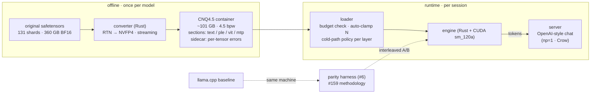
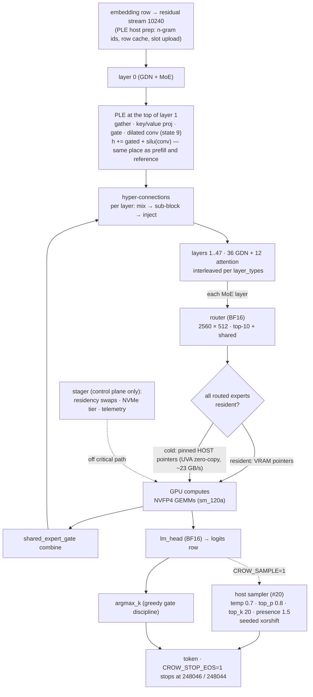
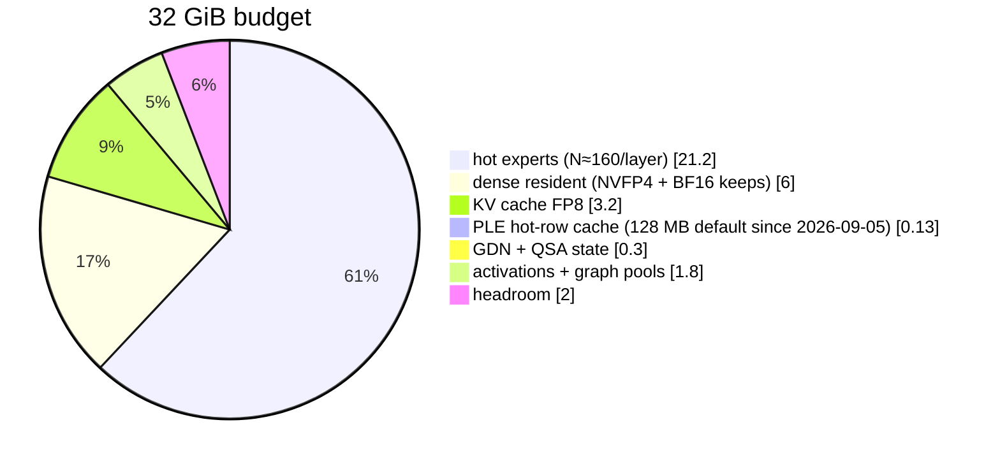
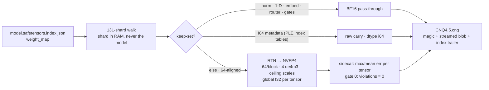

# crow-nest — architecture diagrams

Living renderings of the approved spec (`architecture.md`, sections 1–6). A diagram
contradicting the spec is a bug in the diagram. Owner: issue #14. Updated with every
stage acceptance.

## 1 · System overview — from originals to served tokens

## 2 · Decode path — one token, the handoff-free shape

## 3 · VRAM layout at the default operating point (262k ctx, FP8-KV)

## 4 · Converter pipeline (stage 1 = RTN, calibration-free)

## Changelog

- 2026-09-02: first cut — rendered from approved spec sections 1–6 + decisions (#2). Stage-1 converter reflects the implemented converter; runtime boxes are the spec's design, not yet code.
- 2026-09-02 (later): cold path amended to zero-copy direct read (spec 3.4 amended after the #8 pre-study) — ring/stager moved off the decode critical path to control plane.
- 2026-09-05: decode path redrawn after #11 — the PLE step now sits at the top of layer 1 (it ran before layer 0 in `decode_step` until 2026-09-05 07:00, which is what degenerated the answers); sampler and EOS stop (#20) added as the opt-in tail; PLE cache default 128 MB (#16). Section 3 stays the 2026-09-02 estimate with the PLE slice corrected; the measured load line on 2026-09-05 read "VRAM used 31.21 GiB (dense 7.02 GiB + hot experts 160 × 48 × 2.64 MB + states)".
