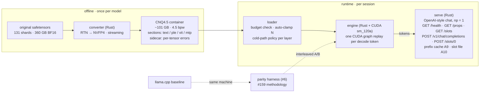
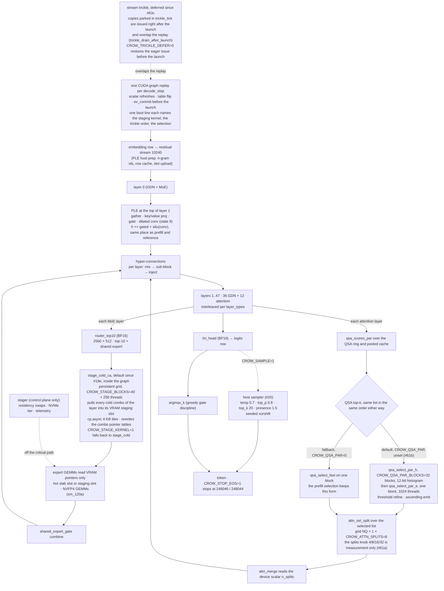
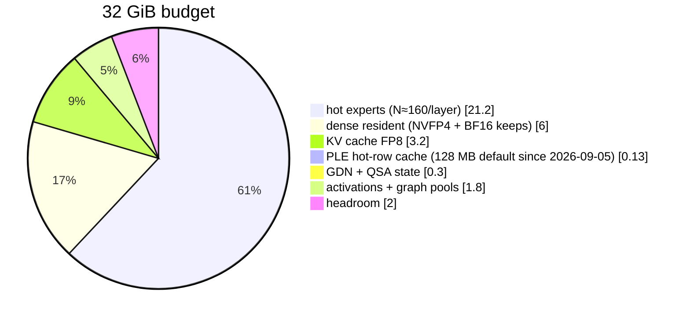
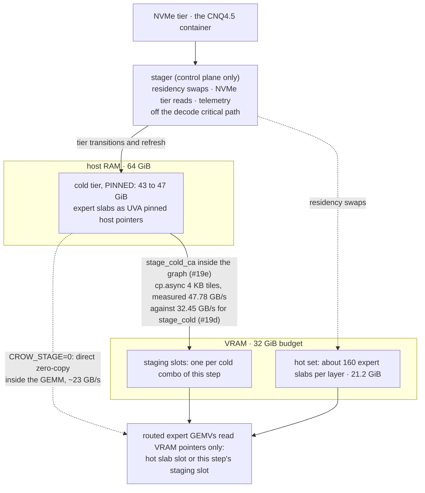
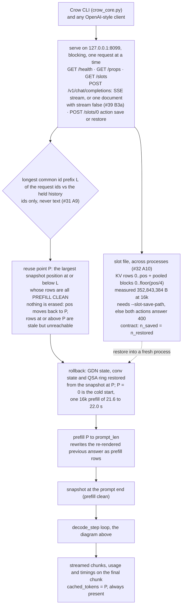
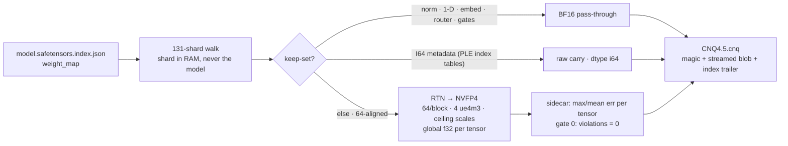

# crow-nest architecture diagrams

Living renderings of the approved spec (`architecture.md`, sections 1 to 7). A diagram
contradicting the spec is a bug in the diagram. Owner: issue #14. Updated with every
stage acceptance. Current as of 2026-09-12, commit 885bb27 (the #61b docs commit).

## 1 · System overview, from originals to served tokens

Status: reflects the server as built in stage A (#24 to #32) on top of the engine defaults
of 2026-09-12, commit 885bb27.

## 2 · Decode path at the current defaults

Status: reflects commit 885bb27, 2026-09-12, the three defaults of the week: stage_cold_ca
(#19e), the deferred trickle (#63c), qsa_select_par with the CROW_QSA_PAR=0 fallback and
attn_sel_split at 8 splits (#61a and #61b, the split count is measurement only). Measured
operating point: 23.94 ms per token = 41.8 tok/s against 24.87 with the fallback
(`decode_out/srv-61b.log`, architecture 3.4).

## 3 · VRAM layout at the default operating point (262k ctx, FP8-KV)

Status: unchanged from the section 2.1 estimate of 2026-09-02 (PLE slice corrected
2026-09-05 per #16); no stage since moved a slice, checked 2026-09-12. The measured load
line of 2026-09-05 read VRAM used 31.21 GiB.

## 4 · Residency: hot set VRAM, pinned cold tier, zero-copy read

Status: reflects architecture 3.4 as amended (zero-copy direct read is the cold-path
primary) with the staging default of #19e (commit 7afb4f8), 2026-09-12; staging numbers
from `decode_out/srv-19d.log` (RTX 5090, 338 MB per token).

## 5 · Serve: endpoints, prefix cache (A9), slot save and restore (A10)

Status: reflects architecture section 7 as built (A9 #31, A10 #32, the dropped
after-answer snapshot M2b #36, the stream false document #39 B3a), 2026-09-12; the warm
turn at 16k reused 99.41 percent of the prompt in 404 ms (README measured table, #31).

## 6 · Converter pipeline (stage 1 = RTN, calibration-free)

Status: unchanged since the first cut of 2026-09-02 (#2); no converter stage has landed
since, verified 2026-09-12.

## Changelog

- 2026-09-02: first cut — rendered from approved spec sections 1–6 + decisions (#2). Stage-1 converter reflects the implemented converter; runtime boxes are the spec's design, not yet code.
- 2026-09-02 (later): cold path amended to zero-copy direct read (spec 3.4 amended after the #8 pre-study) — ring/stager moved off the decode critical path to control plane.
- 2026-09-05: decode path redrawn after #11 — the PLE step now sits at the top of layer 1 (it ran before layer 0 in `decode_step` until 2026-09-05 07:00, which is what degenerated the answers); sampler and EOS stop (#20) added as the opt-in tail; PLE cache default 128 MB (#16). Section 3 stays the 2026-09-02 estimate with the PLE slice corrected; the measured load line on 2026-09-05 read "VRAM used 31.21 GiB (dense 7.02 GiB + hot experts 160 × 48 × 2.64 MB + states)".
- 2026-09-12: post #61b pass. Decode path redrawn for the three default flips: the staging kernel `stage_cold_ca` (#19e, engine commit e256004), the deferred trickle (#63c, engine commit 095a1c8) and the parallel QSA selection `qsa_select_par` with the `CROW_QSA_PAR=0` fallback plus the `CROW_ATTN_SPLITS` measurement knob (61a and 61b, engine commit 9696b13). The resident-or-cold decision at the GEMMs is gone: the staging kernel hands the GEMMs VRAM pointers in every case, so zero-copy direct read survives only behind `CROW_STAGE=0`. New section 4, the residency picture (hot set VRAM, pinned cold tier, zero-copy read), and new section 5, the serve picture (endpoints, prefix cache A9, slot save and restore A10). The system overview server box now names the endpoints. Pie and converter unchanged; every diagram carries a status line.
