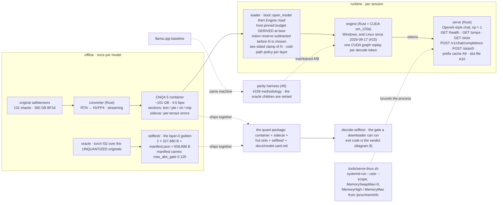
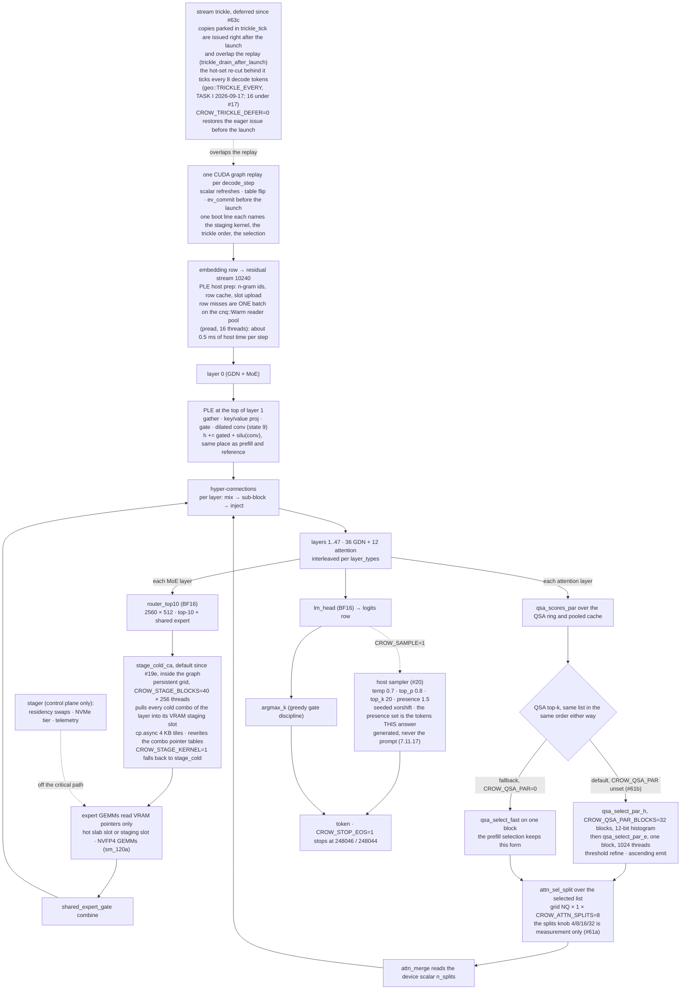
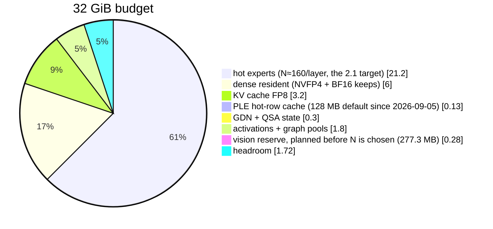
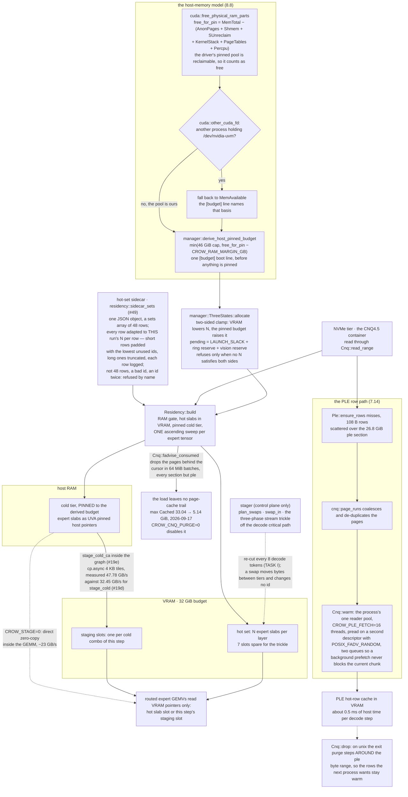
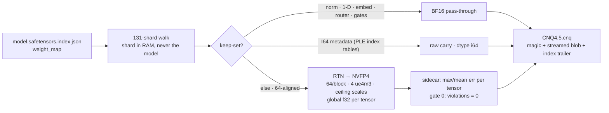
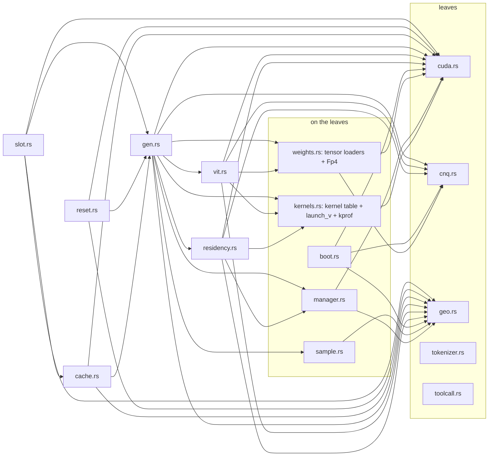
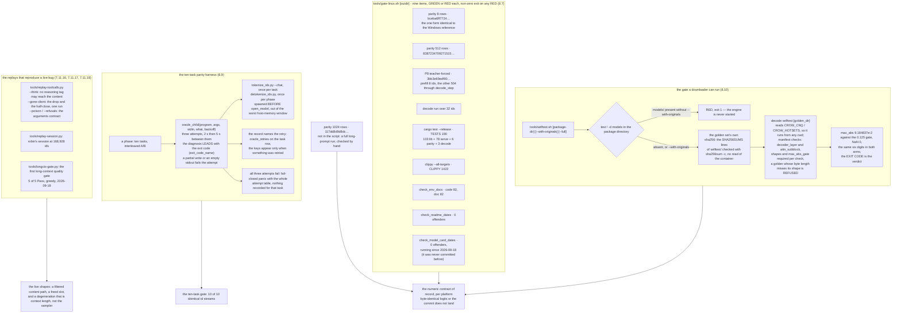

# crow-nest architecture diagrams

Living renderings of the approved spec (`architecture.md`, sections 1 to 8). A diagram
contradicting the spec is a bug in the diagram. Owner: issue #14. Updated with every stage
acceptance. Diagrams 1 to 5 and the new diagram 8 render the tree at commit `cea9406`,
2026-09-18, branch `main` — the pass over v0.3.0 (`9f12429`..`487128d`) and the seven v0.3.1
commits; diagram 6 (the converter) and diagram 7 (the module graph) were re-read against the
same tree and are unchanged, and each says why. Every box names the section of
`architecture.md` it renders.

## 1 · System overview, from originals to served tokens

Status: renders `cea9406`, 2026-09-18. New since the 885bb27 cut: the Linux port and the
bounded launcher (`#15`, 8.8 point 6), the derived host pinned budget and the vision reserve in
the loader box (2.1, 8.8 point 1, 7.13), the quant package and its travelling golden set
(8.10), and the retry around the harness's oracle children (8.9). Spec: 1.1 to 1.3 for the
offline arm, 2.1 and 8.4 for the loader, 7.11.1 to 7.11.7 for the endpoints, 5.1 and 8.9 for
the harness, 8.10 for the package and the self-test.

## 2 · Decode path at the current defaults

Status: renders `cea9406`, 2026-09-18. The three defaults of 885bb27 are untouched —
`stage_cold_ca` (#19e), the deferred trickle (#63c), `qsa_select_par` with the
`CROW_QSA_PAR=0` fallback and `attn_sel_split` at 8 splits (#61a, #61b). Two boxes moved in
v0.3.0: the PLE row misses of a step are now one batched `pread` fetch on the reader pool
instead of one mapping fault per row (7.14 parts 1 and 2), and the adaptation behind the
trickle ticks every 8 decode tokens instead of 16 (7.14 part 4, `docs/env.md`
`CROW_ADAPT_EVERY`). The sampler box names the penalty scope measured for `#68` (7.11.17): the
set is the tokens this answer generated and never the prompt, so it is drawn inside the step and
not over the history. Windows operating point of record, 2026-09-12: 23.94 ms per token =
41.8 tok/s against 24.87 with the fallback (`decode_out/srv-61b.log`, architecture 3.4); the
Linux figure of record is 27.19 ms = 36.8 tok/s (`CHANGELOG.md`, 2026-09-17). Spec: 3.4, 3.5,
4.2, 7.14, 7.11.17.

## 3 · VRAM layout at the default operating point (262k ctx, FP8-KV)

Status: the section 2.1 estimate of 2026-09-02 with the PLE slice corrected 2026-09-05 (#16),
plus the one slice v0.3.0 added: the vision reserve of TASK K (2.1 last paragraph, 7.13) —
the cap-sized tower scratch (228.5 MiB) and the interleaved-mrope span tables (48.8 MiB at
`n_ctx` 200,000), 277.3 MB together, added to the planner's `pending` bytes so an image request
can never find the card full. It comes out of the headroom slice, which is what it was living
in. Measured cost at the serve operating point (2026-09-17, same free-at-start 22.86 GiB,
`n_ctx` 200,000, chunk 2048): N 157 → 155, VRAM used 30.83 → 30.58 GiB; `CROW_VIT=0` reserves
nothing. The measured load line of 2026-09-05 read VRAM used 31.21 GiB. The HOST side of the
same planner loop — the derived pinned budget — is diagram 4. Spec: 2.1, 2.5, 7.13, 8.4 step 8.

## 4 · Residency and load: derived budget, pinned cold tier, page-cache discipline

Status: renders `cea9406`, 2026-09-18. The decode-side half is unchanged from the #19e default
of 2026-09-12 (staging numbers from `decode_out/srv-19d.log`, RTX 5090, 338 MB per token);
everything above it is v0.3.0 and v0.3.1. New boxes: the derived pinned budget with its
`/dev/nvidia-uvm` rule (8.8 points 1 to 3, 2.1), the vision reserve inside the planner's
`pending` bytes (8.4 step 8), the single ascending sweep with `fadvise_consumed` (8.8 point 4),
the `ple`-sparing exit purge (8.8 point 5), the batched PLE row fetch (7.14 parts 1 and 2), the
per-row sidecar rule of `#49` (2.2, `0adbe6a`), and the trickle's 8-token re-cut (7.14 part 4).
Spec: 2.1, 2.2, 2.3, 3.4 as amended, 7.14, 8.8.

## 5 · Serve: one chat request end to end (in, reuse, out)

```mermaid
flowchart TB
    CLI["Crow CLI (crow_core.py)\nand any OpenAI-style client"]
    SRV["serve on 127.0.0.1:8099, blocking, one request at a time\nGET /health · GET /props · GET /slots\nPOST /v1/chat/completions: SSE stream, or one document\nwith stream false (#39 B3a) · POST /slots/0 action save or restore"]
    CLI --> SRV
    SRV --> GUARD["guarded(chat_route) arms cuda::RequestScope\na CUDA allocation refused INSIDE a request is a named 503\nnaming the allocation, its bytes and the free VRAM;\nthe engine is reset and keeps serving. Any other panic still ends the process"]
    subgraph inbound["on the way in (8.5 steps 2 to 4)"]
        PARSE["parse_chat: messages, tools, sampling fields, image blocks"]
        NORM["normalize_messages\ntool turns rendered as a tool_response block\narguments: a JSON string becomes the MAPPING the template needs (7.11.14)\nstrip_stored_think: a stored leading or trailing reasoning tag goes,\nthe text stays, every other shape byte-identical (7.11.16)\none [chat] normalised line per strip"]
        CHK{"check_messages, BEFORE the render"}
        ENC["tk.encode_chat: minijinja render + HF encode"]
        PARSE --> NORM --> CHK
        CHK -->|"renderable"| ENC
    end
    GUARD --> PARSE
    CHK -->|"any other shape"| R400["400 JSON naming the message index and the field"]
    ENC --> IMG["image branch, when the request carries images and the tower is loaded\nbuild_vision_plan: LRU hit, else prep_image → Vit::run\nthe plan holds HOST rows only (7.13)"]
    IMG --> CLAMP["clamped_max_tokens FIRST, then begin_vision\nso the interleaved-mrope span tables are at most n_ctx rows"]
    CLAMP --> LCP{"longest common id prefix L\nof the request ids vs the held history\nids only, never text (#31 A9)"}
    LCP --> P["reuse point P: the largest snapshot position at or below L\nwhose rows are all PREFILL CLEAN\nnothing is erased: pos moves back to P,\nrows at or above P are stale but unreachable"]
    P --> ROLL["rollback: GDN state, conv state and QSA ring restored\nfrom the snapshot at P; P = 0 is the cold start,\none 16k prefill of 21.6 to 22.0 s"]
    ROLL --> PF["prefill P to prompt_len\nrewrites the re-rendered previous answer as prefill rows"]
    PF --> S2["snapshot at the prompt end (prefill clean)"]
    S2 --> ARM["the sampler prologue: arm_sampler for a sampled request,\npark_sampler for a greedy one\ntwo [chat] lines name the SOURCE of every sampling value\n(request or data sheet) and the penalty scope:\ncleared for this request, generated tokens only (7.11.17)"]
    ARM --> DEC["decode_step loop, the diagram above"]
    subgraph outbound["on the way out (7.11.13, 7.11.16, 7.11.18)"]
        TS["ToolStream: the tool-open token arms the parser;\nEmit::Args fragments are never rewritten;\na malformed call carries its raw markup as content"]
        TF["ThinkFilter on Emit::Content only\nLead: a block the model opens is owned\nInside: its text leaves as delta.reasoning_content\nBody: a stray closing tag is DROPPED, a held prefix flushes at the end\nso no byte of an answer is lost, on either request form"]
        SINK{"ChatSink, the one split between the two request forms"}
        TS --> TF --> SINK
    end
    DEC --> TS
    SINK -->|"SseSink"| WIRE["streamed chunks, usage and timings on the final chunk\ncached_tokens = P, always present\nstill_there = the failed flush of the first frame"]
    SINK -->|"CollectSink"| DOCU["one chat.completion document: content, tool_calls\nand reasoning_content only when something was stripped\nusage and timings ALWAYS present"]
    DOCU --> PROBE{"CollectSink::still_there(step), every step (PROBE_EVERY = 1)\npoll(POLLRDHUP), timeout 0, nothing on the wire\nagainst the BASELINE probe taken when the sink was built"}
    PROBE -->|"EOF already there: a client that half-closed"| DOCU2["it gets its whole document"]
    PROBE -->|"EOF appears later: gone"| STOPG["the generation ENDS, the slot is free;\nfinish_reason unchanged, status 200 OK (client gone)"]
    SRV --> SLOT["slot file, across processes (#32 A10)\nKV rows 0..pos + pooled blocks 0..floor(pos/4)\nmeasured 352,843,384 B at 16k\nneeds --slot-save-path, else both actions answer 400\ncontract: n_saved = n_restored"]
    SLOT -.->|"restore into a fresh process"| ROLL
```

Status: renders `cea9406`, 2026-09-18. The reuse chain and the slot file are the 2026-09-12
picture (A9 #31, A10 #32, the dropped after-answer snapshot M2b #36, the stream false document
#39 B3a); the warm turn at 16k reused 99.41 percent of the prompt in 404 ms (README measured
table, #31). Added since: the `guarded` / `RequestScope` 503 and the clamp-before-`begin_vision`
order (7.11.8 last row, 7.13, TASK K), the normaliser's two jobs (7.11.14 for `arguments`,
7.11.16 end 2 for a stored reasoning tag, `667b68b`), `check_messages` as the 400 before the
render (7.11.8), the `ThinkFilter` between the tool parser and the sink (7.11.16 end 1,
`667b68b`), the sink split with `CollectSink`'s `ClientProbe` (7.11.13, 7.11.18, `20bc121`) and
the sampling-provenance lines (7.11.17, `f14e557`). Spec: 7.3 to 7.8 for the reuse chain, 7.11.3
to 7.11.8, 7.11.13, 7.11.16 to 7.11.18, 7.13, 8.5.

## 6 · Converter pipeline (stage 1 = RTN, calibration-free)

Status: unchanged since the first cut of 2026-09-02 (#2); no converter stage has landed since,
verified against the tree at `cea9406` on 2026-09-18 — `converter/src` was last touched before
v0.3.0, and the two v0.3.1 container-side facts (the `ple` range of the exit purge, the row
fetch) are reader-side, not writer-side. The per-tensor sidecar this diagram writes is NOT the
hot-set sidecar of diagram 4, and 2.2 refuses it by name. Spec: 1.2, 1.3, 1.5.

## 7 · Module dependency graph of the engine crate

Status: unchanged. The `use crate::` edges of `engine/src` were regenerated from the tree at
`cea9406`, 2026-09-18, and are edge for edge the graph added at `c1a68cd` and re-verified at
`487128d`: acyclic since `bb9d2ca` broke `gen <-> residency` and `gen <-> vit`, with
`weights.rs` and `boot.rs` in the second layer. The seven commits after `487128d` touched two
library files — `sample.rs` (`f14e557`, the two penalty-scope tests) and `residency.rs`
(`0adbe6a`, `sidecar_sets`) — and no module moved; everything else of v0.3.1 landed in the bins,
which this graph does not draw: `ThinkFilter`, `ClientProbe` and the sampling provenance in
`bin/serve.rs`, `oracle_child` in `bin/parity.rs`, the `selftest` mode in `bin/decode.rs`, and
the `CROW_CNQ` reads of `bin/plecheck.rs` and `bin/states.rs`. Not drawn: the feature-gated
`cutile_pilot.rs` (`cuda`, `kernels`; nothing calls it), and the one edge no import graph shows
— `impl Drop for Engine` in `gen.rs` calls `Engine::drop_decode_graph`, an inherent method
defined in `reset.rs`. Module by module: `architecture.md` section 8.1 and 8.2.

## 8 · Gates, guards and the self-test the package carries

Status: new on 2026-09-18, renders `cea9406`. It draws what section 5.2 asks for and what
v0.3.0 and v0.3.1 built around it: the nine-item Linux gate and the two host-side values it
pins (8.7), the package self-test with its `models/` control and its sha256 (8.10, `#64`), the
bounded retry around the harness's two oracle children (8.9, `#65`), and the three replay
commands that reproduce the live bugs of `#67`, `#54` and `#68` (7.11.16, 7.11.18, 7.11.17).
Every number in it carries its section; the 1024-row form sits outside the script by design.
Spec: 5.1, 5.2, 5.3, 7.11.16 to 7.11.18, 8.7, 8.9, 8.10.

## Changelog

- 2026-09-02: first cut — rendered from approved spec sections 1–6 + decisions (#2). Stage-1 converter reflects the implemented converter; runtime boxes are the spec's design, not yet code.
- 2026-09-02 (later): cold path amended to zero-copy direct read (spec 3.4 amended after the #8 pre-study) — ring/stager moved off the decode critical path to control plane.
- 2026-09-05: decode path redrawn after #11 — the PLE step now sits at the top of layer 1 (it ran before layer 0 in `decode_step` until 2026-09-05 07:00, which is what degenerated the answers); sampler and EOS stop (#20) added as the opt-in tail; PLE cache default 128 MB (#16). Section 3 stays the 2026-09-02 estimate with the PLE slice corrected; the measured load line on 2026-09-05 read "VRAM used 31.21 GiB (dense 7.02 GiB + hot experts 160 × 48 × 2.64 MB + states)".
- 2026-09-12: post #61b pass. Decode path redrawn for the three default flips: the staging kernel `stage_cold_ca` (#19e, engine commit e256004), the deferred trickle (#63c, engine commit 095a1c8) and the parallel QSA selection `qsa_select_par` with the `CROW_QSA_PAR=0` fallback plus the `CROW_ATTN_SPLITS` measurement knob (61a and 61b, engine commit 9696b13). The resident-or-cold decision at the GEMMs is gone: the staging kernel hands the GEMMs VRAM pointers in every case, so zero-copy direct read survives only behind `CROW_STAGE=0`. New section 4, the residency picture (hot set VRAM, pinned cold tier, zero-copy read), and new section 5, the serve picture (endpoints, prefix cache A9, slot save and restore A10). The system overview server box now names the endpoints. Pie and converter unchanged; every diagram carries a status line.
- 2026-09-17: new section 7, the module dependency graph of the engine crate, after the three refactor cuts of branch `linux-refactor` (74c79f2, bb9d2ca, 7ddd296). It is the first diagram in this file that renders the CODE rather than the spec, and it is generated from the `use crate::` edges, so a module move that is not reflected here is a stale diagram. Both module cycles the pre-refactor tree carried (`gen <-> residency`, `gen <-> vit`) are gone: `launch_v`/`launch_sync` moved into `kernels.rs` and the tensor loaders plus `Fp4` into the new `weights.rs`, and `boot.rs` (the shared container/context/config front door) joined the second layer. Diagrams 1 to 6 were re-read against the tree on 2026-09-17 and none of them contradicts it: the decode path, the residency picture, the serve picture and the converter pipeline are unchanged by a refactor that moved no launch, no kernel and no byte of `KERNEL_SRC`.
- 2026-09-17 (later, `487128d`): the graph re-generated after the six engine commits that followed `c1a68cd` and found unchanged; the status lines carry `487128d` and branch `main`. Diagrams 1 to 6 keep their 2026-09-12 Windows numbers, which are dated and machine-named; the Linux values of record that now sit beside them are in `README.md` and `CHANGELOG.md` (16k prefill 968 / 964 tok/s, decode 27.19 ms = 36.8 tok/s, the six-turn serve replay at 228.3 ms of prefill and 247.4 ms to first token, the 1024-row parity form at 740 tok/s). Not redrawn: the image path of `8ff2055` and `487128d` (the planner's vit reserve, the named 503, and the removal of the per-request splice buffer), which belongs in the serve picture of section 5 and is written in `architecture.md` 7.13.
- 2026-09-18, the #14 audit of v0.3.0 and v0.3.1 (`cea9406`): the eight commits that landed since the 2026-09-12 pass were read against every diagram, and the one debt the entry above names is paid. Per diagram:
  - **1, system overview: redrawn.** The loader box says the host pinned budget is DERIVED and the vision reserve is subtracted before N is chosen (2.1, 8.8 point 1, 7.13); the engine box says Linux since 2026-09-17 (#15) and the bounded launcher `tools/serve-linux.sh` is drawn as what wraps the process (8.8 point 6); the quant package and the travelling `selftest/` golden set are new boxes (8.10), and the harness box names the retried oracle children (8.9).
  - **2, decode path: redrawn, two boxes.** The PLE prep names the batched `cnq::Warm` row fetch instead of one mapping fault per row (7.14 parts 1 and 2, `1032bc5`), and the trickle box names the 8-token re-cut that replaced #17's 16 (7.14 part 4, `4004e66`). The sampler box gained the penalty scope measured for `#68` — the tokens this answer generated, never the prompt, cleared per request (7.11.17, `f14e557`). The three defaults of #19e, #63c and #61a/#61b are untouched, so the rest of the path is the 885bb27 drawing.
  - **3, VRAM pie: redrawn, one slice.** The vision reserve of TASK K (277.3 MB: tower scratch 228.5 MiB + mrope span tables 48.8 MiB) is planned VRAM now and comes out of the headroom slice it used to live in (2.1 last paragraph, 7.13); the reserve cost N 157 → 155 at the serve operating point.
  - **4, residency: redrawn and renamed** to "Residency and load", because v0.3.0 put a host-memory model in front of it: the derived budget with the `/dev/nvidia-uvm` fallback (8.8 points 1 to 3), the two-sided clamp with the reserve in `pending` (8.4 step 8), the one ascending sweep with `fadvise_consumed` and the flat page cache (8.8 point 4), the `ple`-sparing exit purge (8.8 point 5), the per-row hot-set sidecar rule of `#49` (2.2, `0adbe6a`) and the PLE row path — `page_runs`, `Cnq::warm`, 16 reader threads, two queues (7.14).
  - **5, serve: redrawn as the whole request path** (in, reuse, out), which is where the #67, #54, #68 and TASK K work lands: `normalize_messages` with both its jobs (7.11.14, 7.11.16 end 2), `check_messages` as the 400 before the render, the `ThinkFilter` between the tool parser and the sink with its three states (7.11.16 end 1), the sink split and `CollectSink`'s `ClientProbe(POLLRDHUP)` with its baseline (7.11.13, 7.11.18), the two sampling-provenance lines (7.11.17), and `guarded` + `RequestScope` answering a request-scoped allocation failure with a named 503 (7.11.8, 7.13). The prefix-cache chain and the slot file are unchanged.
  - **6, converter: unchanged.** No converter stage has landed since 2026-09-02; `converter/src` was not touched in v0.3.0 or v0.3.1, and the two container facts that did move (the exit purge's `ple` range, the row fetch) are reader-side. The status line now says which sidecar this one is, because diagram 4 draws the other.
  - **7, module graph: unchanged, re-generated.** The `use crate::` edges of `engine/src` at `cea9406` are edge for edge those of `487128d`: only `sample.rs` and `residency.rs` were touched in the library, and every other v0.3.1 change landed in a bin, which this graph does not draw. The status line now names those bins so the next reader does not look for `ThinkFilter` in a module.
  - **8, gates, guards and the self-test: NEW.** The verification side had no picture at all, and three commits of v0.3.1 built one: `tools/gate-linux.sh`'s nine items and the two host-side values they pin (8.7), `decode selftest` with `tools/selftest.sh`, the `test ! -d models` refusal and the sha256 of the shipped golden (8.10, `#64`), `oracle_child`'s bounded retry with the exit code leading the diagnosis (8.9, `#65`), and the three replay commands that reproduce `#67`, `#54` and `#68` (7.11.16, 7.11.18, 7.11.17). The 1024-row parity form is drawn outside the script, where 8.7 puts it.
